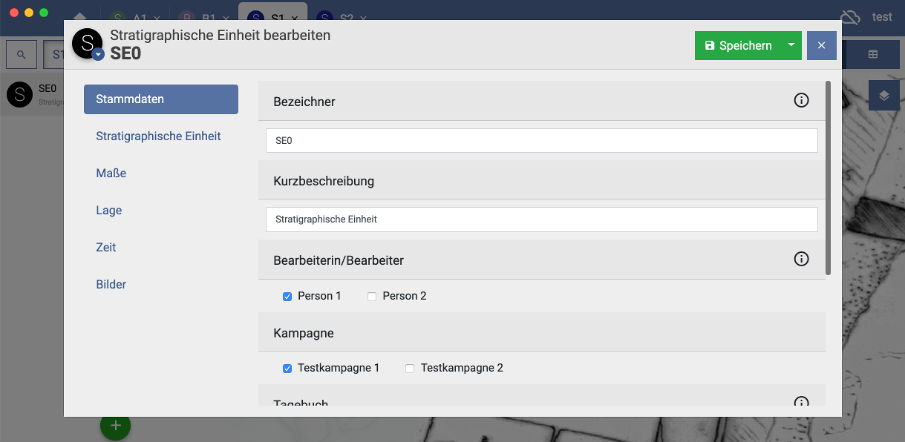
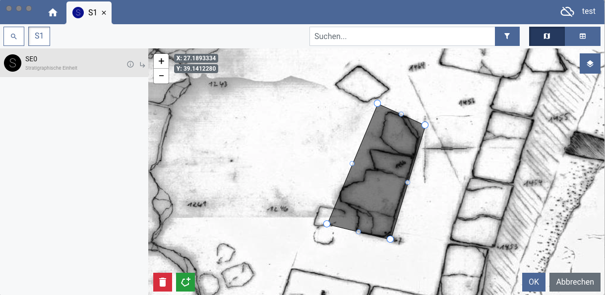
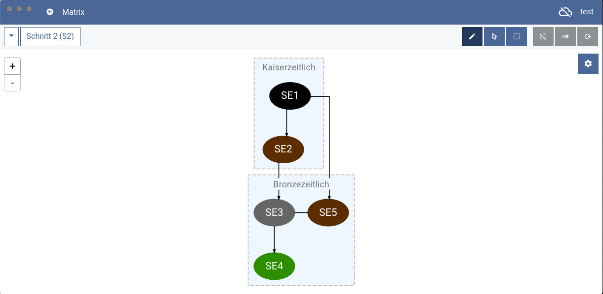
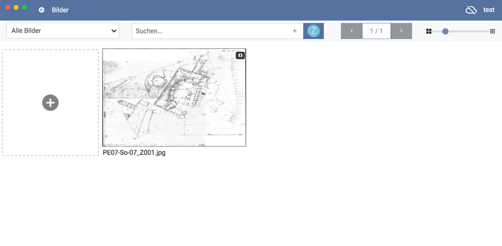
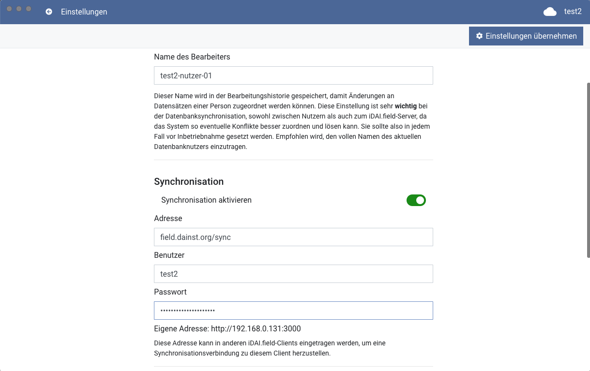
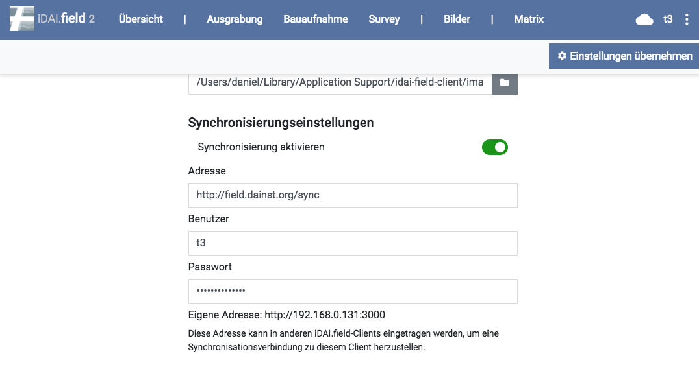
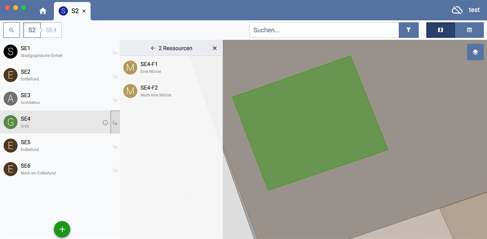

# Features

Here is a short overview of iDAI.field's key features.

## Metadata editor

 

Available types and their fields can be defined 
via a JSON based configuration.

## Shape editor

 
Geo information can be imported or created directly in app.

## Harris Matrix

A Harris style matrix is automatically calculated for every trench
from its stratigraphical units and their temporal relations. 

## Image management

Enables you to import photos or drawings and associate 
them with resources. Also lets you import 
maps to provide a visual context to your resources. 

## Synchronization

 

Multiple clients can be synced to each other to edit the same data on the field site.
Syncing can also be done to a database server to collect the excavations records
on a single central system later on.

## Table view

Using the list view, one can batch edit multiple items quickly.

## Nesting

Nesting resources in resources, as for example finds in contexts, 
makes navigation and finding resources easy.
