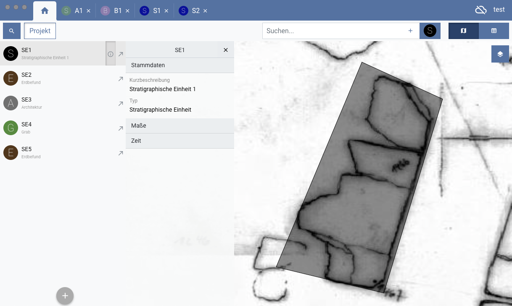

# iDAI.field

 
   
   
The German Archaeological Institute’s ([DAI](https://www.dainst.org)) 
new take on a field research 
documentation system. Combining [features](README-FEATURES.md) of GIS, photo management, and 
database management systems in a unique and integrating manner, 
it aims at facilitating archaeological workflows by reducing the overhead 
of using multiple systems. Developed in-house by the DAI’s information 
technology department, it targets primarily the needs of the institute’s 
excavations, older ones as well as those to come. Yet, due to the nature 
of its adjustable data model and the fact it is open source software, any 
interested third party is free to reuse and adjust it to their needs.
   

## Installation

You can install the latest version of iDAI.field by downloading and running the [setup file](https://github.com/dainst/idai-field/releases/latest) corresponding to your operating system (**MacOS** or **Windows**).


   
## Development

Development of iDAI.field works under **MacOS**, **Windows** and **Linux**. In any case, before you start, make sure you have [NodeJS](https://nodejs.org/en/) > 7.0.0 as well as Node Package Manager ([NPM](https://www.npmjs.com/)) installed.  

Then clone this repository locally and run the following commands:

```
$ npm install
$ npm run build
$ npm start
```

`npm install` fetches the necessary dependencies. `npm run build` compiles the typescript files, creates [configuration](config/README.md) files, gathers the necessary fonts and converts scss files. `npm start` starts the Electron app. To have the TypeScript compilation run continuously while running the app, start the app with `npm start:watch`. In this case, a subprocess for watching gets started. To properly shut it down,
make sure to close the app via `ctrl-c` in your terminal. Alternatively, you can also start the watch process separately, by entering `npm run watch` in one, and then `npm start` in another terminal window. Changes take effect after the watcher reports success and the window is reloaded manually. Scss files are not monitored, so any changes would take effect only after calling `npm run build:sass`.
 
Shapefile import/export is handled by a Java command line tool which is called by the Electron app. If Java 8 or higher and [Maven](https://maven.apache.org/) are installed, the Java tool can be built via the command:
```
$ npm run build:java
```
You can also call `npm run build:all` to build everything in one step (including tests).

See also [idai-components-2](https://github.com/dainst/idai-components-2).

## Tests

The app must have been built (`npm run build:test`) before running the tests.

To execute the **unit tests**, run 

```
$ npm test   
```

The project is set up to have the compilation of the sources (test as well as regular sources) independently from angular. This is due to the fact that we perform node-based tests, since our code runs in an electron context. This done on the 
basis of `test/tsconfig.json`, and `jasmine`. To rebuild the sources for tests continually, you can `npm run build:test+watch` in one terminal window, and `npm test` in another.

For troubleshooting information see [here](docs/unit-test-troubleshooting.md).

To execute **e2e tests**, run 

```
$ npm run e2e [noff|ff]
```

The optional fail fast parameter specifies if test execution stops on the first error (`ff`) or continues until all tests are finished (`noff`). If not specified, the default mode is `noff`. 

## Packaging

To create binaries run:

```
$ npm run package[:mac|:win]
```

Without using one of the specified suffixes, this will create packages for both **MacOS** and **Windows** 32/64 bit.
If used with one of the suffixes, only packages for the selected target platform get created. When the command has finished execution, you find packages of the application for different operating systems in the `release` directory.

Please note that when using **Windows**, due to nested node_modules and the 
windows default maximum path length you might be running into errors while attempting
to extract the package. In that case, please use a different archiver, for example [7-Zip](http://www.7-zip.org/download.html).

Note that creating **Linux** packages should be possible with Electron, but this is yet untested and not enabled.


