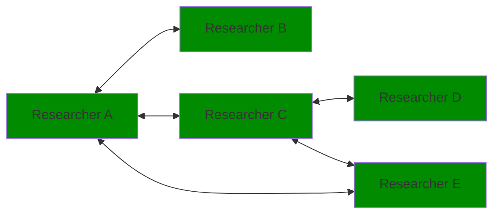
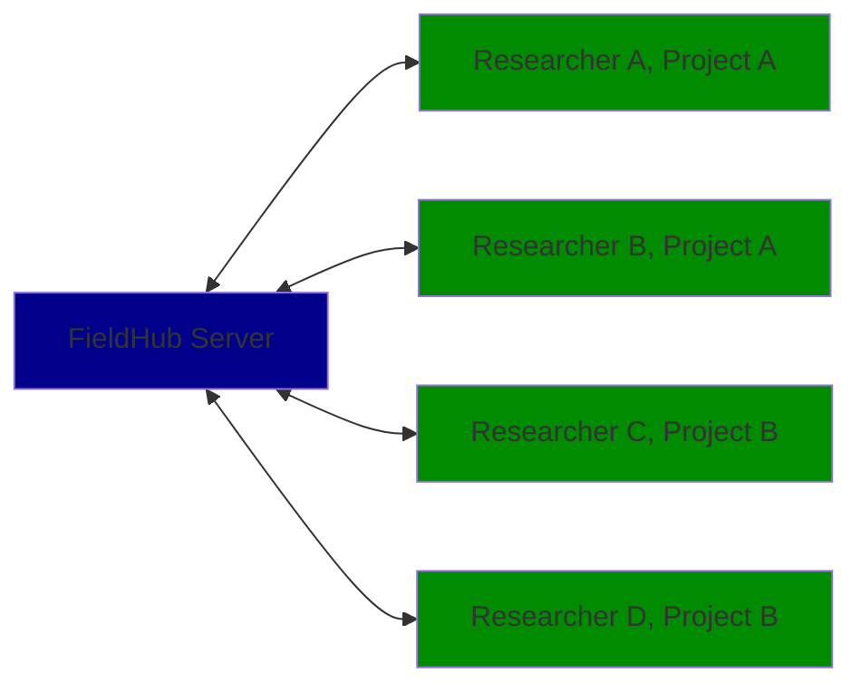

# iDAI.field

This is a monorepo containing five packages:

* [Field Desktop](desktop): The Field Desktop client based on AngularJS and Electron
* [Field Mobile](mobile): The Field Mobile client based on React Native
* [Field Server](server): The FieldHub server application
* [Field Core](core): Shared TypeScript modules
* [iDAI.field Web](web): The iDAI.field Web publication platform

## Collaborative work

Field supports automatic database- and filesyncing between different Field Desktop Clients and FieldHub. Here are some network topologies currently in use.

### Syncing between desktop clients only

This setup does not require a FieldHub server installation. All researchers sync between their machines (Laptops or Deksktop PCs) directly.

### Syncing between desktop clients and institution's FieldHub server

If your institution wants to collect all research data centrally, you may setup a FieldHub server instance and let all your colleagues to it.

### Desktop client as pseudo proxy server

If bandwidth is a concern on excavation, you could also use a Desktop PC/Laptop on side running the desktop client as a local 'pseudo server' to collect data and syncing to your institution's FieldHub server.

### Mix and match

All topologies can be combined

## Development

The repository uses [lerna](https://github.com/lerna/lerna) to manage sub-package dependecies.
When first checking out the code base, bootstrap the dependencies with:

    $ npm run bootstrap

Refer to the sub-package READMEs for detailed instructions on how to set up individual
development environments.
