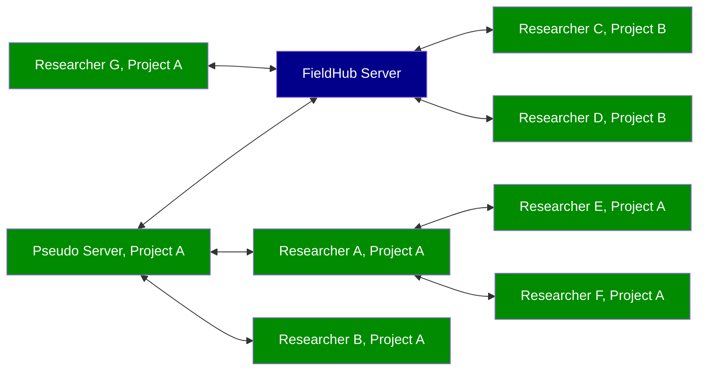

# iDAI.field

This is a monorepo containing five packages:

* [Field Desktop](desktop): The Field Desktop application based on AngularJS and Electron
* [Field Mobile](mobile): The Field Mobile application based on React Native, early development, no release yet
* [Field Server](server): The FieldHub server application
* [Field Core](core): Shared TypeScript modules
* [iDAI.field Web](web): The iDAI.field Web publication platform

Field is the German Archaeological Institute’s ([DAI](https://www.dainst.org)) take on a field research documentation system. The main application is currently Field Desktop, with Field Mobile as an upcoming alternative still in early development. For the time beeing, if you are a researcher interested in using Field, please have a look at the [Field Desktop README](desktop) for more information about its features.

## Field infrastructure capabilities

While it is possible to run just one Field Desktop installation for your project on a single machine, the strength of Field is its capability for automatic database- and filesyncing between different Field Desktop installations and FieldHub.

Here are some network topologies currently in use.

### Syncing between Field Desktop installations only

This setup does not require a FieldHub server installation. All researchers sync between their machines (laptops or desktop PCs) directly.

### Syncing between Field Desktop installations and institution's FieldHub server

If your institution wants to collect all research data centrally, you may setup a FieldHub server instance and let all your researchers sync to it.

### Using a Field Desktop installation as a pseudo proxy server

If bandwidth is a concern on excavation, you may also use a desktop PC or laptop on site running Field Desktop as a local 'pseudo server' to collect data and facilitate syncing to your institution's FieldHub server. This will reduce redundant upload/download bandwith usage compared to the topology variant above.

### Mix and match

The topologies above can also be combined.

## Post-project data usage

After field research documentation has been created using [Field Desktop](desktop), there are several ways to process or publish your data.
* Export CSV/GeoJSON/Shapefiles from within the Field Desktop client.
* Import your data in [R](https://www.r-project.org) using [sofa](https://github.com/ropensci/sofa), an example implementation by [Lisa Steinmann](https://orcid.org/0000-0002-2215-1243) can be found [here](https://github.com/lsteinmann/idaifieldR).

## Development

The repository uses [lerna](https://github.com/lerna/lerna) to manage sub-package dependecies.
When first checking out the code base, bootstrap the dependencies with:

    $ npm run bootstrap

Refer to the sub-package READMEs for detailed instructions on how to set up individual
development environments.
