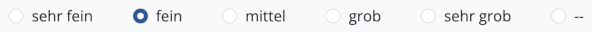
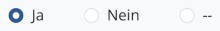
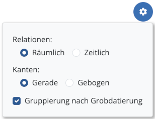

# Erste Schritte

Beim ersten Start der Anwendung werden Sie dazu aufgefordert, Ihren Namen einzugeben. Empfohlen wird, Vor- und Nachnamen anzugeben. Der eingetragene Name wird bei allen von Ihnen vorgenommenen Änderungen in der Datenbank hinterlegt und erleichtert die gemeinsame Bearbeitung von Datensätzen im Projekt, indem bei der Datensynchronisation Änderungen eindeutig zugeordnet werden können. Per Klick auf den Namen oben rechts in der Navigationsleiste oder über das Untermenü **Einstellungen**, das Sie über das Menü "Field" (MacOS) bzw. "Werkzeuge" (Windows) erreichen, können Sie den Namen der Benutzerin/des Benutzers zu einem späteren Zeitpunkt ändern.

Sie befinden sich zunächst im Testprojekt, das es Ihnen ermöglicht, die Funktionen des Programms anhand einiger Beispieldaten auszuprobieren. Bitte beachten Sie, dass neu angelegte Datensätze nach einem Neustart der Anwendung gelöscht und alle Änderungen zurückgesetzt werden, solange das Testprojekt ausgewählt ist. Aus diesem Grund findet im Testprojekt grundsätzlich keine Synchronisation mit anderen Field-Desktop-Installationen oder Field-Servern statt.

Um mit Field Desktop produktiv zu arbeiten und ein eigenes Projekt anzulegen, sollten Sie zunächst die folgenden Schritte durchführen:

1. Rufen Sie im Menü "Projekt" den Menüpunkt **Neu...** auf, um ein eigenes Projekt anzulegen. Sie haben die Wahl zwischen mehreren Voreinstellungen für die Projektkonfiguration: Wählen Sie "Standard" für die umfangreiche Field-Standardkonfiguration oder eine der "Basis"-Optionen, wenn Sie lediglich mit einem Grundgerüst an voreingestellten Kategorien und Feldern starten möchten. Legen Sie außerdem die Sprachen fest, in denen innerhalb des Projekts Daten eingegeben werden sollen. Geben Sie zuletzt die gewünschte Projektkennung sowie optional einen Projektnamen für jede der ausgewählten Sprachen ein.

2. Sobald das neue Projekt geladen wurde, können Sie über das Menü "Projekt" ➝ "Eigenschaften" allgemeine Projektdaten eingeben. Hier sollten Sie zunächst die Listen der **Teammitglieder** (Feld "Team" in der Sektion "Projekt") und der **Kampagnen** (Feld "Kampagnen", ebenfalls in der Sektion "Projekt") anlegen. Sie können diese Listen zu einem späteren Zeitpunkt jederzeit erweitern.

Verwenden Sie das Untermenü **Backup erstellen...**, das Sie über das Menü "Projekt" erreichen, um regelmäßig
Sicherungen Ihrer Projektdaten anzulegen.

# Ressourcen

Nach dem Anlegen bzw. Öffnen eines Projekts befinden Sie sich zunächst im Tab **Übersicht** (gekennzeichnet
durch ein Haus-Symbol), in dem alle Maßnahmen und Orte des Projekts verwaltet werden.

Verwenden Sie den grünen Plus-Button unten in der Ressourcenliste, um eine neue Maßnahme anzulegen. 

Dabei wählen Sie in einem ersten Schritt die Kategorie der Maßnahme aus und können anschließend optional eine
Geometrie für die neue Ressource anlegen. Schließlich öffnet sich der Editor, in dem Sie sämtliche Daten der
Maßnahme eintragen können. Je nach gewählter Maßnahmenkategorie stehen unterschiedliche Felder zur Auswahl,
die jeweils in Gruppen aufgeteilt sind. Zwischen den Feldgruppen können Sie jederzeit per Klick auf einen der
Buttons auf der linken Seite wechseln.

Bevor die Maßnahme über den grünen Speichern-Button gesichert werden kann, muss in jedem Fall das Feld
**Bezeichner** in der Gruppe "Stammdaten" ausgefüllt werden.

Die neue Maßnahme wird nun in der Ressourcenliste angezeigt. Benutzen Sie den Button "Zur Maßnahme wechseln"
(Symbol: Pfeil nach rechts oben), um einen neuen Tab für die Maßnahme zu öffnen.

In Abhängigkeit von der Maßnahmenkategorie können innerhalb eines Maßnahmen-Tabs mithilfe des Plus-Buttons
Ressourcen verschiedener Kategorien angelegt werden (etwa stratigraphische Einheiten innerhalb eines Schnitts
oder Räume innerhalb eines Gebäudes).

## Hierarchische Anordnung

Ressourcen können in hierarchischen Strukturen angeordnet werden, beispielsweise um Funde einer
stratigraphischen Einheit zuzuweisen. Benutzen Sie den Button "Untergeordnete Ressourcen anzeigen"
(Symbol: rechtwinkliger Pfeil nach rechts unten), um auf die tiefere Hierarchieebene zu wechseln. Es werden
nun die untergeordneten Ressourcen angezeigt (etwa die Funde einer stratigraphischen Einheit), und über den
Plus-Button neu erstellte Ressourcen werden entsprechend auf dieser Ebene angelegt.

Der Navigationspfad oberhalb der Ressourcenliste zeigt die gerade ausgewählte Hierarchieebene an. Sie können
jederzeit per Klick auf einen der Buttons des Navigationspfades in eine andere Ebene wechseln.

## Ressourcen verwalten

Ressourcen in der Liste können per Klick ausgewählt werden. Bei gedrückter Strg/Cmd- oder Shift-Taste lassen
sich mehrere Ressourcen gleichzeitig selektieren. Nach einem Rechtsklick auf eine oder mehrere ausgewählte
Ressourcen öffnet sich ein Kontextmenü, das die folgenden Optionen bereitstellt:

* *Warnungen anzeigen*: Zeigt die für diese Ressource vorliegenden Warnungen an (nur verfügbar für Ressourcen mit Warnungen, siehe Kapitel *Warnungen*)
* *Bearbeiten*: Öffnet den Editor (alternativ auch per Doppelklick auf den Ressourceneintrag in der Liste
erreichbar)
* *Bilder verknüpfen*: Öffnet ein Fenster, in dem Bilder mit der gewählten Ressource verknüpft bzw. verknüpfte Bilder entfernt werden können
* *QR-Code hinzufügen*: Öffnet ein Fenster, in dem ein neuer QR-Code für die Ressource generiert werden bzw. ein bestehender QR-Code per Kamera-Scan übernommen werden kann
* *QR-Code verwalten*: Zeigt den QR-Code der Ressource an und erlaubt den Druck eines QR-Code-Etiketts (alternativ auch über den QR-Code-Button rechts im Listenelement der Ressource erreichbar)
* *Verschieben*: Erlaubt es, Ressourcen aus ihrem aktuellen Kontext zu entfernen und einer anderen
Ressource unterzuordnen
* *Löschen*: Entfernt Ressourcen nach einer Sicherheitsabfrage (optional können außerdem alle Bilder entfernt werden,
die ausschließlich mit den zu löschenden Ressourcen verknüpft sind)
* *Aufbewahrungsort scannen*: Setzt einen neuen Aufbewahrungsort für die Ressource, indem der QR-Code des Aufbewahrungsortes per Kamera-Scan eingelesen wird (nur verfügbar für Ressourcen der Kategorien "Fund", "Fundkollektion" und "Probe" sowie der entsprechenden Unterkategorien)

Darüber hinaus stellt das Kontextmenü Funktionen zum Anlegen bzw. Bearbeiten von Geometrien bereit. Bitte beachten Sie,
dass bei Auswahl mehrerer Ressourcen ausschließlich die Optionen *Verschieben* und *Löschen* verfügbar sind. Optionen zum Hinzufügen oder Verwalten von QR-Codes sind ausschließlich verfügbar, wenn die Verwendung von QR-Codes für die entsprechende Kategorie im Konfigurationseditor eingerichtet wurde (siehe Abschnitt *Kategorien bearbeiten* im Kapitel *Konfiguration*).

# Bilder

Bilder können in ein Field-Projekt importiert werden, um sie anschließend mit Ressourcen zu verknüpfen oder als Kartenhintergründe zu verwenden. Für jedes importierte Bild wird automatisch eine Bildressource angelegt, in der Metadaten des Bildes eingetragen werden können.

Bilddateien können über eine Synchronisationsverbindung optional mit anderen Rechnern geteilt werden (siehe Kapitel *Synchronisation*). Ist eine Bilddatei nicht auf dem Rechner vorhanden, wird stattdessen eine Platzhaltergrafik angezeigt.

## Bilder importieren

Bilder können auf zwei verschiedene Arten in die Anwendung importiert werden: über das Menü  "Werkzeuge" ➝ "Bilderverwaltung" sowie über die Option "Bilder verknüpfen" im Kontextmenü einer Ressource (erreichbar per Rechtsklick auf die gewünschte Ressource). In letzterem Fall wird das Bild nach dem Import automatisch mit der entsprechenden Ressource verknüpft (siehe Abschnitt *Bilder mit Ressourcen verknüpfen*).

Zum Import klicken Sie auf den Plus-Button und wählen die gewünschten Dateien aus. Alternativ können Sie die Dateien auch direkt aus einer Dateimanager-Anwendung auf die markierte Fläche ziehen, die den Plus-Button umgibt. Sind für das Projekt mehrere Bildkategorien (d. h. Unterkategorien der Kategorie "Bild") definiert, können Sie die gewünschte Kategorie anschließend aus einem Auswahlmenü wählen. Sie können außerdem den Inhalt des Feldes "Bildersteller/Bilderstellerin" wahlweise automatisch aus den Metadaten der Bilddatei auslesen lassen oder manuell setzen. Zur Auswahl stehen dabei die im Feld "Team" der Projekteigenschaften eingetragenen Personennamen. Das Erstellungsdatum sowie Höhe und Breite des Bildes werden in jedem Fall automatisch aus den Datei-Metadaten ausgelesen.

Unterstützte Bildformate sind *jpg/jpeg*, *png* und *tif/tiff*.

## Bildvarianten

Für jedes importierte Bild wird von der Anwendung eine Kopie sowie eine kleinere Version als Vorschaubild erstellt und im **Bilderverzeichnis** gespeichert, dessen Pfad Sie in den Einstellungen unter "Erweiterte Einstellungen" auslesen können. Die Dateien in diesem Ordner werden von der Anwendung verwaltet und dürfen nicht manuell bearbeitet, umbenannt oder gelöscht werden, da es ansonsten zu Fehlern bei der Anzeige oder der Synchronisation von Bildern kommen kann.

Insgesamt verwaltet die Anwendung für jedes Bild bis zu drei verschiedene Varianten:
* *Originalbild*: Die unveränderte Bilddatei, wie sie in das Projekt importiert wurde
* *Vorschaubild*: Eine automatisch erzeugte Variante des Bildes mit geringer Auflösung, die als Vorschaubild in der Anwendung angezeigt wird (z. B. in der Bilderverwaltung oder bei Ressourcen mit verknüpften Bildern)
* *Für die Anzeige optimiertes Bild*: Für einige Bilder wird zur Anzeige in der Anwendung eine weitere Variante des Bildes erzeugt. Dateien im TIFF-Format werden nach JPEG konvertiert und Bilder mit sehr hoher Auflösung werden verkleinert. Dieser Schritt findet beim Laden des Projekts statt, was je nach Menge der vorhandenen Bilddateien zu einer einmaligen Verlängerung der Ladezeit um einige Minuten führen kann.

Eine Übersicht der aktuell im Bilderverzeichnis vorliegenden Daten können Sie über das Menü "Projekt" ➝ "Datenübersicht" abrufen.

## Bilder verwalten

Öffnen Sie zur Verwaltung der Bilder das Menü "Werkzeuge" ➝ "Bilderverwaltung". Hier können Sie sämtliche Bilder des Projekts einsehen und durchsuchen (siehe dazu auch das Kapitel *Suche*).

### Metadaten bearbeiten

Sie können die Metadaten eines Bildes einsehen, indem Sie per Doppelklick auf das gewünschte Bild die Bildansicht öffnen. Klicken Sie den Bearbeiten-Button, um den Editor aufzurufen und die Metadaten zu editieren. Zur Verfügung stehen hier die Felder, die im Konfigurationsedtior für das Formular der entsprechenden Bildkategorie konfiguriert wurden.

### Bilder löschen

Um importierte Bilder wieder aus dem Projekt zu entfernen, selektieren Sie die entsprechenden Bilder in der Bilderverwaltung. Über den Button "Löschen" können sie anschließend entfernt werden:

Beachten Sie, dass dabei auch die entsprechenden Dateien im Bilderverzeichnis des Projekts gelöscht werden (bei einer bestehenden Synchronisationsverbindung auch auf anderen Rechnern). Verknüpfungen mit Ressourcen gehen beim Löschen verloren.

## Bilder mit Ressourcen verknüpfen

Um eines oder mehrere Bilder mit einer Ressource zu verknüpfen, wählen Sie die Option "Bilder verknüpfen" im Kontextmenü der entsprechenden Ressource und klicken anschließend auf den Plus-Button. Sie haben nun die Wahl zwischen zwei Optionen:

* *Neue Bilder hinzufügen*: Neue Bilder werden in das Projekt importiert und mit der Ressource verknüpft.
* *Existierende Bilder verknüpfen*: Wählen Sie aus bereits im Projekt vorhandenen Bildern eines oder mehrere aus, die mit der Ressource verknüpft werden sollen.

Selektieren Sie Bilder in der Liste und wählen die Option "Verknüpfung entfernen", um verknüpfte Bilder wieder von der Ressource zu lösen. Die Bilder selbst bleiben weiterhin im Projekt erhalten.

Verknüpfungen können auch über die Bilderverwaltung hinzugefügt oder entfernt werden. Selektieren Sie dazu die gewünschten Bilder und klicken den Button "Verknüpfen" (blauer Button) bzw. "Verknüpfungen entfernen" (roter Button) in der oberen Leiste:

### Hauptbild festlegen

Ist eine Ressource mit mehreren Bildern verknüpft, wird eines der Bilder als **Hauptbild** mit einem Stern-Symbol markiert. Dieses Hauptbild wird bei der Ressource als Vorschaubild angezeigt. Sie können das Hauptbild wechseln, indem Sie die Option "Bilder verknüpfen" im Kontextmenü der Ressource auswählen und das gewünschte Bild in der Liste verknüpfter Bilder selektieren. Klicken Sie anschließend den Button "Als Hauptbild festlegen":

## Kartenhintergründe

### Georeferenzierung

Damit ein Bild als Kartenhintergrund eingesetzt werden kann, müssen zunächst Informationen zur Georeferenzierung eingelesen werden. Unterstützt werden Dateien im GeoTIFF-Format mit der Dateiendung *tif/tiff* sowie World-Files mit den Dateiendungen *wld*, *jpgw*, *jpegw*, *jgw*, *pngw*, *pgw*, *tifw*, *tiffw* und *tfw*.

Liegt das Bild als GeoTIFF vor, muss nichts weiter unternommen werden. Die Georeferenzierungsinformationen werden beim Import des Bildes automatisch übernommen.

World-Files können auf zwei verschiedene Arten importiert werden: Ist der Dateiname des World-Files vor der Endung identisch mit dem Namen der entsprechenden Bilddatei, kann die Datei über den Bilderimport (Plus-Button) hinzugefügt werden. Die Zuordnung zum Bild findet dabei automatisch statt. Alternativ kann ein World-File auch über die Bildansicht importiert werden, die Sie in der Bilderverwaltung per Doppelklick auf das entsprechende Bild erreichen. Öffnen Sie hier die Sektion "Georeferenzdaten" und klicken den Button "World-File laden", um anschließend die gewünschte Datei auszuwählen.

### Kartenhintergründe konfigurieren

Ein Kartenhintergund kann entweder für eine bestimmte Maßnahme konfiguriert werden oder für das gesamte Projekt. Wechseln Sie in den Übersichts-Tab (Haussymbol), wenn der Kartenhintergrund im gesamten Projekt zur Verfügung stehen soll, oder in den Tab der gewünschten Maßnahme. Öffnen Sie dort das Kartenhintergründe-Menü über den Button rechts oben auf der Karte und klicken den Bearbeiten-Button. Über den Plus-Button können Sie nun neue Kartenhintergünde hinzufügen, wobei alle Bilder zur Auswahl stehen, für die über den Import eines World-Files Georeferenzierungsdaten hinzugefügt wurden.

Ändern Sie die Reihenfolge von Kartenhintergründen, indem Sie sie per Drag & Drop in der Liste nach oben oder unten schieben. Überlappen sich auf der Karte mehrere Hintergrundbilder, entscheidet die Reihenfolge darüber, welches Bild angezeigt wird: Ein Kartenhintergrund, der in der Liste weiter oben steht, wird auch auf der Karte über einem weiter unten stehenden Kartenhintergund angezeigt und kann diesen dabei ganz oder teilweise überdecken.

Der blaue Button "Als Standard-Kartenhintergrund festlegen" (Stern-Symbol) rechts neben jedem Eintrag in der Liste erlaubt es, eines oder mehrere Bilder auszuwählen, die beim ersten Öffnen des Projekts standardmäßig auf der Karte angezeigt werden sollen.

Über den roten Button "Kartenhintergrund entfernen" können Sie das entsprechende Bild wieder aus der Liste der Kartenhintergründe entfernen. Das Bild selbst wird dabei nicht aus dem Projekt gelöscht und kann später erneut als Kartenhintergrund hinzugefügt werden.

Klicken Sie den Button "Speichern", um die Änderungen in der Datenbank zu speichern.

### Kartenhintergründe anzeigen

Über das Kartenhintergründe-Menü können konfigurierte Kartenhintergründe jederzeit ein- und ausgeblendet werden. Klicken Sie dazu den Augen-Button links neben dem entsprechenden Eintrag in der Liste. Die hier vorgenommenen Einstellungen werden (anders als die Liste der grundsätzlich für den Tab zur Verfügung stehenden Kartenhintergründe) nicht in der Datenbank gespeichert und somit auch nicht über eine Synchronisationsverbindung geteilt, sodass auf unterschiedlichen Rechnern unterschiedliche Kartenhintergründe ein- und ausgeblendet sein können.

# Suche

In der **Übersicht**, den **Maßnahmen-Tabs** sowie in der **Bilderverwaltung** stehen **Suchfilter** zur Verfügung, die Sie verwenden können, um die Menge der aktuell
angezeigten Ressourcen anhand grundlegender Suchkriterien  (Bezeichner, Kurzbeschreibung, Kategorie)
einzuschränken.

Möchten Sie komplexere Suchanfragen formulieren, können Sie innerhalb der **Übersicht** und der
**Maßnahmen-Tabs** darüber hinaus in den **erweiterten Suchmodus** wechseln. 
Dieser Modus ermöglicht es Ihnen einerseits, über Hierarchieebenen hinweg und auch innerhalb des gesamten
Projektes zu suchen und dabei andererseits zusätzliche feldspezifische Suchkriterien zu definieren.

## Suchfilter

Der Suchfilter stellt eine schnelle Möglichkeit dar, Ressourcen nach bestimmten Kriterien anzuzeigen bzw.
auszublenden, und besteht aus einem *Textfilter* (Eingabefeld) sowie einem *Kategoriefilter* (blauer Button).

Nach der Eingabe eines Suchbegriffes und/oder der Auswahl einer Kategorie wird die Menge der aktuell
angezeigten Ressourcen so eingeschränkt, dass sie den Filterkriterien entspricht. In der **Übersicht** und den
**Maßnahmen-Tabs** betrifft das die Ressourcen in der linken Seitenleiste und auf der Karte (in der
Kartenansicht) bzw. die Elemente der Liste (in der Listenansicht). In der **Bilderverwaltung** sind alle im
Raster angezeigten Bilder vom Suchfilter betroffen.

### Kategoriefilter

Über den Kategoriefilter-Button können Sie eine Kategorie wählen. Unterschieden wird zwischen Oberkategorien und
Unterkategorien: Wählen Sie eine Unterkategorie (z. B. "Erdbefund"), werden ausschließlich Ressourcen der
entsprechenden Kategorie angezeigt. Wählen Sie dagegen eine Oberkategorie (z. B. "Stratigraphische Einheit"),
werden Ressourcen der ausgewählten Kategorie sowie aller seiner Unterkategorien (z. B. "Erdbefund", "Grab",
"Architektur", "Fußboden" etc.) berücksichtigt. Klicken Sie ein weiteres Mal, um lediglich die Oberkategorie
selbst auszuwählen.
 
Welche Kategorien zur Auswahl stehen, hängt jeweils vom gerade aktiven Kontext ab: In der Übersicht
können Maßnahmenkategorien gewählt werden, in der Bilderverwaltung Bildkategorien etc. 

### Textfilter

Suchbegriffe werden derzeit mit den Feldern "Bezeichner" und "Kurzbeschreibung" von Ressourcen abgeglichen. 
 
*Beispiel:*
 
In der Übersicht werden die folgenden drei Schnitte angezeigt:

    (1)
    Bezeichner: "S01"
    Kurzbeschreibung: "Schnitt-01"
    
    (2)
    Bezeichner: "S02"
    Kurzbeschreibung: "Schnitt-02"
    
    (3)
    Bezeichner: "ms1"
    Kurzbeschreibung: "Mein Schnitt 1" 

**Mögliche Suchbegriffe** sind die jeweils durch Leerzeichen oder Bindestriche getrennten Textfolgen in den
Bezeichnern und Kurzbeschreibungen, also im Beispiel: "S01", "S02", "ms1", "Schnitt", "01", "02", "Mein", "1".
  
Der Suchbegriff "s01" liefert beispielsweise die Ressource (1), die Suche nach "mein" liefert (3) als
Suchtreffer. **Groß- bzw. Kleinschreibung** spielt dabei keine Rolle und wird ignoriert.

Es handelt sich um eine sogenannte **Präfix-Suche**, d. h. es wird stets auf den Anfang eines Suchbegriffs
geprüft: Da die Bezeichner von (1) und (2) mit der Textfolge "s0" beginnen, liefert der Suchbegriff "s0"
sowohl (1) als auch (2) als Suchtreffer. Eine Suche nach "Schn" liefert (1), (2) und (3) zurück, eine Suche
nach "itt" oder "chni" hingegen nichts.

### Platzhaltersuche

Im Textfilter ist auch eine Platzhaltersuche möglich: Statt eines Zeichens können Sie innerhalb eckiger
Klammern eine Menge unterschiedlicher erlaubter Zeichen angeben. Ein solcher Platzhalter kann pro Suchanfrage
einmal verwendet werden.

*Beispiel:*

    (1) Bezeichner: "Landscape-0001"
    (2) Bezeichner: "Landscape-0009"
    (3) Bezeichner: "Landscape-0010"
    (4) Bezeichner: "Landscape-0011"
    (5) Bezeichner: "Landscape-0022"

Eine Suche nach "Landscape-00[01]" liefert (1), (2), (3), (4), da für die dritte Ziffer sowohl 0 als auch 1
als zulässige Zeichen angegeben wurden. Alle weiteren Zeichen danach sind aufgrund der Präfix-Suche erlaubt.

Eine Suche nach "Landscape-00[01]1" liefert (1) und (4), da die Ziffer nach dem Platzhalter genau eine 1 sein
muss.

### Suchergebnisse aus anderen Kontexten

Werden bei gesetztem Suchfilter keine Suchergebnisse im aktuellen Kontext gefunden, werden unterhalb des
Textfelds Suchergebnisse aus anderen Kontexten angezeigt.

Durch einen Klick auf eine der angezeigten Ressourcen wechseln Sie sofort in den dazugehörigen Kontext und
wählen die entsprechende Ressource aus.

## Erweiterter Suchmodus

In der **Übersicht** und in den **Maßnahmen-Tabs** können Sie durch einen Klick auf den Lupen-Button in
den erweiterten Suchmodus wechseln.
 

Im erweiterten Suchmodus ist eine Suche über größere Datenmengen möglich:

* In der **Übersicht** wird über alle im Projekt angelegten Ressourcen gesucht.
* In den **Maßnahmen-Tabs** wird über alle Ressourcen der Maßnahme gesucht.

In beiden Fällen werden alle gefundenen Suchergebnisse links in der Liste angezeigt. Die Buttons "Im Kontext
anzeigen" (Symbol: Pfeil nach oben) bzw. "Im Kontext einer Maßnahme anzeigen" (Symbol: Pfeil nach rechts oben)
erlauben es, direkt in den hierarchischen Kontext einer Ressource zu wechseln; dabei wird der erweiterte
Suchmodus beendet und wenn erforderlich ein neuer Tab geöffnet. 

Bei aktiviertem erweiterten Suchmodus können keine neuen Ressourcen angelegt werden, was durch den
ausgegrauten Plus-Button angezeigt wird. Um neue Ressourcen anzulegen, verlassen Sie den erweiterten
Suchmodus zunächst wieder.

Die Anzahl der gleichzeitig angezeigten Suchergebnisse ist aus Performancegründen immer auf maximal **200**
beschränkt. Das Programm zeigt die weiteren Ressourcen nicht an, weist aber darauf hin, dass die Maximalanzahl
überschritten ist. Fügen Sie weitere Suchkriterien hinzu oder verlassen Sie den erweiterten Suchmodus, um auf
die ausgeblendeten Ressourcen zugreifen zu können.
 

### Feldspezifische Suchkriterien
 
Ist der erweiterte Suchmodus aktiviert, können Sie eine Suche über spezifische Felder einer Ressource
anstoßen, indem Sie auf den Plus-Button links neben dem Kategoriefilter-Button klicken. Dabei werden Felder
zur Suche angeboten, die der als Filter ausgewählten Kategorie entsprechen und für die in der Projektkonfiguration die Option "Feldspezifische Suche erlauben" aktiviert wurde. Sie können beliebig viele Felder
auswählen, sodass Sie mehrere Suchkriterien miteinander kombinieren können. Darüber hinaus können Sie die
feldspezifischen Suchkriterien selbstverständlich auch in Kombination mit dem Textfilter verwenden.

Handelt es sich um Freitextfelder, so geben Sie den Suchbegriff direkt ein; bei Feldern mit Wertelisten
wählen Sie den Begriff aus der Liste aller erlaubten Werte in einem Dropdown-Menü aus.
 
**Achtung**: Im Gegensatz zum Suchfilter wird an dieser Stelle keine Präfix-Suche durchgeführt. Der
eingestellte Begriff muss exakt mit dem Feldinhalt des entsprechenden Feldes einer Ressource
übereinstimmen, damit die Ressource als Suchergebnis auftaucht.

Alternativ zur Angabe eines konkreten Suchbegriffs kann außerdem nach allen Ressourcen gesucht werden, bei
denen das Feld gesetzt (Option "Beliebiger Wert") bzw. nicht gesetzt ist (Option "Kein Wert").

Die Zahl neben dem Kategoriefilter-Button gibt die Anzahl der aktiven Suchkriterien an. Sie können
Suchkriterien auch nachträglich wieder entfernen, indem Sie das Menü durch einen Klick auf die Zahl erneut
öffnen und das entsprechende Kriterium auswählen.

# Synchronisation

Um mit mehreren Computern an einem Projekt zu arbeiten, können Daten zwischen verschiedenen Field-Desktop-Installationen synchronisiert werden. Das bedeutet, dass Änderungen (neue Ressourcen, gelöschte Ressourcen oder Editierungen bestehender Ressourcen sowie hinzugefügte oder gelöschte Bilder), die auf einem anderen Rechner in Field Desktop vorgenommen werden, automatisch auch in die eigene Datenbank übertragen werden und umgekehrt. So wird erreicht, dass alle Mitarbeitenden zu jeder Zeit mit dem aktuellen Stand des Projekts arbeiten können. Die Synchronisation kann dabei über das Internet oder über ein lokales Netzwerk stattfinden. Sie können weiterhin auch bei konfigurierter Synchronisation offline mit dem Projekt arbeiten – die Datenbanken werden dann synchronisiert, sobald Sie wieder mit dem Netzwerk verbunden sind.

## Projekt herunterladen

Um mit einem bestehenden Projekt zu arbeiten, das bei einer anderen Field-Desktop-Installation oder auf einem Field-Server vorliegt, laden Sie das Projekt zunächst herunter. Wählen Sie dazu den Menüpunkt "Projekt" ➝ "Herunterladen..." aus und geben Sie die Zugangsdaten ein:

* *Adresse*: Tragen Sie hier die Adresse des Projekts ein, das Sie herunterladen möchten. Das kann die Netzwerkadresse eines anderen Computers sein, auf dem Field Desktop gerade geöffnet ist (diese Adresse kann in den Einstellungen unter *Eigene Adresse* eingesehen werden), oder die Adresse eines Field-Servers, der über das Internet oder ein lokales Netzwerk erreichbar ist (z. B. *https://server.field.idai.world* für den Server des DAI).
* *Projektname*: Der Name des Projekts, das Sie herunterladen möchten.
* *Passwort*: Das Passwort des Projekts bzw. der Field-Desktop-Installation, von der Sie das Projekt herunterladen möchten.
* *Vorschaubilder herunterladen*: Diese Option ist standardmäßig aktiviert. Wenn Sie über eine schwache Internetverbindung verfügen und möglichst wenige Daten herunterladen möchten, können Sie sie deaktivieren.
* *Originalbilder herunterladen*: Aktivieren Sie diese Option, wenn Sie die Originalbilder in ihrer ursprünglichen Bildauflösung herunterladen möchten. Je nach Anzahl und Größe der im Projekt verwalteten Bilder können dabei unter Umständen mehrere Gigabyte an Daten heruntergeladen werden. Stellen Sie sicher, dass Sie über eine ausreichende Internetverbindung und genügend Festplattenspeicher verfügen, bevor Sie die Option aktivieren.
* *Existierendes Projekt gleichen Namens überschreiben*: Ist diese Option aktiviert, wird das Projekt auch dann heruntergeladen, wenn ein gleichnamiges Projekt bereits auf dem Rechner existiert. Das bestehende Projekt wird dabei gelöscht.

Sobald Sie gültige Angaben für die Adresse, den Projektnamen und das Passwort eingegeben haben, wird die Menge der jeweils herunterzuladenden Bilddaten nach kurzer Berechnungszeit neben den entsprechenden Optionen angezeigt.

Der Download kann bei größeren Projekten unter Umständen eine längere Zeit dauern. Das heruntergeladene Projekt wird anschließend automatisch geöffnet und eine Synchronisationsverbindung unter Verwendung der gleichen Zugangsdaten hergestellt.

## Synchronisation konfigurieren

Sowohl heruntergeladene als auch neu angelegte Projekte können jederzeit mit anderen Datenbanken synchronisiert werden. Die Synchronisation kann über den Menüpunkt "Projekt" ➝ "Synchronisieren..." konfiguriert werden.

* *Adresse*: Tragen Sie hier die Adresse der Datenbank ein, mit der Sie eine Synchronisationsverbindung herstellen möchten. Das kann die Netzwerkadresse eines anderen Computers sein, auf dem Field Desktop gerade geöffnet ist (diese Adresse kann in den Einstellungen unter *Eigene Adresse* eingesehen werden), oder die Adresse eines Field-Hub-Servers, die über das Internet oder ein lokales Netzwerk erreichbar ist (z. B. *https://server.field.idai.world* für den Field-Hub-Server des DAI).
* *Passwort*: Das Passwort des Projekts bzw. der Field-Desktop-Installation, mit der Sie die Synchronisationsverbindung herstellen möchten.
* *Vorschaubilder synchronisieren*: Diese Option ist standardmäßig aktiviert. Wenn Sie über eine schwache Internetverbindung verfügen und möglichst wenige Daten hoch- bzw. herunterladen möchten, können Sie sie deaktivieren.
* *Synchronisation aktivieren*: Über diesen Schalter können Sie die Verbindung starten bzw. unterbrechen.
* *Originalbilder hochladen*: Aktivieren Sie diese Option, wenn Sie Originalbilder in ihrer ursprünglichen Bildauflösung hochladen möchten.
* *Originalbilder herunterladen*: Aktivieren Sie diese Option, wenn Sie Originalbilder in ihrer ursprünglichen Bildauflösung herunterladen möchten. Je nach Anzahl und Größe der im Projekt verwalteten Bilder können dabei unter Umständen mehrere Gigabyte an Daten heruntergeladen werden. Stellen Sie sicher, dass Sie über eine ausreichende Internetverbindung und genügend Festplattenspeicher verfügen, bevor Sie die Option aktivieren.

Sobald Sie eine gültige Adresse und das korrekte Passwort eingegeben haben, wird die Menge der jeweils aktuell hoch- bzw. herunterzuladenden Bilddaten nach kurzer Berechnungszeit neben den entsprechenden Optionen angezeigt. Beachten Sie, dass die Datenmenge ansteigen kann, wenn zu einem späteren Zeitpunkt zusätzliche Bilder in das Projekt importiert werden.

Über den Schalter **Synchronisation aktivieren** können Sie die Verbindung starten bzw. unterbrechen. Bestätigen Sie Ihre Einstellungen zuletzt über den Button **Einstellungen übernehmen**.

## Synchronisationsstatus

Das Wolken-Icon oben rechts in der Navigationsleiste zeigt den atuellen Status der von Ihnen eingerichteten Synchronisationsverbindung an.

Konnte die Verbindung erfolgreich hergestellt werden, zeigt das Icon einen Haken an. Werden gerade Dateien herunter- oder hochgeladen, wird dies durch einen Pfeil signalisiert. Im Falle eines Fehlers erscheint ein Ausrufezeichen. Zusätzliche Informationen zum Synchronisationsstatus können Sie abfragen, indem Sie den Mauszeiger über das Icon bewegen.

## Konflikte

Zu Konflikten kann es kommen, wenn eine Ressource gleichzeitig auf mehreren Computern bearbeitet wird oder wenn sich zwei Datenbanken miteinander synchronisieren, in denen zuvor die gleiche Ressource bearbeitet wurde. In solchen Fällen stehen sich zwei unterschiedliche Versionen der Ressource gegenüber: die *aktuelle Version* (die in der Ressourcenverwaltung und anderen Bereichen der Anwendung angezeigt wird) und die *konkurrierende Version* (die im Hintergrund gespeichert bleibt, aber vorerst nicht angezeigt wird). Die Versionen können sich in der Anzahl der ausgefüllten Felder unterscheiden; möglicherweise wurden auch verschiedene Werte in die gleichen Felder eingetragen.

Für jede Ressource mit Konflikten wird eine Warnung angezeigt (siehe Kapitel *Warnungen*). Im **Konflikte**-Tab des Ressourceneditors können Sie eine betroffene Ressource bereinigen.

Um den Konflikt aufzulösen, muss für jedes Feld mit voneinander abweichenden Werten entschieden werden, welche Version die jeweils gültige ist. Alternativ können Sie per Klick auf *Aktuelle Version* oder *Konkurrierende Version* eine der beiden Versionen in Gänze übernehmen. Bestätigen Sie Ihre Entscheidung anschließend über den Button **Konflikt lösen**. Falls in der Ressource mehrere Konflikte aufgetreten sind, können Sie diese auf die gleiche Weise der Reihe nach lösen. Sie können dabei auch weitere Anpassungen in den anderen Editor-Tabs vornehmen. Um die Änderungen zu übernehmen, muss die Ressource zum Schluss über den **Speichern**-Button gesichert werden. 

## Synchronisationsverbindungen zur eigenen Field-Desktop-Installation erlauben

Sie können anderen erlauben, eine Synchronisationsverbindung mit Ihrem Projekt herzustellen, indem Sie ihnen die Zugangsdaten mitteilen, die Sie im Menü **Einstellungen** im Abschnitt **Synchronisation** finden können:

* *Eigene Adresse*: Ihre Netzwerkdresse, über die sich andere aus ihrer Field-Desktop-Installation heraus mit Ihrer Datenbank verbinden können. Sie können diese Adresse zusammen mit Ihrem Passwort weitergeben, um anderen zu ermöglichen, ihre Projektdaten mit Ihnen zu synchronisieren.
* *Eigenes Passwort*: Standardmäßig wird die Datenbank mit einem zufällig generierten Passwort vor unbefugtem Zugriff geschützt. An dieser Stelle können Sie das Passwort ändern.
* *Originalbilder empfangen*: Ist diese Option aktiviert, werden von anderen gesendete Bilddateien in ihrer ursprünglichen Bildauflösung angenommen und im Bilderverzeichnis gespeichert. Da die Bilddateien unter Umständen mehrere Gigabyte an Daten umfassen können, sollten Sie sicherstellen, dass ausreichend Speicherplatz im Bilderverzeichnis vorhanden ist. Standardmäßig ist die Option deaktiviert, sodass keine Originalbilder angenommen werden. Die Option betrifft ausschließlich Synchronisationsverbindungen, die auf anderen Rechnern eingerichtet wurden; eine selbst konfigurierte Synchronisationsverbindung ist von dieser Einstellung nicht betroffen.

# Projektkonfiguration

Eine mit Field Desktop verwaltete Datenbank enthält eine Reihe von Ressourcen, die immer einer bestimmten **Kategorie** angehören, beispielsweise "Ort", "Fund" oder "Abbildung". Dabei wird unterschieden zwischen **Oberkategorien** (z. B. "Fund") und **Unterkategorien** (z. B. "Ziegel" oder "Keramik"). Eine Ressource der Unterkategorie gehört dabei immer auch der Oberkategorie an (ein Ziegel ist gleichzeitig ein Fund).

Jede Kategorie stellt eine Reihe von **Feldern** bereit, durch die Merkmale und Metadaten der Ressource beschrieben werden können (z. B. "Gewicht", "Farbe", "Bearbeiter/Bearbeiterin" usw.). Felder wiederum besitzen jeweils einen bestimmten Eingabetyp, der bestimmt, welche Daten für das Feld auf welche Weise eingetragen werden können (z. B.: Textfeld, Zahleneingabe, Datierungsangabe). Für Felder einiger Eingabetypen kann eine **Werteliste** angegeben werden, die eine Reihe von Textwerten als vorgegebene Auswahlmöglichkeiten definiert.

Welche Felder für eine Kategorie konkret im Ressourceneditor zur Verfügung stehen, wird durch die Wahl des **Formulars** bestimmt, das eine Auswahl aus den verfügbaren Feldern vornimmt und diese in **Gruppen** sortiert. Für jede Kategorie steht dabei ein gleichnamiges Basisformular zur Verfügung, das lediglich wenige obligatorische Felder enthält, sowieso eines oder mehrere weitere Formulare mit umfangreicherer Feldauswahl (z. B. "Pottery:default" mit den Standardfeldern des Field-Datenmodells für die Kategorie "Keramik"). Formulare sowie ihre Feldgruppen und Felder können über den Konfigurationseditor beliebig angepasst und erweitert werden. Ein Formular einer Unterkategorie erbt dabei immer die Felder des ausgewählten Formulars der entsprechenden Oberkategorie.

Durch **Relationen** werden Beziehungen zwischen Ressourcen angegeben (z. B.: Erdbefund "A1" liegt räumlich unter Erdbefund "A2"). Relationen können im Konfigurationseditor ausgeblendet, aber nicht neu angelegt werden.

Über das Menü "Werkzeuge" ➝ "Projektkonfiguration" erreichen Sie den Konfigurationseditor, der es Ihnen erlaubt, die im Projekt verfügbaren Kategorien, Felder und Wertelisten anzupassen und zu erweitern. Änderungen an der Konfiguration werden bei bestehender Synchronisationsverbindung an andere Nutzer und Nutzerinnen übertragen, sobald sie über den "Speichern"-Button bestätigt werden.

## Bezeichner und Anzeigenamen

Alle Elemente der Projektkonfiguration (Kategorien, Felder usw.) besitzen jeweils einen **Bezeichner** zur eindeutigen Identifikation. Dieser Bezeichner wird in der Datenbank gespeichert und auch beim Import oder Export von Ressourcen verwendet. Im Konfigurationseditor wird er jeweils in magentafarbener Schrift dargestellt.

Darüber hinaus können **Anzeigenamen** für jede der konfigurierten Projektsprachen eingetragen werden. Diese Texte werden zur Anzeige in allen anderen Bereichen der Anwendung verwendet und auch im Konfigurationseditor in schwarzer Schrift angezeigt. Ist kein Anzeigename vorhanden, wird stattdessen der Bezeichner angezeigt.

## Kategorien und Formulare

In der linken Seitenleiste des Editors werden die aktuell für das Projekt konfigurierten Kategorien aufgelistet. Über das Filtermenü links oben können Sie die Auswahl der angezeigten Kategorien auf einen bestimmten Bereich der Anwendung beschränken (z. B. "Schnitt" für die Beschränkung auf Kategorien, die innerhalb eines Schnitt-Tabs angelegt werden können). Bei Wahl der Option "Alle" werden sämtliche Kategorien des Projekts aufgeführt.

Wenn Sie eine Kategorie in der Liste auswählen, wird auf der rechten Seite das für diese Kategorie konfigurierte Formular mit den entsprechenden Feldgruppen und Feldern angezeigt.

### Hinzufügen von Oberkategorien

Über den grünen Plus-Button unten in der Liste können Sie eine neue Oberkategorie zum Projekt hinzufügen. Dabei haben Sie die Auswahl zwischen allen Oberkategorien der Field-Kategoriebibliothek, die aktuell noch nicht für das Projekt konfiguriert sind. Über das Textfeld oberhalb der Liste können Sie die angezeigten Kategorien und Formulare filtern. Für jede Kategorie werden die verfügbaren Formulare aufgelistet; bei Klick auf eines der Formulare sehen Sie auf der rechten Seite die entsprechenden Feldgruppen und Felder. Bestätigen Sie Ihre Auswahl über den Button "Kategorie hinzufügen".

Beachten Sie bitte, dass keine neuen Oberkategorien über den Konfigurationseditor hinzugefügt werden können.

### Hinzufügen von Unterkategorien

Möchten Sie eine neue Unterkategorie zu einer bestehenden Oberkategorie hinzufügen, klicken Sie auf den kleinen Plus-Button, der rechts neben der entsprechenden Oberkategorie angezeigt wird. Fehlt der Plus-Button, so ist das Anlegen von Unterkategorien für diese Kategorie nicht möglich.

Analog zum Hinzufügen von Oberkategorien haben Sie auch hier die Auswahl zwischen verschiedenen Formularen für jede Kategorie. Möchten Sie eine eigene Kategorie anlegen, geben Sie den gewünschten Kategoriebezeichner in das Textfeld oberhalb der Liste ein und wählen Sie die Option "Neue Kategorie erstellen". Es öffnet sich der Kategorieeditor, in dem Sie die Eigenschaften der Kategorie festlegen können (siehe Abschnitt *Kategorien bearbeiten*). Für eine neu erstellte Kategorie wird automatisch auch ein neues Formular angelegt, das die Felder des ausgewählten Formulars der Oberkategorie erbt.

Projektspezifische Kategorien werden in der Liste blau markiert, sofern die Option "Eigene Kategorien/Felder hervorheben" im Menü "Projektkonfiguration" aktiviert ist.

### Kategorien verwalten

Bei einem Rechtsklick auf eine Kategorie wird ein Kontextmenü eingeblendet, das die folgenden Optionen bereithält:

* *Bearbeiten*: Öffnet den Kategorieeditor (siehe Abschnitt *Kategorien bearbeiten*).
* *Formular wechseln*: Öffnet ein Auswahlmenü zum Wechseln des Formulars für diese Kategorie. Bitte beachten Sie, dass sämtliche Änderungen, die am derzeitigen Formular und der Kategorie vorgenommen wurden, beim Wechsel verloren gehen. Handelt es sich um eine Oberkategorie, so betrifft dies auch sämtliche Unterkategorien und deren Formulare.
* *Löschen*: Entfernt die Kategorie nach einer Sicherheitsabfrage. Wurden bereits Ressourcen dieser Kategorie im Projekt angelegt, so bleiben diese erhalten, werden allerdings nicht mehr angezeigt, bis die Kategorie erneut hinzugefügt wurde. Da beim Löschen auch sämtliche Anpassungen des für die Kategorie ausgewählten Formulars verloren gehen, sollte eine Kategorie allerdings im Regelfall nicht gelöscht werden, wenn bereits Ressourcen mit dem entsprechenden Formular angelegt wurden.

### Kategorien bearbeiten

Über das Kontextmenü oder per Doppelklick auf einen Eintrag in der Kategorieliste kann der Kategorieeditor geöffnet werden, in dem die Eigenschaften der Kategorie editiert werden können:

* *Anzeigename*: Der Name der Kategorie, der in allen Bereichen der Anwendung angezeigt wird. Sie können Bezeichnungen für unterschiedliche Sprachen eintragen.
* *Farbe*: Die Farbe des Kategorie-Symbols sowie der Geometrien, die für Ressourcen dieser Kategorie auf der Karte angezeigt werden.
* *QR-Codes*: Ermöglicht die Verwendung von QR-Codes bei Ressourcen dieser Kategorie (siehe Abschnitt *QR-Codes*).
* *Bezeichner-Präfix*: Geben Sie hier optional einen Text ein, mit dem der Bezeichner von Ressourcen dieser Kategorie stets beginnen soll. Beachten Sie dabei, dass bereits bestehende Bezeichner nicht automatisch angepasst werden.
* *Ressourcenlimit*: Geben Sie hier optional eine Zahl ein, um die maximale Anzahl von Ressourcen festzulegen, die für diese Kategorie angelegt werden können. Bleibt das Feld leer, können beliebig viele Ressourcen angelegt werden. Diese Option steht nur für Maßnahmenkategorien und die Kategorie "Ort" zur Verfügung.

Für von Ihnen angelegte, projektspezifische Kategorien können Sie darüber hinaus folgende Eigenschaften festlegen:
* *Beschreibung*: Ein Beschreibungstext, der darüber informiert, in welchen Kontexten die Kategorie verwendet werden sollte.
* *Verweise*: Geben Sie hier URLs an, wenn Sie auf weitere Informationen zur Kategorie oder Kategoriedefinitionen in anderen Systemen verweisen möchten.

#### QR-Codes

Ist die Verwendung von QR-Codes für eine Kategorie aktiviert, kann jeder Ressource der Kategorie ein einzigartiger QR-Code zugewiesen werden. Es können dabei sowohl neue Codes generiert als auch bestehende Codes per Kamera-Scan übernommen und mit der jeweiligen Ressource verknüpft werden. Der QR-Code kann anschließend auf verschiedene Arten eingesetzt werden:
* Aufrufen der Ressource per Kamera-Scan (über den QR-Code-Button der Suchleiste)
* Druck von QR-Code-Etiketten (über das Kontextmenü der Ressource)
* Setzen des Aufbewahrungsortes einer Ressource per Kamera-Scan des mit dem Aufbewahrungsort verknüpften QR-Codes (über das Kontextmenü der Ressource)
Bitte beachten Sie, dass QR-Codes nur für die Kategorien "Fund", "Fundkollektion", "Probe" und "Aufbewahrungsort" sowie die jeweiligen Unterkategorien verwendet werden können.

Zur Konfiguration von QR-Codes stehen im Kategorieeditor folgende Optionen bereit:
* *QR-Codes zur Identifikation verwenden*: Aktivieren Sie diese Option, um die Verwendung von QR-Codes für Ressourcen der Kategorie zu erlauben
* *Für neue Ressourcen automatisch erzeugen*: Aktivieren Sie diese Option, wenn für jede neu angelegte Ressource automatisch ein QR-Code generiert werden soll
* *Zu druckende Felder*: Wählen Sie bis zu drei Felder aus, die zusätzlich zum Ressourcen-Bezeichner auf dem QR-Code-Etikett gedruckt werden sollen. Aktivieren Sie jeweils die Option "Feldbezeichnung drucken", wenn der Anzeigename des Feldes vor dem Feldinhalt auf dem Etikett erscheinen soll.

### Hierarchie

Die Kategorie bestimmt, an welcher Stelle der Ressourcenhierarchie eine Ressource angelegt werden kann: So können beispielsweise Funde innerhalb von stratigraphischen Einheiten angelegt werden, nicht aber umgekehrt. Mit den beiden Buttons rechts oben über der Formularanzeige können Sie sich anzeigen lassen, unterhalb von Ressourcen welcher Kategorien eine Ressource der ausgewählten Kategorie angelegt werden kann bzw. Ressourcen welcher Kategorien sie beinhalten kann.

Die Kategorienhierarchie kann aktuell nicht im Konfigurationseditor geändert werden. Für neu angelegte Unterkategorien gelten die hierarchischen Restriktionen der Oberkategorie.

## Gruppen

Rechts neben der Kategorieliste werden die Feldgruppen des derzeit ausgewählten Kategorieformulars angezeigt. Klicken Sie auf eine Gruppe, um rechts davon die entsprechenden Felder anzuzeigen.

### Hinzufügen von Gruppen

Über den grünen Plus-Button unten in der Liste können Sie eine neue Gruppe zum Formular hinzufügen. Dabei können Sie eine der Gruppen auswählen, die bereits in anderen für das Projekt konfigurierten Formularen enthalten sind, oder eine neue Gruppe erstellen. Hierzu geben Sie den Bezeichner der neuen Gruppe in das Textfeld oberhalb der Liste ein und wählen die Option "Neue Gruppe erstellen". Es öffnet sich der Gruppeneditor, in dem Sie den Anzeigenamen der neuen Gruppe eintragen können.

### Gruppen verwalten

Bei einem Rechtsklick auf eine Gruppe wird ein Kontextmenü eingeblendet, das die folgenden Optionen bereithält:

* *Bearbeiten*: Öffnet den Gruppeneditor, in dem Sie den Anzeigenamen der Gruppe eintragen können. Sie können Bezeichnungen für unterschiedliche Sprachen eintragen. Der Gruppeneditor kann auch per Doppelklick auf die Gruppe geöffnet werden.
* *Löschen*: Entfernt die Gruppe aus dem Formular. Bitte beachten Sie, dass eine Gruppe nur dann gelöscht werden kann, wenn sie keine Felder enthält. Verschieben Sie vor dem Löschen der Gruppe alle Felder in andere Gruppen oder entfernen Sie sie.

## Felder

Rechts neben der Gruppenliste werden die Felder angezeigt, die in der ausgewählten Gruppe enthalten sind. Klicken Sie auf einen Eintrag in der Felderliste, um weitere Informationen zum Feld einzublenden (Beschreibung, Eingabetyp und gegebenenfalls die zugeordnete Werteliste).

Felder, die aus dem Formular der Oberkategorie stammen, werden durch das Icon der Oberkategorie markiert und können nicht bearbeitet oder gelöscht werden. Wechseln Sie dazu ins Formular der entsprechenden Oberkategorie.

### Hinzufügen von Feldern

Klicken Sie auf den Plus-Button unten in der Feldliste, um ein neues Feld zur Gruppe hinzuzufügen. Sie haben dabei zunächst die Auswahl aus allen Feldern, die für die ausgewählte Kategorie zur Verfügung stehen und die noch nicht zum Formular hinzugefügt wurden. Wählen Sie einen Eintrag in der Liste aus, um auf der rechten Seite Informationen über das Feld einzublenden. Um ein neues Feld anzulegen, geben Sie den gewünschten Bezeichner in das Eingabefeld oberhalb der Liste ein und wählen Sie die Option "Neues Feld erstellen". Es öffnet sich der Feldeditor, in dem Sie die Eigenschaften des Feldes angeben können (siehe Abschnitt *Felder bearbeiten*).

Projektspezifische Felder werden in der Liste blau markiert, sofern die Option "Eigene Kategorien/Felder hervorheben" im Menü "Projektkonfiguration" aktiviert ist.

### Felder verwalten

Bei einem Rechtsklick auf ein Feld wird ein Kontextmenü eingeblendet, das die folgenden Optionen bereithält:

* *Bearbeiten*: Öffnet den Feldeditor (siehe Abschnitt *Felder bearbeiten*).
* *Löschen*: Löscht das Feld nach einer Sicherheitsabfrage. Wurden bereits Daten für dieses Feld in Ressourcen eingetragen, so gehen diese nicht verloren, werden aber nicht mehr angezeigt, bis das Feld erneut hinzugefügt wird. Diese Option steht nur für projektspezifische Felder zur Verfügung. Felder, die einem ausgewählten Formular der Field-Formularbibliothek angehören, können nicht gelöscht, sondern lediglich im Feldeditor ausgeblendet werden. 

### Felder bearbeiten

Über das Kontextmenü oder per Doppelklick auf einen Eintrag in der Feldliste kann der Feldeditor geöffnet werden, in dem die Eigenschaften des Feldes editiert werden können:

* *Anzeigename*: Der Name des Feldes, der in allen Bereichen der Anwendung angezeigt wird. Sie können Bezeichnungen für unterschiedliche Sprachen eintragen.
* *Beschreibung*: Ein Beschreibungstext, der darüber informiert, welche Daten in das Feld eingetragen werden sollen. Dieser Text wird im Ressourceneditor als Tooltip des Info-Icons neben dem Anzeigenamen des Feldes eingeblendet und soll als Hilfestellung bei der Dateneingabe dienen.

### Eingabetyp ändern

Über das Auswahlfeld *Eingabetyp* im Feldeditor können Sie den Eingabetyp des Feldes wechseln. Bitte beachten Sie, dass Sie für die mit Field mitgelieferten Felder nur Eingabetypen wählen können, deren Datenformat mit dem standardmäßig eingestellten Eingabetyp kompatibel sind (beispielsweise ist der Wechsel von einem einzeiligen Textfeld auf ein mehrzeiliges Textfeld möglich, nicht aber der Wechsel von einem Datierungsfeld zu einem Checkbox-Auswahlfeld). Bei projektspezifischen Feldern können Sie den Eingabetyp jederzeit frei ändern.

Bereits eingetragene Felddaten werden auch nach einem Wechsel des Eingabetyps weiterhin angezeigt. Im Ressourceneditor werden mit dem aktuellen Eingabetyp inkompatible Daten allerdings entsprechend markiert und können dort nicht mehr editiert, sondern nur noch gelöscht werden.

#### Einzeiliger Text
Eingabe eines einzeiligen Textes (wahlweise einsprachig oder mehrsprachig)

#### Einzeiliger Text mit Mehrfachauswahl
Eingabe mehrerer einzeiliger Texte (wahlweise einsprachig oder mehrsprachig)

  
####  Mehrzeiliger Text
Eingabe eines mehrzeiligen, mehrsprachigen Textes

#### Ganzzahl
Eingabe einer positiven oder negativen Ganzzahl

#### Positive Ganzzahl
Eingabe einer positiven Ganzzahl

#### Kommazahl
Eingabe einer positiven oder negativen Kommazahl

#### Positive Kommazahl
Eingabe einer positiven Kommazahl

#### URL
Eingabe einer URL

#### Dropdown-Liste
Auswahl eines Wertes aus einer Werteliste

#### Dropdown-Liste (Bereich)
Auswahl eines Wertes oder eines Wertebereichs (von/bis, zwei Werte) aus einer Werteliste

#### Radiobutton
Auswahl eines Werte aus einer Werteliste

#### Ja / Nein
Angabe von Ja oder Nein

#### Checkboxen
Auswahl eines oder mehrerer Werte aus einer Werteliste

#### Datierungsangabe
Angabe einer oder mehrerer Datierungen. Mögliche Datierungstypen sind: Zeitraum, Exakt, Vor, Nach, Naturwissenschaftlich.

#### Datum
Auswahl eines Datums aus einem Kalender. Über das Eingabefeld können auch lediglich Monats- oder Jahresangaben eingetragen werden.

#### Maßangabe
Angabe einer oder mehrerer Maßangaben. Es kann wahlweise ein Einzelwert oder ein Bereich angegeben werden. Aus der spezifizierten Werteliste werden die Auswahlmöglichkeiten für das Dropdown-Unterfeld "Gemessen an" entnommen.

#### Literaturangabe
Angabe eines oder mehrerer bibliographischer Verweise. Optional können Zenon-ID, DOI, Seitenzahl sowie Abbildungsnummer angegeben werden.

#### Kompositfeld
Kompositfelder können mehrere Einträge enthalten, die jeweils aus einer beliebigen Anzahl von Unterfeldern bestehen. Jedes Unterfeld besitzt einen eigenen Namen und Eingabetyp (siehe Abschnitt *Unterfelder*).

### Felder verstecken

Felder können versteckt werden, indem die Einstellung *Feld anzeigen* im Feldeditor deaktiviert wird. Das Feld wird daraufhin weder in der Ressourcenansicht noch im Ressourceneditor angezeigt. Ob versteckte Felder im Konfigurationseditor angezeigt werden, hängt von der Einstellung "Versteckte Felder anzeigen" im Menü "Projektkonfiguration" ab. Bereits eingetragene Daten bleiben auch nach dem Verstecken weiterhin erhalten und werden beim erneuten Aktivieren der Option *Feld anzeigen* wieder eingeblendet. Einige Felder, die für die Funktionalität der Anwendung wesentlich sind, können nicht versteckt werden (etwa der Bezeichner); in diesen Fällen wird die Option nicht angezeigt.

### Eingabe in mehreren Sprachen erlauben

Ist die Option *Eingabe in mehreren Sprachen erlauben* aktiviert, kann für jede der konfigurierten Projektsprachen ein eigener Text in das Feld eingegeben werden. Die Einstellung kann nur für Felder der Eingabetypen "Einzeiliger Text", "Einzeiliger Text mit Mehrfachauswahl" und "Mehrzeiliger Text" ausgewählt werden und ist standardmäßig aktiviert.

### Feldspezifische Suche

Die Einstellung *Feldspezifische Suche erlauben* im Feldeditor bestimmt, ob für ein Feld eine feldspezifische Suche im erweiterten Suchmodus durchgeführt werden kann (siehe Abschnitt *Erweiterter Suchmodus* im Kapitel *Suche*). Für Felder der Kategorie "Projekt" sowie für Felder einiger Eingabetypen kann diese Einstellung nicht aktiviert werden; in diesen Fällen ist sie ausgegraut.

### Werteliste wechseln

Die aktuell ausgewählte Werteliste kann per Klick auf den Button "Werteliste wechseln" durch eine andere Werteliste ausgetauscht werden. Dabei kann entweder eine bestehende Werteliste ausgewählt oder eine neue Liste angelegt werden (siehe Abschnitt *Wertelisten*).

Wurden bereits Daten für das Feld eingetragen, so werden diese auch dann weiterhin angezeigt, wenn die eingetragenen Werte nicht in der neuen Werteliste enthalten sind. Die entsprechenden Werte werden in diesem Fall im Ressourceneditor als inkompatibel markiert und können dort gelöscht werden.

### Unterfelder

Dieser Abschnitt erscheint ausschließlich dann, wenn der Eingabetyp "Kompositfeld" gewählt ist. Legen Sie hier fest, aus welchen Unterfeldern jeder Eintrag des Kompositfelds besteht. Die Reihenfolge der Unterfelder lässt sich per Drag & Drop ändern.

Um ein neues Unterfeld anzulegen, geben Sie den gewünschten Namen in das Eingabefeld ein und bestätigen die Eingabe per Klick auf den Plus-Button. Es öffnet sich ein neues Editorfenster, in dem Sie das Unterfeld ähnlich wie ein gewöhnliches Feld konfigurieren können (Eingabetyp, Anzeigename, Beschreibung usw.).

#### Bedingungen für die Anzeige von Unterfeldern

Optional lässt sich im Unterfeldeditor eine Bedingung für die Anzeige des Unterfelds festlegen. Ist eine Bedingung gesetzt, steht das Unterfeld bei der Dateneingabe nur dann zur Auswahl, wenn bei einem anderen Unterfeld ein bestimmter Wert (oder einer von mehreren Werten) gesetzt ist.

Um eine Bedingung zu setzen, wählen Sie im Dropdown-Feld "Bedingung für die Anzeige des Unterfelds" zunächst ein anderes Unterfeld des gleichen Kompositfelds aus. Zur Auswahl stehen dabei Unterfelder der Eingabetypen "Dropdown-Liste", "Dropdown-Liste (Bereich)", "Radiobutton", "Ja / Nein" und "Checkboxen". Die möglichen Werte des gewählten Unterfelds werden nun angezeigt und können selektiert werden. Das aktuelle Unterfeld wird bei der Dateneingabe nur dann angezeigt, wenn beim als Bedingung gewählten Unterfeld mindestens einer der selektierten Werte gesetzt ist.

## Anpassen der Reihenfolge und der Gruppenzugehörigkeit

Die Reihenfolge von Ober- und Unterkategorien, Gruppen und Feldern lässt sich per Drag & Drop ändern. Dazu klicken Sie auf das Icon links im Listeneintrag, halten die Maustaste gedrückt und schieben das Element an die gewünschte Position.

Auf die gleiche Weise können Felder auch einer anderen Gruppe zugeordnet werden: Ziehen Sie das Feld einfach auf den Eintrag der entsprechenden Gruppe in der Gruppenliste. Beachten Sie dabei, dass Änderungen der Feld- oder Gruppenreihenfolge bzw. der Gruppenzugehörigkeit nicht automatisch vom Formular einer Oberkategorie auf Formulare der entsprechenden Unterkategorien übertragen werden (und umgekehrt).

## Wertelisten

Über das Menü "Projektkonfiguration" ➝ "Wertelistenverwaltung" kann eine Übersicht sämtlicher Wertelisten aufgerufen werden, die mit Field mitgeliefert werden. Die hier aufgeführten Wertelisten werden entweder von den Feldern der Standard-Formulare verwendet oder wurden im Rahmen von Projekten angelegt, die Field bereits eingesetzt haben.

Verwenden Sie das Textfeld oberhalb der Liste, um die Wertelisten auf Basis beliebiger Suchbegriffe zu filtern. Die Suche berücksichtigt dabei sowohl Wertelisten-Bezeichner als auch Bezeichner und Anzeigetexte von einzelnen Werten. Über den Button rechts des Suchfeldes können Sie das Filtermenü öffnen, das es erlaubt, wahlweise nur projektspezifische (d. h. für das Projekt neu angelegte) und/oder innerhalb des Projekts derzeit verwendete Wertelisten anzuzeigen.

Bitte beachten Sie, dass sämtliche Änderungen, die in der Wertelistenverwaltung vorgenommen werden, anschließend per Klick auf den "Speichern"-Button des Konfigurationseditors bestätigt werden müssen, bevor sie für das Projekt angewendet werden.

### Erstellen und Erweitern von Wertelisten

Um eine neue Werteliste anzulegen, geben Sie den gewünschten Bezeichner in das Textfeld ein und wählen Sie die Option "Neue Werteliste erstellen". Es öffnet sich der Wertelisteneditor, in dem Sie die gewünschten Werte eintragen und weitere Einstellungen vornehmen können (siehe Abschnitt *Wertelisten bearbeiten*).

Anstatt eine komplett neue Werteliste anzulegen, können Sie alternativ eine bereits bestehende erweitern. Öffnen Sie dazu per Rechtsklick auf den entsprechenden Listeneintrag das Kontextmenü, wählen Sie die Option *Werteliste erweitern* und geben Sie einen Bezeichner für Ihre Erweiterungsliste ein. Alle Werte der ausgewählten Werteliste werden übernommen und können nun im Editor durch zusätzliche Werte ergänzt werden. Sie haben außerdem die Möglichkeit, existierende Werte zu verstecken und die Reihenfolge anzupassen. Bitte beachten Sie, dass Erweiterungslisten sowie projektspezifische Listen nicht erweitert werden können.

### Projektspezifische Wertelisten verwalten

Bei einem Rechtsklick auf eine projektspezifische Werteliste wird ein Kontextmenü eingeblendet, das die folgenden Optionen bereithält:

* *Bearbeiten*: Öffnet den Wertelisteneditor (siehe Abschnitt *Wertelisten bearbeiten*).
* *Löschen*: Löscht die Werteliste nach einer Sicherheitsabfrage. Das Löschen einer Werteliste ist nicht möglich, solange sie von einem oder mehreren Feldern verwendet wird. Wählen Sie in diesem Fall zunächst eine andere Werteliste für die entsprechenden Felder aus.

### Wertelisten bearbeiten

Über das Kontextmenü oder per Doppelklick auf eine Werteliste kann ein Editor geöffnet werden, in dem die Eigenschaften der Werteliste bearbeitet werden können:

* *Beschreibung der Werteliste*: Ein Beschreibungstext, in dem Sie nähere Informationen zur Werteliste angeben können. Dieser Text wird in der Wertelistenverwaltung bei Auswahl der Liste angezeigt.
* *Verweise*: Geben Sie hier URLs an, um auf weitere Informationen zur Werteliste oder zugrunde liegenden Definitionen in anderen Systemen zu verweisen.
* *Werte*: Tragen Sie hier über das Textfeld "Neuer Wert" den gewünschten Bezeichner eines neuen Wertes ein, der von der Werteliste angeboten werden soll. Es öffnet sich der Werte-Editor, der auch später per Klick auf den Bearbeiten-Button neben jedem Wert aufgerufen werden kann (siehe Abschnitt *Werte bearbeiten*).
* *Automatische Sortierung*: Ist diese Option aktiviert, werden die Werte stets in alphanumerischer Reihenfolge angezeigt. Sie können die Option deaktivieren, um die Werte anschließend per Drag & Drop in die gewünschte Reihenfolge zu bringen.

### Werte bearbeiten

Der Werte-Editor erlaubt es, die Eigenschaften eines Wertes anzupassen:

* *Anzeigetext*: Der Anzeigetext des Wertes. Sie können Texte für unterschiedliche Sprachen eintragen.
* *Beschreibung*: Ein Beschreibungstext, in dem Sie nähere Informationen zum Wert angeben können. Dieser Text wird im Konfigurationseditor als Tooltip für den entsprechenden Wert angezeigt.
* *Verweise*: Geben Sie hier URLs an, um auf zugrunde liegende Definitionen in anderen Systemen zu verweisen.

## Projektsprachen auswählen

Über das Menü "Projektkonfiguration" ➝ "Projektsprachen auswählen..." können Sie die Sprachen festlegen, für die im Projekt Daten eingegeben werden sollen. Bei Freitextfeldern, für die im Konfigurationseditor die Option "Eingabe in mehreren Sprachen erlauben" aktiviert ist, kann für jede Projektsprache ein eigener Text eingegeben werden.
Darüber hinaus werden im Konfigurationseditor für jede Projektsprache automatisch leere Eingabefelder für die Anzeigetexte und Beschreibungen von Kategorien, Feldern, Gruppen, Wertelisten und Werten eingeblendet.

Bitte beachten Sie, dass bereits eingegebene Texte nicht mehr angezeigt werden, wenn die entsprechende Sprache aus der Liste der Projektsprachen entfernt wird. Sie bleiben allerdings in der Datenbank erhalten und werden wieder eingeblendet, wenn die Sprache zu einem späteren Zeitpunkt erneut als Projektsprache ausgewählt wird.

## Konfiguration importieren

Rufen Sie die Menüoption "Projektkonfiguration" ➝ "Konfiguration importieren..." auf, um eine bereits existierende Konfiguration aus einem anderen Projekt zu übernehmen. 
Im Auswahlmenü "Quelle" können Sie zwischen zwei verschiedenen Importmöglichkeiten wählen:

* *Datei*: Importieren Sie eine Field-Konfigurationsdatei (Dateiendung *.configuration*), die zuvor in einem anderen Projekt über das Menü "Projektkonfiguration" ➝ "Konfiguration exportieren..." erstellt wurde.
* *Projekt*: Importieren Sie die Konfiguration eines anderen auf dem gleichen Computer vorliegenden Projekts.

Das Ergebnis des Imports kann nun im Editor überprüft und per Klick auf den "Speichern"-Button übernommen werden. Bitte beachten Sie, dass dabei sämtliche bisherigen Konfigurationseinstellungen durch die importierte Konfiguration ersetzt werden.

## Konfiguration exportieren

Rufen Sie die Menüoption "Projektkonfiguration" ➝ "Konfiguration exportieren..." auf, um die Konfiguration des aktuell geöffneten Projekts als Field-Konfigurationsdatei (Dateiendung *.configuration*) zu speichern. Exportiert wird dabei der im Konfigurationseditor angezeigte Stand inklusive eventueller ungespeicherter Änderungen. In der erzeugten Datei sind auch alle projektspezifischen Wertelisten enthalten.

Über die Menüoption "Projektkonfiguration" ➝ "Konfiguration importieren..." kann die Datei anschließend wieder importiert werden, um die Konfiguration in ein anderes Projekt zu übernehmen oder den gespeicherten Stand der Konfiguration im gleichen Projekt wiederherzustellen.

# Matrix

In der Ansicht **Matrix** (erreichbar über das Menu "Werkzeuge") finden Sie für jeden Schnitt des Projekts
eine Matrix vor, die automatisch aus den stratigraphischen Einheiten des jeweiligen Schnitts generiert wird.
Die Kanten der Matrix werden dabei auf Grundlage der Relationen erstellt, die für die Einheiten angelegt
wurden.

Wählen Sie den Schnitt, für den Sie eine Matrix generieren möchten, über den Dropdown-Button links oben in der
Toolbar aus.

## Optionen

Über den **Optionsbutton** in der rechten oberen Ecke der Matrixansicht können Sie verschiedene Einstellungen
vornehmen, mit denen Sie die Darstellung der Matrix individuell anpassen können. Die gewählten Einstellungen
gelten für alle Matrizen in allen Schnitten des Projekts und bleiben auch nach einem Programmneustart
erhalten.

### Relationen

* *Zeitlich*: Kanten werden auf Basis der Relationen "Zeitlich vor", "Zeitlich nach" und "Zeitgleich mit"
  (Feldgruppe "Zeit") erstellt.
* *Räumlich*: Kanten werden auf Basis der Relationen "Liegt über", "Liegt unter", "Schneidet", "Wird
  geschnitten von" und "Gleich wie" (Feldgruppe "Lage") erstellt.

### Kanten

* *Gerade*: Alle Kanten bestehen aus geraden Linien.
* *Gebogen*: Kanten können gebogen sein, wenn keine direkte Verbindungslinie zwischen zwei Einheiten der
  Matrix gezogen werden kann.

### Gruppierung nach Grobdatierung

Aktivieren Sie diese Option, um die stratigraphischen Einheiten in der Matrix anhand des Eintrags im Feld
"Grobdatierung" zu gruppieren. Sind als Grobdatierung zwei Werte (von/bis) eingetragen, wird jeweils nur
der Wert aus "Grobdatierung (von)" verwendet. Stratigraphische Einheiten mit gleichen Werten für die
Grobdatierung werden nun nahe beieinander platziert und mit einem Rechteck umrahmt.

## Navigation

Bewegen Sie die Maus bei gedrückter **rechter Maustaste**, um die Position der Matrix innerhalb des
Anzeigebereichs zu verändern. Verwenden Sie das **Mausrad** oder die **Zoom-Buttons** in der linken oberen
Ecke des Anzeigebereichs, um die Zoomstufe anzupassen. Mit der **linken Maustaste** können Sie mit Einheiten
der Matrix interagieren; die Art der Interaktion (Editierung oder Selektion) ist dabei vom gewählten
Interaktionsmodus abhängig.

Wenn Sie mit dem Mauszeiger über eine Einheit fahren, werden die davon ausgehenden Kanten farbig markiert:
Grüne Linien zeigen Verbindungen zu Einheiten auf höheren Ebenen an, blaue zu Einheiten auf niedrigeren Ebenen
und orange zu Einheiten auf der gleichen Ebene innerhalb der Matrix.

## Editierung

Standardmäßig befinden Sie sich im **Editierungsmodus**: Klicken Sie auf eine Einheit in der Matrix, um den
Editor zu öffnen, in dem Sie die entsprechende Ressource bearbeiten können. Durch die Editierung der
Relationen in den Gruppen "Zeit" bzw. "Lage" können Sie auf diese Weise auch die Einordnung der Einheit
innerhalb der Matrix verändern. Nach einem Klick auf den Button **Speichern** wird die Matrix automatisch auf
Grundlage der geänderten Daten aktualisiert.

## Anzeige von Teilmatrizen

Um die Übersicht in großen Matrizen zu erleichtern, können auch Teilmatrizen aus ausgewählten Einheiten
der Matrix generiert werden. Verwenden Sie die Buttons auf der rechten Seite der Toolbar, um Einheiten zu
selektieren und eine neue Teilmatrix aus der aktuellen Selektion zu erstellen:

* *Bearbeitungsmodus*: Einheiten können per Linksklick editiert werden.
* *Einzelauswahlmodus*: Einheiten können einzeln per Linksklick selektiert und (bei erneutem Klick)
  deselektiert werden.
* *Gruppenauswahlmodus*: Einheiten können gruppenweise selektiert werden, indem ein Rechteck mit der Maus
  gezogen wird.

* *Auswahl aufheben*: Alle Einheiten werden deselektiert.
* *Matrix aus Auswahl erstellen*: Eine neue Matrix wird generiert, in der ausschließlich die selektierten
  Einheiten angezeigt werden. Die Generierung der Kanten geschieht weiterhin auf Grundlage aller
  stratigraphischen Einheiten des Schnitts, sodass diese Funktion auch dazu verwendet werden kann, um auf
  schnelle Weise zu prüfen, ob zwei Einheiten über mehrere Relationen/Ressourcen hinweg miteinander
  verknüpft sind.
* *Matrix neu laden*: Die ursprüngliche Matrix mit allen stratigraphischen Einheiten des gewählten Schnitts wird wiederhergestellt.

# Import und Export

## Import

Rufen Sie das Menü "Werkzeuge" ➝ "Import" auf, um Ressourcen in das aktuell geöffnete Projekt zu importieren.

* *Quelle*: Wählen Sie die Art der Importquelle aus. Es stehen zwei Optionen zur Auswahl:
    * *Datei*: Die zu importierenden Daten werden aus einer Datei eingelesen, die auf Ihrem Computer, einem angeschlossenen Speichermedium oder einem anderen über das Netzwerk verfügbaren Computer vorliegt.
    * *HTTP*: Die zu importierenden Daten werden per HTTP oder HTTPS anhand einer URL geladen. Bitte beachten Sie, dass ein Import von Dateien der Formate *Shapefile* und *Katalog* bei Auswahl dieser Option nicht möglich ist. 
* *Pfad*: Wählen Sie über einen Dateiauswahldialog die gewünschte Importdatei aus (nur verfügbar bei Quelle "Datei")  
* *URL*: Geben Sie die URL ein, unter der die zu importierenden Daten zur Verfügung stehen (nur verfügbar bei Quelle "HTTP")

Abhängig vom Format der ausgewählten Datei, das anhand der Dateiendung erkannt wird, können weitere Optionen verfügbar sein (siehe Abschnitt zum entsprechenden Format im Unterkapitel *Formate*).

Starten Sie den Importprozess über den Button **Import starten**.

Unterstützte Import-Formate sind:
* CSV (.csv)
* GeoJSON (.geojson, .json)
* Shapefile (.shp)
* JSON Lines (.jsonl)
* Katalog (.catalog)

Für das Anlegen neuer Ressourcen oder das Editieren bestehender Ressourcen eignen sich die Formate *CSV* und *JSON Lines*. Geometrien können über die Formate *GeoJSON*, *Shapefile* oder *JSON Lines* hinzugefügt buw. bearbeitet werden. Das Format *Katalog* kann zum Austausch von Field-Typenkatalogen eingesetzt werden.

## Export

Rufen Sie das Menü "Werkzeuge" ➝ "Export" auf, um Ressourcen des aktuell geöffneten Projekts zu exportieren.

Wählen Sie im Dropdown-Menü **Format** das gewünschte Exportformat aus. Abhängig vom Format können weitere Optionen verfügbar sein (siehe Abschnitt zum entsprechenden Format im Unterkapitel *Formate*).

Nach Klick auf den Button **Export starten** öffnet sich ein Dateiauswahldialog, über den Sie Namen und Zielverzeichnis der zu erstellenden Datei festlegen können. Anschließend startet der Exportprozess.

Unterstützte Export-Formate sind:
* CSV (.csv)
* GeoJSON (.geojson, .json)
* Shapefile (.zip)
* Katalog (.catalog)

## Formate

### CSV

CSV (Dateiendung *csv*) ist das hauptsächliche Dateiformat zum Import und Export von Ressourcendaten im Kontext von Field Desktop. CSV-Dateien können von allen gängigen Tabellenkalkulationsprogrammen gelesen und bearbeitet werden.

CSV-Dateien enthalten **keine Geodaten**. Verwenden Sie eines der beiden Formate *GeoJSON* oder *Shapefile*, um Geodaten zu exportieren oder per Import zu existierenden Ressourcen hinzuzufügen.

#### Aufbau

Eine CSV-Datei enthält immer nur Ressourcen einer einzigen Kategorie. Jede Spalte entspricht dabei einem der Felder, die für das im Projekt verwendete Formular dieser Kategorie konfiguriert wurden. Bitte beachten Sie, dass im Spaltenkopf der eindeutige Feldname stehen muss, wie er im Menü "Projektkonfiguration" für das jeweilige Feld in magentafarbener Schrift angezeigt wird. Die mehrsprachigen Anzeigenamen, die in anderen Bereichen der Anwendung angezeigt werden, können in CSV-Dateien **nicht** verwendet werden.

Obligatorisch ist die Angabe des Bezeichners in der Spalte *identifier*. Alle weiteren Felder sind optional.

Für einen schnellen Überblick und als Vorlage für den CSV-Import können Sie über die Option *Nur Schema* im Menü "Werkzeuge" ➝ "Export" eine leere CSV-Datei mit vorausgefüllten Spaltenköpfen für alle Felder einer beliebigen Kategorie erstellen (siehe Abschnitt *Exportoptionen*).

##### Wertelistenfelder

Bei Feldern, die eine Auswahl aus einer Werteliste erlauben, muss jeweils der Bezeichner des entsprechenden Wertes eingetragen werden. Der Werte-Bezeichner wird im Menü "Projektkonfiguration" bei der Anzeige der jeweiligen Werteliste für jeden Wert in magentafarbener Schrift angezeigt. Die mehrsprachigen Anzeigetexte können **nicht** verwendet werden (außer in Fällen, in denen der Werte-Bezeichner mit dem Anzeigetext in einer der Sprachen identisch ist).

##### Ja/Nein-Felder

Für Felder des Eingabetyps "Ja / Nein" können die Werte *true* (Ja) und *false* (Nein) eingetragen werden.

##### Mehrsprachige Felder

Können in ein Feld Werte in verschiedenen Sprachen eingetragen werden, so wird in der CSV-Datei für jede Sprache eine eigene Spalte angelegt. Der Spaltenkopf enthält (durch einen Punkt vom Feldbezeichner getrennt) jeweils das Sprachkürzel, wie es im Menü "Einstellungen" für jede Sprache in magentafarbener Schrift angezeigt wird (z. B. "shortDescription.en" für den englischen Text der Kurzbeschreibung).

In Projekten, die mit älteren Versionen von Field Desktop erstellt wurden, sowie durch Änderungen an der Projektkonfiguration kann es vorkommen, dass in einem mehrsprachigen Feld ein Wert ohne Sprachangabe eingetragen ist. In diesen Fällen wird im Spaltenkopf anstelle des Sprachkürzels der Text "unspecifiedLanguage" angefügt.

*Beispiel:*

  <table>
    <thead>
      <tr>
        <th>identifier</th>
        <th>description.de</th>
        <th>description.en</th>
      </tr>
    </thead>
    <tbody>
      <tr>
        <td>A</td>
        <td>Beispieltext</td>
        <td>Example text</td>
      </tr>
    </tbody>
  </table>

##### Dropdown-Listen (Bereich)

Felder des Eingabetyps "Dropdown-Liste (Bereich)" bestehen aus bis zu zwei Unterfeldern, für die jeweils eine eigene Spalte angelegt wird:

* *value*: Der Bezeichner des ausgewählten Wertes; bei zwei ausgewählten Werten der erste der beiden Werte
* *endValue*: Der Bezeichner des zweiten ausgewählten Wertes, falls zwei Werte ausgewählt sind

*Beispiel (die Werte-Bezeichner sind in diesem Fall jeweils identisch mit dem deutschen Anzeigetext):*

  <table>
    <thead>
      <tr>
        <th>identifier</th>
        <th>period.value</th>
        <th>period.endValue</th>
      </tr>
    </thead>
    <tbody>
      <tr>
        <td>A</td>
        <td>Eisenzeitlich</td>
        <td></td>
      </tr>
      <tr>
        <td>B</td>
        <td>Frühbronzezeitlich</td>
        <td>Spätbronzezeitlich</td>
      </tr>
    </tbody>
  </table>

##### Datumsfelder

Für Felder des Eingabetyps "Datum" wird ein Wert im Format "Tag.Monat.Jahr" eingetragen. Die Angaben für Tag und Monat sind optional, sodass auch lediglich ein bestimmter Monat bzw. ein bestimmtes Jahr angegeben werden kann.

*Beispiel:*

  <table>
    <thead>
      <tr>
        <th>identifier</th>
        <th>date</th>
      </tr>
    </thead>
    <tbody>
      <tr>
        <td>A</td>
        <td>12.01.2025</td>
      </tr>
      <tr>
        <td>B</td>
        <td>09.2008</td>
      </tr>
      <tr>
        <td>C</td>
        <td>1995</td>
      </tr>
    </tbody>
  </table>

##### Listenfelder

Bei Feldern der Eingabetypen "Checkboxen" und "Einzeiliger Text (Liste)" (ohne Mehrsprachigkeit) wird für das Feld nur eine Spalte angelegt. Die Feldwerte werden jeweils durch ein Semikolon voneinander getrennt (z. B. "Granit;Kalkstein;Schiefer").

Bei Feldern der Eingabetypen "Datierungsangabe", "Maßangabe", "Literaturangabe", "Kompositfeld" und "Einzeiliger Text (Liste)" (mit Mehrsprachigkeit) werden **für jeden Listeneintrag** die entsprechenden Spalten für die jeweiligen Unterfelder bzw. Sprachen angelegt. Hinter den Feldnamen wird dabei (beginnend bei 0 und durch Punkte getrennt) eine Nummer zur Identifikation des jeweiligen Eintrags eingefügt.

*Beispiel für ein Feld des Eingabetyps "Einzeiliger Text (Liste)" mit Mehrsprachigkeit:*

  <table>
    <thead>
      <tr>
        <th>identifier</th>
        <th>exampleField.0.de</th>
        <th>exampleField.0.en</th>
        <th>exampleField.1.de</th>
        <th>exampleField.1.en</th>
      </tr>
    </thead>
    <tbody>
      <tr>
        <td>A</td>
        <td>Wert A1</td>
        <td>Value A1</td>
        <td>Wert A2</td>
        <td>Value A2</td>
      </tr>
      <tr>
        <td>B</td>
        <td>Wert B1</td>
        <td>Value B1</td>
        <td>Wert B2</td>
        <td>Value B2</td>
      </tr>
    </tbody>
  </table>

##### Relationen

Der Spaltenkopf enthält jeweils vor dem Namen der Relation (durch einen Punkt getrennt) das Präfix "relations". Eingetragen werden die Bezeichner der Zielressourcen, getrennt durch ein Semikolon.

Zusätzlich zu den Relationen, die in der Projektkonfiguration im Formular der jeweiligen Kategorie aufgeführt sind, können die folgenden Spalten verwendet werden:
* *relations.isChildOf*: Gibt die übergeordnete Ressource in der Hierarchie an; bleibt bei Ressourcen auf oberster Ebene leer
* *relations.depicts* (nur bei Bildressourcen): Verknüpft das Bild mit einer oder mehreren Ressourcen
* *relations.isDepictedIn* (nicht bei Bildressourcen): Verknüpft die Ressource mit einem oder mehreren Bildern
* *relations.isMapLayerOf* (nur bei Bildressourcen): Fügt das Bild als Kartenhintergrund im Kontext der als Ziel angegebenen Ressource hinzu
* *relations.hasMapLayer* (nicht bei Bildressourcen): Fügt im Kontext dieser Ressource eines oder mehrere Bilder als Kartenhintergrund hinzu

Um Bilder mit dem Projekt zu verknüpfen oder auf Projektebene als Kartenhintergrund einzurichten, tragen Sie in der Spalte *relations.depicts* bzw. *relations.isMapLayerOf* die Projektkennung ein.

*Beispiel:*

  <table>
    <thead>
      <tr>
        <th>identifier</th>
        <th>relations.isAbove</th>
        <th>relations.isChildOf</th>
        <th>relations.isDepictedIn</th>
      </tr>
    </thead>
    <tbody>
      <tr>
        <td>A</td>
        <td>B;C;D</td>
        <td>E</td>
        <td>Image1.png;Image2.png</td>
      </tr>
    </tbody>
  </table>

##### Datierungsangaben

Felder des Eingabetyps "Datierungsangabe" sind Listenfelder, die jeweils mehrere Datierungen enthalten können. Eine Datierung besteht aus folgenden Unterfeldern, für die jeweils pro Datierung eine eigene Spalte angelegt wird:

* *type*: Der Datierungstyp. Mögliche Werte sind: *range* (Zeitraum), *single* (Einzelnes Jahr), *before* (Vor), *after* (Nach), *scientific* (Naturwissenschaftlich)
* *begin*: Jahresangabe, die beim Datierungstyp *after* sowie für das Anfangsdatum beim Datierungstyp *range* gesetzt wird
* *end*: Jahresangabe, die bei den Datierungstypen *single*, *before*, *scientific* sowie für das Enddatum beim Datierungstyp *range* gesetzt wird
* *margin*: Toleranzspanne in Jahren beim Datierungstyp *scientific*
* *source*: Grundlage der Datierung, mehrsprachiges Textfeld
* *isImprecise*: Angabe "Ungenau". Kann beim Datierungstyp *scientific* nicht gesetzt werden. Mögliche Werte sind: *true* (ja), *false* (nein)
* *isUncertain*: Angabe "Unsicher". Kann beim Datierungstyp *scientific* nicht gesetzt werden. Mögliche Werte sind: *true* (ja), *false* (nein)

Die Jahresangaben *begin* und *end* bestehen wiederum aus zwei Unterfeldern:

* *inputType*: Die Zeitrechnung. Mögliche Werte sind: *bce* (v. Chr), *ce* (n. Chr.), *bp* (BP)
* *inputYear*: Die Jahreszahl

*Beispiel:*

  <table>
    <thead>
      <tr>
        <th>identifier</th>
        <th>dating.0.type</th>
        <th>dating.0.begin.inputType</th>
        <th>dating.0.begin.inputYear</th>
        <th>dating.0.end.inputType</th>
        <th>dating.0.end.inputYear</th>
        <th>dating.0.margin</th>
        <th>dating.0.source.de</th>
        <th>dating.0.source.en</th>
        <th>dating.0.isImprecise</th>
        <th>dating.0.isUncertain</th>
      </tr>
    </thead>
    <tbody>
      <tr>
        <td>A</td>
        <td>range</td>
        <td>bce</td>
        <td>100</td>
        <td>ce</td>
        <td>200</td>
        <td></td>
        <td>Beispieltext</td>
        <td>Example text</td>
        <td>false</td>
        <td>false</td>
      </tr>
      <tr>
        <td>B</td>
        <td>single</td>
        <td></td>
        <td></td>
        <td>ce</td>
        <td>750</td>
        <td></td>
        <td></td>
        <td></td>
        <td>true</td>
        <td>false</td>
      </tr>
      <tr>
        <td>C</td>
        <td>before</td>
        <td></td>
        <td></td>
        <td>bp</td>
        <td>20</td>
        <td></td>
        <td></td>
        <td></td>
        <td>false</td>
        <td>true</td>
      </tr>
      <tr>
        <td>D</td>
        <td>after</td>
        <td>bce</td>
        <td>350</td>
        <td></td>
        <td></td>
        <td></td>
        <td></td>
        <td></td>
        <td>false</td>
        <td>false</td>
      </tr>
      <tr>
        <td>E</td>
        <td>scientific</td>
        <td></td>
        <td></td>
        <td>ce</td>
        <td>1200</td>
        <td>50</td>
        <td></td>
        <td></td>
        <td>false</td>
        <td>false</td>
      </tr>
    </tbody>
  </table>

##### Maßangaben

Felder des Eingabetyps "Maßangabe" sind Listenfelder, die jeweils mehrere Maßangaben enthalten können. Eine Maßangabe besteht aus folgenden Unterfeldern, für die jeweils pro Maßangabe eine eigene Spalte angelegt wird:

* *inputValue*: Der gemessene Zahlenwert
* *inputRangeEndValue*: Der zweite gemessene Zahlenwert, falls es sich um einen Bereich handelt
* *inputUnit*: Die Maßeinheit. Mögliche Werte: *mm*, *cm*, *m*
* *measurementPosition*: Feld "Gemessen an". Es muss der Bezeichner eines Wertes aus der für das Feld konfigurierten Werteliste eingetragen werden.
* *measurementComment*: Kommentar, mehrsprachiges Textfeld
* *isImprecise*: Angabe "Ungenau". Mögliche Werte sind: *true* (ja), *false* (nein)

*Beispiel (die Werte-Bezeichner in der Spalte "dimensionLength.0.measurementPosition" sind in diesem Fall jeweils identisch mit dem deutschen Anzeigetext):*

  <table>
    <thead>
      <tr>
        <th>identifier</th>
        <th>dimensionLength.0.inputValue</th>
        <th>dimensionLength.0.inputRangeEndValue</th>
        <th>dimensionLength.0.inputUnit</th>
        <th>dimensionLength.0.measurementPosition</th>
        <th>dimensionLength.0.measurementComment.de</th>
        <th>dimensionLength.0.measurementComment.en</th>
        <th>dimensionLength.0.isImprecise</th>
      </tr>
    </thead>
    <tbody>
      <tr>
        <td>A</td>
        <td>50</td>
        <td></td>
        <td>cm</td>
        <td>Minimale Ausdehnung</td>
        <td>Beispieltext</td>
        <td>Example text</td>
        <td>false</td>
      </tr>
      <tr>
        <td>B</td>
        <td>10</td>
        <td>15</td>
        <td>m</td>
        <td>Maximale Ausdehnung</td>
        <td></td>
        <td></td>
        <td>true</td>
      </tr>
    </tbody>
  </table>

##### Literaturangaben

Felder des Eingabetyps "Literaturangabe" sind Listenfelder, die jeweils mehrere Literaturangaben enthalten können. Eine Literaturangabe besteht aus folgenden Unterfeldern, für die jeweils pro Literaturangabe eine eigene Spalte angelegt wird:

* *quotation*: Literaturzitat
* *zenonId*: Zenon-ID
* *doi*: DOI
* *page*: Seite
* *figure*: Abbildung

*Beispiel:*

  <table>
    <thead>
      <tr>
        <th>identifier</th>
        <th>literature.0.quotation</th>
        <th>literature.0.zenonId</th>
        <th>literature.0.doi</th>
        <th>literature.0.page</th>
        <th>literature.0.figure</th>
      </tr>
    </thead>
    <tbody>
      <tr>
        <td>A</td>
        <td>Hohl S., Kleinke T., Riebschläger F., Watson J. 2023, iDAI.field: developing software for the documentation of archaeological fieldwork, in Bogdani J., Costa S. (eds.), ArcheoFOSS 2022. Proceedings of the 16th International Conference on Open Software, Hardware, Processes, Data and Formats in Archaeological Research (Rome, 22-23 September 2022), «Archeologia e Calcolatori», 34.1, 85-94</td>
        <td>002038255</td>
        <td>https://doi.org/10.19282/ac.34.1.2023.10</td>
        <td>90</td>
        <td>3</td>
      </tr>
    </tbody>
  </table>

##### Kompositfelder

Felder des Eingabetyps "Kompositfeld" sind Listenfelder, die jeweils mehrere Einträge enthalten können. Für jedes konfigurierte Unterfeld wird pro Eintrag eine Spalte angelegt (bei mehrsprachigen Textfeldern entsprechend eine Spalte für jede Sprache). Im Spaltenkopf wird jeweils der Bezeichner des Unterfelds angegeben.

#### Import-Optionen

Bei einem CSV-Import können entweder neue Ressourcen erstellt oder bereits vorhandene Ressourcen bearbeitet werden. Sie können zwischen den folgenden beiden Optionen wählen:

* *Neue Ressourcen importieren*: Ist diese Option aktiviert, wird für jede Zeile der CSV-Tabelle eine neue Ressource angelegt. Datensätze, deren Bezeichner (Spalte *identifier*) bereits vergeben sind, werden ignoriert.
* *Vorhandene Ressourcen ergänzen*: Ist diese Option aktiviert, so werden bereits existierende Ressourcen mit den Daten aus der CSV-Tabelle ergänzt. Felder des Importdatensatzes überschreiben dabei Felder mit dem gleichen Bezeichner im existierenden Datensatz. Im existierenden Datensatz vorhandene Felder, die nicht im Importdatensatz vorhanden sind, bleiben unverändert bestehen. Die Kategorie kann nicht verändert werden. Die Zuordnung von Datensätzen geschieht per Bezeichner (Spalte *identifier*). Datensätze in der CSV-Tabelle, die nicht zugeordnet werden können, werden ignoriert.

Darüber hinaus stehen die folgenden Optionen zur Auswahl:
* *Löschen erlauben*: Ist diese Option aktiviert, so können Felder nicht nur verändert, sondern auch entfernt werden. Gelöscht werden alle Felder (auch Relationen), bei denen das Feld in der Importdatei leer ist. Nicht in der CSV-Tabelle als Spalte aufgeführte Felder bleiben unverändert. Diese Option ist nur bei Auswahl der Option *Vorhandene Ressourcen ergänzen* verfügbar.
* *Nicht konfigurierte Felder ignorieren*: Ist diese Option aktiviert, so werden Felder in der Importdatei, die nicht Teil der Projektkonfiguration sind, beim Import ignoriert. Andernfalls wird der Import abgebrochen, sobald nicht konfigurierte Felder in der Datei gefunden werden.
* *Kategorie auswählen*: Falls der Bezeichner der Kategorie im Dateinamen steht (durch Punkte vom Rest des Dateinamens abgetrennt), wird die Kategorie automatisch erkannt (z. B. "example.find.csv" für eine CSV-Datei, die Ressourcen der Kategorie "Fund" enthält). Enthält der Dateiname keinen Kategoriebezeichner, muss die Kategorie manuell über dieses Dropdown-Menü ausgewählt werden.
* *Daten einer Maßnahme zuordnen*: Wählen Sie eine der im Projekt angelegten Maßnahmen aus, der alle neu angelegten Ressourcen untergeordnet werden sollen. Die Angabe einer Maßnahme ist nicht erforderlich, wenn in der CSV-Datei für alle Datensätze bereits eine übergeordnete Ressource in der Spalte *relations.isChildOf* angegeben wurde, oder wenn Ressourcen der Kategorie nicht innerhalb einer Maßnahme angelegt werden müssen (beispielsweise bei den Kategorien "Ort", "Maßnahme" oder "Bild"). Diese Option ist nur bei Auswahl der Option *Neue Ressourcen importieren* verfügbar.
* *Feldtrennzeichen*: Tragen Sie das Zeichen ein, das in der CSV-Datei als Feldtrennzeichen verwendet wird (die Standardeinstellung ist das Komma). Geben Sie das gleiche Zeichen an, das Sie beim Erstellen der CSV-Datei (z. B. in Field Desktop über das Menü "Export" oder in einem Tabellenkalkulationsprogramm) gewählt haben. In der Regel wird als Feldtrennzeichen für CSV-Dateien entweder das Komma oder das Semikolon verwendet. Wenn es beim Import zu Fehlern kommt, prüfen Sie bitte zunächst, ob Sie das richtige Feldtrennzeichen eingetragen haben, da die Datei andernfalls nicht korrekt gelesen werden kann.

#### Export-Optionen

Wählen Sie zunächst die Art des CSV-Exports aus. Sie können zwischen den folgenden beiden Optionen wählen:
* *Komplett*: Es werden alle Ressourcen anhand der gewählten Einstellungen zu Kontext und Kategorie (siehe unten) exportiert.
* *Nur Schema*: Es wird lediglich die Kopfzeile mit den Spaltenköpfen aller für die gewählte Kategorie konfigurierten Feldern exportiert. Die ausgegebene Datei kann beispielsweise als Ausgangspunkt für die Erstellung einer Importdatei genutzt werden.

Darüber hinaus stehen die folgenden Optionen zur Auswahl:
* *Kontext*: Wählen Sie hier optional eine Maßnahme aus, deren Ressourcen exportiert werden sollen. Bei Auswahl der standardmäßig verwendeten Option "Keine Einschränkung" werden alle Ressourcen des Projekts exportiert, die der ausgewählten Kategorie angehören. Diese Option steht ausschließlich bei Auswahl der Option *Komplett* zur Auswahl.
* *Kategorie*: Wählen Sie hier die gewünschte Kategorie aus. Es werden ausschließlich Ressourcen der gewählten Kategorie exportiert. Zur Auswahl stehen nur Kategorien, von denen Ressourcen im gewählten Kontext existieren. In Klammern wird die Anzahl der in diesem Kontext vorhandenen Ressourcen angezeigt.
* *Feldtrennzeichen*: Tragen Sie das Zeichen ein, das in der zu erstellenden CSV-Datei als Feldtrennzeichen verwendet werden soll (die Standardeinstellung ist das Komma).
* *Hierarchische Relationen zusammenfassen*: Ist diese Option aktiviert, werden die hierarchischen Relationen zur vereinfachten Relation *isChildOf* zusammengefasst, die jeweils die unmittelbar übergeordnete Ressource angibt. Diese Option ist standardmäßig aktiviert und sollte im Normalfall nicht deaktiviert werden. Bei Deaktivierung der Option werden statt der Spalte *relations.isChildOf* die beiden Spalten *relations.liesWithin* und *relations.isRecordedIn* angelegt. In der Spalte *relations.liesWithin* wird dabei die direkt übergeordnete Ressource gesetzt (falls es sich bei der übergeordneten Ressource um keine Maßnahme handelt), in der Spalte *relations.isRecordedIn* dagegen die Maßnahme, der die Ressource untergeordnet ist. 

### GeoJSON

GeoJSON (Dateiendungen *geojson* und *json*) ist ein offenes Format zum Austausch von Vektor-Geodaten, basierend auf dem Format JSON. In Field Desktop kann es zum Import und Export von Geometrien eingesetzt werden.

Beim GeoJSON-Import werden **keine neuen Ressourcen** angelegt, sondern existierenden Ressourcen **Geometrien hinzugefügt**. Verwenden Sie zum Import neuer Ressourcen eines der beiden Formate *CSV* oder *JSON Lines* und fügen Sie den auf diese Weise importierten Ressourcen anschließend per GeoJSON-Import Geometrien hinzu.

#### Aufbau

Der Aufbau einer GeoJSON-Datei richtet sich nach der <a href="https://geojson.org" target="_blank">GeoJSON-Spezifikation</a>. Für den Import oder Export im Kontext von Field Desktop gelten zusätzlich die folgenden Regeln:

Eine GeoJSON-Datei muss immer auf der obersten Ebene ein Objekt vom Typ "FeatureCollection" enthalten. Dieses Objekt beinhaltet wiederum einzelne Objekte vom Typ "Feature".

*Beispiel:*

    {
      "type": "FeatureCollection",
      "features": [
        {
          "type": "Feature",
          ...
        },
        {
          "type": "Feature",
          ...
        }
      ]
    }

Jedes Objekt vom Typ "Feature" entspricht einer Ressource in Field und der dazugehörigen Geometrie. Ein Feature enthält stets die beiden Felder *geometry* und *properties*: Während das Feld *geometry* die Geometriedaten beinhaltet, stellen die Daten im Feld *properties* die Verknüpfung zur Ressource in Field her.

##### Geometrie

Unterstützt werden die folgenden Geometrie-Typen:

* *Point* (Punkt)
* *MultiPoint* (Multipunkt)
* *LineString* (Polyline)
* *MultiLineString* (Multipolyline)
* *Polygon* (Polygon)
* *MultiPolygon* (Multipolygon)

Die Koordinaten werden gemäß der GeoJSON-Spezifikation angegeben.

##### Eigenschaften

Im Objekt *properties* werden beim Export die folgenden Felder der jeweiligen Ressource ausgegeben:

* *identifier*: Der Bezeichner der Ressource
* *category*: Der Bezeichner der für die Ressource gewählten Kategorie
* *shortDescription*: Die Kurzbeschreibung der Ressource. Die Ausgabe ist abhängig von der Konfiguration des Feldes *Kurzbeschreibung* der entsprechenden Kategorie:
    * Einzeiliger Text ohne Eingabe in mehreren Sprachen: Der Text der Kurzbeschreibung als String
    * Einzeiliger Text mit Eingabe in mehreren Sprachen / Mehrzeiliger Text: Ein Objekt mit den Sprachkürzeln als Feldnamen
    * Dropdown-Liste / Radiobutton: Der Bezeichner des ausgewählten Wertes aus der konfigurierten Werteliste

Beim Import findet die Zuordnung von Datensätzen über den Bezeichner statt. Das Feld *identifier* im Objekt *properties* muss also gesetzt sein, damit ein GeoJSON-Import erfolgreich durchgeführt werden kann. Weitere Felder des Objekts *properties* werden beim Import **nicht** berücksichtigt, es wird ausschließlich die Geometrie in der entsprechenden Ressource aktualisiert. Bitte beachten Sie, dass bereits vorhandene Geometrien beim Import überschrieben werden. Datensätze in der Importdatei, die nicht zugeordnet werden können, werden ignoriert.

##### Beispiel

Dieses Beispiel zeigt den Inhalt einer GeoJSON-Exportdatei für eine Ressource mit einer Punktgeometrie. Für den Import müssen die beiden Felder *category* und *shortDescription* im Objekt *properties* nicht gesetzt sein.

    {
      "type": "FeatureCollection",
      "features": [
        {
          "type": "Feature",
          "geometry": {
            "type": "Point",
            "coordinates": [
              28.189335972070695,
              40.14122423529625
            ]
          },
          "properties": {
            "identifier": "F1",
            "category": "Find",
            "shortDescription": {
              "de": "Beispielfund",
              "en": "Example find"
            }
          }
        }
      ]
    }

### Shapefile

Shapefile ist ein weit verbreitetes Format zum Austausch von Vektor-Geodaten und kann im Kontext von Field Desktop alternativ zum Format GeoJSON eingesetzt werden.

Wie beim GeoJSON-Import werden auch beim Shapefile-Import **keine neuen Ressourcen** angelegt, sondern existierenden Ressourcen **Geometrien hinzugefügt**. Verwenden Sie zum Import neuer Ressourcen eines der beiden Formate *CSV* oder *JSON Lines* und fügen Sie den auf diese Weise importierten Ressourcen anschließend per Shapefile-Import Geometrien hinzu.

#### Aufbau

Ein Shapefile besteht jeweils aus einer Gruppe mehrerer Dateien, von denen einige optional sind. Beim Export in Field Desktop werden Dateien mit den folgenden Endungen angelegt:
* *shp*: Enthält die eigentlichen Geodaten
* *dbf*: Enthält die Daten der Attributtabelle, d. h. Sachdaten der zugehörigen Ressource (siehe Unterkapitel *Attributtabelle*).
* *shx*: Stellt die Verknüpfung zwischen Geo- und Sachdaten her
* *cpg*: Gibt den Zeichensatz an, der in der *dbf*-Datei verwendet wird.
* *prj*: Gibt die Projektion an. Diese Datei wird nur dann exportiert, wenn in den Projekteigenschaften eine Auswahl im Feld *Koordinatenbezugssystem* getroffen wurde.

Da ein Shapefile immer nur Geometrien eines einzigen Typs enthalten kann, werden beim Export in Field Desktop insgesamt drei Shapefiles (bestehend jeweils aus den vier bzw. fünf oben angegebenen Dateien) für die einzelnen Geometrietypen erstellt. Einfachtypen werden dabei im Shapefile als Mehrfachtypen gespeichert:
  * Dateiname "multipoints.\*", enthält Geometrien der Typen *Punkt* und *Multipunkt*
  * Dateiname "multipolylines.\*", enthält Geometrien der Typen *Polyline* und *Multipolyline*
  * Dateiname "multipolygons.\*", enthält Geometrien der Typen *Polygon* und *Multipolygon*

Alle Dateien werden in einem Zip-Archiv gebündelt ausgegeben.

Beim Import müssen alle dem Shapefile zugehörigen Dateien gemeinsam in einem Verzeichnis liegen. Wählen Sie im Dateiauswahldialog des Import-Menüs die Datei mit der Endung *shp* aus; alle übrigen Dateien werden automatisch erkannt. Bitte beachten Sie, dass Zip-Archive beim Import **nicht** unterstützt werden. Um eine in Field Desktop exportierte Shapedatei in ein anderes Projekt zu importieren, muss die entsprechende Zip-Datei also zunächst entpackt werden.

##### Attributtabelle

Beim Export werden die folgenden Felder in der Attributtabelle des Shapefiles ausgegeben:

* *identifier*: Der Bezeichner der Ressource
* *category*: Der Bezeichner der für die Ressource gewählten Kategorie
* *sdesc*: Die Kurzbeschreibung der Ressource. Die Ausgabe ist abhängig von der Konfiguration des Feldes *Kurzbeschreibung* der entsprechenden Kategorie:
    * Einzeiliger Text ohne Eingabe in mehreren Sprachen: Der Text der Kurzbeschreibung
    * Einzeiliger Text mit Eingabe in mehreren Sprachen / Mehrzeiliger Text: Ein eigenes Feld für jede Sprache mit dem Sprachkürzel im Feldnamen, getrennt durch einen Unterstrich (z. B. *sdesc\_de* oder *scdesc\_en*) 
    * Dropdown-Liste / Radiobutton: Der Bezeichner des ausgewählten Wertes aus der konfigurierten Werteliste
  
Beim Import findet die Zuordnung von Datensätzen über den Bezeichner statt. Das Feld *identifier* in der Attributtabelle muss also gesetzt sein, damit ein Shapefile-Import erfolgreich durchgeführt werden kann. Weitere Felder der Attributtabelle werden beim Import **nicht** berücksichtigt, es wird ausschließlich die Geometrie in der entsprechenden Ressource aktualisiert. Bitte beachten Sie, dass bereits vorhandene Geometrien beim Import überschrieben werden. Datensätze in der Importdatei, die nicht zugeordnet werden können, werden ignoriert.

### JSON Lines

JSON Lines (Dateiendung *jsonl*) ist ein auf JSON basierendes Textformat, bei dem jede Zeile der Datei einem JSON-Objekt entspricht. Es kann in Field Desktop zum Anlegen und Bearbeiten von Ressourcen (inklusive Geometrien) verwendet werden.

Das Format JSON Lines steht beim Export **nicht** zur Verfügung. Bitte beachten Sie, dass über das Menü "Projekt" ➝ "Backup erstellen..." angelegte Backup-Dateien zwar ebenfalls das Format JSON Lines und die Dateiendung *jsonl* verwenden, allerdings **nicht** über das Menü "Import" eingelesen werden können. Backups können ausschließlich über das Menü "Projekt" ➝ "Backup einlesen..." wiederhergestellt werden.

#### Aufbau

Das grundsätzliche Format einer JSON-Lines-Datei richtet sich nach der <a href="https://jsonlines.org" target="_blank">JSON-Lines-Dokumentation</a>. Jedes JSON-Objekt entspricht einer Ressource in Field und enthält obligatorisch die folgenden Felder:

* *identifier*: Der Bezeichner der Ressource
* *category*: Der Bezeichner der für die Ressource gewählten Kategorie

Ein Objekt kann außerdem die folgenden optionalen Felder enthalten:

* *relations*: Enthält alle Felder vom Eingabetyp *Relation* (siehe Unterkapitel *Relationen*)
* *geometry*: Die Geometrie der Ressource (siehe Unterkapitel *Geometrie*)

Darüber hinaus kann das Objekt eine beliebige Anzahl derjenigen Felder enthalten, die für das im Projekt verwendete Formular dieser Kategorie konfiguriert wurden. Bitte beachten Sie, dass dabei der eindeutige Feldbezeichner angegeben werden muss, wie er im Menü "Projektkonfiguration" für das jeweilige Feld in magentafarbener Schrift angezeigt wird. Die mehrsprachigen Anzeigenamen, die in anderen Bereichen der Anwendung angezeigt werden, können als Feldnamen in JSON-Lines-Dateien **nicht** verwendet werden.

Aus Gründen der Übersichtlichkeit werden die Beispiele im Folgenden jeweils in mehreren Zeilen dargestellt. In tatsächlichen Importdateien muss jedes JSON-Objekt **genau eine Zeile** einnehmen, damit der Import erfolgreich durchgeführt werden kann.

##### Relationen

Felder vom Eingabetyp *Relation* werden im Objekt *relations* gebündelt. Die Feldnamen des Objekts entsprechen den Bezeichnern der Relationen, als Feldwert wird jeweils ein Array mit den Bezeichnern der Zielressourcen eingetragen.

Zusätzlich zu den Relationen, die in der Projektkonfiguration im Formular der jeweiligen Kategorie aufgeführt sind, können die folgenden Relationen verwendet werden:
* *isChildOf*: Gibt die übergeordnete Ressource in der Hierarchie an; wird bei Ressourcen auf oberster Ebene nicht gesetzt
* *depicts* (nur bei Bildressourcen): Verknüpft das Bild mit einer oder mehreren Ressourcen
* *isDepictedIn* (nicht bei Bildressourcen): Verknüpft die Ressource mit einem oder mehreren Bildern
* *isMapLayerOf* (nur bei Bildressourcen): Fügt das Bild als Kartenhintergrund im Kontext der als Ziel angegebenen Ressource hinzu
* *hasMapLayer* (nicht bei Bildressourcen): Fügt im Kontext dieser Ressource eines oder mehrere Bilder als Kartenhintergrund hinzu

Um Bilder mit dem Projekt zu verknüpfen oder auf Projektebene als Kartenhintergrund einzurichten, tragen Sie im Array der Relation *depicts* bzw. *isMapLayerOf* die Projektkennung ein.

*Beispiel:*

    {
      "identifier": "A",
      "category": "Feature",
      "relations": { "isAbove": ["B", "C", "D"], "isChildOf": ["E"], "isDepictedIn": ["Image1.png", "Image2.png"] }
    }

##### Geometrie

Geometrien können gemäß der GeoJSON-Spezifikation angegeben werden. Im Feld *geometry* wird dabei ein Objekt eingetragen, dessen Aufbau demjenigen des Objekts *geometry* innerhalb eines GeoJSON-Features entspricht (siehe Unterkapitel *GeoJSON*).

*Beispiel:*

    {
      "identifier": "A",
      "category": "Feature",
      "geometry": {
        "type": "Point",
        "coordinates": [
          28.189335972070695,
          40.14122423529625
        ]
      }
    }

##### Wertelistenfelder

Bei Feldern, die eine Auswahl aus einer Werteliste erlauben, muss jeweils der Bezeichner des entsprechenden Wertes eingetragen werden. Der Werte-Bezeichner wird im Menü "Projektkonfiguration" bei der Anzeige der jeweiligen Werteliste für jeden Wert in magentafarbener Schrift angezeigt. Die mehrsprachigen Anzeigetexte können **nicht** verwendet werden (außer in Fällen, in denen der Werte-Bezeichner mit dem Anzeigetext in einer der Sprachen identisch ist).

##### Ja/Nein-Felder

Für Felder des Eingabetyps "Ja / Nein" können die Werte *true* (Ja) und *false* (Nein) eingetragen werden.

##### Mehrsprachige Felder

Für Felder, in denen Werte in verschiedenen Sprachen eingetragen werden können, muss ein Objekt angelegt werden, dessen Feldnamen den Kürzeln der verwendeten Sprachen entsprechen. Die Sprachkürzel werden im Menü "Einstellungen" für jede Sprache in magentafarbener Schrift angezeigt.

*Beispiel:*

    {
      "identifier": "A",
      "category": "Feature",
      "description": { "de": "Beispieltext", "en": "Example text" }
    }

##### Dropdown-Listen (Bereich)

Für Felder des Eingabetyps "Dropdown-Liste (Bereich)" wird ein Objekt eingetragen, das die folgenden beiden Unterfeldern enthält:

* *value*: Der Bezeichner des ausgewählten Wertes; bei zwei ausgewählten Werten der erste der beiden Werte
* *endValue*: Der Bezeichner des zweiten ausgewählten Wertes, falls zwei Werte ausgewählt sind

*Beispiel:*

    {
      "identifier": "A",
      "category": "Feature",
      "period1": { "value": "Eisenzeitlich" },
      "period2": { "value": "Frühbronzezeitlich", "endValue": "Spätbronzezeitlich" }
    }

##### Datumsfelder

Für Felder des Eingabetyps "Datum" wird ein Wert im Format "Tag.Monat.Jahr" eingetragen. Die Angaben für Tag und Monat sind optional, sodass auch lediglich ein Monat oder Jahr angegeben werden kann.

*Beispiel:*

    {
      "identifier": "A",
      "category": "Feature",
      "date1": "12.01.2025",
      "date2": "09.2008",
      "date3": "1995"
    }

##### Listenfelder

Felder der Eingabetypen "Einzeiliger Text (Liste)", "Checkboxen", "Datierungsangabe", "Maßangabe", "Literaturangabe" und "Kompositfeld" können mehrere Einträge enthalten. Für diese Felder wird daher ein Array eingetragen.

##### Datierungsangaben

Felder des Eingabetyps "Datierungsangabe" sind Listenfelder, die jeweils mehrere Datierungen enthalten können. Eine Datierung ist ein Objekt, das aus folgenden Unterfeldern besteht:

* *type*: Der Datierungstyp. Mögliche Werte sind: *range* (Zeitraum), *single* (Einzelnes Jahr), *before* (Vor), *after* (Nach), *scientific* (Naturwissenschaftlich)
* *begin*: Jahresangabe, die beim Datierungstyp *after* sowie für das Anfangsdatum beim Datierungstyp *range* gesetzt wird
* *end*: Jahresangabe, die bei den Datierungstypen *single*, *before*, *scientific* sowie für das Enddatum beim Datierungstyp *range* gesetzt wird
* *margin*: Toleranzspanne in Jahren beim Datierungstyp *scientific*
* *source*: Grundlage der Datierung, mehrsprachiges Textfeld
* *isImprecise*: Angabe "Ungenau". Kann beim Datierungstyp *scientific* nicht gesetzt werden. Mögliche Werte sind: *true* (ja), *false* (nein)
* *isUncertain*: Angabe "Unsicher". Kann beim Datierungstyp *scientific* nicht gesetzt werden. Mögliche Werte sind: *true* (ja), *false* (nein)

Die Jahresangaben *begin* und *end* sind wiederum Objekte, die aus zwei Unterfeldern bestehen:

* *inputType*: Die Zeitrechnung. Mögliche Werte sind: *bce* (v. Chr), *ce* (n. Chr.), *bp* (BP)
* *inputYear*: Die Jahreszahl

*Beispiel:*

    {
      "identifier": "A",
      "category": "Feature", 
      "dating": [
        { "type": "range", "begin": { "inputType": "bce", "inputYear": 100 }, "end": { "inputType": "ce", "inputYear": 200 }, "source": { "de": "Beispieltext", "en": "Example text" }, "isImprecise": false, "isUncertain": false },
        { "type": "single", "end": { "inputType": "ce", "inputYear": 750 }, "isImprecise": true, "isUncertain": false },
        { "type": "before", "end": { "inputType": "bp", "inputYear": 20 }, "isImprecise": false, "isUncertain": true },
        { "type": "after", "begin": { "inputType": "bce", "inputYear": 350 }, "isImprecise": false, "isUncertain": false },
        { "type": "scientific", "end": { "inputType": "ce", "inputYear": 1200 }, "margin": 50, "isImprecise": false, "isUncertain": false }
      ]
    }

##### Maßangaben

Felder des Eingabetyps "Maßangabe" sind Listenfelder, die jeweils mehrere Maßangaben enthalten können. Eine Maßangabe ist ein Objekt, das aus folgenden Unterfeldern besteht:

* *inputValue*: Der gemessene Zahlenwert
* *inputRangeEndValue*: Der zweite gemessene Zahlenwert, falls es sich um einen Bereich handelt
* *inputUnit*: Die Maßeinheit. Mögliche Werte: *mm*, *cm*, *m*
* *measurementPosition*: Feld "Gemessen an". Es muss der Bezeichner eines Wertes aus der für das Feld konfigurierten Werteliste eingetragen werden.
* *measurementComment*: Kommentar, mehrsprachiges Textfeld
* *isImprecise*: Angabe "Ungenau". Mögliche Werte sind: *true* (ja), *false* (nein)

*Beispiel:*

    {
      "identifier": "A",
      "category": "Feature", 
      "dimensionLength": [
        { "inputValue": 50, "inputUnit": "cm", "measurementPosition": "Minimale Ausdehnung", "measurementComment": { "de": "Beispieltext", "en": "Example text" }, "isImprecise": false },
        { "inputValue": 10, "inputRangeEndValue": 15, "inputUnit": "m", "measurementPosition": "Maximale Ausdehnung", "isImprecise": true }
      ]
    }

##### Literaturangaben

Felder des Eingabetyps "Literaturangabe" sind Listenfelder, die jeweils mehrere Literaturangaben enthalten können. Eine Literaturangabe ist ein Objekt, das aus folgenden Unterfeldern besteht:

* *quotation*: Literaturzitat
* *zenonId*: Zenon-ID
* *doi*: DOI
* *page*: Seite
* *figure*: Abbildung

*Beispiel:*

    {
      "identifier": "A",
      "category": "Type", 
      "literature": [
        {
          "quotation": "Hohl S., Kleinke T., Riebschläger F., Watson J. 2023, iDAI.field: developing software for the documentation of archaeological fieldwork, in Bogdani J., Costa S. (eds.), ArcheoFOSS 2022. Proceedings of the 16th International Conference on Open Software, Hardware, Processes, Data and Formats in Archaeological Research (Rome, 22-23 September 2022), «Archeologia e Calcolatori», 34.1, 85-94",
          "zenonId": "002038255",
          "doi": "https://doi.org/10.19282/ac.34.1.2023.10",
          "page": "90",
          "figure": "3"
        }
      ]
    }

##### Kompositfelder

Felder des Eingabetyps "Kompositfeld" sind Listenfelder, die jeweils mehrere Einträge enthalten können. Jeder Eintrag ist ein Objekt, dessen Feldnamen jeweils den Bezeichnern der Unterfelder entsprechen, die für das Kompositfeld konfiguriert wurden.

#### Import-Optionen

Bei einem JSON-Lines-Import können entweder neue Ressourcen erstellt oder bereits vorhandene Ressourcen bearbeitet werden. Sie können zwischen den folgenden beiden Optionen wählen:

* *Neue Ressourcen importieren*: Ist diese Option aktiviert, wird für jede Zeile der JSON-Lines-Datei eine neue Ressource angelegt.  Datensätze, deren Bezeichner (Feld *identifier*) bereits vergeben sind, werden ignoriert.
* *Vorhandene Ressource ergänzen*: Ist diese Option aktiviert, so werden bereits existierende Ressourcen mit den Daten aus der JSON-Lines-Datei ergänzt. Felder des Importdatensatzes überschreiben dabei gleichnamige Felder im existierenden Datensatz. Im existierenden Datensatz vorhandene Felder, die nicht im Importdatensatz vorhanden sind, bleiben unverändert bestehen. Die Kategorie kann nicht verändert werden. Die Zuordnung von Datensätzen geschieht per Bezeichner (Feld *identifier*). Datensätze in der JSON-Lines-Datei, die nicht zugeordnet werden können, werden ignoriert.

Darüber hinaus stehen die folgenden Optionen zur Auswahl:

* *Löschen erlauben*: Ist diese Option aktiviert, so können Felder nicht nur verändert, sondern auch entfernt werden. Gelöscht werden alle Felder (auch Relationen), denen in der Importdatei der Wert *null* zugewiesen ist. Nicht aufgeführte Felder bleiben unverändert. Diese Option ist nur bei Auswahl der Option *Vorhandene Ressource ergänzen* verfügbar.
* *Nicht konfigurierte Felder ignorieren*: Ist diese Option aktiviert, so werden Felder in der Importdatei, die nicht Teil der Projektkonfiguration sind, beim Import ignoriert. Andernfalls wird der Import abgebrochen, sobald nicht konfigurierte Felder in der Datei gefunden werden.
* *Daten einer Maßnahme zuordnen*: Wählen Sie eine der im Projekt angelegten Maßnahmen aus, der alle neu angelegten Ressourcen untergeordnet werden sollen. Die Angabe einer Maßnahme ist nicht erforderlich, wenn in der JSON-Lines-Datei für alle Datensätze bereits eine übergeordnete Ressource über die Relation *isChildOf* angegeben wurde, oder wenn Ressourcen der Kategorie nicht innerhalb einer Maßnahme angelegt werden müssen (beispielsweise bei den Kategorien "Ort", "Maßnahme" oder "Bild"). Diese Option ist nur bei Auswahl der Option *Neue Ressourcen importieren* verfügbar.

### Katalog

Das ausschließlich von Field Desktop verwendete Katalog-Format (Dateiendung *catalog*) kann dazu verwendet werden, Typenkataloge, die über das Menü "Werkzeuge" ➝ "Typenverwaltung" angelegt wurden, zwischen verschiedenen Projekten zu teilen.

Exportiert wird jeweils ein Typenkatalog mitsamt aller darin enthaltenen Typen sowie verknüpfter Bilder. Verknüpfte Funde werden **nicht** exportiert.

Nach dem Import der Katalogdatei in ein anderes Projekt kann der Typenkatalog wie gewohnt in der Typenverwaltung eingesehen und zur Bestimmung von Funden eingesetzt werden. Die Bearbeitung eines aus einem anderen Projekt importierten Katalogs ist **nicht** möglich: Importierte Typenkataloge sowie verknüpfte Bilder können als Ganzes wieder aus dem Projekt gelöscht, allerdings nicht editiert, erweitert oder nur in Teilen (d. h. einzelne Typen oder verknüpfte Bilder) gelöscht werden. Es ist jedoch möglich, den Typenkatalog durch den Import einer neuen Katalogdatei durch eine aktualisierte Version zu ersetzen. Bereits angelegte Verknüpfungen zu Funden bleiben dabei erhalten. Die Einschränkung gilt darüber hinaus nicht für Typenkataloge, die nach dem Export zu einem späteren Zeitpunkt wieder in das gleiche Projekt importiert werden. In diesen Fällen kann der Katalog in vollem Umfang bearbeitet und erweitert werden.

Bitte beachten Sie, dass beim Import von Typenkatalogen in ein anderes Projekt eine identische Konfiguration für die Kategorien der exportierten Ressourcen ("Typenkatalog", "Typ", "Abbildung" bzw. eventuell genutzte Unterkategorien) in beiden Projekten vorhanden sein sollte. Nicht im Zielprojekt konfigurierte Felder werden **nicht** angezeigt. Enthält die Katalogdatei Ressourcen, die einer im Zielprojekt nicht vorhandenen Unterkategorie angehören, schlägt der Importprozess fehl. 

#### Export-Optionen

Beim Export von Katalogdateien steht die folgende Option zur Verfügung:

* *Katalog*: Wählen Sie hier den zu exportierenden Typenkatalog aus. Diese Option wird nur angezeigt, wenn im aktuell geöffneten Projekt Typenkataloge vorhanden sind. Aus anderen Projekten importierte Kataloge stehen nicht zur Auswahl.

# Warnungen

Aus verschiedenen Gründen, etwa Änderungen der Projektkonfiguration, können in einem Projekt inkonsistente oder anderweitig fehlerhafte Daten entstehen. In diesen Fällen zeigt die Anwendung eine Warnung an und stellt Möglichkeiten zur Behebung des Problems bereit. Fehlerhafte Ressourcen werden mit einem roten Balken neben dem Listeneintrag der entsprechenden Ressource markiert. In der Navigationsleiste oben rechts wird zudem ein Icon angezeigt, das die Anzahl der Ressourcen angibt, für die Warnungen aufgrund von Datenproblemen vorliegen:

Mit einem Klick auf das Icon oder über das Kontextmenü einer betroffenen Ressource gelangen Sie in das Menü "Warnungen", wo Sie die Liste der fehlerhaften Ressourcen einsehen und nach dem Typ der Warnung filtern können. Es stehen darüber hinaus Möglichkeiten zum Filtern nach Bezeichner und Kurzbeschreibung (per Texteingabe) sowie nach Kategorie bereit.

Wählen Sie eine der angezeigten Ressourcen aus, um die Liste der vorliegenden Warnungen für diese Ressource einzusehen. Für die meisten Warnungen werden Tools angeboten, mit denen sich die Fehler beheben lassen; viele Warnungen können außerdem durch eine Anpassung der Projektkonfiguration gelöst werden. Legen Sie bitte in jedem Fall im Vorfeld ein **Backup** des Projekts über das Menü "Projekt" ➝ "Backup erstellen..." an. Nähere Informationen zu den Ursachen und Lösungsmöglichkeiten der einzelnen Warnungstypen finden Sie im Folgenden.

## Warnungstypen
### Konflikt
Es existieren mehrere Versionen der Ressource, die miteinander in Konflikt stehen.

#### Mögliche Ursachen
* Die Ressource wurde auf verschiedenen Rechern gleichzeitig bei bestehender Synchronisationsverbindung   bearbeitet.
* Die Ressource wurde auf verschiedenen Rechern ohne bestehende Synchronisationsverbindung bearbeitet; erst zu einem späteren Zeitpunkt wurden die Daten synchronisiert.

#### Mögliche Lösungen
* Button *Konflikt lösen*: Lösen Sie die Konflikte im Ressourceneditor (siehe Abschnitt *Konflikte* des Kapitels *Synchronisation*).

### Unkonfigurierte Kategorie
Für die Ressource ist eine Kategorie eingetragen, die nicht in der Projektkonfiguration gefunden werden kann. Die Ressource wird daher nicht angezeigt.

#### Mögliche Ursachen
* Die Kategorie wurde im Konfigurationseditor gelöscht.

#### Mögliche Lösungen
* Button *Neue Kategorie auswählen*: Wählen Sie eine der für das Projekt konfigurierten Kategorien aus. Die gewählte Kategorie wird anschließend für die betroffene Ressource gesetzt. Optional können Sie die neue Kategorie für alle Ressourcen setzen, bei denen die gleiche unkonfigurierte Kategorie eingetragen ist.
* Button *Ressource löschen*: Die betroffene Ressource wird vollständig gelöscht.
* Fügen Sie im Konfigurationseditor eine Kategorie gleichen Namens hinzu.

### Unkonfiguriertes Feld
Es wurden Daten in ein Feld eingetragen, das in der Projektkonfiguration nicht gefunden werden kann. Die eingetragenen Daten werden daher nicht angezeigt.

#### Mögliche Ursachen
* Das Feld wurde im Konfigurationseditor gelöscht.

#### Mögliche Lösungen
* Button *Neues Feld auswählen*: Wählen Sie eines der für die Kategorie der Ressource konfigurierten Felder aus. Die eingetragenen Daten werden anschließend in dieses Feld übertragen. Bitte beachten Sie, dass eventuell bereits vorhandene Daten im Zielfeld dabei überschrieben werden. Optional können Sie das neue Feld für alle Ressourcen setzen, bei denen Daten im gleichen unkonfigurierten Feld eingetragen sind.
* Button *Felddaten löschen*: Die in das Feld eingetragenen Daten werden vollständig gelöscht. Optional können Sie die Felddaten bei allen Ressourcen löschen, bei denen Daten im gleichen unkonfigurierten Feld eingetragen sind.
* Fügen Sie im Konfigurationseditor für die Kategorie der betroffenen Ressource ein Feld gleichen Namens hinzu.

### Ungültige Felddaten
Die in ein Feld eingetragenen Daten entsprechen nicht dem Eingabetyp, der für das Feld gewählt wurde.

#### Mögliche Ursachen
* Der Eingabetyp des Feldes wurde im Konfigurationseditor geändert.

#### Mögliche Lösungen
* Button *Bearbeiten*: Öffnen Sie die Ressource im Ressourceneditor, um die ungültigen Felddaten zu entfernen und gegebenenfalls neu einzutragen.
* Button *Felddaten konvertieren*: Die Daten werden automatisch in das korrekte Format des jeweiligen Eingabetyps konvertiert. Optional können Sie die Daten bei allen Ressourcen konvertieren lassen, bei denen im gleichen Feld ungültige Daten eingetragen sind. Bitte beachten Sie, dass eine automatische Konvertierung nicht in allen Fällen möglich ist und dieser Button daher nicht immer zur Verfügung steht.
* Button *Neues Feld auswählen*: Wählen Sie eines der für die Kategorie der Ressource konfigurierten Felder aus. Die eingetragenen Daten werden anschließend in dieses Feld verschoben. Bitte beachten Sie, dass eventuell bereits vorhandene Daten im Zielfeld dabei überschrieben werden. Optional können Sie das neue Feld für alle Ressourcen setzen, bei denen im gleichen Feld ungültige Daten eingetragen sind (gültige Daten verbleiben im ursprünglichen Feld).

### Nicht in Werteliste enthaltener Wert
In einem Feld sind einer oder mehrere Werte eingetragen, die nicht in der für das Feld konfigurierten Werteliste enthalten sind.

#### Mögliche Ursachen
* Die Werteliste des Feldes wurde im Konfigurationseditor durch eine andere ausgetauscht.
* Werte wurden im Wertelisten-Editor aus einer projektspezifischen Werteliste entfernt.
* Der Eingabetyp des Feldes wurde im Konfigurationseditor von einem Eingabetyp, der die freie Eingabe von Text erlaubt, zu einem Eingabetyp mit Werteliste geändert.
* Bei Feldern, die auf die eingetragenen Werte in den Feldern *Team* und *Kampagnen* der Projekteigenschaften zurückgreifen: Es wurden Einträge aus dem entsprechenden Feld in den Projekteigenschaften entfernt.
* Beim Feld *Kampagne*: Werte wurden aus dem gleichnamigen Feld der übergeordneten Ressource entfernt (für das Feld *Kampagne* dürfen lediglich Werte ausgewählt werden, die in der übergeordneten Ressource gesetzt wurden).

#### Mögliche Lösungen
* Button *Bearbeiten*: Öffnen Sie die Ressource im Ressourceneditor, um die nicht in der Werteliste enthaltenen Werte zu entfernen und gegebenenfalls durch andere Werte zu ersetzen.
* Button *Wert korrigieren*: Wählen Sie aus der für das Feld konfigurierten Werteliste einen neuen Wert aus. Der bisherige Wert wird durch den ausgewählten Wert ersetzt. Optional können Sie den neuen Wert bei allen Feldern sämtlicher Ressourcen setzen, in denen der gleiche Wert eingetragen ist und die die gleiche Werteliste verwenden.
* Button *Wert löschen*: Der im Feld eingetragene Wert wird vollständig gelöscht. Optional können Sie den Wert aus allen Feldern sämtlicher Ressourcen setzen, in denen der gleiche Wert eingetragen ist.
* Wechseln Sie die Werteliste im Konfigurationseditor durch eine Werteliste aus, die den entsprechenden Wert enthält.
* Fügen Sie der für das Feld konfigurierten Werteliste den fehlenden Wert hinzu. Bei nicht projektspezifischen Wertelisten müssen Sie für die Werteliste dazu mit der Option *Werteliste erweitern* zunächst eine Erweiterungsliste anlegen (siehe Abschnitt *Erstellen und Erweitern von Wertelisten* im Kapitel *Projektkonfiguration*).
* Bei Feldern, die auf die eingetragenen Werte in den Feldern *Team* und *Kampagnen* der Projekteigenschaften zurückgreifen: Fügen Sie den fehlenden Wert dem entsprechenden Feld in den Projekteigenschaften hinzu.
* Beim Feld *Kampagne*: Setzen Sie den Wert bei der übergeordneten Ressource, falls dort noch nicht vorhanden.

### Fehlende Zielressource einer Relation
Eine als Ziel einer Relation angegebene Ressource kann nicht gefunden werden.

#### Mögliche Ursachen
* Ein Synchronisationsvorgang wurde nicht vollständig abgeschlossen.

#### Mögliche Lösungen
* Stellen Sie sicher, dass die Daten aller mit dem Field-Projekt arbeitenden Teammitglieder synchronisiert sind.
* Button *Relation bereinigen*: Alle Verweise auf nicht existierende Ressourcen werden aus der Relation gelöscht.

### Fehlende oder ungültige übergeordnete Ressource
Die Ressource besitzt keine gültige übergeordnete Ressource. Dies kann entweder bedeuten, dass für die Ressource keine übergeordnete Ressource gesetzt wurde, dass die angegebene übergeordnete Ressource nicht gefunden werden kann oder dass sie aufgrund ihrer Kategorie keine gültige übergeordnete Ressource ist. Die Ressource wird daher nicht angezeigt.

#### Mögliche Ursachen
* Ein Synchronisationsvorgang wurde nicht vollständig abgeschlossen.
* Die Ressource wurde mit einer veralteten Version von Field Desktop angelegt.

#### Mögliche Lösungen
* Stellen Sie sicher, dass die Daten aller mit dem Field-Projekt arbeitenden Teammitglieder synchronisiert sind.
* Button *Übergeordnete Ressource neu setzen*: Wählen Sie eine neue Ressource als übergeordnete Ressource aus. Die Ressource wird in den Kontext der gewählten Ressource verschoben.
* Button *Ressource löschen*: Die betroffene Ressource wird vollständig gelöscht.

### Fehlendes Bezeichner-Präfix
Der Bezeichner der Ressource enthält nicht das für die entsprechende Kategorie konfigurierte Präfix.

#### Mögliche Ursachen
* Die Ressource wurde angelegt, bevor das Bezeichner-Präfix konfiguriert wurde.

#### Mögliche Lösungen
* Button *Bearbeiten*: Öffnen Sie den Ressourceneditor, um den Bezeichner neu einzutragen.

### Uneindeutiger Bezeichner
Der Bezeichner der Ressource wird auch von einer oder mehreren anderen Ressourcen verwendet. Es kann daher zu Fehlern beim Import und Export von Daten kommen.

#### Mögliche Ursachen
* Die Bezeichner wurden auf verschiedenen Rechnern ohne bestehende Synchronisationsverbindung eingetragen; erst zu einem späteren Zeitpunkt wurden die Daten synchronisiert.

#### Mögliche Lösungen
* Button *Bearbeiten*: Öffnen Sie den Ressourceneditor, um einen neuen Bezeichner einzutragen.

### Ressourcenlimit überschritten
Es existieren mehr Ressourcen einer Kategorie, als das für diese Kategorie konfigurierte Ressourcenlimit erlaubt.

#### Mögliche Ursachen
* Die Ressourcen wurden angelegt, bevor das Ressourcenlimit konfiguriert wurde.
* Die Ressourcen wurden auf verschiedenen Rechnern ohne bestehende Synchronisationsverbindung angelegt; erst zu einem späteren Zeitpunkt wurden die Daten synchronisiert.

#### Mögliche Lösungen
* Löschen Sie Ressourcen der entsprechenden Kategorie, bis das Ressourcenlimit eingehalten wird.
* Erhöhen Sie das Ressourcenlimit im Konfigurationseditor.
