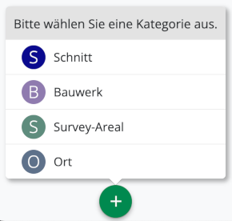
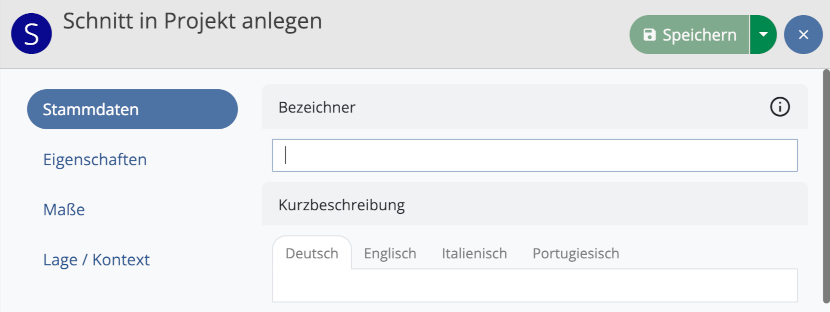
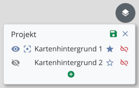
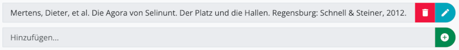

## Erste Schritte

Nach dem ersten Start der Anwendung befinden Sie sich zunächst im Projekt "test", das es
Ihnen ermöglicht, die Funktionen des Programms anhand einiger Testdaten auszuprobieren.
Bitte beachten Sie, dass neu angelegte Datensätze nach einem Neustart der Anwendung
gelöscht und alle Änderungen zurückgesetzt werden, solange das Testprojekt ausgewählt ist.
Aus diesem Grund findet im Testprojekt grundsätzlich keine Synchronisation mit anderen Field-Desktop-Installationen oder Field-Servern statt.

Um mit Field Desktop produktiv zu arbeiten und ein eigenes Projekt anzulegen, sollten Sie zunächst die folgenden Schritte durchführen:

1. Im Untermenü **Einstellungen**, das Sie über das Menü "Field" (MacOS) bzw. "Werkzeuge" (Windows)
erreichen, können Sie grundlegende Einstellungen vornehmen, die für sämtliche Projekte gelten. Legen Sie hier
bitte zunächst Ihren Bearbeiternamen bzw. Bearbeiterinnennamen fest. Dieser Name wird bei allen von Ihnen
vorgenommenen Änderungen in der Datenbank hinterlegt und sollte unbedingt gesetzt werden, insbesondere wenn
Daten synchronisiert werden sollen.

2. Rufen Sie im Menü "Projekt" den Menüpunkt **Neu...** auf und geben Sie den gewünschten Namen Ihres Projekts ein. Erlaubte Zeichen sind Buchstaben, Zahlen, Bindestriche und Unterstriche. Sie haben die Wahl zwischen mehreren Voreinstellungen für die Projektkonfiguration: Wählen Sie "Standard" für die umfangreiche Field-Standardkonfiguration oder eine der "Basis"-Optionen, wenn Sie lediglich mit einem Grundgerüst an voreingestellten Kategorien und Feldern starten möchten. Legen Sie außerdem die Sprachen fest, in denen innerhalb des Projekts Daten eingegeben werden sollen.

3. Sobald das neue Projekt geladen wurde, können Sie über das Menü "Projekt" ➝ "Eigenschaften" allgemeine Projektdaten eingeben. Hier sollten Sie zunächst die Listen der **Teammitglieder** (Feld "Team" in der Sektion "Projekt") und der **Kampagnen** (Feld "Kampagnen", ebenfalls in der Sektion "Projekt") anlegen. Sie können diese Listen zu einem späteren Zeitpunkt jederzeit erweitern.

Verwenden Sie das Untermenü **Backup erstellen...**, das Sie über das Menü "Projekt" erreichen, um regelmäßig
Sicherungen Ihrer Projektdaten anzulegen.

## Ressourcen

Nach dem Anlegen bzw. Öffnen eines Projekts befinden Sie sich zunächst im Tab **Übersicht** (gekennzeichnet
durch ein Haus-Symbol), in dem alle Maßnahmen und Orte des Projekts verwaltet werden.

Verwenden Sie den grünen Plus-Button unten in der Ressourcenliste, um eine neue Maßnahme anzulegen. 

Dabei wählen Sie in einem ersten Schritt die Kategorie der Maßnahme aus und können anschließend optional eine
Geometrie für die neue Ressource anlegen. Schließlich öffnet sich der Editor, in dem Sie sämtliche Daten der
Maßnahme eintragen können. Je nach gewählter Maßnahmenkategorie stehen unterschiedliche Felder zur Auswahl,
die jeweils in Gruppen aufgeteilt sind. Zwischen den Feldgruppen können Sie jederzeit per Klick auf einen der
Buttons auf der linken Seite wechseln.

Bevor die Maßnahme über den grünen Speichern-Button gesichert werden kann, muss in jedem Fall das Feld
**Bezeichner** in der Gruppe "Stammdaten" ausgefüllt werden.

Die neue Maßnahme wird nun in der Ressourcenliste angezeigt. Benutzen Sie den Button "Zur Maßnahme wechseln"
(Symbol: Pfeil nach rechts oben), um einen neuen Tab für die Maßnahme zu öffnen.

In Abhängigkeit von der Maßnahmenkategorie können innerhalb eines Maßnahmen-Tabs mithilfe des Plus-Buttons
Ressourcen verschiedener Kategorien angelegt werden (etwa stratigraphische Einheiten innerhalb eines Schnitts
oder Räume innerhalb eines Gebäudes).

### Hierarchische Anordnung

Ressourcen können in hierarchischen Strukturen angeordnet werden, beispielsweise um Funde einer
stratigraphischen Einheit zuzuweisen. Benutzen Sie den Button "Untergeordnete Ressourcen anzeigen"
(Symbol: rechtwinkliger Pfeil nach rechts unten), um eine Liste aller Ressourcen anzuzeigen, die der
ausgewählten Ressource untergeordnet wurden. Bei einer neu angelegten Ressource ist diese Liste zunächst leer.

Per Klick auf **Kollektion öffnen** kann auf die tiefere Hierarchieebene gewechselt werden, sodass nun die
untergeordneten Ressourcen angezeigt werden (etwa die Funde einer stratigraphischen Einheit).
Die Verwendung des Plus-Buttons führt jetzt dazu, dass Ressourcen entsprechend auf dieser Ebene angelegt
werden.

Der Navigationspfad oberhalb der Ressourcenliste zeigt die gerade ausgewählte Hierarchieebene an. Sie können
jederzeit per Klick auf einen der Buttons des Navigationspfades in eine andere Ebene wechseln.

### Ressourcen verwalten

Ressourcen in der Liste können per Klick ausgewählt werden. Bei gedrückter Strg/Cmd- oder Shift-Taste lassen
sich mehrere Ressourcen gleichzeitig selektieren. Nach einem Rechtsklick auf eine oder mehrere ausgewählte
Ressourcen öffnet sich ein Kontextmenü, das die folgenden Optionen bereitstellt:

* *Bearbeiten*: Öffnet den Editor (alternativ auch per Doppelklick auf den Ressourceneintrag in der Liste
erreichbar)
* *Bilder verknüpfen*: Öffnet ein Fenster, in dem Bilder mit der gewählten Ressource verknüpft bzw. verknüpfte Bilder entfernt werden können.
* *Verschieben*: Erlaubt es, Ressourcen aus ihrem aktuellen Kontext zu entfernen und einer anderen
Ressource unterzuordnen
* *Löschen*: Entfernt Ressourcen nach einer Sicherheitsabfrage (optional können außerdem alle Bilder entfernt werden,
die ausschließlich mit den zu löschenden Ressourcen verknüpft sind)

Darüber hinaus stellt das Kontextmenü Funktionen zum Anlegen bzw. Bearbeiten von Geometrien bereit. Bitte beachten Sie,
dass bei Auswahl mehrerer Ressourcen ausschließlich die Optionen *Verschieben* und *Löschen* verfügbar sind.

## Bilder

Bilder können in ein Field-Projekt importiert werden, um sie anschließend mit Ressourcen zu verknüpfen oder als Kartenhintergründe zu verwenden. Für jedes importierte Bild wird automatisch eine Bildressource angelegt, in der Metadaten des Bildes eingetragen werden können.

Bilddateien können über eine Synchronisationsverbindung optional mit anderen Rechnern geteilt werden (siehe Kapitel *Synchronisation*). Ist eine Bilddatei nicht auf dem Rechner vorhanden, wird stattdessen eine Platzhaltergrafik angezeigt.

### Bilder importieren

Bilder können auf zwei verschiedene Arten in die Anwendung importiert werden: über das Menü  "Werkzeuge" ➝ "Bilderverwaltung" sowie über die Option "Bilder verknüpfen" im Kontextmenü einer Ressource (erreichbar per Rechtsklick auf die gewünschte Ressource). In letzterem Fall wird das Bild nach dem Import automatisch mit der entsprechenden Ressource verknüpft (siehe Abschnitt *Bilder mit Ressourcen verknüpfen*).

Zum Import klicken Sie auf den Plus-Button und wählen die gewünschten Dateien aus. Alternativ können Sie die Dateien auch direkt aus einer Dateimanager-Anwendung auf die markierte Fläche ziehen, die den Plus-Button umgibt. Sind für das Projekt mehrere Bildkategorien (d. h. Unterkategorien der Kategorie "Bild") definiert, können Sie die gewünschte Kategorie anschließend aus einem Auswahlmenü wählen.

Unterstützte Bildformate sind *jpg/jpeg* und *png*. Bitte beachten Sie, dass sehr große Bilder unter Umständen zu Verzögerungen bei der Benutzung der Anwendung führen können. Empfohlen wird, große Bilddateien vor dem Import gegebenenfalls mithilfe eines Bildbearbeitungsprogramms auf eine Maximalgröße von ca. 10 MB zu reduzieren. Darüber hinaus können Bilder mit sehr hoher Auflösung in manchen Fällen nicht importiert werden. Verringern Sie in diesen Fällen die Auflösung der entsprechenden Bilder und starten den Import anschließend erneut.

### Bilder verwalten

Für jedes importierte Bild wird von der Anwendung eine Kopie sowie eine kleinere Version als Vorschaubild erstellt und im **Bilderverzeichnis** gespeichert, dessen Pfad Sie in den Einstellungen unter "Erweiterte Einstellungen" auslesen können. Die Dateien in diesem Ordner werden von der Anwendung verwaltet und dürfen nicht manuell bearbeitet, umbenannt oder gelöscht werden, da es ansonsten zu Fehlern bei der Anzeige oder der Synchronisation von Bildern kommen kann.

Öffnen Sie zur Verwaltung der Bilder das Menü "Werkzeuge" ➝ "Bilderverwaltung". Hier können Sie sämtliche Bilder des Projekts einsehen und durchsuchen (siehe dazu auch das Kapitel *Suche*).

#### Metadaten bearbeiten

Sie können die Metadaten eines Bildes einsehen, indem Sie per Doppelklick auf das gewünschte Bild die Bildansicht öffnen. Klicken Sie den Bearbeiten-Button, um den Editor aufzurufen und die Metadaten zu editieren. Zur Verfügung stehen hier die Felder, die im Konfigurationsedtior für das Formular der entsprechenden Bildkategorie konfiguriert wurden.

#### Bilder löschen

Um importierte Bilder wieder aus dem Projekt zu entfernen, selektieren Sie die entsprechenden Bilder in der Bilderverwaltung. Über den Button "Löschen" können sie anschließend entfernt werden:

Beachten Sie, dass dabei auch die entsprechenden Dateien im Bilderverzeichnis des Projekts gelöscht werden (bei einer bestehenden Synchronisationsverbindung auch auf anderen Rechnern). Verknüpfungen mit Ressourcen gehen beim Löschen verloren.

### Bilder mit Ressourcen verknüpfen

Um eines oder mehrere Bilder mit einer Ressource zu verknüpfen, wählen Sie die Option "Bilder verknüpfen" im Kontextmenü der entsprechenden Ressource und klicken anschließend auf den Plus-Button. Sie haben nun die Wahl zwischen zwei Optionen:

* *Neue Bilder hinzufügen*: Neue Bilder werden in das Projekt importiert und mit der Ressource verknüpft.
* *Existierende Bilder verknüpfen*: Wählen Sie aus bereits im Projekt vorhandenen Bildern eines oder mehrere aus, die mit der Ressource verknüpft werden sollen.

Selektieren Sie Bilder in der Liste und wählen die Option "Verknüpfung entfernen", um verknüpfte Bilder wieder von der Ressource zu lösen. Die Bilder selbst bleiben weiterhin im Projekt erhalten.

Verknüpfungen können auch über die Bilderverwaltung hinzugefügt oder entfernt werden. Selektieren Sie dazu die gewünschten Bilder und klicken den Button "Verknüpfen" (blauer Button) bzw. "Verknüpfungen entfernen" (roter Button) in der oberen Leiste:

#### Hauptbild festlegen

Ist eine Ressource mit mehreren Bildern verknüpft, wird eines der Bilder als **Hauptbild** mit einem Stern-Symbol markiert. Dieses Hauptbild wird bei der Ressource als Vorschaubild angezeigt. Sie können das Hauptbild wechseln, indem Sie die Option "Bilder verknüpfen" im Kontextmenü der Ressource auswählen und das gewünschte Bild in der Liste verknüpfter Bilder selektieren. Klicken Sie anschließend den Button "Als Hauptbild festlegen":

### Kartenhintergründe

#### Georeferenzierung

Damit ein Bild als Kartenhintergrund eingesetzt werden kann, müssen zunächst Informationen zur Georeferenzierung aus einem World-File eingelesen werden. Unterstützt werden World-Files mit den Dateiendungen *wld*, *jpgw*, *jpegw*, *jgw*, *pngw* und *pgw*.

World-Files können auf zwei verschiedene Arten importiert werden: Ist der Dateiname des World-Files vor der Endung identisch mit dem Namen der entsprechenden Bilddatei, kann die Datei über den Bilderimport (Plus-Button) hinzugefügt werden. Die Zuordnung zum Bild findet dabei automatisch statt. Alternativ kann ein World-File auch über die Bildansicht importiert werden, die Sie in der Bilderverwaltung per Doppelklick auf das entsprechende Bild erreichen. Öffnen Sie hier die Sektion "Georeferenzdaten" und klicken den Button "World-File laden", um anschließend die gewünschte Datei auszuwählen.

#### Kartenhintergründe konfigurieren

Ein Kartenhintergund kann entweder für eine bestimmte Maßnahme konfiguriert werden oder für das gesamte Projekt. Wechseln Sie in den Übersichts-Tab (Haussymbol), wenn der Kartenhintergrund im gesamten Projekt zur Verfügung stehen soll, oder in den Tab der gewünschten Maßnahme. Öffnen Sie dort das Kartenhintergründe-Menü über den Button rechts oben auf der Karte und klicken den Bearbeiten-Button. Über den Plus-Button können Sie nun neue Kartenhintergünde hinzufügen, wobei alle Bilder zur Auswahl stehen, für die über den Import eines World-Files Georeferenzierungsdaten hinzugefügt wurden.

Ändern Sie die Reihenfolge von Kartenhintergründen, indem Sie sie per Drag & Drop in der Liste nach oben oder unten schieben. Überlappen sich auf der Karte mehrere Hintergrundbilder, entscheidet die Reihenfolge darüber, welches Bild angezeigt wird: Ein Kartenhintergrund, der in der Liste weiter oben steht, wird auch auf der Karte über einem weiter unten stehenden Kartenhintergund angezeigt und kann diesen dabei ganz oder teilweise überdecken.

Der blaue Button "Als Standard-Kartenhintergrund festlegen" (Stern-Symbol) rechts neben jedem Eintrag in der Liste erlaubt es, eines oder mehrere Bilder auszuwählen, die beim ersten Öffnen des Projekts standardmäßig auf der Karte angezeigt werden sollen.

Über den roten Button "Kartenhintergrund entfernen" können Sie das entsprechende Bild wieder aus der Liste der Kartenhintergründe entfernen. Das Bild selbst wird dabei nicht aus dem Projekt gelöscht und kann später erneut als Kartenhintergrund hinzugefügt werden.

Klicken Sie den Button "Speichern", um die Änderungen in der Datenbank zu speichern.

#### Kartenhintergründe anzeigen

Über das Kartenhintergründe-Menü können konfigurierte Kartenhintergründe jederzeit ein- und ausgeblendet werden. Klicken Sie dazu den Augen-Button links neben dem entsprechenden Eintrag in der Liste. Die hier vorgenommenen Einstellungen werden (anders als die Liste der grundsätzlich für den Tab zur Verfügung stehenden Kartenhintergründe) nicht in der Datenbank gespeichert und somit auch nicht über eine Synchronisationsverbindung geteilt, sodass auf unterschiedlichen Rechnern unterschiedliche Kartenhintergründe ein- und ausgeblendet sein können.

## Suche

In der **Übersicht**, den **Maßnahmen-Tabs** sowie in der **Bilderverwaltung** stehen **Suchfilter** zur Verfügung, die Sie verwenden können, um die Menge der aktuell
angezeigten Ressourcen anhand grundlegender Suchkriterien  (Bezeichner, Kurzbeschreibung, Kategorie)
einzuschränken.

Möchten Sie komplexere Suchanfragen formulieren, können Sie innerhalb der **Übersicht** und der
**Maßnahmen-Tabs** darüber hinaus in den **erweiterten Suchmodus** wechseln. 
Dieser Modus ermöglicht es Ihnen einerseits, über Hierarchieebenen hinweg und auch innerhalb des gesamten
Projektes zu suchen und dabei andererseits zusätzliche feldspezifische Suchkriterien zu definieren.

### Suchfilter

Der Suchfilter stellt eine schnelle Möglichkeit dar, Ressourcen nach bestimmten Kriterien anzuzeigen bzw.
auszublenden, und besteht aus einem *Textfilter* (Eingabefeld) sowie einem *Kategoriefilter* (blauer Button).

Nach der Eingabe eines Suchbegriffes und/oder der Auswahl einer Kategorie wird die Menge der aktuell
angezeigten Ressourcen so eingeschränkt, dass sie den Filterkriterien entspricht. In der **Übersicht** und den
**Maßnahmen-Tabs** betrifft das die Ressourcen in der linken Seitenleiste und auf der Karte (in der
Kartenansicht) bzw. die Elemente der Liste (in der Listenansicht). In der **Bilderverwaltung** sind alle im
Raster angezeigten Bilder vom Suchfilter betroffen.

#### Kategoriefilter

Über den Kategoriefilter-Button können Sie eine Kategorie wählen. Unterschieden wird zwischen Oberkategorien und
Unterkategorien: Wählen Sie eine Unterkategorie (z. B. "Erdbefund"), werden ausschließlich Ressourcen der
entsprechenden Kategorie angezeigt. Wählen Sie dagegen eine Oberkategorie (z. B. "Stratigraphische Einheit"),
werden Ressourcen der ausgewählten Kategorie sowie aller seiner Unterkategorien (z. B. "Erdbefund", "Grab",
"Architektur", "Fußboden" etc.) berücksichtigt. Klicken Sie ein weiteres Mal, um lediglich die Oberkategorie
selbst auszuwählen.
 
Welche Kategorien zur Auswahl stehen, hängt jeweils vom gerade aktiven Kontext ab: In der Übersicht
können Maßnahmenkategorien gewählt werden, in der Bilderverwaltung Bildkategorien etc. 

#### Textfilter

Suchbegriffe werden derzeit mit den Feldern "Bezeichner" und "Kurzbeschreibung" von Ressourcen abgeglichen. 
 
*Beispiel:*
 
In der Übersicht werden die folgenden drei Schnitte angezeigt:

    (1)
    Bezeichner: "S01"
    Kurzbeschreibung: "Schnitt-01"
    
    (2)
    Bezeichner: "S02"
    Kurzbeschreibung: "Schnitt-02"
    
    (3)
    Bezeichner: "ms1"
    Kurzbeschreibung: "Mein Schnitt 1" 

**Mögliche Suchbegriffe** sind die jeweils durch Leerzeichen oder Bindestriche getrennten Textfolgen in den
Bezeichnern und Kurzbeschreibungen, also im Beispiel: "S01", "S02", "ms1", "Schnitt", "01", "02", "Mein", "1".
  
Der Suchbegriff "s01" liefert beispielsweise die Ressource (1), die Suche nach "mein" liefert (3) als
Suchtreffer. **Groß- bzw. Kleinschreibung** spielt dabei keine Rolle und wird ignoriert.

Es handelt sich um eine sogenannte **Präfix-Suche**, d. h. es wird stets auf den Anfang eines Suchbegriffs
geprüft: Da die Bezeichner von (1) und (2) mit der Textfolge "s0" beginnen, liefert der Suchbegriff "s0"
sowohl (1) als auch (2) als Suchtreffer. Eine Suche nach "Schn" liefert (1), (2) und (3) zurück, eine Suche
nach "itt" oder "chni" hingegen nichts.

#### Platzhaltersuche

Im Textfilter ist auch eine Platzhaltersuche möglich: Statt eines Zeichens können Sie innerhalb eckiger
Klammern eine Menge unterschiedlicher erlaubter Zeichen angeben. Ein solcher Platzhalter kann pro Suchanfrage
einmal verwendet werden.

*Beispiel:*

    (1) Bezeichner: "Landscape-0001"
    (2) Bezeichner: "Landscape-0009"
    (3) Bezeichner: "Landscape-0010"
    (4) Bezeichner: "Landscape-0011"
    (5) Bezeichner: "Landscape-0022"

Eine Suche nach "Landscape-00[01]" liefert (1), (2), (3), (4), da für die dritte Ziffer sowohl 0 als auch 1
als zulässige Zeichen angegeben wurden. Alle weiteren Zeichen danach sind aufgrund der Präfix-Suche erlaubt.

Eine Suche nach "Landscape-00[01]1" liefert (1) und (4), da die Ziffer nach dem Platzhalter genau eine 1 sein
muss.

#### Suchergebnisse aus anderen Kontexten

Werden bei gesetztem Suchfilter keine Suchergebnisse im aktuellen Kontext gefunden, werden unterhalb des
Textfelds Suchergebnisse aus anderen Kontexten angezeigt.

Durch einen Klick auf eine der angezeigten Ressourcen wechseln Sie sofort in den dazugehörigen Kontext und
wählen die entsprechende Ressource aus.

### Erweiterter Suchmodus

In der **Übersicht** und in den **Maßnahmen-Tabs** können Sie durch einen Klick auf den Lupen-Button in
den erweiterten Suchmodus wechseln.
 

Im erweiterten Suchmodus ist eine Suche über größere Datenmengen möglich:

* In der **Übersicht** wird über alle im Projekt angelegten Ressourcen gesucht.
* In den **Maßnahmen-Tabs** wird über alle Ressourcen der Maßnahme gesucht.

In beiden Fällen werden alle gefundenen Suchergebnisse links in der Liste angezeigt. Die Buttons "Im Kontext
anzeigen" (Symbol: Pfeil nach oben) bzw. "Im Kontext einer Maßnahme anzeigen" (Symbol: Pfeil nach rechts oben)
erlauben es, direkt in den hierarchischen Kontext einer Ressource zu wechseln; dabei wird der erweiterte
Suchmodus beendet und wenn erforderlich ein neuer Tab geöffnet. 

Bei aktiviertem erweiterten Suchmodus können keine neuen Ressourcen angelegt werden, was durch den
ausgegrauten Plus-Button angezeigt wird. Um neue Ressourcen anzulegen, verlassen Sie den erweiterten
Suchmodus zunächst wieder.

Die Anzahl der gleichzeitig angezeigten Suchergebnisse ist aus Performancegründen immer auf maximal **200**
beschränkt. Das Programm zeigt die weiteren Ressourcen nicht an, weist aber darauf hin, dass die Maximalanzahl
überschritten ist. Fügen Sie weitere Suchkriterien hinzu oder verlassen Sie den erweiterten Suchmodus, um auf
die ausgeblendeten Ressourcen zugreifen zu können.
 

#### Feldspezifische Suchkriterien
 
Ist der erweiterte Suchmodus aktiviert, können Sie eine Suche über spezifische Felder einer Ressource
anstoßen, indem Sie auf den Plus-Button links neben dem Kategoriefilter-Button klicken. Dabei werden Felder
zur Suche angeboten, die der als Filter ausgewählten Kategorie entsprechen und für die in der Projektkonfiguration die Option "Feldspezifische Suche erlauben" aktiviert wurde. Sie können beliebig viele Felder
auswählen, sodass Sie mehrere Suchkriterien miteinander kombinieren können. Darüber hinaus können Sie die
feldspezifischen Suchkriterien selbstverständlich auch in Kombination mit dem Textfilter verwenden.

Handelt es sich um Freitextfelder, so geben Sie den Suchbegriff direkt ein; bei Feldern mit Wertelisten
wählen Sie den Begriff aus der Liste aller erlaubten Werte in einem Dropdown-Menü aus.
 
**Achtung**: Im Gegensatz zum Suchfilter wird an dieser Stelle keine Präfix-Suche durchgeführt. Der
eingestellte Begriff muss exakt mit dem Feldinhalt des entsprechenden Feldes einer Ressource
übereinstimmen, damit die Ressource als Suchergebnis auftaucht.

Alternativ zur Angabe eines konkreten Suchbegriffs kann außerdem nach allen Ressourcen gesucht werden, bei
denen das Feld gesetzt (Option "Beliebiger Wert") bzw. nicht gesetzt ist (Option "Kein Wert").

Die Zahl neben dem Kategoriefilter-Button gibt die Anzahl der aktiven Suchkriterien an. Sie können
Suchkriterien auch nachträglich wieder entfernen, indem Sie das Menü durch einen Klick auf die Zahl erneut
öffnen und das entsprechende Kriterium auswählen.

## Synchronisation

Um mit mehreren Computern an einem Projekt zu arbeiten, können Daten zwischen verschiedenen Field-Desktop-Installationen synchronisiert werden. Das bedeutet, dass Änderungen (neue Ressourcen, gelöschte Ressourcen oder Editierungen bestehender Ressourcen sowie hinzugefügte oder gelöschte Bilder), die auf einem anderen Rechner in Field Desktop vorgenommen werden, automatisch auch in die eigene Datenbank übertragen werden und umgekehrt. So wird erreicht, dass alle Mitarbeitenden zu jeder Zeit mit dem aktuellen Stand des Projekts arbeiten können. Die Synchronisation kann dabei über das Internet oder über ein lokales Netzwerk stattfinden. Sie können weiterhin auch bei konfigurierter Synchronisation offline mit dem Projekt arbeiten – die Datenbanken werden dann synchronisiert, sobald Sie wieder mit dem Netzwerk verbunden sind.

Bitte beachten Sie, dass vor der Einrichtung der Synchronisation in jedem Fall das Feld **Name des Bearbeiters/der Bearbeiterin** in den Einstellungen ausgefüllt sein sollte.

### Projekt herunterladen

Um mit einem bestehenden Projekt zu arbeiten, das bei einer anderen Field-Desktop-Installation oder auf einem Field-Server vorliegt, laden Sie das Projekt zunächst herunter. Wählen Sie dazu im Menü "Projekt" den Menüpunkt **Herunterladen...** aus und geben Sie die Zugangsdaten ein:

* *Adresse*: Tragen Sie hier die Adresse des Projekts ein, das Sie herunterladen möchten. Das kann die Netzwerkadresse eines anderen Computers sein, auf dem Field Desktop gerade geöffnet ist (diese Adresse kann in den Einstellungen unter *Eigene Adresse* eingesehen werden), oder die Adresse eines Field-Servers, der über das Internet oder ein lokales Netzwerk erreichbar ist (z. B. *https://server.field.idai.world* für den Server des DAI).
* *Projektname*: Der Name des Projekts, das Sie herunterladen möchten.
* *Passwort*: Das Passwort des Projekts bzw. der Field-Desktop-Installation, von der Sie das Projekt herunterladen möchten.
* *Vorschaubilder herunterladen*: Diese Option ist standardmäßig aktiviert. Wenn Sie über eine schwache Internetverbindung verfügen und möglichst wenige Daten herunterladen möchten, können Sie sie deaktivieren.
* *Originalbilder herunterladen*: Aktivieren Sie diese Option, wenn Sie die Originalbilder in ihrer ursprünglichen Bildauflösung herunterladen möchten. Je nach Anzahl und Größe der im Projekt verwalteten Bilder können dabei unter Umständen mehrere Gigabyte an Daten heruntergeladen werden. Stellen Sie sicher, dass Sie über eine ausreichende Internetverbindung und genügend Festplattenspeicher verfügen, bevor Sie die Option aktivieren.
* *Existierendes Projekt gleichen Namens überschreiben*: Ist diese Option aktiviert, wird das Projekt auch dann heruntergeladen, wenn ein gleichnamiges Projekt bereits auf dem Rechner existiert. Das bestehende Projekt wird dabei gelöscht.

Sobald Sie gültige Angaben für die Adresse, den Projektnamen und das Passwort eingegeben haben, wird die Menge der jeweils herunterzuladenden Bilddaten nach kurzer Berechnungszeit neben den entsprechenden Optionen angezeigt.

Der Download kann bei größeren Projekten unter Umständen eine längere Zeit dauern. Das heruntergeladene Projekt wird anschließend automatisch geöffnet und eine Synchronisationsverbindung unter Verwendung der gleichen Zugangsdaten hergestellt.

### Synchronisation konfigurieren

Sowohl heruntergeladene als auch neu angelegte Projekte können jederzeit mit anderen Datenbanken synchronisiert werden. Die Synchronisation kann über den Menüpunkt "Projekt" ➝ "Synchronisieren..." konfiguriert werden.

* *Adresse*: Tragen Sie hier die Adresse der Datenbank ein, mit der Sie eine Synchronisationsverbindung herstellen möchten. Das kann die Netzwerkadresse eines anderen Computers sein, auf dem Field Desktop gerade geöffnet ist (diese Adresse kann in den Einstellungen unter *Eigene Adresse* eingesehen werden), oder die Adresse eines FieldHub-Servers, die über das Internet oder ein lokales Netzwerk erreichbar ist (z. B. *https://server.field.idai.world* für den FieldHub-Server des DAI).
* *Passwort*: Das Passwort des Projekts bzw. der Field-Desktop-Installation, mit der Sie die Synchronisationsverbindung herstellen möchten.
* *Vorschaubilder synchronisieren*: Diese Option ist standardmäßig aktiviert. Wenn Sie über eine schwache Internetverbindung verfügen und möglichst wenige Daten hoch- bzw. herunterladen möchten, können Sie sie deaktivieren.
* *Synchronisation aktivieren*: Über diesen Schalter können Sie die Verbindung starten bzw. unterbrechen.
* *Originalbilder hochladen*: Aktivieren Sie diese Option, wenn Sie Originalbilder in ihrer ursprünglichen Bildauflösung hochladen möchten.
* *Originalbilder herunterladen*: Aktivieren Sie diese Option, wenn Sie Originalbilder in ihrer ursprünglichen Bildauflösung herunterladen möchten. Je nach Anzahl und Größe der im Projekt verwalteten Bilder können dabei unter Umständen mehrere Gigabyte an Daten heruntergeladen werden. Stellen Sie sicher, dass Sie über eine ausreichende Internetverbindung und genügend Festplattenspeicher verfügen, bevor Sie die Option aktivieren.

Sobald Sie eine gültige Adresse und das korrekte Passwort eingegeben haben, wird die Menge der jeweils aktuell hoch- bzw. herunterzuladenden Bilddaten nach kurzer Berechnungszeit neben den entsprechenden Optionen angezeigt. Beachten Sie, dass die Datenmenge ansteigen kann, wenn zu einem späteren Zeitpunkt zusätzliche Bilder in das Projekt importiert werden.

Über den Schalter **Synchronisation aktivieren** können Sie die Verbindung starten bzw. unterbrechen. Bestätigen Sie Ihre Einstellungen zuletzt über den Button **Einstellungen übernehmen**.

### Synchronisationsstatus

Das Wolken-Icon oben rechts in der Navigationsleiste zeigt den atuellen Status der von Ihnen eingerichteten Synchronisationsverbindung an.

Konnte die Verbindung erfolgreich hergestellt werden, zeigt das Icon einen Haken an. Werden gerade Dateien herunter- oder hochgeladen, wird dies durch einen Pfeil signalisiert. Im Falle eines Fehlers erscheint ein Ausrufezeichen. Zusätzliche Informationen zum Synchronisationsstatus können Sie abfragen, indem Sie den Mauszeiger über das Icon bewegen.

### Konflikte

Zu Konflikten kann es kommen, wenn eine Ressource gleichzeitig auf mehreren Computern bearbeitet wird oder wenn sich zwei Datenbanken miteinander synchronisieren, in denen zuvor die gleiche Ressource bearbeitet wurde. In solchen Fällen stehen sich zwei unterschiedliche Versionen der Ressource gegenüber: die *aktuelle Version* (die in der Ressourcenverwaltung und anderen Bereichen der Anwendung angezeigt wird) und die *konkurrierende Version* (die im Hintergrund gespeichert bleibt, aber vorerst nicht angezeigt wird). Die Versionen können sich in der Anzahl der ausgefüllten Felder unterscheiden; möglicherweise wurden auch verschiedene Werte in die gleichen Felder eingetragen.

Ressourcen mit Konflikten werden in der Liste mit einer roten Linie markiert. Darüber hinaus erscheint in der Navigationsleiste ein Icon, das die Anzahl der Konflikte im Projekt mitteilt:

Klicken Sie auf das Icon, um eine Liste sämtlicher Ressourcen mit Konflikten zu öffnen. Wenn Sie eine der Ressourcen anwählen, gelangen Sie in den **Konflikte**-Tab des Editors, wo Sie die Ressource bereinigen können.

Um den Konflikt aufzulösen, muss für jedes Feld mit voneinander abweichenden Werten entschieden werden, welche Version die jeweils gültige ist. Alternativ können Sie per Klick auf *Aktuelle Version* oder *Konkurrierende Version* eine der beiden Versionen in Gänze übernehmen. Bestätigen Sie Ihre Entscheidung anschließend über den Button **Konflikt lösen**. Falls in der Ressource mehrere Konflikte aufgetreten sind, können Sie diese auf die gleiche Weise der Reihe nach lösen. Sie können dabei auch weitere Anpassungen in den anderen Editor-Tabs vornehmen. Um die Änderungen zu übernehmen, muss die Ressource zum Schluss über den **Speichern**-Button gesichert werden. 

### Synchronisationsverbindungen zur eigenen Field-Desktop-Installation erlauben

Sie können anderen erlauben, eine Synchronisationsverbindung mit Ihrem Projekt herzustellen, indem Sie ihnen die Zugangsdaten mitteilen, die Sie im Menü **Einstellungen** im Abschnitt **Synchronisation** finden können:

* *Eigene Adresse*: Ihre Netzwerkdresse, über die sich andere aus ihrer Field-Desktop-Installation heraus mit Ihrer Datenbank verbinden können. Sie können diese Adresse zusammen mit Ihrem Passwort weitergeben, um anderen zu ermöglichen, ihre Projektdaten mit Ihnen zu synchronisieren.
* *Eigenes Passwort*: Standardmäßig wird die Datenbank mit einem zufällig generierten Passwort vor unbefugtem Zugriff geschützt. An dieser Stelle können Sie das Passwort ändern.
* *Originalbilder empfangen*: Ist diese Option aktiviert, werden von anderen gesendete Bilddateien in ihrer ursprünglichen Bildauflösung angenommen und im Bilderverzeichnis gespeichert. Da die Bilddateien unter Umständen mehrere Gigabyte an Daten umfassen können, sollten Sie sicherstellen, dass ausreichend Speicherplatz im Bilderverzeichnis vorhanden ist. Standardmäßig ist die Option deaktiviert, sodass keine Originalbilder angenommen werden. Die Option betrifft ausschließlich Synchronisationsverbindungen, die auf anderen Rechnern eingerichtet wurden; eine selbst konfigurierte Synchronisationsverbindung ist von dieser Einstellung nicht betroffen.

## Projektkonfiguration

Eine mit Field Desktop verwaltete Datenbank enthält eine Reihe von Ressourcen, die immer einer bestimmten **Kategorie** angehören, beispielsweise "Ort", "Fund" oder "Abbildung". Dabei wird unterschieden zwischen **Oberkategorien** (z. B. "Fund") und **Unterkategorien** (z. B. "Ziegel" oder "Keramik"). Eine Ressource der Unterkategorie gehört dabei immer auch der Oberkategorie an (ein Ziegel ist gleichzeitig ein Fund).

Jede Kategorie stellt eine Reihe von **Feldern** bereit, durch die Merkmale und Metadaten der Ressource beschrieben werden können (z. B. "Gewicht", "Farbe", "Bearbeiter/Bearbeiterin" usw.). Felder wiederum besitzen jeweils einen bestimmten Eingabetyp, der bestimmt, welche Daten für das Feld auf welche Weise eingetragen werden können (z. B.: Textfeld, Zahleneingabe, Datierungsangabe). Für Felder einiger Eingabetypen kann eine **Werteliste** angegeben werden, die eine Reihe von Textwerten als vorgegebene Auswahlmöglichkeiten definiert.

Welche Felder für eine Kategorie konkret im Ressourceneditor zur Verfügung stehen, wird durch die Wahl des **Formulars** bestimmt, das eine Auswahl aus den verfügbaren Feldern vornimmt und diese in **Gruppen** sortiert. Für jede Kategorie steht dabei ein gleichnamiges Basisformular zur Verfügung, das lediglich wenige obligatorische Felder enthält, sowieso eines oder mehrere weitere Formulare mit umfangreicherer Feldauswahl (z. B. "Pottery:default" mit den Standardfeldern des Field-Datenmodells für die Kategorie "Keramik"). Formulare sowie ihre Feldgruppen und Felder können über den Konfigurationseditor beliebig angepasst und erweitert werden. Ein Formular einer Unterkategorie erbt dabei immer die Felder des ausgewählten Formulars der entsprechenden Oberkategorie.

Durch **Relationen** werden Beziehungen zwischen Ressourcen angegeben (z. B.: Erdbefund "A1" liegt räumlich unter Erdbefund "A2"). Relationen können im Konfigurationseditor ausgeblendet, aber nicht neu angelegt werden.

Über das Menü "Werkzeuge" ➝ "Projektkonfiguration" erreichen Sie den Konfigurationseditor, der es Ihnen erlaubt, die im Projekt verfügbaren Kategorien, Felder und Wertelisten anzupassen und zu erweitern. Änderungen an der Konfiguration werden bei bestehender Synchronisationsverbindung an andere Nutzer und Nutzerinnen übertragen, sobald sie über den "Speichern"-Button bestätigt werden.

### Kategorien und Formulare

In der linken Seitenleiste des Editors werden die aktuell für das Projekt konfigurierten Kategorien aufgelistet. Über das Filtermenü links oben können Sie die Auswahl der angezeigten Kategorien auf einen bestimmten Bereich der Anwendung beschränken (z. B. "Schnitt" für die Beschränkung auf Kategorien, die innerhalb eines Schnitt-Tabs angelegt werden können). Bei Wahl der Option "Alle" werden sämtliche Kategorien des Projekts aufgeführt.

Wenn Sie eine Kategorie in der Liste auswählen, wird auf der rechten Seite das für diese Kategorie konfigurierte Formular mit den entsprechenden Feldgruppen und Feldern angezeigt.

#### Hinzufügen von Oberkategorien

Über den grünen Plus-Button unten in der Liste können Sie eine neue Oberkategorie zum Projekt hinzufügen. Dabei haben Sie die Auswahl zwischen allen Oberkategorien der Field-Kategoriebibliothek, die aktuell noch nicht für das Projekt konfiguriert sind. Über das Textfeld oberhalb der Liste können Sie die angezeigten Kategorien und Formulare filtern. Für jede Kategorie werden die verfügbaren Formulare aufgelistet; bei Klick auf eines der Formulare sehen Sie auf der rechten Seite die entsprechenden Feldgruppen und Felder. Bestätigen Sie Ihre Auswahl über den Button "Kategorie hinzufügen".

Beachten Sie bitte, dass aktuell keine neuen Oberkategorien über den Konfigurationseditor hinzugefügt werden können.

#### Hinzufügen von Unterkategorien

Möchten Sie eine neue Unterkategorie zu einer bestehenden Oberkategorie hinzufügen, klicken Sie auf den kleinen Plus-Button, der rechts neben der entsprechenden Oberkategorie angezeigt wird. Fehlt der Plus-Button, so ist das Anlegen von Unterkategorien für diese Kategorie nicht möglich.

Analog zum Hinzufügen von Oberkategorien haben Sie auch hier die Auswahl zwischen verschiedenen Formularen für jede Kategorie. Möchten Sie eine eigene Kategorie anlegen, geben Sie den gewünschten Kategoriebezeichner in das Textfeld oberhalb der Liste ein und wählen Sie die Option "Neue Kategorie erstellen". Es öffnet sich der Kategorieeditor, in dem Sie die Eigenschaften der Kategorie festlegen können (siehe Abschnitt *Kategorien bearbeiten*). Für eine neu erstellte Kategorie wird automatisch auch ein neues Formular angelegt, das die Felder des ausgewählten Formulars der Oberkategorie erbt.

Projektspezifische Kategorien werden in der Liste blau markiert, sofern die Option "Eigene Kategorien/Felder hervorheben" im Menü "Projektkonfiguration" aktiviert ist.

#### Kategorien verwalten

Bei einem Rechtsklick auf eine Kategorie wird ein Kontextmenü eingeblendet, das die folgenden Optionen bereithält:

* *Bearbeiten*: Öffnet den Kategorieeditor (siehe Abschnitt *Kategorien bearbeiten*).
* *Formular wechseln*: Öffnet ein Auswahlmenü zum Wechseln des Formulars für diese Kategorie. Bitte beachten Sie, dass sämtliche Änderungen, die am derzeitigen Formular und der Kategorie vorgenommen wurden, beim Wechsel verloren gehen. Handelt es sich um eine Oberkategorie, so betrifft dies auch sämtliche Unterkategorien und deren Formulare.
* *Löschen*: Entfernt die Kategorie nach einer Sicherheitsabfrage. Wurden bereits Ressourcen dieser Kategorie im Projekt angelegt, so bleiben diese erhalten, werden allerdings nicht mehr angezeigt, bis die Kategorie erneut hinzugefügt wurde. Da beim Löschen auch sämtliche Anpassungen des für die Kategorie ausgewählten Formulars verloren gehen, sollte eine Kategorie allerdings im Regelfall nicht gelöscht werden, wenn bereits Ressourcen mit dem entsprechenden Formular angelegt wurden.

#### Kategorien bearbeiten

Über das Kontextmenü oder per Doppelklick auf einen Eintrag in der Kategorieliste kann der Kategorieeditor geöffnet werden, in dem die Eigenschaften der Kategorie editiert werden können:

* *Kategoriebezeichnung*: Der Anzeigename der Kategorie, der in allen Bereichen der Anwendung angezeigt wird. Sie können Bezeichnungen für unterschiedliche Sprachen eintragen.
* *Farbe*: Die Farbe des Kategorie-Symbols sowie der Geometrien, die für Ressourcen dieser Kategorie auf der Karte angezeigt werden.

Für von Ihnen angelegte, projektspezifische Kategorien können Sie darüber hinaus folgende Eigenschaften festlegen:
* *Beschreibung*: Ein Beschreibungstext, der darüber informiert, in welchen Kontexten die Kategorie verwendet werden sollte.
* *Verweise*: Geben Sie hier URLs an, wenn Sie auf weitere Informationen zur Kategorie oder Kategoriedefinitionen in anderen Systemen verweisen möchten.

#### Hierarchie

Die Kategorie bestimmt, an welcher Stelle der Ressourcenhierarchie eine Ressource angelegt werden kann: So können beispielsweise Funde innerhalb von stratigraphischen Einheiten angelegt werden, nicht aber umgekehrt. Mit den beiden Buttons rechts oben über der Formularanzeige können Sie sich anzeigen lassen, unterhalb von Ressourcen welcher Kategorien eine Ressource der ausgewählten Kategorie angelegt werden kann bzw. Ressourcen welcher Kategorien sie beinhalten kann.

Die Kategorienhierarchie kann aktuell nicht im Konfigurationseditor geändert werden. Für neu angelegte Unterkategorien gelten die hierarchischen Restriktionen der Oberkategorie.

### Gruppen

Rechts neben der Kategorieliste werden die Feldgruppen des derzeit ausgewählten Kategorieformulars angezeigt. Klicken Sie auf eine Gruppe, um rechts davon die entsprechenden Felder anzuzeigen.

#### Hinzufügen von Gruppen

Über den grünen Plus-Button unten in der Liste können Sie eine neue Gruppe zum Formular hinzufügen. Dabei können Sie eine der Gruppen auswählen, die bereits in anderen für das Projekt konfigurierten Formularen enthalten sind, oder eine neue Gruppe erstellen. Hierzu geben Sie den Bezeichner der neuen Gruppe in das Textfeld oberhalb der Liste ein und wählen die Option "Neue Gruppe erstellen". Es öffnet sich der Gruppeneditor, in dem Sie den Anzeigenamen der neuen Gruppe eintragen können.

#### Gruppen verwalten

Bei einem Rechtsklick auf eine Gruppe wird ein Kontextmenü eingeblendet, das die folgenden Optionen bereithält:

* *Bearbeiten*: Öffnet den Gruppeneditor, in dem Sie den Anzeigenamen der Gruppe eintragen können. Sie können Bezeichnungen für unterschiedliche Sprachen eintragen. Der Gruppeneditor kann auch per Doppelklick auf die Gruppe geöffnet werden.
* *Löschen*: Entfernt die Gruppe aus dem Formular. Bitte beachten Sie, dass eine Gruppe nur dann gelöscht werden kann, wenn sie keine Felder enthält. Verschieben Sie vor dem Löschen der Gruppe alle Felder in andere Gruppen oder entfernen Sie sie.

### Felder

Rechts neben der Gruppenliste werden die Felder angezeigt, die in der ausgewählten Gruppe enthalten sind. Klicken Sie auf einen Eintrag in der Felderliste, um weitere Informationen zum Feld einzublenden (Beschreibung, Eingabetyp und gegebenenfalls die zugeordnete Werteliste).

Felder, die aus dem Formular der Oberkategorie stammen, werden durch das Icon der Oberkategorie markiert und können nicht bearbeitet oder gelöscht werden. Wechseln Sie dazu ins Formular der entsprechenden Oberkategorie.

#### Hinzufügen von Feldern

Klicken Sie auf den Plus-Button unten in der Feldliste, um ein neues Feld zur Gruppe hinzuzufügen. Sie haben dabei zunächst die Auswahl aus allen Feldern, die für die ausgewählte Kategorie zur Verfügung stehen und die noch nicht zum Formular hinzugefügt wurden. Wählen Sie einen Eintrag in der Liste aus, um auf der rechten Seite Informationen über das Feld einzublenden. Um ein neues Feld anzulegen, geben Sie den gewünschten Bezeichner in das Eingabefeld oberhalb der Liste ein und wählen Sie die Option "Neues Feld erstellen". Es öffnet sich der Feldeditor, in dem Sie die Eigenschaften des Feldes angeben können (siehe Abschnitt *Felder bearbeiten*).

Projektspezifische Felder werden in der Liste blau markiert, sofern die Option "Eigene Kategorien/Felder hervorheben" im Menü "Projektkonfiguration" aktiviert ist.

#### Felder verwalten

Bei einem Rechtsklick auf ein Feld wird ein Kontextmenü eingeblendet, das die folgenden Optionen bereithält:

* *Bearbeiten*: Öffnet den Feldeditor (siehe Abschnitt *Felder bearbeiten*).
* *Löschen*: Löscht das Feld nach einer Sicherheitsabfrage. Wurden bereits Daten für dieses Feld in Ressourcen eingetragen, so gehen diese nicht verloren, werden aber nicht mehr angezeigt, bis das Feld erneut hinzugefügt wird. Diese Option steht nur für projektspezifische Felder zur Verfügung. Felder, die einem ausgewählten Formular der Field-Formularbibliothek angehören, können nicht gelöscht, sondern lediglich im Feldeditor ausgeblendet werden. 

#### Felder bearbeiten

Über das Kontextmenü oder per Doppelklick auf einen Eintrag in der Feldliste kann der Feldeditor geöffnet werden, in dem die Eigenschaften des Feldes editiert werden können:

* *Feldbezeichnung*: Der Anzeigename des Feldes, der in allen Bereichen der Anwendung angezeigt wird. Sie können Bezeichnungen für unterschiedliche Sprachen eintragen.
* *Beschreibung*: Ein Beschreibungstext, der darüber informiert, welche Daten in das Feld eingetragen werden sollen. Dieser Text wird im Ressourceneditor als Tooltip des Info-Icons neben dem Feldnamen eingeblendet und soll als Hilfestellung bei der Dateneingabe dienen.

#### Eingabetyp ändern

Über das Auswahlfeld *Eingabetyp* im Feldeditor können Sie den Eingabetyp des Feldes wechseln. Bitte beachten Sie, dass Sie für die mit Field mitgelieferten Felder nur Eingabetypen wählen können, deren Datenformat mit dem standardmäßig eingestellten Eingabetyp kompatibel sind (beispielsweise ist der Wechsel von einem einzeiligen Textfeld auf ein mehrzeiliges Textfeld möglich, nicht aber der Wechsel von einem Datierungsfeld zu einem Checkbox-Auswahlfeld). Bei projektspezifischen Feldern können Sie den Eingabetyp jederzeit frei ändern.

Bereits eingetragene Felddaten werden auch nach einem Wechsel des Eingabetyps weiterhin angezeigt. Im Ressourceneditor werden mit dem aktuellen Eingabetyp inkompatible Daten allerdings entsprechend markiert und können dort nicht mehr editiert, sondern nur noch gelöscht werden.

##### Einzeiliger Text
Eingabe eines einzeiligen Textes (wahlweise einsprachig oder mehrsprachig)

##### Einzeiliger Text mit Mehrfachauswahl
Eingabe mehrerer einzeiliger Texte (wahlweise einsprachig oder mehrsprachig)

  
#####  Mehrzeiliger Text
Eingabe eines mehrzeiligen, mehrsprachigen Textes

##### Ganzzahl
Eingabe einer positiven oder negativen Ganzzahl

##### Positive Ganzzahl
Eingabe einer positiven Ganzzahl

##### Kommazahl
Eingabe einer positiven oder negativen Kommazahl

##### Positive Kommazahl
Eingabe einer positiven Kommazahl

##### URL
Eingabe einer URL

##### Dropdown-Liste
Auswahl eines Wertes aus einer Werteliste

##### Dropdown-Liste (Bereich)
Auswahl eines Wertes oder eines Wertebereichs (von/bis, zwei Werte) aus einer Werteliste

##### Radiobutton
Auswahl eines Werte aus einer Werteliste

##### Ja / Nein
Angabe von Ja oder Nein

##### Checkboxen
Auswahl eines oder mehrerer Werte aus einer Werteliste

##### Datierungsangabe
Angabe einer oder mehrerer Datierungen. Mögliche Datierungstypen sind: Zeitraum, Exakt, Vor, Nach, Naturwissenschaftlich.

##### Datum
Auswahl eines Datums aus einem Kalender. Über das Eingabefeld können auch lediglich Monats- oder Jahresangaben eingetragen werden.

##### Maßangabe
Angabe einer oder mehrerer Maßangaben. Es kann wahlweise ein Einzelwert oder ein Bereich angegeben werden. Aus der spezifizierten Werteliste werden die Auswahlmöglichkeiten für das Dropdown-Unterfeld "Gemessen an" entnommen.

##### Literaturangabe
Angabe eines oder mehrerer bibliographischer Verweise. Optional können Zenon-ID, DOI, Seitenzahl sowie Abbildungsnummer angegeben werden.

#### Felder verstecken

Felder können versteckt werden, indem die Einstellung *Feld anzeigen* im Feldeditor deaktiviert wird. Das Feld wird daraufhin weder in der Ressourcenansicht noch im Ressourceneditor angezeigt. Ob versteckte Felder im Konfigurationseditor angezeigt werden, hängt von der Einstellung "Versteckte Felder anzeigen" im Menü "Projektkonfiguration" ab. Bereits eingetragene Daten bleiben auch nach dem Verstecken weiterhin erhalten und werden beim erneuten Aktivieren der Option *Feld anzeigen* wieder eingeblendet. Einige Felder, die für die Funktionalität der Anwendung wesentlich sind, können nicht versteckt werden (etwa der Bezeichner); in diesen Fällen wird die Option nicht angezeigt.

#### Eingabe in mehreren Sprachen erlauben

Ist die Option *Eingabe in mehreren Sprachen erlauben* aktiviert, kann für jede der konfigurierten Projektsprachen ein eigener Text in das Feld eingegeben werden. Die Einstellung kann nur für Felder der Eingabetypen "Einzeiliger Text", "Einzeiliger Text mit Mehrfachauswahl" und "Mehrzeiliger Text" ausgewählt werden und ist standardmäßig aktiviert.

#### Feldspezifische Suche

Die Einstellung *Feldspezifische Suche erlauben* im Feldeditor bestimmt, ob für ein Feld eine feldspezifische Suche im erweiterten Suchmodus durchgeführt werden kann (siehe Abschnitt *Erweiterter Suchmodus* im Kapitel *Suche*). Für Felder der Kategorie "Projekt" sowie für Felder einiger Eingabetypen kann diese Einstellung nicht aktiviert werden; in diesen Fällen ist sie ausgegraut.

#### Werteliste wechseln

Die aktuell ausgewählte Werteliste kann per Klick auf den Button "Werteliste wechseln" durch eine andere Werteliste ausgetauscht werden. Dabei kann entweder eine bestehende Werteliste ausgewählt oder eine neue Liste angelegt werden (siehe Abschnitt *Wertelisten*).

Wurden bereits Daten für das Feld eingetragen, so werden diese auch dann weiterhin angezeigt, wenn die eingetragenen Werte nicht in der neuen Werteliste enthalten sind. Die entsprechenden Werte werden in diesem Fall im Ressourceneditor als inkompatibel markiert und können dort gelöscht werden.

### Anpassen der Reihenfolge und der Gruppenzugehörigkeit

Die Reihenfolge von Ober- und Unterkategorien, Gruppen und Feldern lässt sich per Drag & Drop ändern. Dazu klicken Sie auf das Icon links im Listeneintrag, halten die Maustaste gedrückt und schieben das Element an die gewünschte Position.

Auf die gleiche Weise können Felder auch einer anderen Gruppe zugeordnet werden: Ziehen Sie das Feld einfach auf den Eintrag der entsprechenden Gruppe in der Gruppenliste. Beachten Sie dabei, dass Änderungen der Feld- oder Gruppenreihenfolge bzw. der Gruppenzugehörigkeit nicht automatisch vom Formular einer Oberkategorie auf Formulare der entsprechenden Unterkategorien übertragen werden (und umgekehrt).

### Wertelisten

Über das Menü "Projektkonfiguration" ➝ "Wertelistenverwaltung" kann eine Übersicht sämtlicher Wertelisten aufgerufen werden, die mit Field mitgeliefert werden. Die hier aufgeführten Wertelisten werden entweder von den Feldern der Standard-Formulare verwendet oder wurden im Rahmen von Projekten angelegt, die Field bereits eingesetzt haben.

Verwenden Sie das Textfeld oberhalb der Liste, um die Wertelisten auf Basis beliebiger Suchbegriffe zu filtern. Die Suche berücksichtigt dabei sowohl Wertelisten-Bezeichner als auch Bezeichner und Anzeigetexte von einzelnen Werten. Über den Button rechts des Suchfeldes können Sie das Filtermenü öffnen, das es erlaubt, wahlweise nur projektspezifische (d. h. für das Projekt neu angelegte) und/oder innerhalb des Projekts derzeit verwendete Wertelisten anzuzeigen.

Bitte beachten Sie, dass sämtliche Änderungen, die in der Wertelistenverwaltung vorgenommen werden, anschließend per Klick auf den "Speichern"-Button des Konfigurationseditors bestätigt werden müssen, bevor sie für das Projekt angewendet werden.

#### Erstellen und Erweitern von Wertelisten

Um eine neue Werteliste anzulegen, geben Sie den gewünschten Bezeichner in das Textfeld ein und wählen Sie die Option "Neue Werteliste erstellen". Es öffnet sich der Wertelisteneditor, in dem Sie die gewünschten Werte eintragen und weitere Einstellungen vornehmen können (siehe Abschnitt *Wertelisten bearbeiten*).

Anstatt eine komplett neue Werteliste anzulegen, können Sie alternativ eine bereits bestehende erweitern. Öffnen Sie dazu per Rechtsklick auf den entsprechenden Listeneintrag das Kontextmenü, wählen Sie die Option *Werteliste erweitern* und geben Sie einen Bezeichner für Ihre Erweiterungsliste ein. Alle Werte der ausgewählten Werteliste werden übernommen und können nun im Editor durch zusätzliche Werte ergänzt werden. Sie haben außerdem die Möglichkeit, existierende Werte zu verstecken und die Reihenfolge anzupassen. Bitte beachten Sie, dass Erweiterungslisten sowie projektspezifische Listen nicht erweitert werden können.

#### Projektspezifische Wertelisten verwalten

Bei einem Rechtsklick auf eine projektspezifische Werteliste wird ein Kontextmenü eingeblendet, das die folgenden Optionen bereithält:

* *Bearbeiten*: Öffnet den Wertelisteneditor (siehe Abschnitt *Wertelisten bearbeiten*).
* *Löschen*: Löscht die Werteliste nach einer Sicherheitsabfrage. Das Löschen einer Werteliste ist nicht möglich, solange sie von einem oder mehreren Feldern verwendet wird. Wählen Sie in diesem Fall zunächst eine andere Werteliste für die entsprechenden Felder aus.

#### Wertelisten bearbeiten

Über das Kontextmenü oder per Doppelklick auf eine Werteliste kann ein Editor geöffnet werden, in dem die Eigenschaften der Werteliste bearbeitet werden können:

* *Beschreibung der Werteliste*: Ein Beschreibungstext, in dem Sie nähere Informationen zur Werteliste angeben können. Dieser Text wird in der Wertelistenverwaltung bei Auswahl der Liste angezeigt.
* *Verweise*: Geben Sie hier URLs an, um auf weitere Informationen zur Werteliste oder zugrunde liegenden Definitionen in anderen Systemen zu verweisen.
* *Werte*: Tragen Sie hier über das Textfeld "Neuer Wert" die Werte ein, die von der Werteliste angeboten werden sollen. Es öffnet sich jeweils der Werte-Editor, der auch später per Klick auf den Bearbeiten-Button neben jedem Wert aufgerufen werden kann (siehe Abschnitt *Werte bearbeiten*).
* *Automatische Sortierung*: Ist diese Option aktiviert, werden die Werte stets in alphanumerischer Reihenfolge angezeigt. Sie können die Option deaktivieren, um die Werte anschließend per Drag & Drop in die gewünschte Reihenfolge zu bringen.

#### Werte bearbeiten

Der Werte-Editor erlaubt es, die Eigenschaften eines Wertes anzupassen:

* *Anzeigetext*: Der Anzeigetext des Wertes. Sie können Texte für unterschiedliche Sprachen eintragen.
* *Beschreibung*: Ein Beschreibungstext, in dem Sie nähere Informationen zum Wert angeben können. Dieser Text wird im Konfigurationseditor als Tooltip für den entsprechenden Wert angezeigt.
* *Verweise*: Geben Sie hier URLs an, um auf zugrunde liegende Definitionen in anderen Systemen zu verweisen.

### Projektsprachen auswählen

Über das Menü "Projektkonfiguration" ➝ "Projektsprachen auswählen..." können Sie die Sprachen festlegen, für die im Projekt Daten eingegeben werden sollen. Bei Freitextfeldern, für die im Konfigurationseditor die Option "Eingabe in mehreren Sprachen erlauben" aktiviert ist, kann für jede Projektsprache ein eigener Text eingegeben werden.
Darüber hinaus werden im Konfigurationseditor für jede Projektsprache automatisch leere Eingabefelder für die Anzeigetexte und Beschreibungen von Kategorien, Feldern, Gruppen, Wertelisten und Werten eingeblendet.

Bitte beachten Sie, dass bereits eingegebene Texte nicht mehr angezeigt werden, wenn die entsprechende Sprache aus der Liste der Projektsprachen entfernt wird. Sie bleiben allerdings in der Datenbank erhalten und werden wieder eingeblendet, wenn die Sprache zu einem späteren Zeitpunkt erneut als Projektsprache ausgewählt wird.

### Konfiguration importieren

Um eine bereits existierende Konfiguration aus einem anderen Projekt zu übernehmen, öffnen Sie das neue Projekt, wechseln in den Konfigurationseditor und rufen die Menüoption "Projektkonfiguration" ➝ "Konfiguration importieren..." auf. Wählen Sie das Projekt, deren Konfiguration Sie übernehmen möchten, anschließend aus der Liste aus, und bestätigen Sie Ihre Auswahl per Klick auf den "OK"-Button. Das Ergebnis des Imports kann nun im Editor überprüft und per Klick auf den "Speichern"-Button übernommen werden. Bitte beachten Sie, dass dabei sämtliche bisherigen Konfigurationseinstellungen durch die importierte Konfiguration ersetzt werden.

## Matrix

In der Ansicht **Matrix** (erreichbar über das Menu "Werkzeuge") finden Sie für jeden Schnitt des Projekts
eine Matrix vor, die automatisch aus den stratigraphischen Einheiten des jeweiligen Schnitts generiert wird.
Die Kanten der Matrix werden dabei auf Grundlage der Relationen erstellt, die für die Einheiten angelegt
wurden.

Wählen Sie den Schnitt, für den Sie eine Matrix generieren möchten, über den Dropdown-Button links oben in der
Toolbar aus.

### Optionen

Über den **Optionsbutton** in der rechten oberen Ecke der Matrixansicht können Sie verschiedene Einstellungen
vornehmen, mit denen Sie die Darstellung der Matrix individuell anpassen können. Die gewählten Einstellungen
gelten für alle Matrizen in allen Schnitten des Projekts und bleiben auch nach einem Programmneustart
erhalten.

#### Relationen

* *Zeitlich*: Kanten werden auf Basis der Relationen "Zeitlich vor", "Zeitlich nach" und "Zeitgleich mit"
  (Feldgruppe "Zeit") erstellt.
* *Räumlich*: Kanten werden auf Basis der Relationen "Liegt über", "Liegt unter", "Schneidet", "Wird
  geschnitten von" und "Gleich wie" (Feldgruppe "Lage") erstellt.

#### Kanten

* *Gerade*: Alle Kanten bestehen aus geraden Linien.
* *Gebogen*: Kanten können gebogen sein, wenn keine direkte Verbindungslinie zwischen zwei Einheiten der
  Matrix gezogen werden kann.

#### Gruppierung nach Grobdatierung

Aktivieren Sie diese Option, um die stratigraphischen Einheiten in der Matrix anhand des Eintrags im Feld
"Grobdatierung" zu gruppieren. Sind als Grobdatierung zwei Werte (von/bis) eingetragen, wird jeweils nur
der Wert aus "Grobdatierung (von)" verwendet. Stratigraphische Einheiten mit gleichen Werten für die
Grobdatierung werden nun nahe beieinander platziert und mit einem Rechteck umrahmt.

### Navigation

Bewegen Sie die Maus bei gedrückter **rechter Maustaste**, um die Position der Matrix innerhalb des
Anzeigebereichs zu verändern. Verwenden Sie das **Mausrad** oder die **Zoom-Buttons** in der linken oberen
Ecke des Anzeigebereichs, um die Zoomstufe anzupassen. Mit der **linken Maustaste** können Sie mit Einheiten
der Matrix interagieren; die Art der Interaktion (Editierung oder Selektion) ist dabei vom gewählten
Interaktionsmodus abhängig.

Wenn Sie mit dem Mauszeiger über eine Einheit fahren, werden die davon ausgehenden Kanten farbig markiert:
Grüne Linien zeigen Verbindungen zu Einheiten auf höheren Ebenen an, blaue zu Einheiten auf niedrigeren Ebenen
und orange zu Einheiten auf der gleichen Ebene innerhalb der Matrix.

### Editierung

Standardmäßig befinden Sie sich im **Editierungsmodus**: Klicken Sie auf eine Einheit in der Matrix, um den
Editor zu öffnen, in dem Sie die entsprechende Ressource bearbeiten können. Durch die Editierung der
Relationen in den Gruppen "Zeit" bzw. "Lage" können Sie auf diese Weise auch die Einordnung der Einheit
innerhalb der Matrix verändern. Nach einem Klick auf den Button **Speichern** wird die Matrix automatisch auf
Grundlage der geänderten Daten aktualisiert.

### Anzeige von Teilmatrizen

Um die Übersicht in großen Matrizen zu erleichtern, können auch Teilmatrizen aus ausgewählten Einheiten
der Matrix generiert werden. Verwenden Sie die Buttons auf der rechten Seite der Toolbar, um Einheiten zu
selektieren und eine neue Teilmatrix aus der aktuellen Selektion zu erstellen:

* *Bearbeitungsmodus*: Einheiten können per Linksklick editiert werden.
* *Einzelauswahlmodus*: Einheiten können einzeln per Linksklick selektiert und (bei erneutem Klick)
  deselektiert werden.
* *Gruppenauswahlmodus*: Einheiten können gruppenweise selektiert werden, indem ein Rechteck mit der Maus
  gezogen wird.

* *Auswahl aufheben*: Alle Einheiten werden deselektiert.
* *Matrix aus Auswahl erstellen*: Eine neue Matrix wird generiert, in der ausschließlich die selektierten
  Einheiten angezeigt werden. Die Generierung der Kanten geschieht weiterhin auf Grundlage aller
  stratigraphischen Einheiten des Schnitts, sodass diese Funktion auch dazu verwendet werden kann, um auf
  schnelle Weise zu prüfen, ob zwei Einheiten über mehrere Relationen/Ressourcen hinweg miteinander
  verknüpft sind.
* *Matrix neu laden*: Die ursprüngliche Matrix mit allen stratigraphischen Einheiten des gewählten Schnitts wird wiederhergestellt.
