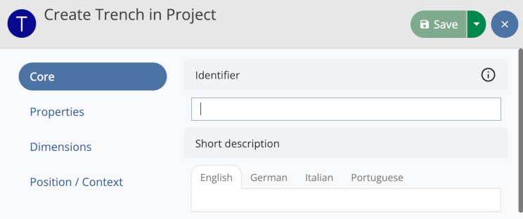
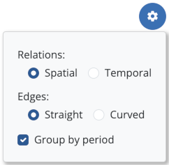

## First steps

After starting the iDAI.field desktop application for the first time, the project "test" will be active, allowing
you to experiment with the application's functionality using a set of test data. Please note that as long as the
test project is selected, any newly created data sets will be deleted and all changes will be reset when restarting
the application. For this reason, synchronization with other iDAI.field instances or databases is not performed for
the test project.  

In order to work with iDAI.field productively, you should first follow these steps:

1. The submenu **Settings**, which is accessible via the menu "iDAI.field" (MacOS) respectively "File"
(Windows), allows you to change some basic settings applied to all projects. As a first step, please enter
your editor name. This name will be stored in the database along with every change you make. It is strongly
recommended to fill in this field, especially if data is going to be synchronized.  

2. In the submenu **Settings** you can also change the path to the image directory. This may be necessary if
you want to access an image directory located on a network device (NAS) used by several users simultaneously.
Please note that in each case images must be imported via the iDAI.field application. Image files that are
manually placed in the image directory can **not** be used by the application. 

3. Click on the project name "test" in order to open the **Project management**. In this menu, you can create
a new project by clicking the plus button. Allowed characters for the project name are letters, numbers and
hyphens.

4. As soon as the new project has been loaded, you can enter basic project data by clicking the edit
button in the project management menu. First of all, you should create the lists of **staff members** (field
"Staff" of section "Project") and **campaigns** (field "Campaigns", also of section "Project"). You can extend
these lists at any time.

Use the menu option **Create backup**, which is accessible via the menu "Tools", to create backup files of
your project data regularly.

## Resources

The resource management facilities are at the core of iDAI.field.

### Operations

After creating a project or opening an existing one, you begin in the tab **Overview** (recognizable by the
home symbol) where all of the project's operations and places are managed.

Use the green plus button at the bottom of the resources list to create a new operation.

In the process, you firstly choose the category of the operation, before you may optionally create a geometry
for the new resource. Afterwards the editor is opened, where all data of the operation can be filled in.
Depending on the chosen operation category, different fields are available, which are arranged in multiple
groups. You can switch between field groups by clicking the buttons on the left side.

Before the resource can be saved via the green save button, at the very least the **identifier** field in the
core section has to be filled in.

The new operation is now displayed in the resources list. Use the button "Switch to operation" (Symbol: Arrow
up right) in order to open a new tab for the operation.

Depending on the category of the operation, resources of different categories can be created within an
operation tab via the plus button (e. g. stratigraphical units within a trench or rooms within a building).

### Hierarchical ordering

Resources can be arranged in hierarchical structures, for example to assign finds to a stratigraphical unit.
Use the button "Show child resources" (Symbol: rectangular arrow down right) to show a list of all resources
that are subordinate to the selected resource. This list is initially empty for a newly created resource.

By clicking "Open collection" you can switch to the lower level of the hierarchy, which means that now the
subordinated resources are shown (e. g. the finds of a stratigraphical unit).
Usage of the plus button will now lead to all resources getting created at that level. 

The navigation path above the resources list indicates the currently selected hierarchy level. You can always
switch to another level by clicking one of the buttons of the navigation path.

### Management

Resources in the list can be selected by clicking; by holding down the Ctrl/Cmd or Shift key, multiple resources
can be selected simultaneously. Right clicking one or more selected resources in the list opens a context menu
providing the following options:

* *Edit*: Opens the editor (also available by doubleclicking the resource entry in the list)
* *Move*: Allows removing resources from their current context and assigning them to another parent resource
* *Delete*: Removes resources after a security check (optionally, you can also delete all images that are
exclusively linked to the resources you want to delete)

Furthermore, the context menu contains options for creating and editing geometries. Please note that when
multiple resources are selected, only the *Move* and *Delete* options are available.

## Search

In the **overview**, in the **operation tabs** as well as in the **image management** (accessible via the menu
"Tools"), a **search filter** is available. You can use it to restrict the currently displayed resources by
the means of some basic search criteria (identifier, short description, category).

If you want to express more complex search queries, you can furthermore switch into the **extended search
mode** while in the **overview** or one of the **operation tabs**. This mode allows you to expand the search
bypassing hierarchical orderings, to search over the whole project and to define additional field specific
search criteria.

### Search filter

The search filter is a fast way to show or hide resources based on specific criteria. It consists of a
*text filter* (an input field) and a *category filter* (a blue button).

After entering a search term and/or choosing a category, only the resources matching these filter
criteria are shown. In the **overview** and the **operation tabs**, this affects all resources in the left
sidebar and on the map (in map view) respectively the elements of the list (in list view). In the **image
management**, all images shown in the grid are affected by the search filter.

#### Category filter

The category filter button allows you to choose a resource category. There are supercategories and
subcategories: If you choose a subcategory (e. g. "Layer"), only the resources of the respective category are
shown. In contrast, if you choose a supercategory (e. g. "Stratigraphical unit"), the resources of the
selected category as well as all of its subcategories (e. g. "Layer", "Grave", "Architecture", "Floor" etc.)
are included. Click again to select only the supercategory itself.

The current context decides which categories are available: In the overview you can choose operation
categories, in the image management image categories etc.

#### Text filter

Search terms are currently compared with the resource fields "Identifier" and "Short description".
 
*Example:*
 
The following three trenches are shown in the overview:

    (1)
    Identifier: "T01"
    Short description: "Trench-01"
    
    (2)
    Identifier: "T02"
    Short description: "Trench-02"
    
    (3)
    Identifier: "mt1"
    Short description: "My trench 1" 

**Possible search terms** are the text strings of the identifiers and short descriptions, each split by space
characters or hyphens, as in the example: "T01", "T02", "mt1", "Trench", "01", "02", "My", "1".  

Therefore, a search for the term "t01" returns the resource (1), and a search for "my" returns (3) as a
result. **Capitalization** is ignored. 
  
The search performed is a so-called **prefix search**, which means that in each case the beginning of the
search term is checked: As the identifiers of (1) and (2) start with the text string "t0", a search for the
term "t0" returns (1) as well as (2) as results. A search for "tr" returns (1), (2) and (3), while a search
for "ench" or "ren" returns nothing.

#### Placeholder search

When entering text into the text filter field, placeholders can be used: Instead of a single character, you
can specify a set of different allowed characters within square brackets. Such a placeholder can be used one
time per search query.

*Example:*

    (1) Identifier: "Landscape-0001"
    (2) Identifier: "Landscape-0009"
    (3) Identifier: "Landscape-0010"
    (4) Identifier: "Landscape-0011"
    (5) Identifier: "Landscape-0022"

A search for "Landscape-00[01]" returns (1), (2), (3), (4), because 0 as well as 1 are defined as allowed
characters for the third digit. All following characters are allowed due to the prefix search.

A search for "Landscape-00[01]1" returns (1) and (4), as the digit after the placeholder must be a 1.

#### Search results from other contexts

If no search results are found in the current context, search results from other contexts are shown below the
text input field.

By clicking one of the resources, you can immediately switch to the corresponding context and select the
resource.

### Extended search mode

In the **overview** as well as in the **operation tabs**, you can switch to the extended search mode by
clicking the magnifier button.
 

The extended search mode allows searching over larger amounts of data:

* In the **overview**, the search is performed over all of the project's resources.
* In the **operation tabs**, the search is performed over all of the operation's resources.

In both cases all the resources found get shown in the list on the left side. The buttons "Show in context"
(Symbol: Arrow up) respectively "Show in context of an operation" (Symbol: Arrow up right) allow you to
switch to the hierarchical context of a resource; in doing so the extended search mode is ended and a new tab
is opened if necessary.

While in extended search mode, it is not possible to create resources, which is indicated by the deactivated
create button. In order to create new resources, please leave the extended search mode.

The number of search results shown simultaneously is restricted to a maximum of **200** for performance
reasons. Other resources are not displayed by the application and instead a notice is shown informing about
the maximum being exceeded. Add further search criteria or leave the extended search mode in order to access
these resources. 

#### Field specific search criteria
 
If the extended search mode is activated, you can start a search over specific fields of a resource by
clicking the plus button to the left of the category filter button. Fields available for search are those
corresponding to the selected category. You can choose as many fields as you want in order to combine
multiple search criteria. Of course, you can also use the field specific search criteria in combination with
the text filter. 

In case of a text field, just enter the search term directly; for fields with value lists, choose the term
from a list of all allowed values in a dropdown menu. 

**Important**: In contrast to the search filter, no prefix search is performed in this case. The chosen search
term must match the content of the resource field exactly for the resource to appear in the list of search
results. 

As an alternative to specifying a particular search term, you can also search for all resources in which the
field is set (option "Any value") or not set (option "No value"). 

The number appearing next to the category filter button indicates the number of active search criteria. You can
remove search criteria by clicking the number. This opens up the menu again and you can choose the search
criterion to remove.

## Matrix

The **Matrix** view (accessible via the menu "Tools") displays a matrix for each trench of the project,
generated automatically from the stratigraphical units of the respective trench. The edges of the matrix are
built on the basis of the relations created for the units.

Choose the trench for which a matrix shall be generated via the dropdown button on the left side of the
toolbar.

### Options

Via the **Options button** in the upper right corner of the matrix view, you can customize the matrix
visualization by adjusting different settings. The chosen settings are applied to all matrices for all of the
project's trenches and are preserved when restarting the application.

#### Relations

* *Temporal*: Edges are built based on the relations "Before", "After" and "Contemporary with" (field group
"Time"). 
* *Spatial*: Edges are built based on the relations "Above", "Below", "Cuts", "Cut by" and "Equivalent to"
(field group "Position").

#### Edges

* *Straight*: All edges are composed of straight lines.
* *Curved*: Edges may be curved if there is no direct connecting line between two units of the matrix.

#### Group by period

Activate this option in order to group the stratigraphical units of the matrix based on the value of the field
"Period". If two values are set for the field (from/until), the value of "Period (from)" is used in each case.
Stratigraphical units with equal period values are placed close to each other and framed by a rectangle. 

### Navigation

Move the mouse with the **right mouse button** pressed in order to change the position of the matrix within
the display area. Use the **mouse wheel** or the **zoom buttons** in the upper left corner of the display area
to adjust the zoom level. By using the **left mouse button**, you can interact with units of the matrix; the
type of interaction (editing or selection) depends on the selected interaction mode.

When the mouse cursor is moved over a unit, the edges starting at this unit are highlighted in color: Green
lines show connections to units on higher levels, blue ones to units on lower levels and orange ones to units
on the same level of the matrix. 

### Editing

By default, the **edit mode** is active: Click a unit in the matrix in order to open up the editor allowing
you to make changes to the corresponding resource. In this way, you can also change the position of the unit
within the matrix by editing the relations in the field groups "Time" respectively "Position". After clicking
**Save**, the matrix is updated automatically on the basis of the changed data. 

### Display of sub-matrices

To facilitate the overview in large matrices, sub-matrices can also be generated from selected units of the
matrix. Use the buttons on the right side of the toolbar in order to select units and create a new sub-matrix
from the current selection: 

* *Edit mode*: Units can be edited by left click.
* *Single selection mode*: Units can be selected and deselected separately by left click.
* *Group selection mode*: Units can be selected in groups by drawing a rectangle using the mouse.

* *Deselect*: All units are deselected.
* *Create matrix from selection*: A new matrix is generated consisting only of the selected units. Edges are
  still built on the basis of all stratigraphical units of the trench; thus the function can also be used as a
  fast way to check if two units are connected across multiple relations/resources.
* *Reload matrix*: The original matrix with all stratigraphical units of the selected trench is restored.
  

## Synchronization

In order to collaborate on a single project, data can be synchronized between multiple iDAI.field installations on different computers. This means that changes (new resources, deleted resources or editings of existing resources) coming from an iDAI.field application running on another machine will be transferred automatically to the local database and vice versa. This enables all participants to work simultaneously with the latest state of the project. Synchronization works both via the internet or via a local network. You can still continue working on a project while offline - in that case the databases will be synchronized as soon as the network connection is established again.

Data only is synchronized between projects of the same name. To load data from another iDAI.field installation, simply start by creating an empty project with the name of the project you want to load into your application. When a connection is established, the data will be downloaded automatically (this process can take a while for larger projects).

### Configuration

Synchronization is configured via the **Settings** submenu (menu "iDAI.field" (MacOS) or "File" (Windows)).

Please make sure to fill in the field **Editor name** before setting up the configuration.

* *Address*: Enter the address of the synchronization target. This can be the network address of another machine which runs an iDAI.field installation, or the address of a CouchDB database accessible via the internet or a local network (for example *http://field.dainst.org/sync* for the iDAI.field database server of the DAI).
* *Password*: Enter the password of the target database.
* *Your address*: Your network address, which others can use to connect their iDAI.field applications to your installation. You can hand over this address and your password to allow others to connect to your machine.
* *Your password*: By default the database is protected with a randomly generated password. Here you can change that password.

After setting *Address* and *Password*, you can complete the configuration by selecting *Activate synchronization* and then saving these settings by clicking *Apply settings*.

### Synchronization state

The cloud icon in the top right corner of the navigation bar shows the current state of your configured synchronization connection.

If a connection has been successfully established, the icon shows a checkmark. When data is being uploaded or downloaded, this is indicated by an arrow. In case of errors an exclamation mark is shown. Additional information regarding the synchronization state can be obtained by hovering the mouse pointer over the icon.

### Conflicts

Conflicts can occur when a resource is edited at the same time on multiple computers or when two databases synchronize where the same resource has been edited while the computers were not connected. In these cases there are two different versions of the same resource: the *current version* (which is displayed in resource management and other areas of the application) and the *competing version* (which is stored in the background, but is not shown without taking further steps). The two versions can differ in the number of filled-in fields, but also by having different values in the same fields.

Conflicted resources are marked by a red border in the resources list. In addition to that an icon will appear in the navigation bar, indicating the number of conflicts within the current project.

Click the icon to see the list of all conflicted resources. Selecting one of these resources will open the conflicts tab of the editor, where you can clean up the resource.

To resolve conflicts, for each field with differing values a decision must be made on which version is valid. Alternatively you can just select either the *current version* or the *competing version* as a whole. Confirm the decision by clicking **Resolve conflict**. In case there are multiple conflicts on a single resource, this process has to be repeated until all conflicts are resolved. It is possible to make changes in other editor groups as well while the editor is open. To apply the changes, the resource finally should be saved via the **Save** button.
