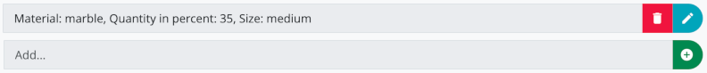
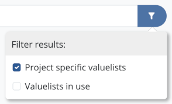

## First steps

The first time you start the application, you will be asked to enter your name. It is recommended that you enter your first name and surname. The name you enter is stored in the database for all changes you make and facilitates collaborative work on  data records in the project by allowing changes to be clearly assigned during data synchronization. You can change the user name at a later time by clicking on the name in the top right-hand corner of the navigation bar or via the **Settings** submenu, which you can access via the menu "Field" (MacOS) or "Tools" (Windows).

Initially, the test project will be active, allowing you to experiment with the application's functionality using a set of sample data. Please note that as long as the test project is selected, any newly created data sets will be deleted and all changes will be reset when restarting the application. For this reason, synchronization with other Field Desktop instances or databases is not performed for the test project.  

In order to work with Field Desktop productively and create your own project, you should first follow these steps:

1. In the "Project" menu, select the menu item **New...** to create your own project. You have the choice between several presets for the project configuration: Choose "Standard" for the extensive Field default configuration or one of the "Basic" options if you want to start with only a basic framework of preset categories and fields. Also specify the languages in which data will be entered within the project. Finally, enter the desired project identifier and optionally a project name for each of the selected languages.

2. As soon as the new project has been loaded, you can enter basic project data via the menu "Project" ➝ "Properties". First of all, you should create the lists of **staff members** (field
"Staff" of section "Project") and **campaigns** (field "Campaigns", also of section "Project"). You can extend
these lists at any time.

Use the menu option **Create backup...**, which is accessible via the menu "Project", to create backup files of
your project data regularly.

## Resources

After creating a project or opening an existing one, you begin in the tab **Overview** (recognizable by the
home symbol) where all of the project's operations and places are managed.

Use the green plus button at the bottom of the resources list to create a new operation.

In the process, you firstly choose the category of the operation, before you may optionally create a geometry
for the new resource. Afterwards the editor is opened, where all data of the operation can be filled in.
Depending on the chosen operation category, different fields are available, which are arranged in multiple
groups. You can switch between field groups by clicking the buttons on the left side.

Before the resource can be saved via the green save button, at the very least the **identifier** field in the
core section has to be filled in.

The new operation is now displayed in the resources list. Use the button "Switch to operation" (Symbol: Arrow
up right) in order to open a new tab for the operation.

Depending on the category of the operation, resources of different categories can be created within an
operation tab via the plus button (e.g. stratigraphical units within a trench or rooms within a building).

### Hierarchical ordering

Resources can be arranged in hierarchical structures, for example to assign finds to a stratigraphic unit. Use the button 
"Show child resources" (symbol: rectangular arrow down right) to switch to the lower hierarchy level. The child resources are now displayed (e.g. the finds of a stratigraphic unit), and resources that are newly created via the plus button appear at this hierarchy level accordingly.

The navigation path above the resources list indicates the currently selected hierarchy level. You can always
switch to another level by clicking one of the buttons of the navigation path.

### Manage resources

Resources in the list can be selected by clicking. By holding down the Ctrl/Cmd or Shift key, multiple resources
can be selected simultaneously. Right clicking one or more selected resources in the list opens a context menu
providing the following options:

* *Show warnings*: Displays the warnings available for this resource (only available for resources with warnings, see chapter *Warnings*)
* *Edit*: Opens the editor (also available by doubleclicking the resource entry in the list)
* *Link images*: Opens a window where images can be linked to the selected resource or linked images can be removed
* *Add QR code*: Opens a window in which a new QR code can be generated for the resource or an existing QR code can be linked via camera scan
* *Manage QR code*: Displays the QR code of the resource and allows printing a QR code label (alternatively also accessible via the QR code button on the right side of the list element of the resource)
* *Move*: Allows removing resources from their current context and assigning them to another parent resource
* *Delete*: Removes resources after a security check (optionally, you can also delete all images that are
exclusively linked to the resources you want to delete)
* *Scan storage place*: Sets a new storage place for the resource by scanning the QR code of the storage place via camera scan (only available for resources of the categories "Find", "Find collection" and "Sample" as well as the respective subcategories)

Furthermore, the context menu contains options for creating and editing geometries. Please note that when
multiple resources are selected, only the *Move* and *Delete* options are available. Options for adding or managing QR codes are only available if the use of QR codes has been set up for the corresponding category in the configuration editor (see section *Edit categories* in chapter *Configuration*).

## Images

Images can be imported into a Field project to be subsequently linked to resources or used as map layers. For each imported image, an image resource is automatically created where metadata of the image can be entered.

Image files can optionally be shared with other computers via a synchronization connection (see chapter *Synchronization*). If an image file is not available on the computer, a placeholder graphic is displayed instead.

### Import images

Images can be imported into the application in two different ways: via the menu "Tools" ➝ "Image management" and via the "Link images" option in the context menu of a resource (accessible by right-clicking on the desired resource). In the latter case, the image will be automatically linked to the corresponding resource after import (see section *Link images to resources*).

To start the import, click the plus button and select the files you want to add to the project. Alternatively, you can drag the files directly from a file manager application to the highlighted area surrounding the plus button. If multiple image categories (i.e. subcategories of the category "Image") are defined for the project, you can then select the desired category from a dropdown menu. You can also choose to either have the content of the field "Creator" read automatically from the image file metadata or set it manually. The names entered in the field "Team" of the project properties are available for selection. In either case, the creation date as well as the height and width of the image are automatically read from the file metadata.
Supported image formats are *jpg/jpeg*, *png* and *tif/tiff*.

### Image variants

For each imported image, the application creates a copy as well as a smaller version as a preview image and stores it in the **Images directory**, whose path you can see in the settings under "Advanced settings". The files in this folder are managed by the application and must not be edited, renamed or deleted manually, otherwise errors may occur when viewing or synchronizing images.

In total, the application manages up to three different variants for each image:
* *Original image*: The unmodified image file as it was imported into the project
* *Thumbnail image*: An automatically generated low-resolution variant of the image that is displayed as a preview image in the application (for example, in image management or for resources with linked images)
* *Image optimized for display*: For certain images, another variant is created for display in the application. Files in TIFF format are converted to JPEG and images with very high resolution are reduced in size. This step takes place when the project is loaded, which can lead to a one-time extension of the loading time by a few minutes, depending on the amount of existing image files.

You can open an overview of the data currently present in the image directory via the menu "Project" ➝ "Data overview".

### Manage images

To manage images, open the menu "Tools" ➝ "Image management". Here you can view and search through all the images in the project (see also chapter *Search*).

#### Edit metadata

You can view the metadata of an image by double-clicking on the desired image to open the image view. Click the edit button to open the editor and extend or alter the metadata. Available here are the fields configured in the configuration editor for the form of the corresponding image category.

#### Delete images

To remove imported images from the project, select the corresponding images in the image management. They can then be removed via the "Delete" button:

Please note that this will also delete the corresponding files in the project's images directory (and on other computers if a synchronization connection is established). Links to resources will be lost when deleting an image.

### Link images to resources

To link one or more images to a resource, select the "Link images" option in the context menu of the corresponding resource and click the plus button. You now have the choice between two options:

* *Add new images*: New images will be imported into the project and linked to the resource.
* *Link existing images*: Select one or more images from those already present in the project to be linked to the resource.

Select images in the list and choose the "Remove link" option to unlink images from the resource. The images themselves remain in the project.

Links can also be added or removed via the image management. To do this, select the desired images and click the button "Link" (blue button) or "Remove links" (red button) in the top bar:

#### Set main image

If a resource is linked to multiple images, one of the images is marked with a star icon as the **main image**. This main image is displayed as a preview image for the resource. You can change the main image by selecting the "Link images" option in the context menu of the resource and selecting the desired image in the list of linked images. Then click the button "Set as main image":

### Map layers

#### Georeferencing

Before an image can be used as a map layer, georeferencing information must first be provided. Supported are files in GeoTIFF format with the file extension *tif/tiff* as well as world files with the file extensions *wld*, *jpgw*, *jpegw*, *jgw*, *pngw*, *pgw*, *tifw*, *tiffw* and *tfw*.

If the image file is in GeoTIFF format, nothing further needs to be done. The georeferencing information is automatically applied when the image is imported.

World files can be imported in two different ways: If the file name of the world file before the extension is identical to the name of the corresponding image file, the file can be added via image import (plus button). The assignment to the image takes place automatically. Alternatively, a world file can also be imported via the image view, which you can reach by double-clicking on the corresponding image in the image management. Open the section "Georeference data" and click the "Load world file" button to select the desired file.

#### Configure map layers

A map layer can be configured either for a specific operation or for the entire project. Switch to the overview tab (house icon) if you want the map layer to be available in the entire project, or to the tab of the desired operation. There, open the map layer menu via the button at the top right of the map and click the edit button. You can now add new map layers via the plus button. All images for which georeference data has been added are available for selection.

Change the order of map layers by moving them up or down the list via drag & drop. If multiple images overlap on the map, the order determines which image is displayed: A layer that is higher in the list will also be displayed on the map above a layer that is further down, and may hide it completely or partially.

The blue button "Set as default map layer" (star icon) to the right of each list entry allows selecting one or more images that should be displayed by default on the map when the project is opened for the first time.

You can remove a layer from the list by clicking the red button "Remove map layer". The image itself will not be deleted from the project and can be added as a map layer again.

Click the "Save" button to save the changes to the database.

#### Display map layers

Configured map layers can be shown or hidden at any time via the map layer menu. To do this, click the eye button to the left of the corresponding entry in the list. The settings made here are not saved in the database (unlike the list of map layers available for the tab) and are therefore not shared via a synchronization connection, so that different map layers can be shown and hidden on different computers.

## Search

In the **overview**, in the **operation tabs** as well as in the **image management**, a **search filter** is available. You can use it to restrict the currently displayed resources by
the means of some basic search criteria (identifier, short description, category).

If you want to express more complex search queries, you can furthermore switch into the **extended search
mode** while in the **overview** or one of the **operation tabs**. This mode allows you to expand the search
bypassing hierarchical orderings, to search over the whole project and to define additional field specific
search criteria.

### Search filter

The search filter is a fast way to show or hide resources based on specific criteria. It consists of a
*text filter* (an input field) and a *category filter* (a blue button).

After entering a search term and/or choosing a category, only the resources matching these filter
criteria are shown. In the **overview** and the **operation tabs**, this affects all resources in the left
sidebar and on the map (in map view) respectively the elements of the list (in list view). In the **image
management**, all images shown in the grid are affected by the search filter.

#### Category filter

The category filter button allows you to choose a resource category. There are supercategories and
subcategories: If you choose a subcategory (e.g. "Layer"), only the resources of the respective category are
shown. In contrast, if you choose a supercategory (e.g. "Stratigraphical unit"), the resources of the
selected category as well as all of its subcategories (e.g. "Layer", "Grave", "Architecture", "Floor" etc.)
are included. Click again to select only the supercategory itself.

The current context decides which categories are available: In the overview you can choose operation
categories, in the image management image categories etc.

#### Text filter

Search terms are currently compared with the resource fields "Identifier" and "Short description".
 
*Example:*
 
The following three trenches are shown in the overview:

    (1)
    Identifier: "T01"
    Short description: "Trench-01"
    
    (2)
    Identifier: "T02"
    Short description: "Trench-02"
    
    (3)
    Identifier: "mt1"
    Short description: "My trench 1" 

**Possible search terms** are the text strings of the identifiers and short descriptions, each split by space
characters or hyphens, as in the example: "T01", "T02", "mt1", "Trench", "01", "02", "My", "1".  

Therefore, a search for the term "t01" returns the resource (1), and a search for "my" returns (3) as a
result. **Capitalization** is ignored. 
  
The search performed is a so-called **prefix search**, which means that in each case the beginning of the
search term is checked: As the identifiers of (1) and (2) start with the text string "t0", a search for the
term "t0" returns (1) as well as (2) as results. A search for "tr" returns (1), (2) and (3), while a search
for "ench" or "ren" returns nothing.

#### Placeholder search

When entering text into the text filter field, placeholders can be used: Instead of a single character, you
can specify a set of different allowed characters within square brackets. Such a placeholder can be used one
time per search query.

*Example:*

    (1) Identifier: "Landscape-0001"
    (2) Identifier: "Landscape-0009"
    (3) Identifier: "Landscape-0010"
    (4) Identifier: "Landscape-0011"
    (5) Identifier: "Landscape-0022"

A search for "Landscape-00[01]" returns (1), (2), (3), (4), because 0 as well as 1 are defined as allowed
characters for the third digit. All following characters are allowed due to the prefix search.

A search for "Landscape-00[01]1" returns (1) and (4), as the digit after the placeholder must be a 1.

#### Search results from other contexts

If no search results are found in the current context, search results from other contexts are shown below the
text input field.

By clicking one of the resources, you can immediately switch to the corresponding context and select the
resource.

### Extended search mode

In the **overview** as well as in the **operation tabs**, you can switch to the extended search mode by
clicking the magnifier button.
 

The extended search mode allows searching over larger amounts of data:

* In the **overview**, the search is performed over all of the project's resources.
* In the **operation tabs**, the search is performed over all of the operation's resources.

In both cases all the resources found get shown in the list on the left side. The buttons "Show in context"
(Symbol: Arrow up) respectively "Show in context of an operation" (Symbol: Arrow up right) allow you to
switch to the hierarchical context of a resource; in doing so the extended search mode is ended and a new tab
is opened if necessary.

While in extended search mode, it is not possible to create resources, which is indicated by the deactivated
create button. In order to create new resources, please leave the extended search mode.

The number of search results shown simultaneously is restricted to a maximum of **200** for performance
reasons. Other resources are not displayed by the application and instead a notice is shown informing about
the maximum being exceeded. Add further search criteria or leave the extended search mode in order to access
these resources. 

#### Field specific search criteria
 
If the extended search mode is activated, you can start a search over specific fields of a resource by
clicking the plus button to the left of the category filter button. Fields available for search are those
corresponding to the selected category. You can choose as many fields as you want in order to combine
multiple search criteria. Of course, you can also use the field specific search criteria in combination with
the text filter. 

In case of a text field, just enter the search term directly; for fields with valuelists, choose the term
from a list of all allowed values in a dropdown menu. 

**Important**: In contrast to the search filter, no prefix search is performed in this case. The chosen search
term must match the content of the resource field exactly for the resource to appear in the list of search
results. 

As an alternative to specifying a particular search term, you can also search for all resources in which the
field is set (option "Any value") or not set (option "No value"). 

The number appearing next to the category filter button indicates the number of active search criteria. You can
remove search criteria by clicking the number. This opens up the menu again and you can choose the search
criterion to remove.

## Synchronization

In order to collaborate on a single project, data can be synchronized between multiple Field Desktop installations on different computers. This means that changes (new resources, deleted resources or editings of existing resources as well as added or deleted images) coming from an Field Desktop application running on another machine will be transferred automatically to the local database and vice versa. This enables all participants to work simultaneously with the latest state of the project. Synchronization works both via the internet or via a local network. You can still continue working on a project while offline – in that case the databases will be synchronized as soon as the network connection is established again.

### Download project

To work with an existing project that is available on another Field Desktop installation or a Field server, first download the project. To do this, select **Download...** from the "Project" menu and enter the access data:

* *Address*: Enter the address of the computer from which you want to download the project. This can either be the network address of another computer on which Field Desktop is currently open (this address can be viewed in the settings section *Your address*) or the address of a Field server that is accessible via the internet or a local network (e.g. *https://server.field.idai.world* for the server of the DAI).
* *Project name*: The name of the project you want to download.
* *Password*: The password of the project or the Field Desktop installation from which you want to download the project.
* *Download preview images*: This option is enabled by default. If you have a weak internet connection and want to download as little data as possible, you may want to disable it.
* *Download original images*: Enable this option if you want to download the images in their original image resolution. Depending on the number and size of images managed in the project, this may involve downloading several gigabytes of data. Make sure you have a sufficient internet connection and enough hard disk space before enabling this option.
* *Overwrite existing project of the same name*: If this option is enabled, the project will be downloaded even if a project with the same name already exists on the computer. The existing project will be deleted in the process.

As soon as you have entered a valid address, project name and password, the amount of image data to be downloaded will be shown besides the respective options after a short computation time.

Please note that the download may take a longer time for larger projects. The downloaded project will be opened automatically afterwards and a synchronization connection will be established using the same credentials.

### Configure synchronization

Both downloaded and newly created projects can be synchronized with other databases at any time. Synchronization can be configured via the menu "Project" ➝ "Synchronize...".

* *Address*: The address of the database with which you want to establish a synchronization connection. This can either be the network address of another computer where Field Desktop is currently open (this address can be viewed in the settings section *Your address*), or the address of a Field Hub server that is accessible via the internet or a local network (e.g. *https://server.field.idai.world* for the Field Hub server of the DAI). 
* *Password*: The password of the project or Field Desktop installation you want to establish the synchronization connection with.
* *Enable synchronization*: Use this switch to start or interrupt the connection.
* *Synchronize preview images*: This option is enabled by default. If you have a weak internet connection and want to upload/download as little data as possible, you may want to disable it.
* *Upload original images*: Enable this option if you want to upload images in their original image resolution.
* *Download original images*: Enable this option if you want to download images in their original image resolution. Depending on the number and size of images managed in the project, this may involve downloading several gigabytes of data. Make sure you have a sufficient internet connection and enough hard disk space before enabling this option.
 
As soon as you have entered a valid address and the correct password, the amount of image data to upload/download will be shown besides the respective options after a short computation time. Please note that the amount of data may increase if additional images are imported into the project at a later time.

Finally, confirm your settings by clicking the **Apply settings** button.

### Synchronization state

The cloud icon in the top right corner of the navigation bar shows the current state of your configured synchronization connection.

If a connection has been successfully established, the icon shows a checkmark. When data is being uploaded or downloaded, this is indicated by an arrow. In case of errors an exclamation mark is shown. Additional information regarding the synchronization state can be obtained by hovering the mouse pointer over the icon.

### Conflicts

Conflicts can occur when a resource is edited at the same time on multiple computers or when two databases synchronize where the same resource has been edited while the computers were not connected. In these cases there are two different versions of the same resource: the *current version* (which is displayed in resource management and other areas of the application) and the *competing version* (which is stored in the background, but is not shown without taking further steps). The two versions can differ in the number of filled-in fields, but also by having different values in the same fields.

A warning is shown for each resource with conflicts (see chapter *Warnings*). You can clean up an affected resource in the **Conflicts** tab of the resource editor.

To resolve conflicts, for each field with differing values a decision must be made on which version is valid. Alternatively you can just select either the *current version* or the *competing version* as a whole. Confirm the decision by clicking **Resolve conflict**. In case there are multiple conflicts on a single resource, this process has to be repeated until all conflicts are resolved. It is possible to make changes in other editor groups as well while the editor is open. To apply the changes, the resource finally should be saved via the **Save** button.

### Allow synchronization connections to your own Field Desktop installation

You can allow others to establish a synchronization connection with your project by providing them with the credentials that can be found in the **Settings** menu in the section **Synchronization**:

* *Your address*: Your network address, which others can use to connect to your database from their own Field Desktop installation. You can share this address along with your password to allow others to synchronize their project data with you.
* *Your password*: By default, the database is protected from unauthorized access with a randomly generated password. At this point you can change the password.
* *Receive original images*: If this option is enabled, image files sent by others are accepted in their original image resolution and stored in the image directory. Since the image files may contain several gigabytes of data, you should ensure that there is sufficient storage space in the image directory. By default, the option is disabled, so no original images are accepted. The option only affects synchronization connections that have been set up on other computers; a self-configured synchronization connection is not affected by this setting.

## Project configuration

A database managed with Field Desktop contains a number of resources that always belong to a specific **category**, for example "Place", "Find" or "Image". A distinction is made between **supercategories** (e.g. "Find") and **subcategories** (e.g. "Brick" or "Pottery"). A resource of the subcategory always belongs to the supercategory as well (a brick is also a find).

Each category provides a set of **fields** that can be used to describe properties and metadata of the resource (e.g. "weight", "color", "processor", etc.). Fields each have a specific input type that determines what data can be entered for the field in which way (e.g.: text field, number input, dating input). For fields of some input types, a **valuelist** can be specified that defines a set of text values as predefined choices.

Which fields are specifically available for a category in the resource editor is determined by the choice of **form**, which makes a selection from the available fields and sorts them into **groups**. For each category a basic form of the same name is available, which contains only a few obligatory fields, in addition to one or more forms with a more extensive field selection (e.g. "Pottery:default" with the standard fields of the Field data model for the category "Pottery"). Forms and their field groups and fields can be customized and extended as desired using the configuration editor. A form of a subcategory always inherits the fields of the selected form of the corresponding supercategory.

**Relations** are used to specify relationships between resources (e.g.: layer "A1" lies spatially below layer "A2"). Relations can be hidden in the configuration editor, but not newly created.

Via the "Tools" ➝ "Project configuration" menu, you can access the configuration editor, which allows you to adjust and extend the categories, fields and valuelists available in the project. If a synchronization connection is established, changes to the configuration will be transferred to other users as soon as they are confirmed via the "Save" button.

### Identifiers and labels

All elements of the project configuration (categories, fields, valuelists, etc.) each have an **identifier** for unique identification. This identifier is saved in the database and is also used when importing or exporting resources. It is displayed in magenta in the configuration editor.

In addition, **labels** can be added for each of the configured project languages. These texts are used for display in all other areas of the application and are also displayed in black in the configuration editor. If there is no label, the identifier is displayed instead.

### Categories and forms

The left sidebar of the editor lists the categories currently configured for the project. Using the filter menu at the top left, you can limit the selection of displayed categories to a specific part of the application (e.g. "Trench" for limiting to categories that can be created within a trench tab). If you select the "All" option, all categories of the project will be listed.

When you select a category in the list, the form configured for that category is displayed on the right side with the corresponding field groups and fields.

#### Add supercategories

Using the green plus button at the bottom of the list, you can add a new supercategory to the project. A new window opens where you can choose between all supercategories of the Field category library that are not already configured for the project. You can filter the displayed categories and forms using the text field above the list. For each category, the available forms are listed; when you select one of the forms, you will see the corresponding field groups and fields on the right side. Confirm your selection by clicking the "Add category" button.

Please note that no new supercategories can be added via the configuration editor.

#### Add subcategories

If you want to add a new subcategory to an existing supercategory, click on the small plus button displayed to the right of the corresponding supercategory. If the plus button is missing, it is not possible to create subcategories for this category.

Similar to adding supercategories, you also have the choice between different forms for each category. If you want to create your own category, enter the desired category name in the text field above the list and select the "Create new category" option. The category editor will open, where you can set the category's properties (see the *Edit category* section). For a newly created category, a new form is also created automatically, which inherits the fields of the selected form of the parent category.

Project specific categories are highlighted in blue in the list, provided that the "Highlight custom categories/fields" option is enabled in the "Project configuration" menu.

#### Manage categories

Right-clicking on a category brings up a context menu that provides the following options:

* *Edit*: Opens the category editor (see section *Edit categories*).
* *Swap form*: Opens a menu to select another form for this category. Please note that any changes made to the current form and category will be lost in this process. If this is a supercategory, this will also affect all subcategories and their forms.
* *Delete*: Removes the category after a confirmation prompt. If resources of this category have already been created in the project, they will not be lost, but will no longer be displayed until the category is added again. Since deleting also loses all customizations of the form selected for the category, however, a category should not be deleted in most cases if resources have already been created based on the corresponding form.

#### Edit categories

Via the context menu or by double-clicking on an entry in the category list, the category editor can be opened, in which the properties of the category can be edited:

* *Category label*: The display label of the category, which will be shown in all areas of the application. You can enter labels for different languages.
* *Color*: The color of the category icon as well as the geometries displayed for resources of this category on the map.
* *QR codes*: Enables the use of QR codes for resources of this category (see section *QR codes*).
* *Identifier prefix*: Optionally enter here a text with which the identifier of resources of this category should always start. Please note that already existing identifiers will not be adjusted automatically.
* *Resource limit*: Optionally enter a number here to specify the maximum number of resources that can be created for this category. If the input field is left blank, any number of resources can be created. This option is only available for operation categories and the category "Place".

You can also specify the following properties for project-specific categories:
* *Description*: A description text that informs in which contexts the category should be used.
* *References*: Specify URLs here if you want to reference more information about the category or category definitions in other systems.

##### QR codes

If the use of QR codes is enabled for a category, a unique QR code can be assigned to each resource of the category. Either a new code can be generated or an existing code can be read by camera scan and linked to the respective resource. The QR code can then be used in various ways:
* Accessing the resource by camera scan (via the QR code button in the search bar)
* Printing QR code labels (via the context menu of the resource)
* Setting the storage location of a resource via camera scan of the QR code linked to the storage location (via the context menu of the resource)
Please note that QR codes can only be used for the categories "Find", "Find collection", "Sample" and "Storage location" as well as the respective subcategories.

The following options are available in the category editor for configuring QR codes:
* *Use QR codes for identification*: Enable this option to allow the use of QR codes for resources of the category
* *Automatically create for new resources*: Enable this option if a QR code should be generated automatically for every newly created resource
* *Fields to print*: Select up to three fields to be printed on the QR code label in addition to the resource identifier. Activate the option "Print field label" if you want the field label to appear before the field content on the label.

#### Hierarchy

The category determines where in the resource hierarchy a resource can be created: For example, finds can be created within stratigraphic units, but not vice versa. With the two buttons on the top right above the form display you can see below resources of which categories a resource of the selected category can be created and resources of which categories it can contain.

The category hierarchy cannot currently be changed in the configuration editor. For newly created subcategories, the hierarchical restrictions of the supercategory apply.

### Groups

To the right of the category list, the field groups of the currently selected category form are displayed. Click on a group to display the corresponding fields to the right of it.

#### Add groups

You can add a new group to the form using the green plus button at the bottom of the list. You can select one of the groups already included in other forms configured for the project or create a new group. To do this, enter the name of the new group in the text field above the list and select the "Create new group" option. The group editor will open where you can enter the display label of the new group.

#### Manage groups

Right-clicking on a group brings up a context menu with the following options:

* *Edit*: Opens the group editor where you can enter the display label of the group. You can enter labels for different languages. The group editor can also be opened by double-clicking on the group.
* *Delete*: Removes the group from the form. Please note that a group can only be deleted if it does not contain any fields. Before deleting the group, move all the fields to other groups or remove them.

### Fields

To the right of the group list, the fields that are included in the selected group are displayed. Click on an entry in the fields list to display more information about the field (description, input type, and the assigned valuelist, if any).

Fields inherited from the supercategory form are marked by the supercategory icon and cannot be edited or deleted. To do this, switch to the form of the corresponding supercategory.

#### Add fields

Click the plus button at the bottom of the field list to add a new field to the group. You can choose between all the fields available for the selected category that have not yet been added to the form. Select an entry in the list to show information about the field on the right side. To create a new field, enter the desired identifier in the input field above the list and select the "Create new field" option. The field editor opens, where you can specify the properties of the field (see section *Edit field*).

Project-specific fields are highlighted in blue in the list, provided that the "Highlight custom categories/fields" option is enabled in the "Project configuration" menu.

#### Manage fields

Right-clicking on a field brings up a context menu that provides the following options:

* *Edit*: Opens the field editor (see section *Edit field*).
* *Delete*: Deletes the field after a confirmation prompt. If data for this field has already been entered in resources, it will not be lost, but will no longer be displayed until the field is added again. This option is only available for project specific fields. Fields that belong to a form selected from the Field form library cannot be deleted, only hidden in the field editor. 

#### Edit fields

Via the context menu or by double-clicking on an entry in the field list, the field editor can be opened, in which the properties of the field can be edited:

* *Field label*: The display label of the field, which is shown in all areas of the application. You can enter labels for different languages.
* *Description*: A description text that informs what data should be entered into the field. This text is displayed in the resource editor as a tooltip of the info icon next to the field label and is intended to help with data entry.

#### Change input type

The *Input type* checkbox in the field editor allows you to change the input type of the field. Please note that for the fields that come with Field Desktop, you can only select input types whose data format is compatible with the default input type (for example, it is possible to change from a single-line text field to a multi-line text field, but not to change from a dating field to a checkbox selection field). For project-specific fields, you can freely change the input type at any time.

Field data that has already been entered will continue to be displayed even after the input type has been changed. In the resource editor, however, data that is incompatible with the current input type is marked accordingly and can no longer be edited there, only deleted.

##### Single line text
Input of a single line text (optionally monolingual or multilingual)

##### Single line text with multiple selection
Input of multiple single line texts (optionally monolingual or multilingual)

  
##### Multiline text
Input of a multiline, multilingual text

##### Whole number
Input of a positive or negative whole number

##### Positive whole number
Input of a positive whole number

##### Decimal number
Input of a positive or negative decimal number

##### Positive decimal number
Input of a positive decimal number

##### URL
Input of an URL

##### Dropdown list
Selection of a value from a valuelist

##### Dropdown list (range)
Selection of a value or a range of values (from/to, two values) from a valuelist

##### Radiobutton
Selection of a value from a valuelist

##### Yes / No
Selection of Yes or No

##### Checkboxes
Selection of one or more values from a valuelist

##### Dating
Specification of one or more datings. Possible dating types are: Period, Single year, Before, After, Scientific.

##### Date
Selection of a date from a calendar. The input field can also be used to enter only month or year information.

##### Dimension
Specification of one or more dimensions. Either a single value or a range can be specified. The selection options for the dropdown subfield "As measured by" are taken from the specified valuelist.

##### Bibliographic reference
Specification of one or more bibliographic references. Optionally, the Zenon ID, DOI, page number and figure number can be specified.

##### Composite field
Composite fields can contain multiple entries, each consisting of any number of subfields. Each subfield has its own name and input type (see section *Subfields*).

#### Hide fields

Fields can be hidden by deactivating the *Show field* setting in the field editor. The field is then neither displayed in the resource view nor in the resource editor. Whether hidden fields are displayed in the configuration editor depends on the "Show hidden fields" setting in the "Project configuration" menu. Data that has already been entered is still retained after hiding and is displayed again when the *Show field* option is activated again. Some fields that are essential to the functionality of the application cannot be hidden (such as the resource identifier); in these cases, the option is not displayed.

#### Allow input in multiple languages

If the option *Allow input in multiple languages* is enabled, a separate text can be entered in the field for each of the configured project languages. The setting is only available for fields of the input types "Single line text", "Single line text with multiple selection" and "Multiline text" and is activated by default.

#### Field specific search

The setting *Allow field specific search* in the field editor determines whether a field specific search can be performed for a field in extended search mode (see the *Extended search mode* section in the *Search* chapter). For fields of the category "Project" as well as for fields of some input types this setting cannot be activated; in these cases it is grayed out.

#### Replace valuelist

The currently selected valuelist can be replaced by another one by clicking the "Replace valuelist" button. Either an existing valuelist can be selected or a new list can be created (see section *Valuelists*).

If data has already been entered for the field, it will continue to be displayed even if the values entered are not included in the new valuelist. In this case, the corresponding values are marked as incompatible in the resource editor and can be deleted there.

#### Subfields

This section appears only if the input type "Composite field" is selected and allows defining the subfields each entry of the composite field consists of. The order of the subfields can be changed via drag & drop.

To create a new subfield, enter the desired name in the input field and confirm it by clicking the plus button.  A new editor window will open where you can configure the subfield in a similar way to a normal field (input type, label, description, etc.).

##### Subfield conditions

Optionally, a condition for displaying the subfield can be set in the subfield editor. If a condition is set, the subfield will be available during data entry only if another subfield has a specific value (or one of several values) set.

To set a condition, first select another subfield of the same composite field in the dropdown field "Condition for display of subfield". Subfields of the input types "Dropdown list", "Dropdown list (range)", "Radiobutton", "Yes / No" and "Checkboxes" are available for selection. The possible values of the chosen subfield are now displayed and can be selected. The current subfield is only displayed during data entry if at least one of the selected values is set for the subfield selected as a condition field.

### Adjusting order and group assignment

The order of supercategories, subcategories, groups and fields can be changed using drag & drop. To do so, click on the handle icon on the left of the list entry, hold down the mouse button and move the element to the desired position.

Fields can also be assigned to another group in the same way: Simply drag the field to the entry of the corresponding group in the group list. Note that changes to the field/group order or group assignment are not automatically transferred from the form of a supercategory to forms of the corresponding subcategories (and vice versa).

### Valuelists

The "Project configuration" ➝ "Valuelist management" menu opens an overview of all the valuelists that come with Field. The valuelists listed here are either used by the fields of the standard forms or were created in the context of projects that have already used Field.

Use the text field above the list to filter the valuelists based on any search terms. The search takes into account valuelist identifiers as well as identifiers and display labels of individual values. Using the button to the right of the search field, you can open the filter menu, which allows you to selectively display only project specific (i.e. newly created) valuelists and/or valuelists currently used within the project.

Please note that all changes made in the valuelist management window must subsequently be confirmed by clicking on the "Save" button of the configuration editor before they are applied to the project.

#### Create and extend valuelists

To create a new valuelist, enter the desired identifier in the text field and select the "Create new valuelist" option. The valuelist editor will open, where you can enter the desired values and make further settings (see section *Edit valuelists*).

Instead of creating a completely new valuelist, you can alternatively extend an already existing one. To do this, right-click on the corresponding list entry to open the context menu, select the *Extend valuelist* option and enter an identifier for your extension list. All values of the selected valuelist are taken over and can now be supplemented by additional values in the editor. You also have the option to hide existing values and adjust their order. Please note that extension lists as well as project specific lists cannot be extended.

#### Manage project specific valuelists

Right-clicking on a project specific valuelist brings up a context menu that provides the following options:

* *Edit*: Opens the valuelist editor (see section *Edit valuelists*).
* *Delete*: Deletes the valuelist after a confirmation prompt. Deleting a valuelist is not possible as long as it is used by one or more fields. In this case, first select another valuelist for the corresponding fields.

#### Edit valuelists

Via the context menu or by double-clicking on a valuelist, an editor can be opened in which the properties of the list can be edited:

* *Valuelist description*: A description text where you can specify more detailed information about the valuelist. This text is displayed in valuelist management when the list is selected.
* *References*: Specify URLs here to reference more information about the valuelist or definitions in other systems.
* *Values*: Use the text field "New value" to enter the desired identifier of a new value to be included in the valuelist. The value editor opens in each case, which can also be called later by clicking on the edit button next to each value (see section *Edit values*).
* *Automatic sorting*: If this option is enabled, the values will always be displayed in alphanumeric order. You can deactivate the option in order to subsequently drag and drop the values into the desired order.

#### Edit values

The value editor allows you to customize the properties of a value:

* *Label*: The display label of the value. You can enter labels for different languages.
* *Description*: A description text where you can specify more detailed information about the value. This text is displayed in the configuration editor as a tooltip for the corresponding value.
* *References*: Specify URLs here to reference definitions in other systems.

### Select project languages

The menu "Project configuration" ➝ "Select project languages..." allows you to specify the languages for which data is to be entered in the project. For text fields for which the option "Allow input in multiple languages" is activated in the configuration editor, a separate text can be entered for each project language.
In addition, empty input fields for the labels and descriptions of categories, fields, groups, valuelists and values are automatically displayed in the configuration editor for each project language.

Please note that texts that have already been entered will no longer be displayed if the corresponding language is removed from the list of project languages. However, they will remain in the database and will be displayed again if the language is once more selected as a project language at a later time.

### Import configuration

Use the menu option "Project configuration" ➝ "Import configuration..." to import an existing configuration from another project. 
In the dropdown menu "Source", you can choose between two different import options:

* *File*: Import a Field configuration file (file extension *.configuration*) that was previously created in another project via the menu "Project configuration" ➝ "Export configuration...".
* *Project*: Import the configuration of another project available on the same computer.

The result of the import can now be checked in the editor and accepted by clicking the "Save" button. Please note that all previous configuration settings will be replaced by the imported configuration.

### Export configuration

Use the menu option "Project configuration" ➝ "Export configuration..." to save the configuration of the opened project as a Field configuration file (file extension *.configuration*). This will export the state currently displayed in the configuration editor, including any unsaved changes. The generated file also contains all project-specific valuelists.

The file can then be imported again via the menu option "Project configuration" ➝ "Import configuration..." in order to transfer the configuration to another project or restore the saved configuration state in the same project.

## Matrix

The **Matrix** view (accessible via the menu "Tools") displays a matrix for each trench of the project,
generated automatically from the stratigraphical units of the respective trench. The edges of the matrix are
built on the basis of the relations created for the units.

Choose the trench for which a matrix shall be generated via the dropdown button on the left side of the
toolbar.

### Options

Via the **Options button** in the upper right corner of the matrix view, you can customize the matrix
visualization by adjusting different settings. The chosen settings are applied to all matrices for all of the
project's trenches and are preserved when restarting the application.

#### Relations

* *Temporal*: Edges are built based on the relations "Before", "After" and "Contemporary with" (field group
"Time"). 
* *Spatial*: Edges are built based on the relations "Above", "Below", "Cuts", "Cut by" and "Equivalent to"
(field group "Position").

#### Edges

* *Straight*: All edges are composed of straight lines.
* *Curved*: Edges may be curved if there is no direct connecting line between two units of the matrix.

#### Group by period

Activate this option in order to group the stratigraphical units of the matrix based on the value of the field
"Period". If two values are set for the field (from/until), the value of "Period (from)" is used in each case.
Stratigraphical units with equal period values are placed close to each other and framed by a rectangle. 

### Navigation

Move the mouse with the **right mouse button** pressed in order to change the position of the matrix within
the display area. Use the **mouse wheel** or the **zoom buttons** in the upper left corner of the display area
to adjust the zoom level. By using the **left mouse button**, you can interact with units of the matrix; the
type of interaction (editing or selection) depends on the selected interaction mode.

When the mouse cursor is moved over a unit, the edges starting at this unit are highlighted in color: Green
lines show connections to units on higher levels, blue ones to units on lower levels and orange ones to units
on the same level of the matrix. 

### Editing

By default, the **edit mode** is active: Click a unit in the matrix in order to open up the editor allowing
you to make changes to the corresponding resource. In this way, you can also change the position of the unit
within the matrix by editing the relations in the field groups "Time" respectively "Position". After clicking
**Save**, the matrix is updated automatically on the basis of the changed data. 

### Display of sub-matrices

To facilitate the overview in large matrices, sub-matrices can also be generated from selected units of the
matrix. Use the buttons on the right side of the toolbar in order to select units and create a new sub-matrix
from the current selection: 

* *Edit mode*: Units can be edited by left click.
* *Single selection mode*: Units can be selected and deselected separately by left click.
* *Group selection mode*: Units can be selected in groups by drawing a rectangle using the mouse.

* *Deselect*: All units are deselected.
* *Create matrix from selection*: A new matrix is generated consisting only of the selected units. Edges are
  still built on the basis of all stratigraphical units of the trench; thus the function can also be used as a
  fast way to check if two units are connected across multiple relations/resources.
* *Reload matrix*: The original matrix with all stratigraphical units of the selected trench is restored.

## Warnings

For various reasons, such as changes to the project configuration, inconsistent or otherwise incorrect data may occur in a project. In these cases, the application displays a warning and provides options for solving the problem. Faulty resources are marked with a red bar next to the list entry of the corresponding resource. Furthermore, an icon is displayed in the navigation bar at the top right, indicating the number of resources for which there are warnings due to data problems:

Clicking the icon or using the context menu of an affected resource takes you to the menu "Warnings", where you can view the list of faulty resources and filter by warning type. There are also options for filtering by identifier and short description (via text input) as well as by category.

Select one of the displayed resources to view the list of existing warnings for that resource. For most warnings, tools are provided that can be used to resolve the errors; many warnings can also be resolved by adjusting the project configuration. In any case, please create a **backup** of the project in advance via the menu "Project" ➝ "Create backup...". Further information on the causes and possible solutions for the individual warning types can be found below.

### Warning types
#### Conflict
There are multiple versions of the resource that are in conflict with each other.

##### Possible causes
* The resource was edited on different computers at the same time with an existing synchronization connection.
* The resource was edited on different computers without an existing synchronization connection; the data was then synchronized at a later point in time.

##### Possible solutions
* Button *Resolve conflict*: Resolve the conflicts in the resource editor (see section *Conflicts* of chapter *Synchronization*).

#### Unconfigured category
A category is set for the resource that cannot be found in the project configuration. The resource is therefore not displayed.

##### Possible causes
* The category has been deleted in the configuration editor.

##### Possible solutions
* Button *Select new category*: Select one of the categories configured for the project. The selected category is then set for the affected resource. Optionally, you can set the new category for all resources for which the same unconfigured category is specified.
* Button *Delete resource*: The affected resource is deleted completely.
* Add a category with the same name in the configuration editor.

#### Unconfigured field
Data has been entered in a field that cannot be found in the project configuration. The entered data is therefore not displayed.

##### Possible causes
* The field has been deleted in the configuration editor.

##### Possible solutions
* Button *Select new field*: Select one of the fields configured for the category of the resource. The data entered will then be moved to this field. Please note that any existing data in the target field will be overwritten. Optionally, you can set the new field for all resources for which data has been entered in the same unconfigured field.
* Button *Delete field data*: The data entered in the field is deleted completely. Optionally, you can delete the field data for all resources for which data has been entered in the same unconfigured field.
* Add a field with the same name for the category of the affected resource in the configuration editor.

#### Invalid field data
The data entered in a field does not correspond to the input type selected for the field.

##### Possible causes
* The input type of the field has been changed in the configuration editor.

##### Possible solutions
* Button *Edit*: Open the resource in the resource editor to remove the invalid field data and re-enter it if necessary.
* Button *Convert field data*: The data is automatically converted to the correct format for the respective input type. Optionally, you can have the data converted for all resources where invalid data has been entered in the same field. Please note that automatic conversion is not possible in all cases and this button is therefore not always available.
* Button *Select new field*: Select one of the fields configured for the category of the resource. The data entered will then be moved to this field. Please note that any existing data in the target field will be overwritten. Optionally, you can set the new field for all resources for which invalid data has been entered in the same field (valid data remains in the original field).

#### Value not included in valuelist
One or more values are entered in a field that are not contained in the valuelist configured for the field.

##### Possible causes
* The valuelist of the field has been replaced with a different one in the configuration editor.
* Values have been removed from a project-specific valuelist in the valuelist editor.
* The input type of the field has been changed in the configuration editor from an input type that allows the free entry of text to an input type with a valuelist.
* For fields that use the values entered in the fields *Staff* and *Campaigns* of the project properties: Entries have been removed from the corresponding field in the project properties.
* For the field *Campaign*: Values have been removed from the field of the same name in the parent resource (only values that have been set in the parent resource may be selected for the field *Campaign*).

##### Possible solutions
* Button *Edit*: Open the resource in the resource editor to remove the values not included in the valuelist and replace them with other values if necessary.
* Button *Fix value*: Select a new value from the valuelist configured for the field. The previous value is replaced by the selected value. Optionally, you can set the new value for all fields of all resources in which the same value is entered and which use the same valuelist.
* Button *Delete value*: The value entered in the field is deleted completely. Optionally, you can delete the value from all fields of all resources in which the same value is entered.
* Replace the valuelist in the configuration editor with a valuelist that contains the corresponding value.
* Add the missing value to the valuelist configured for the field. For non-project-specific valuelists, you must first create an extension list for the valuelist using the option *Extend valuelist* (see section *Create and extend valuelists* in chapter *Project configuration*).
* For fields that are based on the values entered in the *Staff* and *Campaigns* fields of the project properties: Add the missing value to the corresponding field in the project properties.
* For the field *Campaign*: Set the value in the parent resource if it does not already exist there.

#### Missing target resource of a relation
A resource specified as the target of a relation cannot be found.

##### Possible causes
* A synchronization process has not been fully completed.

##### Possible solutions
* Make sure that the data of all team members working with the Field project is synchronized.
* Button *Clean up relation*: All references to non-existent resources are deleted from the relation.

#### Missing or invalid parent resource
The resource does not have a valid parent resource. This can either mean that no parent resource has been set for the resource, that the specified parent resource cannot be found or that it is not a valid parent resource due to its category. The resource is therefore not displayed.

##### Possible causes
* A synchronization process has not been fully completed.
* The resource was created with an outdated version of Field Desktop.

##### Possible solutions
* Make sure that the data of all team members working with the Field project is synchronized.
* Button *Set new parent resource*: Select a new resource as the parent resource. The resource is moved to the context of the selected resource.
* Button *Delete resource*: The affected resource is deleted completely.

#### Missing identifier prefix
The identifier of the resource does not contain the prefix configured for the corresponding category.

##### Possible causes
* The resource was created before the identifier prefix was configured.

##### Possible solutions
* Button *Edit*: Open the resource editor to re-enter the identifier.

#### Ambiguous identifier
The identifier of the resource is also used by one or more other resources. Therefore, errors can occur when importing and exporting data.

##### Possible causes
* The identifiers were entered on different computers without an existing synchronization connection; the data was then synchronized at a later point in time.

##### Possible solutions
* Button *Edit*: Open the resource editor to enter a new identifier.

#### Resource limit exceeded
There are more resources of a particular category than the resource limit configured for this category allows.

##### Possible causes
* The resources were created before the resource limit was configured.
* The resources were created on different computers without an existing synchronization connection; the data was then synchronized at a later point in time.

##### Possible solutions
* Delete resources of the corresponding category until the resource limit is met.
* Increase the resource limit in the configuration editor.
