# 첫 번째 단계

애플리케이션을 처음 시작하면 이름을 입력하라는 메시지가 표시됩니다. 이름과 성을 입력하는 것이 좋습니다. 입력한 이름은 모든 변경 사항에 대해 데이터베이스에 저장되며 데이터 동기화 중에 변경 사항이 명확하게 할당되도록 하여 프로젝트의 데이터 기록에 대한 공동 작업을 용이하게 합니다. 나중에 탐색 모음의 오른쪽 상단에 있는 이름을 클릭하거나 "필드"(macOS) 또는 "도구"(Windows 및 Linux) 메뉴를 통해 액세스할 수 있는 **설정** 하위 메뉴를 통해 사용자 이름을 변경할 수 있습니다.

처음에는 테스트 프로젝트가 활성화되어 샘플 데이터 세트를 사용하여 애플리케이션의 기능을 실험해 볼 수 있습니다. 테스트 프로젝트를 선택하면 새로 생성된 데이터 세트가 삭제되고 애플리케이션을 다시 시작할 때 모든 변경 사항이 재설정된다는 점에 유의하세요. 이러한 이유로 테스트 프로젝트에 대해서는 다른 Field Desktop 인스턴스 또는 데이터베이스와의 동기화가 수행되지 않습니다.

Field Desktop을 사용하여 생산적으로 작업하고 자신만의 프로젝트를 만들려면 먼저 다음 단계를 따라야 합니다.

1. "프로젝트" 메뉴에서 메뉴 항목 **새로 만들기...**를 선택하여 자신만의 프로젝트를 만듭니다. 프로젝트 구성에 대한 여러 사전 설정 중에서 선택할 수 있습니다. 광범위한 필드 기본 구성에 대해 "기본값"을 선택하거나 사전 설정된 범주 및 필드의 기본 프레임워크만으로 시작하려면 "기본" 옵션 중 하나를 선택합니다. 또한 프로젝트 내에서 데이터가 입력될 언어를 지정합니다. 마지막으로 원하는 프로젝트 식별자를 입력하고 선택적으로 선택한 각 언어에 대한 프로젝트 이름을 입력합니다.

2. 새 프로젝트가 로드되자마자 "프로젝트" ➝ "속성" 메뉴를 통해 기본 프로젝트 데이터를 입력할 수 있습니다. 우선 **직원** 목록을 작성해야 합니다(필드
"프로젝트" 섹션의 "직원") 및 **캠페인**("프로젝트" 섹션의 "캠페인" 필드). 언제든지 이러한 목록을 확장할 수 있습니다.

# 자원

프로젝트를 생성하거나 기존 프로젝트를 연 후 모든 프로젝트 작업과 장소가 관리되는 **개요**(홈 기호로 인식 가능) 탭에서 시작합니다.

새 작업을 생성하려면 리소스 목록 하단에 있는 녹색 더하기 버튼을 사용하세요.

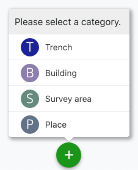

이 과정에서 먼저 작업 카테고리(예: "참호" 또는 "건물")를 선택한 후 선택적으로 지도에 새 리소스에 대한 지오메트리를 생성할 수 있습니다. 그런 다음 작업의 모든 데이터를 입력할 수 있는 편집기가 열립니다. 선택한 작업 범주에 따라 여기에서 다양한 필드를 사용할 수 있습니다(*리소스 편집* 섹션 참조).

녹색 저장 버튼을 통해 리소스를 저장하려면 최소한 핵심 섹션의 **식별자** 필드를 채워야 합니다.

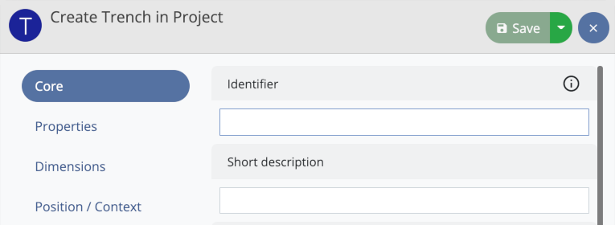

이제 새 작업이 리소스 목록에 표시됩니다. 작업을 위한 새 탭을 열려면 "작업으로 전환" 버튼(기호: 오른쪽 위 화살표)을 사용하십시오.

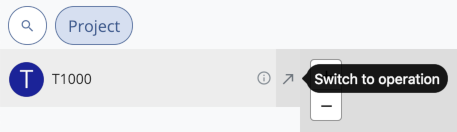

작업 범주에 따라 더하기 버튼을 통해 작업 탭 내에서 다양한 범주의 리소스를 생성할 수 있습니다(예: 참호 내의 층위학적 단위 또는 건물 내의 방).

## 계층적 순서

예를 들어 층위학적 단위에 발견물을 할당하기 위해 리소스를 계층 구조로 배열할 수 있습니다. 하위 계층 수준으로 전환하려면 "하위 리소스 표시"(기호: 오른쪽 아래 직사각형 화살표) 버튼을 사용하십시오. 이제 하위 리소스가 표시되고(예: 층위학적 단위의 발견), 더하기 버튼을 통해 새로 생성된 리소스는 이에 따라 이 계층 구조 수준에 표시됩니다.

리소스 목록 위의 탐색 경로는 현재 선택된 계층 수준을 나타냅니다. 탐색 경로의 버튼 중 하나를 클릭하여 언제든지 다른 레벨로 전환할 수 있습니다.

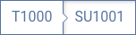

## 자원 관리

목록에 있는 리소스를 클릭하여 선택할 수 있습니다. Ctrl/Cmd 또는 Shift 키를 누르고 있으면 여러 리소스를 동시에 선택할 수 있습니다. 목록에서 하나 이상의 선택된 리소스를 마우스 오른쪽 버튼으로 클릭하면 다음 옵션을 제공하는 상황에 맞는 메뉴가 열립니다.

* *경고 표시*: 이 리소스에 사용할 수 있는 경고를 표시합니다(경고가 있는 리소스에만 사용 가능, *경고* 장 참조).
* *편집*: 리소스 편집기를 엽니다(*리소스 편집* 섹션 참조). 또는 목록에서 리소스 항목을 두 번 클릭하여 편집기를 열 수도 있습니다.
* *링크 이미지*: 이미지를 선택한 리소스에 연결하거나 연결된 이미지를 제거할 수 있는 창을 엽니다.
* *QR 코드 추가*: 리소스에 대한 새 QR 코드를 생성하거나 카메라 스캔을 통해 기존 QR 코드를 연결할 수 있는 창을 엽니다.
* *QR 코드 관리*: 리소스의 QR 코드를 표시하고 QR 코드 라벨을 인쇄할 수 있습니다(또는 리소스 목록 요소 오른쪽에 있는 QR 코드 버튼을 통해 액세스할 수도 있음)
* *이동*: 현재 컨텍스트에서 리소스를 제거하고 다른 상위 리소스에 할당할 수 있습니다.
* *삭제*: 보안 검사 후 리소스를 제거합니다. (선택적으로 현재 사용 중인 모든 이미지를 삭제할 수도 있습니다.
삭제하려는 리소스에만 독점적으로 연결됨)
* *문서 워크플로*: 선택한 리소스에 연결된 프로세스를 표시하고 새 프로세스를 생성할 수 있습니다(프로세스 카테고리의 "수행 대상" 관계의 대상 카테고리로 구성된 카테고리에만 사용 가능).
* *스캔 유형*: 카메라 스캔을 통해 해당 유형의 QR 코드를 읽어 유형에 리소스를 연결합니다("찾기" 범주 및 하위 범주의 리소스에만 사용 가능).
* *스캔 저장 장소*: 카메라 스캔을 통해 저장 장소의 QR 코드를 판독하여 리소스의 새로운 저장 장소를 설정합니다. ("찾기", "컬렉션 찾기", "샘플" 범주의 리소스와 해당 하위 범주의 리소스에만 사용 가능)
* *스캔 유형 또는 저장 장소*: 프로젝트 구성에서 유형 및 저장 장소 모두에 대해 QR 코드가 활성화된 경우 카메라 스캔을 통해 QR 코드를 읽어 이 옵션을 사용하여 두 범주의 리소스에 대한 링크를 생성할 수 있습니다("찾기" 범주 및 해당 하위 범주의 리소스에만 사용 가능).

또한 상황에 맞는 메뉴에는 형상 생성 및 편집을 위한 옵션이 포함되어 있습니다. 여러 리소스를 선택한 경우 *이동* 및 *삭제* 옵션만 사용할 수 있습니다. QR 코드 추가 또는 관리 옵션은 구성 편집기에서 해당 카테고리에 대해 QR 코드 사용이 설정된 경우에만 사용할 수 있습니다(*구성* 장의 *카테고리 편집* 섹션 참조).

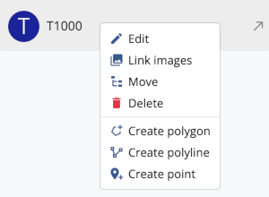

## 리소스 편집

리소스 편집기는 상황에 맞는 메뉴를 통해 열거나 리소스 목록의 항목을 두 번 클릭하여 열 수 있습니다. 여기서 선택한 리소스의 데이터를 편집할 수 있습니다. 입력 양식은 리소스 카테고리(예: "트렌치" 또는 "찾기")에 따라 다르며 구성 편집기에서 정의할 수 있습니다(*프로젝트 구성* 장 참조).

범주에 사용할 수 있는 필드는 여러 그룹(예: "핵심", "차원", "위치/컨텍스트")으로 나뉩니다. 편집기 왼쪽 섹션에 있는 그룹 버튼 중 하나를 클릭하면 해당 그룹의 필드가 편집기 오른쪽 섹션에 표시됩니다. 각 필드에는 프로젝트 구성에서 특정 입력 유형이 할당되며, 이에 따라 필드에 입력할 수 있는 데이터 유형이 결정됩니다(예: "한 줄 텍스트", "날짜", "차원"). 모든 입력 유형 목록은 *프로젝트 구성* 장의 *필드* 하위 장에서 확인할 수 있습니다.

편집기에서 변경한 사항은 "저장" 버튼을 클릭한 후에만 저장됩니다.

### 필드 및 값에 대한 정보 보기

프로젝트 구성에서는 필드 및 값 목록에 대한 추가 정보가 포함된 웹사이트에 대한 설명 텍스트 및 링크를 저장할 수 있으며 이는 데이터를 입력할 때 도움이 될 수 있습니다. 값 목록 내의 필드나 값에 대해 이러한 추가 정보를 사용할 수 있는 경우 해당 필드나 값에 마우스 포인터를 갖다 대면 나타나는 점선으로 표시됩니다.

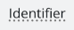

**마우스 오른쪽 버튼을 클릭**하면 설명 텍스트 및/또는 참조로 입력된 외부 웹사이트 링크가 표시되는 팝업 창이 열립니다.

### 카테고리 변경

선택한 리소스가 속한 카테고리에 대한 기호가 편집기 헤더 왼쪽에 표시됩니다. 카테고리가 상위 카테고리이거나 해당 하위 카테고리 중 하나인 경우 다른 하위 카테고리나 상위 카테고리 자체로 전환할 수 있습니다. 이 옵션은 화살표 기호가 있는 작은 파란색 버튼으로 표시됩니다.

버튼을 클릭하면 목록에서 원하는 카테고리를 선택할 수 있습니다. 이제 편집기에 새로 선택한 카테고리에 대한 양식이 표시됩니다. 그러나 변경 사항은 "저장" 버튼을 클릭한 경우에만 실제로 수행됩니다.

*예*: '찾기' 상위 카테고리에는 '벽돌', '동전', '도자기' 등의 하위 카테고리가 있습니다. 자원이 "벽돌" 범주에 속하는 경우 언제든지 상위 범주 "찾기" 또는 다른 하위 범주("동전" 또는 "도자기") 중 하나로 전환할 수 있습니다. 그러나 다른 카테고리(예: "트렌치")로 전환하는 것은 불가능합니다.

**중요**: 해당 필드가 새로 선택한 카테고리의 형식에 속하지 않는 경우 카테고리를 변경할 때 이미 입력된 필드 데이터가 손실될 수 있다는 점에 유의하세요. 이 경우 카테고리 변경 시 경고가 표시됩니다. 저장하기 전에 원래 범주로 다시 전환하면 모든 필드 데이터가 유지됩니다.

카테고리가 "작업" 또는 "프로세스" 상위 카테고리에 속하는 경우 카테고리 변경이 불가능합니다.

### 리소스의 여러 인스턴스 생성

새 리소스를 생성할 때 동시에 여러 인스턴스를 생성할 수 있는 옵션이 있습니다. 이렇게 하려면 "저장" 버튼 오른쪽에 있는 "아래 화살표" 기호가 있는 버튼을 클릭하고 열리는 드롭다운 메뉴에서 "다중 인스턴스 생성" 옵션을 선택하세요. 이제 생성할 총 리소스 수를 입력하고 "리소스 생성" 버튼을 클릭하여 입력을 확인합니다.

여러 리소스를 생성하는 경우 리소스 편집기 양식에 입력한 필드 데이터가 각 리소스에 추가됩니다. 그러나 입력된 관계는 생성된 첫 번째 리소스에 대해서만 저장되며 생성된 복사본에는 포함되지 **않습니다**.

각 리소스에 고유한 식별자가 있는지 확인하기 위해 생성된 각 추가 복사본에 대해 "식별자" 필드에 입력한 값에 카운터가 추가됩니다. "식별자" 필드에 카운터가 포함된 값을 이미 입력한 경우 이 값이 계속됩니다.

*예*: "식별자" 필드에 "ABC" 값을 입력했으며 세 개의 리소스를 생성하려고 합니다. 생성된 추가 리소스에는 "ABC2" 및 "ABC3" 식별자가 자동으로 부여됩니다. 그러나 "ABC15" 값을 입력한 경우 생성된 추가 리소스에는 "ABC16" 및 "ABC17" 식별자가 제공됩니다.

### 중복된 리소스

리소스 편집기에서 "저장" 버튼 오른쪽에 있는 "아래 화살표" 기호가 있는 버튼을 클릭하고 열리는 드롭다운 메뉴에서 "복제" 옵션을 선택하여 기존 리소스의 복사본을 만들 수 있습니다. 이제 생성할 복사본 수를 입력하고(기존 리소스는 계산되지 않음) "리소스 저장" 버튼을 클릭하여 입력을 확인합니다.

리소스의 여러 인스턴스 생성과 마찬가지로 입력된 모든 필드 데이터는 관계를 제외하고 생성된 복사본에 추가됩니다. 식별자는 카운터로 보완되거나 기존 카운터가 계속됩니다(*여러 리소스 생성* 섹션 참조).

# 이미지

이미지를 필드 프로젝트로 가져와 나중에 리소스에 연결하거나 지도 레이어로 사용할 수 있습니다. 가져온 각 이미지에 대해 이미지의 메타데이터를 입력할 수 있는 이미지 리소스가 자동으로 생성됩니다.

이미지 파일은 선택적으로 동기화 연결을 통해 다른 컴퓨터와 공유할 수 있습니다(*동기화* 장 참조). 컴퓨터에서 이미지 파일을 사용할 수 없는 경우 자리 표시자 그래픽이 대신 표시됩니다.

## 이미지 가져오기

이미지는 "도구" ➝ "이미지 관리" 메뉴를 통해, 그리고 리소스의 상황에 맞는 메뉴에 있는 "이미지 링크" 옵션을 통해(원하는 리소스를 마우스 오른쪽 버튼으로 클릭하여 액세스 가능) 두 가지 방법으로 애플리케이션으로 가져올 수 있습니다. 후자의 경우 이미지는 가져온 후 해당 리소스에 자동으로 연결됩니다(*이미지를 리소스에 연결* 섹션 참조).

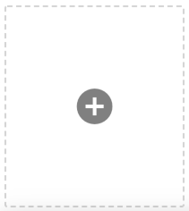

가져오기를 시작하려면 더하기 버튼을 클릭하고 프로젝트에 추가할 파일을 선택하세요. 또는 파일 관리자 응용 프로그램에서 더하기 버튼 주변의 강조 표시된 영역으로 파일을 직접 끌어서 놓을 수도 있습니다. 프로젝트에 대해 여러 이미지 카테고리(예: "이미지" 카테고리의 하위 카테고리)가 정의된 경우 드롭다운 메뉴에서 원하는 카테고리를 선택할 수 있습니다. 이미지 파일 메타데이터에서 "작성자" 필드의 내용을 자동으로 읽거나 수동으로 설정하도록 선택할 수도 있습니다. 프로젝트 속성의 "팀" 필드에 입력한 이름을 선택할 수 있습니다. 두 경우 모두 생성 날짜와 이미지의 높이 및 너비가 파일 메타데이터에서 자동으로 읽혀집니다. 지원되는 이미지 형식은 *jpg/jpeg*, *png* 및 *tif/tiff*입니다.

## 이미지 변형

가져온 각 이미지에 대해 애플리케이션은 미리보기 이미지로 복사본과 더 작은 버전을 생성하여 **이미지 디렉터리**에 저장합니다. 해당 경로는 "고급 설정" 아래의 설정에서 확인할 수 있습니다. 이 폴더의 파일은 애플리케이션에 의해 관리되며 수동으로 편집, 이름 변경 또는 삭제하면 안 됩니다. 그렇지 않으면 이미지를 보거나 동기화할 때 오류가 발생할 수 있습니다.

전체적으로 애플리케이션은 각 이미지에 대해 최대 3개의 서로 다른 변형을 관리합니다.
* *원본 이미지*: 프로젝트로 가져온 수정되지 않은 이미지 파일
* *썸네일 이미지*: 애플리케이션에서 미리보기 이미지로 표시되는 이미지의 자동 생성된 저해상도 변형(예: 이미지 관리 또는 링크된 이미지가 있는 리소스의 경우)
* *디스플레이에 최적화된 이미지*: 특정 이미지의 경우 애플리케이션에 표시하기 위해 다른 변형이 생성됩니다. TIFF 형식의 파일은 JPEG로 변환되고 해상도가 매우 높은 이미지는 크기가 줄어듭니다. 이 단계는 프로젝트가 로드될 때 발생하며, 이로 인해 기존 이미지 파일의 양에 따라 로드 시간이 몇 분 정도 일회적으로 연장될 수 있습니다.

"프로젝트" ➝ "데이터 개요" 메뉴를 통해 현재 이미지 디렉토리에 있는 데이터의 개요를 열 수 있습니다.

## 이미지 관리

이미지를 관리하려면 "도구" ➝ "이미지 관리" 메뉴를 엽니다. 여기에서 프로젝트의 모든 이미지를 보고 검색할 수 있습니다(*검색* 장 참조).

### 메타데이터 편집

원하는 이미지를 두 번 클릭하여 이미지 보기를 열면 이미지의 메타데이터를 볼 수 있습니다. 편집 버튼을 클릭하면 편집기를 열고 메타데이터를 확장하거나 변경할 수 있습니다. 여기에서는 해당 이미지 카테고리의 형식에 대해 구성 편집기에서 구성된 필드를 사용할 수 있습니다.

### 이미지 삭제

가져온 이미지를 프로젝트에서 제거하려면 이미지 관리에서 해당 이미지를 선택하세요. 그런 다음 "삭제" 버튼을 통해 제거할 수 있습니다.

이렇게 하면 프로젝트의 이미지 디렉터리(동기화 연결이 설정된 경우 다른 컴퓨터에서도)의 해당 파일도 삭제됩니다. 이미지를 삭제하면 리소스에 대한 링크가 손실됩니다.

### 원본 이미지 다운로드

이미지의 원본 파일을 컴퓨터에서 사용할 수 없는 경우 전체 프로젝트에 대한 원본 이미지 다운로드를 활성화하지 않고도 개별적으로 다운로드할 수도 있습니다. 이렇게 하려면 이미지 관리에서 원하는 이미지를 선택하고(또는 애플리케이션의 다른 부분에서 불러오고) "원본 이미지 다운로드" 버튼을 클릭하세요. 이제 이미지 파일이 로드됩니다.

이 기능은 "프로젝트" ➝ "동기화..." 메뉴를 통해 프로젝트에 대한 유효한 동기화 대상이 입력된 경우에만 사용할 수 있습니다(*동기화* 장 참조).

### 원본 이미지 내보내기

Field Desktop에서 원본 이미지 파일을 내보내려면 먼저 이미지 관리에서 이미지를 선택하고(또는 응용 프로그램의 다른 부분에서 호출) "내보내기" 버튼을 클릭합니다. 이미지 파일을 내보낼 디렉터리를 선택할 수 있는 창이 나타납니다. 파일 이름 지정에 대한 두 가지 옵션 중에서 선택할 수도 있습니다.

* *식별자*: 현재 프로젝트에 해당 이미지가 가지고 있는 식별자가 내보낸 이미지 파일의 파일 이름으로 사용됩니다.
* *원본 파일 이름*: 파일은 원래 프로젝트에 가져온 이름으로 내보내집니다.

## 이미지를 리소스에 연결

하나 이상의 이미지를 리소스에 연결하려면 해당 리소스의 상황에 맞는 메뉴에서 "이미지 연결" 옵션을 선택하고 더하기 버튼을 클릭하세요. 이제 다음 두 가지 옵션 중에서 선택할 수 있습니다.

* *새 이미지 추가*: 새 이미지를 프로젝트로 가져와 리소스에 연결합니다.
* *기존 이미지 연결*: 리소스에 연결할 프로젝트에 이미 있는 이미지 중에서 하나 이상의 이미지를 선택합니다.

목록에서 이미지를 선택하고 "링크 제거" 옵션을 선택하여 리소스에서 이미지 링크를 해제합니다. 이미지 자체는 프로젝트에 남아 있습니다.

이미지 관리를 통해 링크를 추가하거나 제거할 수도 있습니다. 이렇게 하려면 원하는 이미지를 선택하고 상단 표시줄에서 "링크"(파란색 버튼) 또는 "링크 제거"(빨간색 버튼) 버튼을 클릭하세요.

### 메인 이미지 설정

리소스가 여러 이미지에 연결된 경우 이미지 중 하나가 **기본 이미지**로 별표 아이콘으로 표시됩니다. 이 기본 이미지는 리소스의 미리보기 이미지로 표시됩니다. 리소스의 컨텍스트 메뉴에서 "이미지 링크" 옵션을 선택하고 링크된 이미지 목록에서 원하는 이미지를 선택하여 기본 이미지를 변경할 수 있습니다. 그런 다음 "기본 이미지로 설정" 버튼을 클릭합니다.

## 지도 레이어

### 지리참조

이미지를 지도 레이어로 사용하려면 먼저 지리참조 정보를 제공해야 합니다. 파일 확장자가 *tif/tiff*인 GeoTIFF 형식의 파일과 파일 확장자가 *wld*, *jpgw*, *jpegw*, *jgw*, *pngw*, *pgw*, *tifw*, *tiffw* 및 *tfw*인 월드 파일이 지원됩니다.

이미지 파일이 GeoTIFF 형식인 경우 더 이상 수행할 작업이 없습니다. 이미지를 가져올 때 지리참조 정보가 자동으로 적용됩니다.

월드 파일은 두 가지 방법으로 가져올 수 있습니다. 확장자 앞의 월드 파일 이름이 해당 이미지 파일 이름과 동일한 경우 이미지 가져오기(+ 버튼)를 통해 파일을 추가할 수 있습니다. 이미지에 대한 할당은 자동으로 수행됩니다. 또는 이미지 관리에서 해당 이미지를 두 번 클릭하면 접근할 수 있는 이미지 보기를 통해 월드 파일을 가져올 수도 있습니다. "지리 참조 데이터" 섹션을 열고 "세계 파일 로드" 버튼을 클릭하여 원하는 파일을 선택합니다.

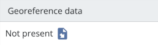

### 지도 레이어 구성

특정 작업이나 전체 프로젝트에 대해 맵 레이어를 구성할 수 있습니다. 지도 레이어를 전체 프로젝트에서 사용하려면 개요 탭(집 아이콘)으로 전환하거나 원하는 작업 탭으로 전환하세요. 그곳에서 지도 오른쪽 상단의 버튼을 통해 지도 레이어 메뉴를 열고 편집 버튼을 클릭하세요. 이제 더하기 버튼을 통해 새 지도 레이어를 추가할 수 있습니다. 지리참조 데이터가 추가된 모든 이미지를 선택할 수 있습니다.

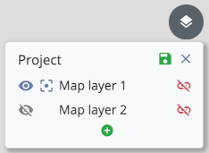

드래그 앤 드롭을 통해 지도 레이어를 목록 위나 아래로 이동하여 지도 레이어의 순서를 변경하세요. 여러 이미지가 지도에 겹치는 경우 순서에 따라 표시되는 이미지가 결정됩니다. 목록에서 더 높은 레이어는 지도에서 더 아래에 있는 레이어 위에 표시되며 완전히 또는 부분적으로 숨겨질 수 있습니다.

각 목록 항목 오른쪽에 있는 파란색 버튼 "기본 맵 레이어로 설정"(별표 아이콘)을 사용하면 프로젝트를 처음 열 때 맵에 기본적으로 표시되어야 하는 하나 이상의 이미지를 선택할 수 있습니다.

빨간색 버튼 "지도 레이어 제거"를 클릭하면 목록에서 레이어를 제거할 수 있습니다. 이미지 자체는 프로젝트에서 삭제되지 않으며 다시 지도 레이어로 추가할 수 있습니다.

데이터베이스에 대한 변경 사항을 저장하려면 "저장" 버튼을 클릭하세요.

### 지도 레이어 표시

구성된 지도 레이어는 지도 레이어 메뉴를 통해 언제든지 표시하거나 숨길 수 있습니다. 이렇게 하려면 목록에서 해당 항목 왼쪽에 있는 눈 모양 버튼을 클릭하세요. 여기에서 지정한 설정은 탭에 사용 가능한 맵 레이어 목록과 달리 데이터베이스에 저장되지 않으므로 동기화 연결을 통해 공유되지 않으므로 다른 컴퓨터에서 다른 맵 레이어를 표시하거나 숨길 수 있습니다.

# 찾다

**개요**, **작업 탭** 및 **이미지 관리**에서 **검색 필터**를 사용할 수 있습니다. 이를 사용하여 일부 기본 검색 기준(식별자, 간단한 설명, 카테고리)을 통해 현재 표시된 리소스를 제한할 수 있습니다.

더 복잡한 검색어를 표현하고 싶다면 **개요** 또는 **작업 탭** 중 하나에서 **확장 검색 모드**로 전환할 수도 있습니다. 이 모드를 사용하면 계층적 순서를 우회하여 검색을 확장하고, 전체 프로젝트를 검색하고, 필드별 추가 검색 기준을 정의할 수 있습니다.

## 검색 필터

검색 필터는 특정 기준에 따라 리소스를 표시하거나 숨기는 빠른 방법입니다. *텍스트 필터*(입력 필드)와 *범주 필터*(파란색 버튼)로 구성됩니다.

검색어를 입력하거나 카테고리를 선택하면 해당 필터 기준과 일치하는 리소스만 표시됩니다. **개요** 및 **작업 탭**에서 이는 왼쪽 사이드바 및 지도(지도 보기)에 있는 모든 리소스에 각각 영향을 미치며 목록 요소(목록 보기)에 영향을 줍니다. **이미지 관리**에서 그리드에 표시된 모든 이미지는 검색 필터의 영향을 받습니다.

### 카테고리 필터

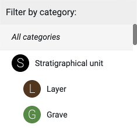

카테고리 필터 버튼을 사용하면 리소스 카테고리를 선택할 수 있습니다. 상위 카테고리와 하위 카테고리가 있습니다. 하위 카테고리(예: "레이어")를 선택하면 해당 카테고리의 리소스만 표시됩니다. 반대로, 상위 카테고리(예: "층위학적 단위")를 선택하면 선택한 카테고리의 리소스와 모든 하위 카테고리(예: "레이어", "무덤", "건축", "바닥" 등)가 포함됩니다. 상위카테고리 자체만 선택하려면 다시 클릭하세요.

현재 컨텍스트에 따라 사용 가능한 범주가 결정됩니다. 개요에서 작업 범주, 이미지 관리 이미지 범주 등을 선택할 수 있습니다.

### 텍스트 필터

검색어는 리소스 필드 "식별자" 및 "간단한 설명"과 비교됩니다.

*예:*

개요에는 다음 세 개의 트렌치가 표시됩니다.

    (1)
    Identifier: "T01"
    Short description: "Trench-01"

    (2)
    Identifier: "T02"
    Short description: "Trench-02"

    (3)
    Identifier: "mt1"
    Short description: "My trench 1"

**가능한 검색어**는 식별자와 짧은 설명의 텍스트 문자열이며, 예를 들어 "T01", "T02", "mt1", "Trench", "01", "02", "My", "1"과 같이 각각 공백 문자나 하이픈으로 구분됩니다.

따라서 "t01"이라는 용어를 검색하면 리소스(1)가 반환되고, "my"를 검색하면 결과(3)가 반환됩니다. **대문자**는 무시됩니다.

수행되는 검색은 소위 **접두사 검색**입니다. 이는 각 경우에 검색어의 시작 부분이 확인된다는 의미입니다. (1)과 (2)의 식별자는 텍스트 문자열 "t0"으로 시작하므로 용어 "t0"을 검색하면 (1)과 (2)가 결과로 반환됩니다. "tr"을 검색하면 (1), (2) 및 (3)이 반환되지만 "ench" 또는 "ren"을 검색하면 아무 것도 반환되지 않습니다.

### 자리표시자 검색

텍스트 필터 필드에 텍스트를 입력할 때 자리 표시자를 사용할 수 있습니다. 단일 문자 대신 대괄호 안에 허용되는 다양한 문자 집합을 지정할 수 있습니다. 이러한 자리 표시자는 검색어당 한 번만 사용할 수 있습니다.

*예:*

    (1) Identifier: "Landscape-0001"
    (2) Identifier: "Landscape-0009"
    (3) Identifier: "Landscape-0010"
    (4) Identifier: "Landscape-0011"
    (5) Identifier: "Landscape-0022"

"Landscape-00[01]"을 검색하면 (1), (2), (3), (4)가 반환됩니다. 0과 1이 세 번째 숫자에 허용되는 문자로 정의되어 있기 때문입니다. 접두어 검색으로 인해 다음 문자는 모두 허용됩니다.

"Landscape-00[01]1"을 검색하면 (1)과 (4)가 반환됩니다. 자리 표시자 뒤의 숫자는 1이어야 하기 때문입니다.

### 다른 컨텍스트의 검색 결과

현재 컨텍스트에서 검색 결과를 찾을 수 없는 경우 다른 컨텍스트의 검색 결과가 텍스트 입력 필드 아래에 표시됩니다.

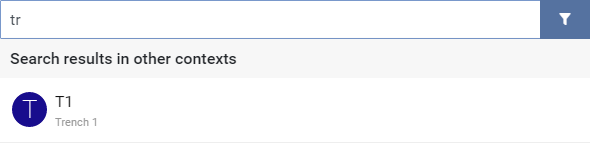

리소스 중 하나를 클릭하면 즉시 해당 컨텍스트로 전환하여 리소스를 선택할 수 있습니다.

## 확장된 검색 모드

**개요** 및 **작업 탭**에서 돋보기 버튼을 클릭하면 확장 검색 모드로 전환할 수 있습니다.

확장 검색 모드를 사용하면 더 많은 양의 데이터를 검색할 수 있습니다.

* **개요**에서는 프로젝트의 모든 리소스에 대해 검색이 수행됩니다.
* **작업 탭**에서는 작업의 모든 리소스에 대해 검색이 수행됩니다.

두 경우 모두 발견된 모든 리소스가 왼쪽 목록에 표시됩니다. "컨텍스트에 표시"(기호: 위쪽 화살표) 각각 "작업 컨텍스트에 표시"(기호: 오른쪽 위쪽 화살표) 버튼을 사용하면 리소스의 계층적 컨텍스트로 전환할 수 있습니다. 그렇게 하면 확장 검색 모드가 종료되고 필요한 경우 새 탭이 열립니다.

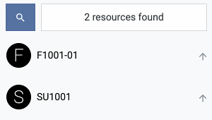

확장 검색 모드에서는 리소스를 생성할 수 없으며 이는 비활성화된 생성 버튼으로 표시됩니다. 새로운 리소스를 생성하려면 확장 검색 모드를 종료하세요.

동시에 표시되는 검색결과 수는 성능상의 이유로 최대 **200**으로 제한됩니다. 다른 리소스는 애플리케이션에 표시되지 않고 대신 최대값이 초과되었음을 알리는 알림이 표시됩니다. 이러한 리소스에 액세스하려면 추가 검색 기준을 추가하거나 확장 검색 모드를 종료하세요.

### 분야별 검색 기준

확장 검색 모드가 활성화된 경우 카테고리 필터 버튼 왼쪽에 있는 더하기 버튼을 클릭하여 리소스의 특정 필드에 대한 검색을 시작할 수 있습니다. 검색 가능한 필드는 선택한 카테고리에 해당하는 필드입니다. 여러 검색 기준을 결합하기 위해 원하는 만큼 많은 필드를 선택할 수 있습니다. 물론 텍스트 필터와 함께 필드별 검색 기준을 사용할 수도 있습니다.

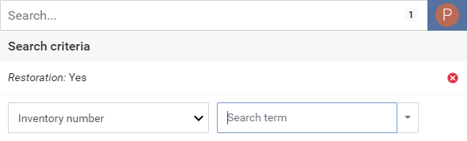

텍스트 필드의 경우 검색어를 직접 입력하세요. 값 목록이 있는 필드의 경우 드롭다운 메뉴의 허용되는 모든 값 목록에서 용어를 선택합니다.

**중요**: 검색 필터와 달리 이 경우 접두사 검색은 수행되지 않습니다. 검색 결과 목록에 리소스가 표시되려면 선택한 검색어가 리소스 필드의 내용과 정확하게 일치해야 합니다.

특정 검색어를 지정하는 대신 필드가 설정되거나("모든 값" 옵션) 설정되지 않은("값 없음" 옵션) 모든 리소스를 검색할 수도 있습니다.

카테고리 필터 버튼 옆에 나타나는 숫자는 활성 검색 기준의 수를 나타냅니다. 숫자를 클릭하면 검색 기준을 제거할 수 있습니다. 그러면 메뉴가 다시 열리고 제거할 검색 기준을 선택할 수 있습니다.

# 동기화

단일 프로젝트에서 공동 작업을 하기 위해 서로 다른 컴퓨터에 설치된 여러 Field Desktop 간에 데이터를 동기화할 수 있습니다. 즉, 다른 컴퓨터에서 실행 중인 Field Desktop 응용 프로그램에서 발생하는 변경 사항(새 리소스, 삭제된 리소스 또는 기존 리소스의 편집, 이미지 추가 또는 삭제)이 자동으로 로컬 데이터베이스로 전송되고 그 반대의 경우도 마찬가지입니다. 이를 통해 모든 참가자는 프로젝트의 최신 상태를 동시에 작업할 수 있습니다. 동기화는 인터넷이나 로컬 네트워크를 통해 작동합니다. 오프라인 상태에서도 프로젝트 작업을 계속할 수 있습니다. 이 경우 네트워크 연결이 다시 설정되자마자 데이터베이스가 동기화됩니다.

## 프로젝트 다운로드

다른 Field Desktop 설치 또는 Field 서버에서 사용할 수 있는 기존 프로젝트로 작업하려면 먼저 프로젝트를 다운로드하십시오. 이렇게 하려면 메뉴 항목 "프로젝트" ➝ "다운로드..."를 선택하고 액세스 데이터를 입력하십시오.

* *주소*: 프로젝트를 다운로드하려는 컴퓨터의 주소를 입력하세요. 이는 Field Desktop이 현재 열려 있는 다른 컴퓨터의 네트워크 주소(이 주소는 설정 섹션 *사용자 주소*에서 볼 수 있음) 또는 인터넷이나 로컬 네트워크를 통해 액세스할 수 있는 Field 서버의 주소(예: DAI 서버의 경우 *https://server.field.idai.world*)일 수 있습니다.
* *프로젝트 이름*: 다운로드하려는 프로젝트 이름입니다.
* *비밀번호*: 프로젝트를 다운로드하려는 프로젝트 또는 Field Desktop 설치의 비밀번호입니다.
* *미리보기 이미지 다운로드*: 이 옵션은 기본적으로 활성화되어 있습니다. 인터넷 연결이 약하고 가능한 한 적은 양의 데이터를 다운로드하려면 이를 비활성화하는 것이 좋습니다.
* *원본 이미지 다운로드*: 원본 이미지 해상도로 이미지를 다운로드하려면 이 옵션을 활성화하세요. 프로젝트에서 관리되는 이미지의 수와 크기에 따라 수 기가바이트의 데이터를 다운로드해야 할 수도 있습니다. 이 옵션을 활성화하기 전에 인터넷 연결이 충분하고 하드 디스크 공간이 충분한지 확인하세요.
* *동일한 이름의 기존 프로젝트 덮어쓰기*: 이 옵션을 활성화하면 동일한 이름의 프로젝트가 컴퓨터에 이미 존재하더라도 프로젝트가 다운로드됩니다. 이 과정에서 기존 프로젝트가 삭제됩니다.

유효한 주소, 프로젝트 이름 및 비밀번호를 입력하자마자 짧은 계산 시간 후에 다운로드할 이미지 데이터의 양이 해당 옵션 옆에 표시됩니다.

대규모 프로젝트의 경우 다운로드 시간이 더 오래 걸릴 수 있습니다. 다운로드한 프로젝트는 이후 자동으로 열리고 동일한 자격 증명을 사용하여 동기화 연결이 설정됩니다.

## 동기화 구성

다운로드한 프로젝트와 새로 생성된 프로젝트는 언제든지 다른 데이터베이스와 동기화될 수 있습니다. 동기화는 "프로젝트" ➝ "동기화..." 메뉴를 통해 구성할 수 있습니다.

* *주소*: 동기화 연결을 설정하려는 데이터베이스의 주소입니다. 이는 Field Desktop이 현재 열려 있는 다른 컴퓨터의 네트워크 주소(이 주소는 설정 섹션 *사용자 주소*에서 볼 수 있음)이거나 인터넷이나 로컬 네트워크를 통해 액세스할 수 있는 Field Hub 서버의 주소(예: DAI의 Field Hub 서버에 대한 *https://server.field.idai.world*)일 수 있습니다.
* *비밀번호*: 동기화 연결을 설정하려는 프로젝트 또는 Field Desktop 설치의 비밀번호입니다.
* *동기화 활성화*: 이 스위치를 사용하여 연결을 시작하거나 중단합니다.
* *미리보기 이미지 동기화*: 이 옵션은 기본적으로 활성화되어 있습니다. 인터넷 연결이 약하고 가능한 한 적은 양의 데이터를 업로드/다운로드하려는 경우 비활성화하는 것이 좋습니다.
* *원본 이미지 업로드*: 원본 이미지 해상도로 이미지를 업로드하려면 이 옵션을 활성화하세요.
* *원본 이미지 다운로드*: 원본 이미지 해상도로 이미지를 다운로드하려면 이 옵션을 활성화하세요. 프로젝트에서 관리되는 이미지의 수와 크기에 따라 수 기가바이트의 데이터를 다운로드해야 할 수도 있습니다. 이 옵션을 활성화하기 전에 인터넷 연결이 충분하고 하드 디스크 공간이 충분한지 확인하세요.

유효한 주소와 올바른 비밀번호를 입력하자마자 짧은 계산 시간 후에 업로드/다운로드할 이미지 데이터의 양이 해당 옵션 옆에 표시됩니다. 나중에 추가 이미지를 프로젝트로 가져오면 데이터 양이 증가할 수 있다는 점에 유의하세요.

마지막으로 **설정 적용** 버튼을 클릭하여 설정을 확인하세요.

## 동기화 상태

탐색 모음의 오른쪽 상단에 있는 클라우드 아이콘은 구성된 동기화 연결의 현재 상태를 표시합니다.

연결이 성공적으로 설정되면 아이콘에 확인 표시가 나타납니다. 데이터가 업로드되거나 다운로드되는 경우에는 화살표로 표시됩니다. 오류가 있는 경우 느낌표가 표시됩니다. 아이콘 위에 마우스 포인터를 올리면 동기화 상태에 관한 추가 정보를 얻을 수 있습니다.

## 충돌

여러 컴퓨터에서 동시에 리소스를 편집하거나 컴퓨터가 연결되지 않은 동안 동일한 리소스가 편집되어 두 데이터베이스가 동기화되는 경우 충돌이 발생할 수 있습니다. 이러한 경우 동일한 리소스에는 두 가지 다른 버전이 있습니다. *현재 버전*(리소스 관리 및 애플리케이션의 기타 영역에 표시됨)과 *경쟁 버전*(백그라운드에 저장되지만 추가 단계를 수행하지 않으면 표시되지 않음)입니다. 두 버전은 채워진 필드 수가 다를 수 있지만 동일한 필드에 다른 값이 있을 수도 있습니다.

충돌이 있는 각 리소스에 대해 경고가 표시됩니다(*경고* 장 참조). 리소스 편집기의 **충돌** 탭에서 영향을 받은 리소스를 정리할 수 있습니다.

충돌을 해결하려면 값이 다른 각 필드에 대해 유효한 버전을 결정해야 합니다. 또는 *현재 버전*이나 *경쟁 버전*을 전체적으로 선택할 수도 있습니다. **충돌 해결**을 클릭하여 결정을 확인합니다. 단일 리소스에 여러 충돌이 있는 경우 모든 충돌이 해결될 때까지 이 프로세스를 반복해야 합니다. 편집기가 열려 있는 동안에도 다른 편집기 그룹에서 변경 작업을 수행할 수 있습니다. 변경 사항을 적용하려면 마지막으로 **저장** 버튼을 통해 리소스를 저장해야 합니다.

## 자신의 Field Desktop 설치에 대한 동기화 연결 허용

**설정** 메뉴의 **동기화** 섹션에서 찾을 수 있는 자격 증명을 다른 사람에게 제공하여 다른 사람이 프로젝트와의 동기화 연결을 설정하도록 허용할 수 있습니다.

* *귀하의 주소*: 다른 사람들이 자신의 Field Desktop 설치에서 귀하의 데이터베이스에 연결하는 데 사용할 수 있는 네트워크 주소입니다. 다른 사람이 자신의 프로젝트 데이터를 귀하와 동기화할 수 있도록 이 주소를 비밀번호와 함께 공유할 수 있습니다.
* *귀하의 비밀번호*: 기본적으로 데이터베이스는 임의로 생성된 비밀번호를 사용하여 무단 액세스로부터 보호됩니다. 이 시점에서 비밀번호를 변경할 수 있습니다.
* *원본 이미지 수신*: 이 옵션을 활성화하면 다른 사람이 보낸 이미지 파일이 원본 이미지 해상도로 승인되어 이미지 디렉터리에 저장됩니다. 이미지 파일에는 수 기가바이트의 데이터가 포함될 수 있으므로 이미지 디렉터리에 충분한 저장 공간이 있는지 확인해야 합니다. 기본적으로 이 옵션은 비활성화되어 있으므로 원본 이미지는 허용되지 않습니다. 이 옵션은 다른 컴퓨터에 설정된 동기화 연결에만 영향을 미칩니다. 자체 구성된 동기화 연결은 이 설정의 영향을 받지 않습니다.

# 프로젝트 구성

Field Desktop으로 관리되는 데이터베이스에는 항상 특정 **범주**(예: "장소", "찾기" 또는 "이미지")에 속하는 여러 리소스가 포함되어 있습니다. **상위 카테고리**(예: '찾기')와 **하위 카테고리**(예: '벽돌' 또는 '도자기')가 구분됩니다. 하위 카테고리의 자원은 항상 상위 카테고리에도 속합니다(브릭도 찾기입니다).

각 카테고리는 리소스의 속성과 메타데이터(예: '무게', '색상', '프로세서' 등)를 설명하는 데 사용할 수 있는 **필드** 집합을 제공합니다. 각 필드에는 해당 필드에 어떤 데이터를 어떤 방식으로 입력할 수 있는지 결정하는 특정 입력 유형이 있습니다(예: 텍스트 필드, 숫자 입력, 날짜 입력). 일부 입력 유형의 필드의 경우 미리 정의된 선택 사항으로 텍스트 값 집합을 정의하는 **valuelist**를 지정할 수 있습니다.

리소스 편집기의 카테고리에 구체적으로 사용할 수 있는 필드는 **양식**을 선택하여 결정됩니다. 양식**에서는 사용 가능한 필드를 선택하여 **그룹**으로 정렬합니다. 각 카테고리에 대해 더 광범위한 필드 선택이 있는 하나 이상의 양식 외에 몇 개의 필수 필드만 포함하는 동일한 이름의 기본 양식을 사용할 수 있습니다(예: "도자기" 범주에 대한 필드 데이터 모델의 표준 필드가 있는 "도자기:기본"). 양식과 해당 필드 그룹 및 필드는 구성 편집기를 사용하여 원하는 대로 사용자 정의하고 확장할 수 있습니다. 하위 범주의 양식은 항상 해당 상위 범주의 선택된 양식 필드를 상속합니다.

**관계**는 리소스 간의 관계를 지정하는 데 사용됩니다(예: 레이어 "A1"은 공간적으로 레이어 "A2" 아래에 위치함). 관계는 구성 편집기에서 숨길 수 있지만 새로 생성할 수는 없습니다.

"도구" ➝ "프로젝트 구성" 메뉴를 통해 구성 편집기에 접근할 수 있으며, 이를 통해 프로젝트에서 사용할 수 있는 카테고리, 필드 및 값 목록을 조정하고 확장할 수 있습니다. 동기화 연결이 설정된 경우 구성 변경 사항은 "저장" 버튼을 통해 확인되는 즉시 다른 사용자에게 전송됩니다.

## 식별자 및 라벨

프로젝트 구성의 모든 요소(범주, 필드, 값 목록 등)에는 각각 고유 식별을 위한 **식별자**가 있습니다. 이 식별자는 데이터베이스에 저장되며 리소스를 가져오거나 내보낼 때도 사용됩니다. 구성 편집기에서는 자홍색으로 표시됩니다.

또한 구성된 각 프로젝트 언어에 대해 **레이블**을 추가할 수 있습니다. 이러한 텍스트는 애플리케이션의 다른 모든 영역에 표시되는 데 사용되며 구성 편집기에서도 검은색으로 표시됩니다. 라벨이 없으면 대신 식별자가 표시됩니다.

## 카테고리 및 양식

편집기의 왼쪽 사이드바에는 현재 프로젝트에 대해 구성된 범주가 나열됩니다. 왼쪽 상단에 있는 필터 메뉴를 사용하면 표시되는 카테고리의 선택을 애플리케이션의 특정 부분으로 제한할 수 있습니다(예: 트렌치 탭 내에서 생성할 수 있는 카테고리로 제한하는 "트렌치"). "모두" 옵션을 선택하면 프로젝트의 모든 범주가 ​​나열됩니다.

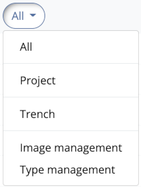

목록에서 범주를 선택하면 해당 범주에 대해 구성된 양식이 해당 필드 그룹 및 필드와 함께 오른쪽에 표시됩니다.

### 상위 카테고리 추가

목록 하단에 있는 녹색 더하기 버튼을 사용하면 프로젝트에 새 상위 카테고리를 추가할 수 있습니다. 프로젝트에 대해 아직 구성되지 않은 필드 범주 라이브러리의 모든 상위 범주 중에서 선택할 수 있는 새 창이 열립니다. 목록 위의 텍스트 필드를 사용하여 표시된 카테고리와 양식을 필터링할 수 있습니다. 각 카테고리에 대해 사용 가능한 양식이 나열됩니다. 양식 중 하나를 선택하면 오른쪽에 해당 필드 그룹과 필드가 표시됩니다. "카테고리 추가" 버튼을 클릭하여 선택을 확인하세요.

구성 편집기를 통해 새 상위 카테고리를 추가할 수 없습니다.

### 하위 카테고리 추가

기존 상위 카테고리에 새 하위 카테고리를 추가하려면 해당 상위 카테고리 오른쪽에 표시된 작은 더하기 버튼을 클릭하세요. 더하기 버튼이 없으면 이 카테고리에 대한 하위 카테고리를 생성할 수 없습니다.

상위 카테고리를 추가하는 것과 유사하게 각 카테고리에 대해 다양한 양식 중에서 선택할 수도 있습니다. 자신만의 카테고리를 생성하려면 목록 위의 텍스트 필드에 원하는 카테고리 이름을 입력하고 "새 카테고리 생성" 옵션을 선택하세요. 카테고리 속성을 설정할 수 있는 카테고리 편집기가 열립니다(*카테고리 편집* 섹션 참조). 새로 생성된 카테고리의 경우 상위 카테고리에서 선택한 양식의 필드를 상속하는 새 양식도 자동으로 생성됩니다.

"프로젝트 구성" 메뉴에서 "사용자 정의 범주/필드 강조 표시" 옵션이 활성화된 경우 프로젝트 관련 범주가 목록에서 파란색으로 강조 표시됩니다.

### 카테고리 관리

범주를 마우스 오른쪽 버튼으로 클릭하면 다음 옵션을 제공하는 상황에 맞는 메뉴가 나타납니다.

* *편집*: 카테고리 편집기를 엽니다(*카테고리 편집* 섹션 참조).
* *양식 교체*: 이 카테고리에 대한 다른 양식을 선택할 수 있는 메뉴를 엽니다. 이 프로세스에서는 현재 양식 및 카테고리에 대한 모든 변경 사항이 손실된다는 점에 유의하세요. 이것이 상위 카테고리인 경우 모든 하위 카테고리와 해당 형식에도 영향을 미칩니다.
* *삭제*: 확인 메시지가 표시된 후 카테고리를 제거합니다. 이 범주의 리소스가 프로젝트에 이미 생성된 경우 해당 리소스는 손실되지 않지만 범주를 다시 추가할 때까지 더 이상 표시되지 않습니다. 그러나 삭제하면 해당 범주에 대해 선택한 양식의 모든 사용자 정의도 손실되므로 해당 양식을 기반으로 리소스가 이미 생성된 경우 대부분의 경우 범주를 삭제해서는 안 됩니다.

### 카테고리 수정

상황에 맞는 메뉴를 사용하거나 카테고리 목록의 항목을 두 번 클릭하면 카테고리 속성을 편집할 수 있는 카테고리 편집기를 열 수 있습니다.

* *라벨*: 애플리케이션의 모든 영역에 표시되는 카테고리의 표시 라벨입니다. 다양한 언어에 대한 라벨을 입력할 수 있습니다.
* *색상*: 지도에서 이 카테고리의 자원에 대해 표시되는 도형 및 카테고리 아이콘의 색상입니다.
* *QR 코드*: 이 카테고리의 리소스에 대한 QR 코드 사용을 활성화합니다(*QR 코드* 섹션 참조).
* *식별자 접두어*: 선택적으로 이 카테고리의 자원 식별자가 항상 시작되어야 하는 텍스트를 여기에 입력하십시오. 기존 식별자는 자동으로 조정되지 않습니다.
* *리소스 제한*: 필요에 따라 여기에 숫자를 입력하여 이 범주에 대해 생성할 수 있는 최대 리소스 수를 지정합니다. 입력 필드를 비워 두면 원하는 만큼의 리소스를 생성할 수 있습니다. 이 옵션은 작업 범주와 "장소" 범주에만 사용할 수 있습니다.

프로젝트별 범주에 대해 다음 속성을 지정할 수도 있습니다.
* *설명*: 카테고리가 어떤 상황에서 사용되어야 하는지 알려주는 설명 텍스트입니다.
* *일반 참조*: 해당 카테고리에 대한 추가 정보를 찾을 수 있는 웹사이트의 URL입니다(*참조* 섹션 참조).
* *의미론적 참조*: 다른 시스템의 관련 개념에 대한 링크입니다(*참조* 섹션 참조).

#### QR 코드

카테고리에 대해 QR 코드 사용이 활성화된 경우 카테고리의 각 리소스에 고유한 QR 코드를 할당할 수 있습니다. 새 코드를 생성하거나 기존 코드를 카메라 스캔으로 읽고 해당 리소스에 연결할 수 있습니다. QR 코드는 다양한 방법으로 사용될 수 있습니다.
* 카메라 스캔을 통해 리소스에 액세스(검색창의 QR 코드 버튼을 통해)
* QR 코드 라벨 인쇄(리소스의 상황에 맞는 메뉴를 통해)
* 저장 위치에 연결된 QR 코드의 카메라 스캔을 통해 리소스 저장 위치 설정(리소스의 컨텍스트 메뉴를 통해)
QR 코드는 "찾기", "컬렉션 찾기", "샘플", "유형", "저장 위치" 카테고리와 해당 하위 카테고리에만 사용할 수 있습니다.

QR 코드 구성을 위해 범주 편집기에서 다음 옵션을 사용할 수 있습니다.
* *식별을 위해 QR 코드 사용*: 카테고리의 리소스에 대해 QR 코드 사용을 허용하려면 이 옵션을 활성화합니다.
* *새 리소스에 대해 자동 생성*: 새로 생성된 모든 리소스에 대해 QR 코드가 자동으로 생성되어야 하는 경우 이 옵션을 활성화합니다.
* *인쇄할 필드*: 리소스 식별자 외에 QR 코드 라벨에 인쇄할 필드를 최대 3개까지 선택합니다. 인쇄된 라벨의 필드 내용 앞에 필드 라벨이 나타나도록 하려면 "필드 라벨 인쇄" 옵션을 활성화하십시오.

### 계층

범주는 자원 계층 구조에서 자원을 생성할 수 있는 위치를 결정합니다. 예를 들어, 층위학적 단위 내에서 발견 항목을 생성할 수 있지만 그 반대의 경우는 생성할 수 없습니다. 양식 표시 오른쪽 상단에 있는 두 개의 버튼을 사용하면 선택한 카테고리의 리소스가 생성될 수 있는 카테고리의 리소스와 포함될 수 있는 카테고리의 리소스를 아래에서 볼 수 있습니다.

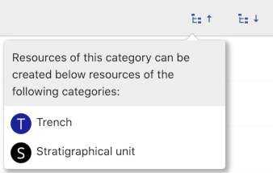

범주 계층 구조는 현재 구성 편집기에서 변경할 수 없습니다. 새로 생성된 하위 범주의 경우 상위 범주의 계층적 제한이 적용됩니다.

## 여러 떼

카테고리 목록 오른쪽에는 현재 선택된 카테고리 형태의 필드 그룹이 표시됩니다. 그룹을 클릭하면 오른쪽에 해당 필드가 표시됩니다.

### 그룹 추가

목록 하단에 있는 녹색 더하기 버튼을 사용하여 양식에 새 그룹을 추가할 수 있습니다. 프로젝트에 대해 구성된 다른 양식에 이미 포함된 그룹 중 하나를 선택하거나 새 그룹을 생성할 수 있습니다. 이렇게 하려면 목록 위의 텍스트 필드에 새 그룹의 이름을 입력하고 "새 그룹 만들기" 옵션을 선택하세요. 새 그룹의 표시 라벨을 입력할 수 있는 그룹 편집기가 열립니다.

### 그룹 관리

그룹을 마우스 오른쪽 버튼으로 클릭하면 다음 옵션이 포함된 상황에 맞는 메뉴가 나타납니다.

* *편집*: 그룹의 표시 라벨을 입력할 수 있는 그룹 편집기를 엽니다. 다양한 언어에 대한 라벨을 입력할 수 있습니다. 그룹 편집기는 그룹을 두 번 클릭하여 열 수도 있습니다.
* *삭제*: 양식에서 그룹을 제거합니다. 필드가 포함되지 않은 경우에만 그룹을 삭제할 수 있습니다. 그룹을 삭제하기 전에 모든 필드를 다른 그룹으로 이동하거나 제거하세요.

## 전지

그룹 목록 오른쪽에는 선택한 그룹에 포함된 필드가 표시됩니다. 필드 목록의 항목을 클릭하면 해당 필드에 대한 추가 정보(설명, 입력 유형 및 할당된 값 목록(있는 경우))가 표시됩니다.

상위 카테고리 양식에서 상속된 필드는 상위 카테고리 아이콘으로 표시되며 편집하거나 삭제할 수 없습니다. 이렇게 하려면 해당 상위 카테고리의 형식으로 전환하세요.

### 필드 추가

필드 목록 하단의 더하기 버튼을 클릭하면 그룹에 새 필드를 추가할 수 있습니다. 아직 양식에 추가되지 않은 선택한 범주에 사용 가능한 모든 필드 중에서 선택할 수 있습니다. 목록에서 항목을 선택하면 오른쪽 필드에 대한 정보가 표시됩니다. 새 필드를 생성하려면 목록 위의 입력 필드에 원하는 식별자를 입력하고 "새 필드 생성" 옵션을 선택하세요. 필드의 속성을 지정할 수 있는 필드 편집기가 열립니다(*필드 편집* 섹션 참조).

"프로젝트 구성" 메뉴에서 "사용자 정의 범주/필드 강조 표시" 옵션이 활성화된 경우 프로젝트 관련 필드가 목록에서 파란색으로 강조 표시됩니다.

### 필드 관리

필드를 마우스 오른쪽 버튼으로 클릭하면 다음 옵션을 제공하는 상황에 맞는 메뉴가 나타납니다.

* *편집*: 필드 편집기를 엽니다(*필드 편집* 섹션 참조).
* *삭제*: 확인 메시지가 표시된 후 필드를 삭제합니다. 이 필드의 데이터가 이미 리소스에 입력된 경우 손실되지 않지만 필드를 다시 추가할 때까지 더 이상 표시되지 않습니다. 이 옵션은 프로젝트 특정 필드에만 사용할 수 있습니다. 필드 양식 라이브러리에서 선택한 양식에 속한 필드는 삭제할 수 없으며 필드 편집기에서만 숨겨집니다.

### 필드 편집

상황에 맞는 메뉴를 사용하거나 필드 목록의 항목을 두 번 클릭하면 필드 속성을 편집할 수 있는 필드 편집기를 열 수 있습니다.

* *레이블*: 애플리케이션의 모든 영역에 표시되는 필드의 표시 레이블입니다. 다양한 언어에 대한 라벨을 입력할 수 있습니다.
* *설명*: 해당 필드에 어떤 데이터를 입력해야 하는지 알려주는 설명 텍스트입니다. 이 텍스트는 리소스 편집기에서 필드 레이블 옆에 있는 정보 아이콘의 도구 설명으로 표시되며 데이터 입력을 돕기 위한 것입니다.
* *일반 참고자료*: 해당 분야에 대한 추가 정보를 찾을 수 있는 웹사이트의 URL입니다(*참고자료* 섹션 참조).
* *의미론적 참조*: 다른 시스템의 관련 개념에 대한 링크입니다(*참조* 섹션 참조).

### 입력 유형 변경

필드 편집기의 *입력 유형* 확인란을 사용하면 필드의 입력 유형을 변경할 수 있습니다. Field Desktop과 함께 제공되는 필드의 경우 데이터 형식이 기본 입력 유형과 호환되는 입력 유형만 선택할 수 있습니다. 예를 들어 한 줄 텍스트 필드에서 여러 줄 텍스트 필드로 변경할 수 있지만 날짜 필드에서 확인란 선택 필드로 변경할 수는 없습니다. 프로젝트별 필드의 경우 언제든지 입력 유형을 자유롭게 변경할 수 있습니다.

이미 입력된 필드 데이터는 입력 유형이 변경된 후에도 계속 표시됩니다. 그러나 리소스 편집기에서는 현재 입력 유형과 호환되지 않는 데이터가 적절하게 표시되어 더 이상 편집할 수 없으며 삭제만 됩니다.

#### 단일 행 텍스트
단일 라인 텍스트 입력(선택적으로 단일 언어 또는 다국어)

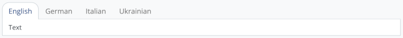

#### 다중 선택이 가능한 단일 행 텍스트
여러 개의 단일 라인 텍스트 입력(선택적으로 단일 언어 또는 다중 언어)

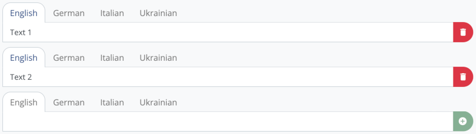

#### 여러 줄 텍스트
여러 줄, 다국어 텍스트 입력

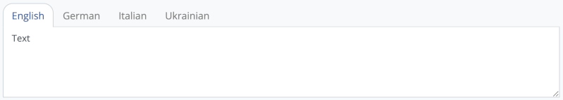

#### 정수
양수 또는 음수 정수 입력

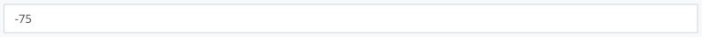

#### 양의 정수
양의 정수 입력

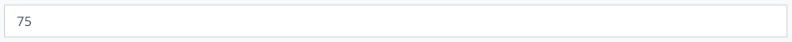

#### 십진수
양수 또는 음수 십진수 입력

#### 양의 십진수
양의 십진수 입력

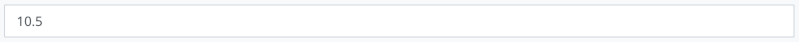

#### URL
URL 입력

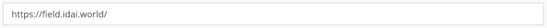

#### 드롭다운 목록
값 목록에서 값 선택

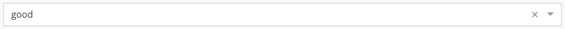

#### 드롭다운 목록(범위)
값 목록에서 값 또는 값 범위(시작/끝, 두 값) 선택

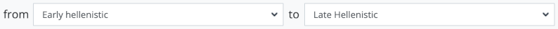

#### 라디오버튼
값 목록에서 값 선택

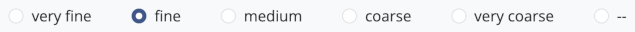

#### 예 / 아니오
예 또는 아니오 선택

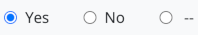

#### 체크박스
값 목록에서 하나 이상의 값 선택

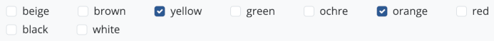

#### 날짜
달력에서 날짜 선택. 입력 필드를 사용하여 월 또는 연도 정보만 입력할 수도 있습니다. 선택적으로 시간도 지정할 수 있습니다. 추가 구성 옵션은 *날짜 필드 구성* 섹션을 참조하세요.

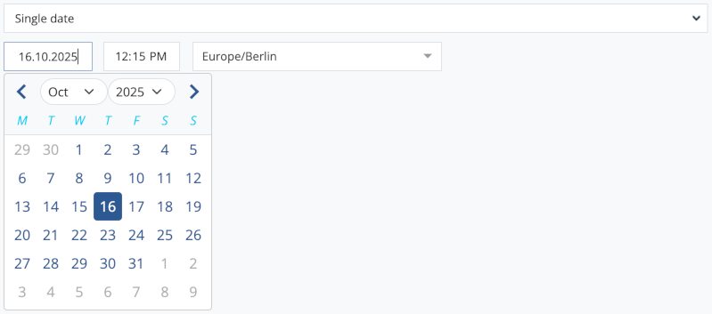

#### 데이트
하나 이상의 날짜 지정. 가능한 날짜 유형은 기간, 1년, 이전, 이후, 과학입니다.

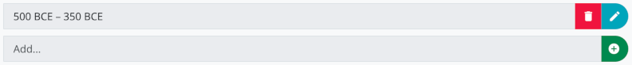

#### 차원
하나 이상의 치수 측정 사양. 사용 가능한 측정 단위는 "mm", "cm" 및 "m"입니다. 단일 값 또는 범위를 지정할 수 있습니다. "측정 기준" 드롭다운 하위 필드의 선택 옵션은 지정된 값 목록에서 가져옵니다.

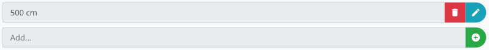

#### 무게
하나 이상의 중량 측정 사양. 사용 가능한 측정 단위는 "mg", "g" 및 "kg"입니다. 단일 값 또는 범위를 지정할 수 있습니다. 드롭다운 하위 필드 "측정 장치"에 대한 선택 옵션은 지정된 값 목록에서 가져옵니다.

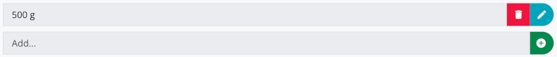

#### 용량
하나 이상의 부피 측정 사양. 사용 가능한 측정 단위는 "ml"과 "l"입니다. 단일 값 또는 범위를 지정할 수 있습니다. 드롭다운 하위 필드 "측정 기술"에 대한 선택 옵션은 지정된 값 목록에서 가져옵니다.

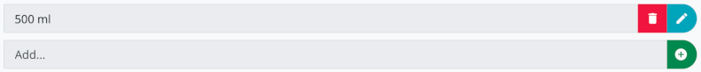

#### 참고문헌
하나 이상의 참고문헌을 지정합니다. 선택적으로 Zenon ID, DOI, 페이지 번호 및 그림 번호를 지정할 수 있습니다.

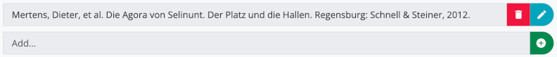

#### 복합분야
복합 필드에는 각각 임의 개수의 하위 필드로 구성된 여러 항목이 포함될 수 있습니다. 각 하위 필드에는 고유한 이름과 입력 유형이 있습니다(*하위 필드* 섹션 참조).

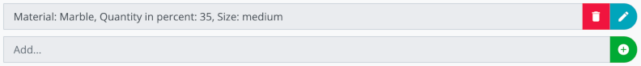

#### 관계
구성된 대상 범주 중 하나에 속하는 하나 이상의 다른 리소스에 대한 참조(*허용된 대상 범주* 섹션 참조) 선택적으로 대상 리소스에 자동으로 설정되는 역관계를 구성할 수 있습니다(*역관계* 섹션 참조).

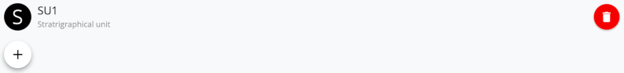

### 필드 숨기기

필드 편집기에서 *필드 표시* 설정을 비활성화하면 필드를 숨길 수 있습니다. 그러면 필드가 리소스 보기나 리소스 편집기에 표시되지 않습니다. 구성 편집기에 숨겨진 필드가 표시되는지 여부는 "프로젝트 구성" 메뉴의 "숨겨진 필드 표시" 설정에 따라 다릅니다. 이미 입력된 데이터는 숨긴 후에도 유지되며 *필드 표시* 옵션이 다시 활성화되면 다시 표시됩니다. 애플리케이션 기능에 필수적인 일부 필드(예: 리소스 식별자)는 숨길 수 없습니다. 이 경우 옵션이 표시되지 않습니다.

### 필수항목

필드 편집기에서 *필수 필드* 옵션을 활성화하여 필드를 필수로 구성할 수 있습니다. 해당 리소스를 저장하려면 필수 필드를 채워야 합니다. 옵션이 활성화되었을 때 해당 카테고리의 기존 자원이 이미 있는 경우, 사용자가 반드시 입력해야 하는 필수 필드를 알 수 있도록 경고가 표시됩니다.

### 여러 언어로 입력 허용

*다중 언어로 입력 허용* 옵션이 활성화된 경우 구성된 각 프로젝트 언어에 대한 필드에 별도의 텍스트를 입력할 수 있습니다. 이 설정은 "한 줄 텍스트", "다중 선택이 가능한 한 줄 텍스트" 및 "여러 줄 텍스트" 입력 유형의 필드에만 사용할 수 있으며 기본적으로 활성화됩니다.

### 분야별 검색

필드 편집기의 *필드별 검색 허용* 설정은 확장 검색 모드에서 필드에 대해 필드별 검색을 수행할 수 있는지 여부를 결정합니다(*검색* 장의 *확장 검색 모드* 섹션 참조). "프로젝트" 범주의 필드와 일부 입력 유형의 필드에 대해서는 이 설정을 활성화할 수 없습니다. 이 경우 회색으로 표시됩니다.

### 표시 조건

"필드 표시 조건" 설정을 사용하여 필드 표시 조건을 정의할 수 있습니다. 조건이 설정된 경우 동일한 자원의 다른 필드에 특정 값(또는 여러 값 중 하나)이 설정된 경우 데이터 입력 중에만 해당 필드를 사용할 수 있습니다.

조건을 설정하려면 먼저 "필드 표시 조건" 드롭다운 필드에서 동일한 범주의 다른 필드를 선택합니다. 입력 유형 "드롭다운 목록", "드롭다운 목록(범위)", "라디오 버튼", "예/아니요" 및 "체크박스" 필드 중에서 선택할 수 있습니다. 이제 선택한 필드에 가능한 값이 표시되고 선택할 수 있습니다. 현재 필드는 선택한 값 중 하나 이상이 조건으로 사용된 필드에 설정된 경우에만 데이터 입력 중에 표시됩니다.

필수 필드로 구성된 경우 해당 필드에 대한 표시 조건을 설정할 수 없습니다.

### 값 목록 바꾸기

현재 선택된 값 목록은 "값 목록 바꾸기" 버튼을 클릭하여 다른 값 목록으로 바꿀 수 있습니다. 기존 값 목록을 선택하거나 새 목록을 생성할 수 있습니다(*값 목록* 섹션 참조).

필드에 데이터가 이미 입력된 경우 입력한 값이 새 값 목록에 포함되지 않더라도 계속 표시됩니다. 이 경우 해당 값은 리소스 편집기에서 호환되지 않는 것으로 표시되며 삭제할 수 있습니다.

### 날짜 필드 구성

입력 유형 "날짜"를 선택한 경우 두 개의 추가 선택 필드가 나타나 날짜 필드를 추가로 사용자 정의할 수 있습니다.

#### 시간 지정

여기서 날짜 필드에 시간을 입력하는 것이 허용되는지 여부를 지정할 수 있습니다.

* *선택사항*: 시간을 입력할 수 있지만 날짜만 입력할 수도 있습니다.
* *필수*: 날짜 외에 시간을 입력한 경우에만 해당 필드를 채울 수 있습니다.
* *허용되지 않음*: 시간을 입력할 수 없습니다. 날짜만 설정할 수 있습니다.

#### 입력 모드

여기에서 필드에 단일 날짜 또는 날짜 범위를 입력해야 하는지 여부를 지정할 수 있습니다. 기간은 시작일과 종료일로 구성됩니다.

* *임의*: 단일 날짜와 날짜 범위를 모두 입력할 수 있습니다.
* *단일 날짜*: 단일 날짜만 입력할 수 있습니다.
* *기간*: 기간만 입력할 수 있습니다.

### 기하학 필드 구성

도형을 생성할 수 있는 각 범주의 형식에는 항상 "기하학" 입력 유형의 필드가 포함됩니다. 필드 편집기에서 이 필드에 허용되는 지오메트리 유형을 선택할 수 있습니다. 해당 카테고리의 리소스에 대한 도형을 생성할 때 선택한 도형 유형만 선택할 수 있습니다. 기본적으로 모든 도형 유형이 허용됩니다.

Field Desktop은 다음과 같은 형상 유형을 지원합니다.

* *다각형*("다중 다각형"을 선택한 경우 항상 자동으로 선택됨)
* *다중 다각형*
* *폴리라인*("다중폴리라인"을 선택한 경우 항상 자동으로 선택됨)
* *다중선*
* *포인트*("다중포인트"를 선택한 경우 항상 자동으로 선택됨)
* *다중점*

### 하위 필드

이 섹션은 입력 유형 "복합 필드"가 선택된 경우에만 나타나며 복합 필드의 각 항목으로 구성된 하위 필드를 정의할 수 있습니다. 하위 필드의 순서는 드래그 앤 드롭을 통해 변경할 수 있습니다.

새 하위 필드를 생성하려면 입력 필드에 원하는 이름을 입력하고 더하기 버튼을 클릭하여 확인합니다. 일반 필드(입력 유형, 레이블, 설명 등)와 유사한 방식으로 하위 필드를 구성할 수 있는 새 편집기 창이 열립니다.

#### 하위 필드 조건

선택적으로 하위 필드 표시 조건을 하위 필드 편집기에서 설정할 수 있습니다. 조건이 설정된 경우 다른 하위 필드에 특정 값(또는 여러 값 중 하나)이 설정된 경우에만 데이터 입력 중에 해당 하위 필드를 사용할 수 있습니다.

조건을 설정하려면 먼저 "하위 필드 표시 조건" 드롭다운 필드에서 동일한 복합 필드의 다른 하위 필드를 선택합니다. 입력 유형 "드롭다운 목록", "드롭다운 목록(범위)", "라디오 버튼", "예/아니요" 및 "체크박스"의 하위 필드를 선택할 수 있습니다. 이제 선택한 하위 필드의 가능한 값이 표시되고 선택할 수 있습니다. 현재 하위 필드는 선택한 값 중 하나 이상이 조건 필드로 선택된 하위 필드에 설정된 경우에만 데이터 입력 중에 표시됩니다.

### 허용된 타겟 카테고리

이 섹션은 입력 유형 "관계"를 선택한 경우에만 나타납니다. 여기에서 선택한 범주의 리소스만 관계 대상으로 선택할 수 있습니다. 상위 카테고리를 선택하면 해당 하위 카테고리도 모두 자동으로 허용된 대상 카테고리로 간주됩니다.

해당 필드에 이미 입력된 대상 리소스는 허용된 대상 범주 목록에서 범주가 제거되는 경우 자동으로 제거되지 않습니다. 이 경우 영향을 받은 리소스에 대해 해당 경고가 표시됩니다.

### 역관계

이 섹션은 입력 유형 "관계"를 선택한 경우에만 나타납니다. 선택적으로 입력 유형 "관계"의 다른 필드를 여기에서 선택할 수 있습니다. 이 필드는 입력된 대상 리소스에서 자동으로 업데이트되어 관계의 반대 방향을 반영합니다.

*예:* "아래에 있음" 관계에 대해 역관계 "위에 있음"이 구성됩니다. 대상 자원 "B"가 "아래에 있음" 관계 필드의 "A" 자원에 입력되면, 대상 자원 "A"는 "위에 있음" 관계 필드의 자원 "B"에 자동으로 입력됩니다.

이미 생성되었으며 다음 기준을 충족하는 필드만 선택 필드 *역관계*에 나타납니다.

* 해당 필드는 입력 유형이 "관계"여야 합니다.
* 해당 필드는 현재 편집 중인 필드의 허용된 모든 대상 범주에 대해 동일한 식별자로 구성되어야 합니다.
* 현재 편집 중인 필드가 속한 카테고리를 해당 필드에 대해 허용 대상 카테고리로 설정해야 합니다.
* 현재 편집 중인 필드는 이러한 기준에 따라 해당 필드의 허용된 모든 대상 범주에 대해 역관계로 입력되도록 허용되어야 합니다.

역관계를 선택하고 *확인* 버튼을 사용하여 변경 사항을 확인한 후 다른 필드의 역관계가 그에 따라 자동으로 추가되거나 업데이트됩니다.

이미 입력된 자원 데이터는 다른 역관계 선택 시 자동으로 업데이트되지 않으니 주의하시기 바랍니다.

## 순서 및 그룹 할당 조정

드래그 앤 드롭을 사용하여 상위 카테고리, 하위 카테고리, 그룹 및 필드의 순서를 변경할 수 있습니다. 이렇게 하려면 목록 항목 왼쪽에 있는 핸들 아이콘을 클릭하고 마우스 버튼을 누른 채 요소를 원하는 위치로 이동하세요.

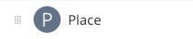

동일한 방법으로 필드를 다른 그룹에 할당할 수도 있습니다. 간단히 그룹 목록의 해당 그룹 항목으로 필드를 드래그하면 됩니다. 필드/그룹 순서 또는 그룹 할당에 대한 변경 사항은 상위 범주 형식에서 해당 하위 범주 형식으로 자동으로 전송되지 않으며 그 반대의 경우도 마찬가지입니다.

## 값 목록

"프로젝트 구성" ➝ "값 목록 관리" 메뉴는 Field와 함께 제공되는 모든 값 목록의 개요를 엽니다. 여기에 나열된 값 목록은 표준 양식의 필드에서 사용되거나 이미 Field를 사용한 프로젝트의 컨텍스트에서 생성되었습니다.

목록 위의 텍스트 필드를 사용하여 검색어를 기준으로 값 목록을 필터링합니다. 검색에서는 값 목록 식별자뿐만 아니라 개별 값의 식별자 및 표시 레이블도 고려합니다. 검색 필드 오른쪽에 있는 버튼을 사용하면 필터 메뉴를 열 수 있으며, 이를 통해 프로젝트 관련(새로 생성된) 값 목록 및/또는 현재 프로젝트 내에서 사용되는 값 목록만 선택적으로 표시할 수 있습니다.

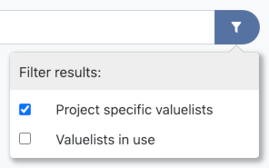

값 목록 관리 창에서 이루어진 모든 변경 사항은 이후에 프로젝트에 적용되기 전에 구성 편집기의 "저장" 버튼을 클릭하여 확인해야 합니다.

### 값 목록 생성 및 확장

새 값 목록을 생성하려면 텍스트 필드에 원하는 식별자를 입력하고 "새 값 목록 생성" 옵션을 선택하세요. 원하는 값을 입력하고 추가 설정을 할 수 있는 값 목록 편집기가 열립니다(*값 목록 편집* 섹션 참조).

완전히 새로운 값 목록을 만드는 대신 기존 값 목록을 확장할 수도 있습니다. 이렇게 하려면 해당 목록 항목을 마우스 오른쪽 버튼으로 클릭하여 상황에 맞는 메뉴를 열고 *값 목록 확장* 옵션을 선택한 다음 확장 목록에 대한 식별자를 입력하세요. 선택한 값 목록의 모든 값이 인계되며 이제 편집기에서 추가 값으로 보완될 수 있습니다. 기존 값을 숨기고 순서를 조정할 수도 있습니다. 확장 목록은 물론 프로젝트별 목록도 확장할 수 없습니다.

### 프로젝트별 가치 목록 관리

프로젝트별 값 목록을 마우스 오른쪽 버튼으로 클릭하면 다음 옵션을 제공하는 상황에 맞는 메뉴가 나타납니다.

* *편집*: 값 목록 편집기를 엽니다(*값 목록 편집* 섹션 참조).
* *삭제*: 확인 메시지가 표시된 후 값 목록을 삭제합니다. 하나 이상의 필드에서 사용되는 한 값 목록을 삭제할 수 없습니다. 이 경우 먼저 해당 필드에 대해 다른 값 목록을 선택하십시오.

### 값 목록 편집

상황에 맞는 메뉴를 사용하거나 값 목록을 두 번 클릭하면 목록 속성을 편집할 수 있는 편집기가 열릴 수 있습니다.

* *값 목록 설명*: 값 목록에 대한 자세한 정보를 지정할 수 있는 설명 텍스트입니다. 이 텍스트는 목록을 선택하면 값 목록 관리에 표시됩니다.
* *일반 참조*: 값 목록에 대한 추가 정보를 찾을 수 있는 웹사이트의 URL입니다(*참조* 섹션 참조).
* *의미론적 참조*: 다른 시스템의 관련 개념에 대한 링크입니다(*참조* 섹션 참조).
* *값*: "새 값" 텍스트 필드를 사용하여 값 목록에 포함할 새 값의 원하는 식별자를 입력합니다. 각 경우마다 값 편집기가 열리며 나중에 각 값 옆에 있는 편집 버튼을 클릭하여 호출할 수도 있습니다(*값 편집* 섹션 참조).
* *자동 정렬*: 이 옵션을 활성화하면 값이 항상 영숫자 순서로 표시됩니다. 나중에 값을 원하는 순서로 끌어서 놓기 위해 옵션을 비활성화할 수 있습니다.

### 값 편집

값 편집기를 사용하면 값의 속성을 사용자 정의할 수 있습니다.

* *레이블*: 값의 표시 레이블입니다. 다양한 언어에 대한 라벨을 입력할 수 있습니다.
* *설명*: 값에 대한 자세한 정보를 지정할 수 있는 설명 텍스트입니다. 이 텍스트는 해당 값에 대한 도구 설명으로 구성 편집기에 표시됩니다.
* *일반 참조*: 값에 대한 추가 정보를 찾을 수 있는 웹사이트의 URL입니다(*참조* 섹션 참조).
* *의미론적 참조*: 다른 시스템의 관련 개념에 대한 링크입니다(*참조* 섹션 참조).

## 참고자료

양식, 필드, 값 목록 및 해당 값은 참조를 통해 외부 리소스에 연결될 수 있습니다. 일반 참조와 의미론적 참조는 구별됩니다.

### 일반 참고자료

일반 참조는 프로젝트 구성의 각 요소에 대한 추가 정보에 액세스할 수 있는 웹 페이지의 URL입니다. 이러한 URL은 필드나 값을 마우스 오른쪽 버튼으로 클릭하면 리소스 편집기에 표시될 수 있는 정보 팝업에 표시되므로 데이터 입력에 도움이 될 수 있습니다.

### 의미론적 참조

의미론적 참조는 다른 시스템(어휘, 온톨로지 등)의 관련 개념에 대한 링크를 나타내며 술어와 URI로 구성됩니다.

#### 매핑 관계

다음 관계 중 하나를 술어로 선택할 수 있습니다.

* skos:정확한 일치
* 스코스:closeMatch
* skos:broadMatch
* 스코스:narrowMatch
* 스코스:관련 일치
* IDW:알 수 없음일치

처음 5개 관계는 *SKOS(Simple Knowledge Organization System)*의 표준 매핑 관계입니다. *idw:unknownMatch*는 특별히 정의된 추가 항목입니다. 모든 관계는 *skos:mappingRelation*의 하위 속성이며 관례에 따라 서로 다른 개념 체계 간의 연결을 위한 것입니다.

다음 설명은 자세한 내용을 확인할 수 있는 [SKOS 참조](https://www.w3.org/TR/skos-reference/#mapping)를 기반으로 합니다.

##### skos:정확한 일치

*skos:exactMatch* 관계는 두 개념을 연결하는 데 사용되며, 이는 개념이 광범위한 정보 검색 애플리케이션에서 상호 교환적으로 사용될 수 있다는 높은 수준의 신뢰도를 나타냅니다.

##### 스코스:closeMatch

*skos:closeMatch* 관계는 일부 정보 검색 애플리케이션에서 상호 교환적으로 사용될 수 있을 만큼 충분히 유사한 두 개념을 연결하는 데 사용됩니다.

##### skos:broadMatch

*skos:broadMatch* 관계는 두 개념 사이의 계층적 매핑 링크를 기술하는 데 사용되며, 대상 개념은 더 넓은 개념으로 식별됩니다(즉, 링크된 개념은 필드 프로젝트 구성의 개념을 포함합니다).

[A]가 필드 프로젝트 구성의 요소(예: 필드 또는 값)이고 [B]가 URI로 식별되는 개념인 경우:

[A] skos:broadMatch [B] = [B]가 [A]보다 넓습니다.

##### 스코스:narrowMatch

*skos:narrowMatch* 관계는 두 개념 사이의 계층적 매핑 링크를 명시하는 데 사용되며, 대상 개념은 더 좁은 개념으로 식별됩니다(즉, 현장 프로젝트 구성의 개념이 연결된 개념을 포함합니다).

[A]가 필드 프로젝트 구성의 요소(예: 필드 또는 값)이고 [B]가 URI로 식별되는 개념인 경우:

[A] skos:narrowMatch [B] = [B]가 [A]보다 좁습니다.

##### 스코스:관련 일치

*skos:관련Match* 관계는 두 개념 사이의 연관 매핑 링크를 기술하는 데 사용됩니다. 두 개념이 관련되어 있지만 어느 쪽도 다른 쪽보다 넓거나 좁지 않고 동일하지 않을 때 사용해야 합니다. 관계가 주제적, 기능적 또는 문맥적 연관에 적합합니다(예: "암포라"와 "와인 거래" 간의 연결).

##### IDW:알 수 없음일치

*idw:unknownMatch* 관계는 두 개념을 연결하는 데 사용되며 매핑 유형을 알 수 없음을 나타냅니다. 두 개념이 관련되어 있다는 합리적인 증거가 있지만 정확한 매핑 종류(동등성, 계층적 또는 연관)가 아직 결정되지 않은 경우 사용해야 합니다.

##### 결정 가이드

범위와 의도가 동일합니까? ➝ *skos:정확한 일치*

매우 가깝지만 주의사항이 남아 있나요? ➝ *스코스:closeMatch*

엄밀히 말하면 더 일반적이고 구체적입니까? ➝ *skos:broadMatch* / *skos:narrowMatch*

계층적/등가적이지 않고 연관만 있습니까? ➝ *skos:관련 일치*

불명확함; 큐레이션 표시? ➝ *idw:unknownMatch*

## 프로젝트 언어 선택

"프로젝트 구성" ➝ "프로젝트 언어 선택..." 메뉴를 사용하면 프로젝트에 데이터를 입력할 언어를 지정할 수 있습니다. 구성 편집기에서 "다중 언어로 입력 허용" 옵션이 활성화된 텍스트 필드의 경우 각 프로젝트 언어에 대해 별도의 텍스트를 입력할 수 있습니다. 또한 카테고리, 필드, 그룹, 값 목록 및 값의 레이블과 설명을 위한 빈 입력 필드가 각 프로젝트 언어에 대한 구성 편집기에 자동으로 표시됩니다.

해당 언어가 프로젝트 언어 목록에서 제거되면 이미 입력된 텍스트는 더 이상 표시되지 않습니다. 그러나 해당 언어는 데이터베이스에 남아 있으며 나중에 해당 언어를 프로젝트 언어로 다시 한 번 선택하면 다시 표시됩니다.

## 구성 가져오기

다른 프로젝트에서 기존 구성을 가져오려면 "프로젝트 구성" ➝ "구성 가져오기..." 메뉴 옵션을 사용하십시오. '소스' 드롭다운 메뉴에서 두 가지 가져오기 옵션 중에서 선택할 수 있습니다.

* *파일*: "프로젝트 구성" ➝ "구성 내보내기..." 메뉴를 통해 이전에 다른 프로젝트에서 생성된 필드 구성 파일(파일 확장자 *.configuration*)을 가져옵니다.
* *프로젝트*: 동일한 컴퓨터에서 사용 가능한 다른 프로젝트의 구성을 가져옵니다.

이제 가져오기 결과를 편집기에서 확인하고 "저장" 버튼을 클릭하여 승인할 수 있습니다. 모든 이전 구성 설정은 가져온 구성으로 대체됩니다.

## 구성 내보내기

메뉴 옵션 "프로젝트 구성" ➝ "구성 내보내기..."를 사용하여 열린 프로젝트의 구성을 필드 구성 파일(파일 확장자 *.configuration*)로 저장합니다. 저장되지 않은 변경 사항을 포함하여 현재 구성 편집기에 표시된 상태를 내보냅니다. 생성된 파일에는 모든 프로젝트별 값 목록도 포함되어 있습니다.

그런 다음 구성을 다른 프로젝트로 전송하거나 동일한 프로젝트에 저장된 구성 상태를 복원하기 위해 "프로젝트 구성" ➝ "구성 가져오기..." 메뉴 옵션을 통해 파일을 다시 가져올 수 있습니다.

# 작업흐름

Field Desktop의 워크플로 기능을 사용하면 프로젝트에서 수행되는 프로세스(예: 샘플링, 복원, 도면 생성 등)를 문서화할 수 있습니다.

## 구성

프로세스는 상위 범주 "프로세스"의 리소스로 표시됩니다. "프로세스" 범주 자체는 추상적입니다. 즉, 해당 하위 범주의 리소스만 생성될 수 있습니다. 워크플로 문서 작업을 하려면 먼저 프로젝트에 대해 "프로세스" 범주의 하나 이상의 하위 범주를 구성해야 합니다. 하위 범주는 프로세스 유형을 결정합니다.

하위 카테고리를 추가하려면 "도구" ➝ "프로젝트 구성" 메뉴를 통해 구성 편집기를 열고 카테고리 필터를 "워크플로" 또는 "모두" 옵션으로 설정한 다음 "프로세스" 카테고리 옆에 있는 더하기 버튼을 클릭하세요. 필드 범주 라이브러리에 포함된 모든 프로세스 하위 범주를 보여주는 창이 열립니다. 이러한 범주 중 하나에 대해 원하는 양식을 선택하거나, 새 범주의 이름을 입력하여 고유한 프로세스 하위 범주를 만듭니다.

두 경우 모두 이제 "수행됨" 및 "결과" 관계에 대해 허용되는 대상 범주를 설정할 수 있습니다.

"수행됨" 관계는 프로세스가 **수행**되는 리소스에 연결하는 데 사용됩니다. 이 관계는 필수 필드이므로 이 시점에서 대상 카테고리를 하나 이상 선택해야 합니다. 예를 들어, 여기에서 "찾기" 카테고리를 선택하면 해당 카테고리의 프로세스가 찾기에 대해 수행될 수 있음을 의미합니다.

"결과" 관계는 프로세스의 **결과**인 리소스에 프로세스를 연결하는 데 사용됩니다. 이 관계를 지정하는 것은 선택 사항입니다. 이 시점에서 대상 범주를 선택하지 않으면 처음에는 이 프로세스 하위 범주에 관계를 사용할 수 없습니다. 그러나 나중에 언제든지 양식에 관계를 추가할 수 있습니다(*프로젝트 구성* 장의 *필드 추가* 섹션 참조).

두 관계에 대해 허용되는 대상 범주는 나중에 범주에 대한 해당 관계 필드("수행" 또는 "결과")를 편집하여 조정할 수 있습니다. 기본적으로 두 관계 필드는 모두 "워크플로" 그룹에 있습니다.

하위 범주 추가에 대한 자세한 내용은 *프로젝트 구성* 장의 *범주 및 양식* 섹션을 참조하세요.

## 선적 서류 비치

프로세스는 워크플로 개요를 통해, 그리고 리소스 상황에 맞는 메뉴의 "문서 워크플로" 옵션을 통해 두 가지 방법으로 생성하고 볼 수 있습니다.

### 개요

프로젝트에 문서화된 모든 프로세스의 개요는 "도구" ➝ "작업흐름" 메뉴를 통해 접근할 수 있습니다. 프로세스는 식별자나 실행 날짜를 기준으로 정렬될 수 있습니다. 또한 카테고리 및 식별자별 필터링과 필드별 검색을 위한 일반적인 옵션을 사용할 수 있습니다(*검색* 장 참조). 화면 하단의 더하기 버튼을 사용하여 새로운 프로세스를 생성할 수 있습니다.

### 선택한 리소스에 대한 문서 워크플로

특정 리소스에서 수행된 프로세스만 보려면 원하는 리소스를 선택하고(여러 리소스를 한 번에 선택하려면 Ctrl/Cmd 또는 Shift 키를 누른 채) 마우스 오른쪽 버튼을 클릭하여 상황에 맞는 메뉴를 엽니다. 이제 "문서화 워크플로" 옵션을 선택하면 선택한 리소스 중 하나 이상에서 수행된 모든 프로세스를 나열하는 창을 열 수 있습니다. 이 창은 프로세스 생성 및 연결을 위한 고급 옵션도 제공합니다.

#### 프로세스 생성

창 하단에 있는 더하기 버튼을 사용하여 새 프로세스를 생성할 수 있습니다. 먼저 원하는 프로세스 하위 카테고리를 선택하세요. 선택한 모든 리소스에 대해 수행할 수 있는 프로세스 하위 범주만 사용할 수 있습니다. 해당 교차점이 없으면 더하기 버튼이 표시되지 않습니다. 여러 리소스를 선택한 경우 더하기 버튼을 클릭한 후 두 가지 옵션 중에서 선택할 수 있습니다.

* *선택한 모든 리소스에 대한 하나의 공통 프로세스*: 하나의 새 프로세스가 생성됩니다. 이 프로세스는 "수행됨" 관계를 통해 선택된 모든 리소스에 연결됩니다.
* *리소스당 하나의 프로세스*: 선택한 각 리소스에 대해 별도의 새 프로세스가 생성되고 "수행됨" 관계를 통해 해당 리소스에 연결됩니다.

#### 링크 프로세스

창 하단에 있는 파란색 링크 버튼을 사용하여 기존 프로세스를 선택한 리소스에 연결할 수 있습니다. 버튼을 클릭하면 리소스를 검색할 수 있는 창이 열립니다. 리소스를 선택하면 현재 "수행됨" 관계를 통해 이 리소스에 연결된 모든 프로세스가 표시됩니다. 프로세스 중 하나를 선택하여 선택한 모든 리소스에 연결합니다. 프로세스에 대한 기존 링크는 유지됩니다.

선택한 모든 리소스에 대해 수행할 수 있는 하위 범주의 프로세스만 선택할 수 있습니다. 해당 교차점이 없으면 링크 버튼이 표시되지 않습니다.

### 프로세스 분야

각 프로세스에는 "상태"와 "날짜"라는 두 개의 필수 필드가 있으며 각 프로세스에 대해 작성해야 합니다.

"상태" 필드는 다음 값 중 하나를 선택할 수 있는 드롭다운 필드입니다.

* *계획됨*: 프로세스가 아직 수행되지 않았지만 향후 계획되어 있습니다.
* *진행 중*: 프로세스가 현재 수행 중이지만 아직 완료되지 않았습니다.
* *완료*: 프로세스가 완료되었습니다.
* *취소됨*: 프로세스가 시작되었지만 취소되었습니다.

"날짜" 필드는 실행 날짜를 지정합니다(상태에 따라 과거, 현재 또는 미래일 수 있음). 날짜 지정 유형은 "날짜" 필드를 편집하여 구성 편집기에서 조정할 수 있습니다. 기본적으로 요일 외에 시간도 지정할 수 있으며, 단일 날짜와 날짜 범위를 모두 지정할 수 있습니다. 날짜 필드의 사용자 정의 옵션에 대한 자세한 내용은 *프로젝트 구성* 장의 *날짜 필드 구성* 섹션을 참조하세요.

입력한 날짜는 선택한 주와 일치해야 합니다. 그렇지 않은 경우(예를 들어 "완료" 상태를 선택했지만 입력한 날짜가 미래인 경우) 해당 경고가 표시됩니다(*경고* 장의 *잘못된 상태* 섹션 참조).

# 행렬

**매트릭스** 보기("도구" 메뉴를 통해 접근 가능)에는 각 트렌치의 층위 단위에서 자동으로 생성된 프로젝트의 각 트렌치에 대한 매트릭스가 표시됩니다. 매트릭스의 모서리는 단위에 대해 생성된 관계를 기반으로 구축됩니다.

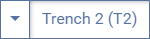

도구 모음 왼쪽에 있는 드롭다운 버튼을 통해 매트릭스를 생성할 트렌치를 선택합니다.

## 옵션

매트릭스 보기의 오른쪽 상단에 있는 **옵션 버튼**을 통해 다양한 설정을 조정하여 매트릭스 시각화를 맞춤설정할 수 있습니다. 선택한 설정은 모든 프로젝트의 트렌치에 대한 모든 매트릭스에 적용되며 응용 프로그램을 다시 시작할 때 유지됩니다.

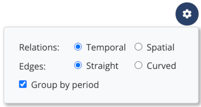

### 처지

* *시간적*: "이전", "이후" 및 "현재" 관계(필드 그룹)를 기반으로 에지가 구축됩니다.
"시간").
* *공간*: 가장자리는 "위", "아래", "절단", "절단 기준" 및 "동등" 관계를 기반으로 구축됩니다.
(필드 그룹 "위치").

### 가장자리

* *직선*: 모든 모서리가 직선으로 구성됩니다.
* *곡선*: 매트릭스의 두 단위 사이에 직접 연결 선이 없는 경우 가장자리가 곡선일 수 있습니다.

### 기간별 그룹화

"기간" 필드의 값을 기준으로 행렬의 층위학적 단위를 그룹화하려면 이 옵션을 활성화하십시오. (from/until) 필드에 두 개의 값이 설정된 경우 각 경우에 "기간(from)" 값이 사용됩니다. 동일한 기간 값을 갖는 층위 단위는 서로 가까이 배치되고 직사각형으로 구성됩니다.

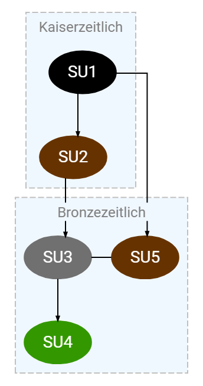

## 항해

디스플레이 영역 내에서 매트릭스의 위치를 ​​변경하려면 **오른쪽 마우스 버튼**을 누른 상태에서 마우스를 이동하세요. 확대/축소 수준을 조정하려면 디스플레이 영역 왼쪽 상단에 있는 **마우스 휠** 또는 **줌 버튼**을 사용하세요. **마우스 왼쪽 버튼**을 사용하면 매트릭스 단위와 상호 작용할 수 있습니다. 상호 작용 유형(편집 또는 선택)은 선택한 상호 작용 모드에 따라 다릅니다.

마우스 커서를 장치 위로 이동하면 이 장치에서 시작하는 가장자리가 색상으로 강조 표시됩니다. 녹색 선은 더 높은 수준의 장치에 대한 연결을 나타내고, 파란색 선은 더 낮은 수준의 장치에, 주황색 선은 매트릭스의 동일한 수준에 있는 장치에 대한 연결을 나타냅니다.

## 편집

기본적으로 **편집 모드**는 활성화되어 있습니다. 매트릭스에서 단위를 클릭하면 해당 리소스를 변경할 수 있는 편집기가 열립니다. 이러한 방식으로 "시간" 필드 그룹과 "위치" 필드 그룹의 관계를 편집하여 매트릭스 내 단위의 위치를 ​​변경할 수도 있습니다. **저장**을 클릭하면 변경된 데이터를 기반으로 매트릭스가 자동으로 업데이트됩니다.

## 부분행렬 표시

대규모 행렬의 개요를 용이하게 하기 위해 선택된 행렬 단위에서 하위 행렬을 생성할 수도 있습니다. 단위를 선택하고 현재 선택에서 새 하위 매트릭스를 생성하려면 도구 모음 오른쪽에 있는 버튼을 사용하십시오.

* *편집 모드*: 왼쪽 클릭으로 단위를 편집할 수 있습니다.
* *단일 선택 모드*: 단위는 마우스 왼쪽 버튼을 클릭하여 개별적으로 선택 및 선택 취소할 수 있습니다.
* *그룹 선택 모드*: 마우스를 사용하여 직사각형을 그려 단위를 그룹으로 선택할 수 있습니다.

* *선택 해제*: 모든 장치가 선택 해제됩니다.
* *선택에서 행렬 생성*: 선택한 단위로만 구성된 새 행렬이 생성됩니다. 가장자리는
여전히 트렌치의 모든 층위 단위를 기반으로 건설되었습니다. 따라서 이 기능은 두 단위가 여러 관계/자원에 걸쳐 연결되어 있는지 확인하는 빠른 방법으로도 사용할 수 있습니다.
* *매트릭스 다시 로드*: 선택한 트렌치의 모든 층위 단위가 포함된 원래 매트릭스가 복원됩니다.

## 내보내다

도구 모음의 맨 오른쪽에 있는 내보내기 버튼을 사용하여 현재 표시된 행렬을 파일로 내보냅니다.

두 가지 파일 형식 중에서 선택할 수 있습니다.

* *Dot(Graphviz)*: 오픈 소스 소프트웨어인 Graphviz 등에서 읽을 수 있는 그래프를 설명하는 형식입니다. (파일 확장자 *gv*)
* *SVG*: 벡터 그래픽을 표시하기 위한 형식입니다. (파일 확장자 *svg*)

# 가져오기 및 내보내기

## 수입

현재 열려 있는 프로젝트로 리소스를 가져오려면 "도구" ➝ "가져오기" 메뉴 항목을 선택하세요.

* *소스*: 가져오기 소스 유형을 선택합니다. 선택할 수 있는 옵션은 두 가지가 있습니다.
    * *파일*: 가져올 데이터는 사용자의 컴퓨터, 연결된 저장 매체 또는 네트워크를 통해 접근 가능한 다른 컴퓨터에 있는 파일에서 읽습니다.
    * *HTTP*: 가져올 데이터는 URL을 사용해 HTTP 또는 HTTPS로 불러옵니다. 이 옵션을 선택하면 *Shapefile* 및 *Catalog* 형식의 파일을 가져올 수 없습니다.
* *경로*: 파일 선택 대화 상자를 통해 원하는 가져오기 파일을 선택합니다(소스 옵션 "파일"에만 사용 가능).
* *URL*: 가져올 데이터를 찾을 수 있는 URL을 입력합니다(소스 옵션 "HTTP"에만 사용 가능).

파일 확장자를 기반으로 인식되는 선택한 파일의 형식에 따라 추가 옵션을 사용할 수 있습니다(*형식* 섹션에서 해당 형식에 대한 하위 섹션 참조).

**가져오기 시작** 버튼을 사용하여 가져오기 프로세스를 시작하세요.

지원되는 가져오기 형식은 다음과 같습니다.
* CSV(.csv)
* GeoJSON(.geojson, .json)
* 셰이프파일(.shp)
* JSON 라인(.jsonl)
* 카탈로그(.catalog)

*CSV* 및 *JSON 줄* 형식은 새 리소스를 생성하거나 기존 리소스를 편집하는 데 적합합니다. *GeoJSON*, *Shapefile* 또는 *JSON Lines* 형식을 사용하여 도형을 추가하거나 편집할 수 있습니다. *카탈로그* 형식은 필드 유형 카탈로그를 교환하는 데 사용할 수 있습니다.

새 이미지는 "도구" ➝ "이미지 관리" 메뉴를 통해서만 가져올 수 있습니다. 그러나 이미 가져온 이미지의 리소스 데이터는 CSV 또는 JSON Lines 가져오기를 통해 편집할 수 있습니다.

## 내보내다

현재 열려 있는 프로젝트에서 리소스를 내보내려면 "도구" ➝ "내보내기" 메뉴 항목을 선택하세요.

먼저 드롭다운 메뉴 **형식**에서 원하는 내보내기 형식을 선택합니다. 형식에 따라 추가 옵션을 사용할 수 있습니다(*형식* 섹션의 해당 형식에 대한 하위 섹션 참조).

**내보내기 시작** 버튼을 클릭하면 생성할 파일의 이름과 대상 디렉터리를 지정할 수 있는 파일 선택 대화 상자가 열립니다. 그런 다음 내보내기 프로세스가 시작됩니다.

지원되는 내보내기 형식은 다음과 같습니다.
* CSV(.csv)
* GeoJSON(.geojson, .json)
* 셰이프파일(.zip)
* 카탈로그(.catalog)

## 형식

### CSV

CSV(파일 확장자 *csv*)는 Field Desktop에서 자원 데이터를 가져오고 내보내는 데 사용되는 기본 파일 형식입니다. CSV 파일은 모든 일반 스프레드시트 애플리케이션에서 읽고 편집할 수 있습니다.

CSV 파일은 **지리 데이터를 포함하지 않습니다**. *GeoJSON* 또는 *Shapefile* 두 가지 형식 중 하나를 사용하여 지리 데이터를 내보내거나 가져오기를 통해 기존 리소스에 추가하세요.

#### 구조

CSV 파일에는 단일 카테고리의 리소스만 포함됩니다. 각 열은 이 범주의 프로젝트에서 사용되는 양식에 대해 구성된 필드 중 하나에 속합니다. 입력 유형에 따라 하나의 필드를 설명하는 데 둘 이상의 열이 필요할 수 있습니다. 열 헤더에는 "프로젝트 구성" 메뉴에서 해당 필드에 대해 자홍색으로 표시되는 고유한 필드 식별자가 포함되어야 합니다. 애플리케이션의 다른 영역에 표시되는 다국어 표시 이름은 CSV 파일에서 사용할 수 **없습니다**.

*식별자* 열에 식별자를 지정하는 것은 필수입니다. 다른 모든 필드는 선택 사항입니다.

빠른 개요 및 CSV 가져오기를 위한 템플릿으로 "도구" ➝ "내보내기" 메뉴에서 *스키마만* 옵션을 사용하여 카테고리의 모든 필드에 대해 미리 채워진 열 헤더가 있는 빈 CSV 파일을 생성할 수 있습니다(*내보내기 옵션* 섹션 참조).

##### 값 목록 필드

값 목록에서 선택할 수 있는 필드의 경우 해당 값의 식별자를 입력해야 합니다. 값 식별자는 해당 값 목록이 표시되는 모든 위치에서 "프로젝트 구성" 메뉴의 각 값에 대해 자홍색으로 표시됩니다. 다국어 표시 텍스트는 **사용할 수 없습니다**(값 식별자가 언어 중 하나의 표시 텍스트와 동일한 경우 제외).

##### 예/아니요 필드

입력 유형 "예/아니요" 필드에 *true*(예) 및 *false*(아니요) 값을 입력할 수 있습니다.

##### 다국어 분야

필드에 다른 언어의 값을 입력할 수 있는 경우 각 언어에 대한 별도의 열이 CSV 파일에 생성됩니다. 열 머리글에는 각 언어에 대한 "설정" 메뉴에서 자홍색으로 표시되는 언어 코드(필드 식별자와 점으로 구분됨)가 포함되어 있습니다(예: 간단한 설명의 영어 텍스트인 경우 *shortDescription.en*).

이전 버전의 Field Desktop을 사용하여 생성된 프로젝트에서 프로젝트 구성 변경으로 인해 언어 사양이 없는 값이 다국어 필드에 존재할 수 있습니다. 이러한 경우 언어 코드 대신 *unspecifiedLanguage* 텍스트가 열 머리글에 추가됩니다.

*예:*

<table>
    <thead>
      <tr>
        <th>identifier</th>
        <th>description.de</th>
        <th>description.en</th>
      </tr>
    </thead>
    <tbody>
      <tr>
        <td>A</td>
        <td>Beispieltext</td>
        <td>Example text</td>
      </tr>
    </tbody>
</table>

##### 드롭다운 목록(범위)

입력 유형 "드롭다운 목록(범위)"의 필드는 최대 2개의 하위 필드로 구성되며 각 하위 필드에 대해 별도의 열이 생성됩니다.

* *값*: 선택한 값의 식별자입니다. 두 값을 선택한 경우 두 값 중 첫 번째 값입니다.
* *endValue*: 두 값이 선택된 경우 두 번째로 선택한 값의 식별자입니다.

*예(이 경우 값 식별자는 독일 라벨과 동일합니다):*

<table>
    <thead>
      <tr>
        <th>identifier</th>
        <th>period.value</th>
        <th>period.endValue</th>
      </tr>
    </thead>
    <tbody>
      <tr>
        <td>A</td>
        <td>Eisenzeitlich</td>
        <td></td>
      </tr>
      <tr>
        <td>B</td>
        <td>Frühbronzezeitlich</td>
        <td>Spätbronzezeitlich</td>
      </tr>
    </tbody>
</table>

##### 날짜 필드

입력 유형 "날짜"의 필드는 최대 3개의 하위 필드로 구성되며 각 하위 필드에 대해 별도의 열이 생성됩니다.

* *값*: 단일 날짜에 대한 날짜 지정입니다. 기간의 시작일
* *endValue*: 기간의 종료 날짜
* *isRange*: 날짜가 날짜 범위인지 여부를 나타냅니다. 가능한 값은 *true*(날짜 범위), *false*(단일 날짜)입니다.

날짜는 "day.month.year"(DD.MM.YYYY) 형식으로 입력됩니다. 일, 월 입력은 선택사항이므로 특정 연도 또는 특정 월만 입력이 가능합니다.

또한 프로젝트 구성의 해당 필드에 시간 입력이 허용되는 경우 "시:분" 형식의 시간 지정을 입력할 수 있습니다(공백으로 구분). **중요**: 시간은 항상 UTC(협정 세계시, 서유럽 표준시/그리니치 표준시에 해당) 시간대에 지정됩니다.

<table>
    <thead>
      <tr>
        <th>identifier</th>
        <th>date.value</th>
        <th>date.endValue</th>
        <th>date.isRange</th>
      </tr>
    </thead>
    <tbody>
    <tr>
        <td>A</td>
        <td>19.08.2017 17:25</td>
        <td>20.08.2017 11:09</td>
        <td>true</td>
      </tr>
      <tr>
        <td>B</td>
        <td>12.01.2025</td>
        <td></td>
        <td>false</td>
      </tr>
      <tr>
        <td>C</td>
        <td>09.2008</td>
        <td>11.2008</td>
        <td>true</td>
      </tr>
      <tr>
        <td>D</td>
        <td>1995</td>
        <td></td>
        <td>false</td>
      </tr>
    </tbody>
</table>

##### 필드 나열

입력 유형이 "체크박스"인 필드의 경우 해당 필드에 대해 하나의 열만 생성됩니다. 필드 값은 값 사이에 공백 없이 세미콜론으로 서로 구분됩니다(예: "화강암;석회석;슬레이트").

입력 유형이 "날짜", "치수", "무게", "부피", "서지 참조", "복합 필드" 및 "한 줄 텍스트(목록)"인 필드의 경우 **각 목록 항목**에 대해 각 하위 필드 또는 언어에 해당하는 열이 생성됩니다. 해당 항목을 식별하기 위해 필드 이름 뒤에 숫자가 삽입됩니다(0에서 시작하고 점으로 구분됨).

*여러 언어로 입력된 입력 유형 "한 줄 텍스트(목록)" 필드의 예:*

<table>
    <thead>
      <tr>
        <th>identifier</th>
        <th>exampleField.0.de</th>
        <th>exampleField.0.en</th>
        <th>exampleField.1.de</th>
        <th>exampleField.1.en</th>
      </tr>
    </thead>
    <tbody>
      <tr>
        <td>A</td>
        <td>Wert A1</td>
        <td>Value A1</td>
        <td>Wert A2</td>
        <td>Value A2</td>
      </tr>
      <tr>
        <td>B</td>
        <td>Wert B1</td>
        <td>Value B1</td>
        <td>Wert B2</td>
        <td>Value B2</td>
      </tr>
    </tbody>
</table>

##### 처지

열 머리글에는 관계 이름 앞에 *관계*라는 접두사가 포함되어 있습니다(점으로 구분됨). 대상 리소스의 식별자는 세미콜론으로 구분되어 입력됩니다.

해당 카테고리의 형태로 프로젝트 구성에 나열된 관계 외에도 다음 열을 사용할 수 있습니다.
* *relations.isChildOf*: 계층 구조에서 직접 상위 리소스를 지정합니다. 최상위 리소스의 경우 비어 있습니다.
* *relations.depicts*(이미지 리소스에만 해당): 이미지를 하나 이상의 리소스에 연결합니다.
* *relations.isDepictedIn*(이미지 리소스 제외): 리소스를 하나 이상의 이미지에 연결합니다.
* *relations.isMapLayerOf*(이미지 리소스에만 해당): 대상으로 지정된 리소스의 컨텍스트에서 이미지를 맵 레이어로 추가합니다.
* *relations.hasMapLayer*(이미지 리소스 제외): 이 리소스의 컨텍스트에서 하나 이상의 이미지를 지도 레이어로 추가합니다.

이미지를 프로젝트에 연결하거나 프로젝트 수준에서 지도 레이어로 설정하려면 *relations.depicts* 또는 *relations.isMapLayerOf* 열에 프로젝트 식별자를 입력하세요.

*예:*

<table>
    <thead>
      <tr>
        <th>identifier</th>
        <th>relations.isAbove</th>
        <th>relations.isChildOf</th>
        <th>relations.isDepictedIn</th>
      </tr>
    </thead>
    <tbody>
      <tr>
        <td>A</td>
        <td>B;C;D</td>
        <td>E</td>
        <td>Image1.png;Image2.png</td>
      </tr>
    </tbody>
</table>

##### QR 코드

*scanCode* 열에는 리소스를 고유하게 식별하고 애플리케이션에 QR 코드로 표시되는 문자열을 입력할 수 있습니다. 먼저 구성 편집기에서 해당 카테고리에 대해 QR 코드 사용을 활성화해야 합니다.

*예:*

<table>
    <thead>
      <tr>
        <th>identifier</th>
        <th>scanCode</th>
      </tr>
    </thead>
    <tbody>
      <tr>
        <td>A</td>
        <td>06ad7807-b363-4609-8db8-e33779faecf7</td>
      </tr>
    </tbody>
</table>

##### 데이트

입력 유형 "데이트"의 필드는 목록 필드이며 각 필드에는 여러 데이트 항목이 포함될 수 있습니다. 날짜는 각 날짜에 대해 별도의 열이 생성되는 다음 하위 필드로 구성됩니다.

* *type*: 데이트 유형입니다. 가능한 값은 *범위*(기간), *단일*(1년), *이전*(이전), *이후*(이후), *과학*(과학)입니다.
* *시작*: 날짜 유형 *이후*에 대해 설정되고 날짜 유형 *범위*에 대한 시작 날짜로 설정되는 연도 지정입니다.
* *end*: 날짜 유형 *single*, *before* 및 *scientific*에 대해 설정되고 날짜 유형 *range*에 대한 종료 날짜로 설정된 연도 지정입니다.
* *마진*: 연대 측정 유형 *과학적*에 대한 허용 오차 한계(년)입니다.
* *출처*: 데이트, 다국어 텍스트 필드의 출처입니다.
* *isImprecise*: 사양이 "부정확"합니다. 데이트 유형 *과학적*에는 설정할 수 없습니다. 가능한 값은 *true*(예), *false*(아니요)입니다.
* *isUncertain*: 사양이 "불확실함"입니다. 데이트 유형 *과학적*에는 설정할 수 없습니다. 가능한 값은 *true*(예), *false*(아니요)입니다.

연도 지정 *시작* 및 *끝*은 두 개의 하위 필드로 구성됩니다.

* *inputType*: 시간 척도입니다. 가능한 값은 *bce*(BCE), *ce*(CE), *bp*(BP)입니다.
* *inputYear*: 연도입니다.

*예:*

<table>
    <thead>
      <tr>
        <th>identifier</th>
        <th>dating.0.type</th>
        <th>dating.0.begin.inputType</th>
        <th>dating.0.begin.inputYear</th>
        <th>dating.0.end.inputType</th>
        <th>dating.0.end.inputYear</th>
        <th>dating.0.margin</th>
        <th>dating.0.source.de</th>
        <th>dating.0.source.en</th>
        <th>dating.0.isImprecise</th>
        <th>dating.0.isUncertain</th>
      </tr>
    </thead>
    <tbody>
      <tr>
        <td>A</td>
        <td>range</td>
        <td>bce</td>
        <td>100</td>
        <td>ce</td>
        <td>200</td>
        <td></td>
        <td>Beispieltext</td>
        <td>Example text</td>
        <td>false</td>
        <td>false</td>
      </tr>
      <tr>
        <td>B</td>
        <td>single</td>
        <td></td>
        <td></td>
        <td>ce</td>
        <td>750</td>
        <td></td>
        <td></td>
        <td></td>
        <td>true</td>
        <td>false</td>
      </tr>
      <tr>
        <td>C</td>
        <td>before</td>
        <td></td>
        <td></td>
        <td>bp</td>
        <td>20</td>
        <td></td>
        <td></td>
        <td></td>
        <td>false</td>
        <td>true</td>
      </tr>
      <tr>
        <td>D</td>
        <td>after</td>
        <td>bce</td>
        <td>350</td>
        <td></td>
        <td></td>
        <td></td>
        <td></td>
        <td></td>
        <td>false</td>
        <td>false</td>
      </tr>
      <tr>
        <td>E</td>
        <td>scientific</td>
        <td></td>
        <td></td>
        <td>ce</td>
        <td>1200</td>
        <td>50</td>
        <td></td>
        <td></td>
        <td>false</td>
        <td>false</td>
      </tr>
    </tbody>
</table>

##### 치수, 중량 및 부피

입력 유형 "치수", "무게" 및 "부피"의 필드는 각각 여러 항목을 포함할 수 있는 목록 필드입니다. 항목은 각 항목에 대해 별도의 열이 생성되는 다음 하위 필드로 구성됩니다.

* *inputValue*: 측정된 수치입니다.
* *inputRangeEndValue*: 범위인 경우 두 번째로 측정된 숫자 값입니다.
* *inputUnit*: 측정 단위입니다. 가능한 값: *mm*, *cm*, *m*(치수) / *mg*, *g*, *kg*(무게) / *ml*, *l*(부피).
* *measurementPosition*: "측정 기준" 필드(치수 사양에만 해당). 필드에 대해 구성된 값 목록의 값 식별자를 입력해야 합니다.
* *measurementDevice*: "측정 장치" 필드(중량 사양에만 해당). 필드에 대해 구성된 값 목록의 값 식별자를 입력해야 합니다.
* *measurementTechnique*: "측정 기술" 필드(볼륨 사양에만 해당). 필드에 대해 구성된 값 목록의 값 식별자를 입력해야 합니다.
* *measurementComment*: 설명, 다국어 텍스트 필드입니다.
* *isImprecise*: 사양이 "부정확"합니다. 가능한 값은 *true*(예), *false*(아니요)입니다.

*예(이 경우 "dimensionLength.0.measurementPosition" 열의 값 식별자는 독일어 레이블과 동일함):*

<table>
    <thead>
      <tr>
        <th>identifier</th>
        <th>dimensionLength.0.inputValue</th>
        <th>dimensionLength.0.inputRangeEndValue</th>
        <th>dimensionLength.0.inputUnit</th>
        <th>dimensionLength.0.measurementPosition</th>
        <th>dimensionLength.0.measurementComment.de</th>
        <th>dimensionLength.0.measurementComment.en</th>
        <th>dimensionLength.0.isImprecise</th>
      </tr>
    </thead>
    <tbody>
      <tr>
        <td>A</td>
        <td>50</td>
        <td></td>
        <td>cm</td>
        <td>Minimale Ausdehnung</td>
        <td>Beispieltext</td>
        <td>Example text</td>
        <td>false</td>
      </tr>
      <tr>
        <td>B</td>
        <td>10</td>
        <td>15</td>
        <td>m</td>
        <td>Maximale Ausdehnung</td>
        <td></td>
        <td></td>
        <td>true</td>
      </tr>
    </tbody>
</table>

##### 참고문헌

입력 유형 "서지 참조"의 필드는 목록 필드이며 각 필드에는 여러 참조 항목이 포함될 수 있습니다. 항목은 각 참고문헌에 대해 별도의 열이 생성되는 다음 하위 필드로 구성됩니다.

* *인용*: 문헌 인용
* *zenonId*: 제논 ID
* *도이*: DOI
* *페이지*: 페이지
* *그림*: 그림

*예:*

<table>
    <thead>
      <tr>
        <th>identifier</th>
        <th>literature.0.quotation</th>
        <th>literature.0.zenonId</th>
        <th>literature.0.doi</th>
        <th>literature.0.page</th>
        <th>literature.0.figure</th>
      </tr>
    </thead>
    <tbody>
      <tr>
        <td>A</td>
        <td>Hohl S., Kleinke T., Riebschläger F., Watson J. 2023, iDAI.field: developing software for the documentation of archaeological fieldwork, in Bogdani J., Costa S. (eds.), ArcheoFOSS 2022. Proceedings of the 16th International Conference on Open Software, Hardware, Processes, Data and Formats in Archaeological Research (Rome, 22-23 September 2022), «Archeologia e Calcolatori», 34.1, 85-94</td>
        <td>002038255</td>
        <td>https://doi.org/10.19282/ac.34.1.2023.10</td>
        <td>90</td>
        <td>3</td>
      </tr>
    </tbody>
</table>

##### 복합 필드

입력 유형 "복합 필드"의 필드는 목록 필드이며 각 필드에는 여러 항목이 포함될 수 있습니다. 구성된 각 하위 필드에 대해 항목당 하나의 열이 생성됩니다(다국어 텍스트 필드의 경우 각 언어에 대해 하나의 열). 하위 필드의 식별자는 열 머리글에 지정됩니다.

#### 가져오기 옵션

CSV 가져오기를 사용하면 새 리소스를 생성하거나 기존 리소스를 편집할 수 있습니다. 다음 두 가지 옵션 중에서 선택할 수 있습니다.

* *새 리소스 가져오기*: 이 옵션이 활성화되면 CSV 테이블의 각 행에 대해 새 리소스가 생성됩니다. 식별자(*식별자* 열)가 이미 할당된 리소스는 무시됩니다.
* *기존 리소스 업데이트*: 이 옵션이 활성화되면 기존 리소스가 CSV 테이블의 데이터와 병합됩니다. 가져오기 레코드의 필드는 기존 데이터 레코드의 동일한 식별자로 필드를 덮어씁니다. 가져오기 레코드에 없는 기존 레코드의 필드는 변경되지 않은 상태로 유지됩니다. 카테고리는 가져오기를 통해 변경할 수 없습니다. 기존 레코드에 대한 가져오기 레코드 할당은 식별자 필드(*식별자* 열)를 기반으로 수행됩니다. 할당할 수 없는 CSV 테이블의 레코드는 무시됩니다.

다음 옵션도 사용할 수 있습니다.

* *삭제 허용*: 이 옵션이 활성화되면 필드를 변경할 수 있을 뿐만 아니라 삭제할 수도 있습니다. 가져오기 파일의 필드가 비어 있는 모든 필드(관계 포함)가 삭제됩니다. CSV 테이블의 열로 나열되지 않은 필드는 변경되지 않은 상태로 유지됩니다. 이 옵션은 *기존 리소스 업데이트* 옵션을 선택한 경우에만 사용할 수 있습니다.
* *구성되지 않은 필드 무시*: 이 옵션이 활성화되면 가져오기 중에 프로젝트 구성의 일부가 아닌 가져오기 파일의 필드가 무시됩니다. 그렇지 않으면 파일에서 구성되지 않은 필드가 발견되는 즉시 가져오기가 중단됩니다.
* *카테고리 선택*: 카테고리 식별자가 파일 이름의 일부인 경우(나머지 파일 이름과 점으로 구분) 카테고리가 자동으로 인식됩니다(예: "찾기" 카테고리의 리소스가 포함된 CSV 파일의 경우 "example.find.csv"). 파일 이름에 카테고리 식별자가 포함되어 있지 않으면 이 드롭다운 메뉴를 사용하여 카테고리를 수동으로 선택해야 합니다. *새 리소스 가져오기* 옵션이 활성화된 경우 "이미지" 카테고리와 해당 하위 카테고리를 선택할 수 없습니다.
* *작업에 데이터 할당*: 새로 생성된 모든 리소스가 할당될 프로젝트에 있는 작업 중 하나를 선택합니다. 모든 레코드에 대해 CSV 파일의 *relations.isChildOf* 열에 상위 리소스의 식별자가 이미 지정되어 있거나 작업 내에서 카테고리의 리소스를 생성할 필요가 없는 경우(예: "장소", "작업" 및 "이미지" 카테고리의 경우 해당) 작업을 지정할 필요가 없습니다. 이 옵션은 *새 리소스 가져오기* 옵션을 선택한 경우에만 사용할 수 있습니다.
* *필드 구분 기호*: CSV 파일에서 필드 구분 기호로 사용되는 문자를 입력합니다(기본 설정은 쉼표입니다). CSV 파일을 생성할 때 선택한 것과 동일한 문자를 입력합니다(예: Field Desktop에서 "내보내기" 메뉴를 통해 또는 스프레드시트 애플리케이션에서). 대부분의 경우 쉼표나 세미콜론이 CSV 파일의 필드 구분 기호로 사용됩니다. 가져오는 동안 오류가 발생하면 먼저 올바른 필드 구분 기호를 입력했는지 확인하십시오. 그렇지 않으면 파일을 올바르게 읽을 수 없습니다.

#### 내보내기 옵션

먼저 CSV 내보내기 유형을 선택하세요. 다음 두 가지 옵션 중에서 선택할 수 있습니다.

* *완료*: 컨텍스트 및 카테고리에 대해 선택한 설정에 따라 모든 리소스를 내보냅니다(아래 참조).
* *스키마만*: 선택한 범주에 대해 구성된 모든 필드의 열 헤더가 포함된 헤더 행만 내보냅니다. 내보낸 파일은 가져오기 파일을 생성하기 위한 템플릿으로 사용할 수 있습니다.

다음 옵션도 사용할 수 있습니다.

* *컨텍스트*: 선택적으로 여기에서 작업을 선택합니다. 내보내기는 이 작업의 리소스로 제한됩니다. 기본 옵션 "제한 없음"이 선택되면 선택한 범주의 모든 리소스가 내보내집니다. 이 옵션은 *완료* 옵션을 선택한 경우에만 사용할 수 있습니다.
* *카테고리*: 여기에서 원하는 카테고리를 선택하세요. 선택한 카테고리의 리소스만 내보냅니다. 이 드롭다운 메뉴에서는 선택한 컨텍스트에 리소스가 존재하는 카테고리만 선택할 수 있습니다. 선택한 컨텍스트에서 사용 가능한 리소스 수가 괄호 안에 표시됩니다.
* *필드 구분자*: 생성할 CSV 파일에서 필드 구분자로 사용할 문자를 입력합니다. (기본 설정은 쉼표입니다.)
* *계층 관계 결합*: 이 옵션이 활성화되면 계층 관계는 각 경우에 직접 상위 리소스를 지정하는 단순화된 관계 *isChildOf*로 결합됩니다. 이 옵션은 기본적으로 활성화되어 있으며 대부분의 경우 비활성화하면 안 됩니다. 옵션이 비활성화되면 *relations.isChildOf* 열 대신 *relations.liesWithin* 및 *relations.isRecordedIn* 두 열이 생성됩니다. *relations.liesWithin* 열에는 직계 상위 리소스가 설정되고(상위 리소스가 작업이 아닌 경우), 리소스가 기록된 작업은 *relations.isRecordedIn* 열에 설정됩니다.

### GeoJSON

GeoJSON(파일 확장자 *geojson* 및 *json*)은 JSON 형식을 기반으로 벡터 지리 데이터를 교환하기 위한 개방형 형식입니다. Field Desktop에서 형상을 가져오고 내보내는 데 사용할 수 있습니다.

GeoJSON 파일을 가져올 때 **새 리소스**가 생성되지 않습니다. 대신 기존 리소스에 **기하학적 구조가 추가**됩니다. 새 리소스를 가져오려면 *CSV* 또는 *JSON 라인* 두 가지 형식 중 하나를 사용한 다음 GeoJSON 가져오기를 사용하여 새로 생성된 리소스에 도형을 추가하세요.

#### 구조

GeoJSON 파일의 구조는 <a href="https://geojson.org" target="_blank">GeoJSON 사양</a>를 기반으로 합니다. Field Desktop의 맥락에서 가져오기 또는 내보내기에는 다음과 같은 추가 규칙이 적용됩니다.

GeoJSON 파일은 항상 최상위 수준에 *FeatureCollection* 유형의 객체를 포함해야 합니다. 이 개체에는 *Feature* 유형의 개별 개체가 포함됩니다.

*예:*

    {
      "type": "FeatureCollection",
      "features": [
        {
          "type": "Feature",
          ...
        },
        {
          "type": "Feature",
          ...
        }
      ]
    }

*Feature* 유형의 각 개체는 필드의 리소스 및 관련 기하학에 해당합니다. 지형지물에는 항상 *geometry* 및 *properties*라는 두 개의 필드가 포함됩니다. *geometry* 필드에는 기하학 데이터가 포함되어 있지만 *properties* 필드의 데이터는 필드의 리소스에 대한 링크를 설정합니다.

##### 기하학

다음과 같은 지오메트리 유형이 지원됩니다.

* *포인트* (포인트)
* *다중점*(다중점)
* *라인스트링*(폴리라인)
* *MultiLineString*(다중선)
* *다각형*(다각형)
* *다중 다각형*(다중 다각형)

좌표는 GeoJSON 사양에 따라 지정됩니다.

##### 속성

내보내기 중에 해당 리소스의 다음 필드가 *속성* 개체에 기록됩니다.

* *식별자*: 리소스의 식별자입니다.
* *category*: 리소스에 대해 선택된 카테고리의 식별자입니다.
* *shortDescription*: 리소스에 대한 간단한 설명입니다. 출력은 해당 카테고리의 *shortDescription* 필드 구성에 따라 달라집니다.
    * 여러 언어 입력을 사용하지 않는 한 줄 텍스트: 간단한 설명의 텍스트가 문자열로 기록됩니다.
    * 여러 언어 입력을 사용하는 한 줄 텍스트 / 여러 줄 텍스트: 언어 코드를 필드 이름으로 사용하는 객체로 기록됩니다.
    * 드롭다운 목록 / 라디오 버튼: 구성된 값 목록에서 선택한 값의 식별자가 기록됩니다.

가져오는 동안 데이터 레코드는 식별자를 통해 할당됩니다. 따라서 GeoJSON 데이터를 성공적으로 가져오려면 객체 *속성*에 *식별자* 필드를 설정하는 것이 필수입니다. 가져오는 동안 *속성* 개체의 다른 필드는 고려되지 **않습니다**. 해당 리소스에서는 지오메트리만 업데이트됩니다. 가져오는 동안 기존 형상을 덮어쓰게 됩니다. 할당할 수 없는 가져오기 파일의 레코드는 무시됩니다.

##### 예

이 예에서는 포인트 도형이 있는 리소스에 대한 GeoJSON 내보내기 파일의 내용을 보여줍니다. 가져오기를 위해 개체 *properties*의 두 필드 *category* 및 *shortDescription*을 설정할 필요가 없습니다.

    {
      "type": "FeatureCollection",
      "features": [
        {
          "type": "Feature",
          "geometry": {
            "type": "Point",
            "coordinates": [
              28.189335972070695,
              40.14122423529625
            ]
          },
          "properties": {
            "identifier": "F1",
            "category": "Find",
            "shortDescription": {
              "de": "Beispielfund",
              "en": "Example find"
            }
          }
        }
      ]
    }

### 셰이프파일

Shapefile은 벡터 지리 데이터를 교환하는 데 널리 사용되는 형식이며 Field Desktop의 맥락에서 GeoJSON 형식의 대안으로 사용할 수 있습니다.

GeoJSON 가져오기와 마찬가지로 Shapefile 데이터를 가져올 때 **새 리소스**가 생성되지 않습니다. 대신 기존 리소스에 **기하학적 구조가 추가**됩니다. 새 리소스를 가져오려면 *CSV* 또는 *JSON Lines* 두 가지 형식 중 하나를 사용한 다음 Shapefile 가져오기를 사용하여 새로 생성된 리소스에 도형을 추가하세요.

#### 구조

Shapefile은 여러 파일의 그룹으로 구성되며 그 중 일부는 선택 사항입니다. Field Desktop에서 내보낼 때 다음 확장자를 가진 파일이 생성됩니다.

* *shp*: 실제 지리 데이터를 포함합니다.
* *dbf*: 속성 테이블 데이터, 즉 관련 리소스의 데이터를 포함합니다(*속성 테이블* 섹션 참조).
* *shx*: 지리 데이터와 속성 데이터 간의 링크를 설정합니다.
* *cpg*: *dbf* 파일에 사용되는 인코딩을 지정합니다.
* *prj*: 투영을 지정합니다. 이 파일은 프로젝트 속성의 *좌표 참조 시스템* 필드에서 선택한 경우에만 내보내집니다.

Shapefile은 단일 유형의 형상만 포함할 수 있으므로 Field Desktop에서 내보낼 때 개별 형상 유형에 대해 총 3개의 Shapefile(각각 위에 지정된 4개 또는 5개 파일로 구성)이 생성됩니다. 단일 유형은 쉐이프파일에 여러 유형으로 저장되며, 이로 인해 다음 파일이 생성됩니다.

  * 파일 이름 "multipoints.\*"에는 *Point* 및 *Multipoint* 유형의 형상이 포함되어 있습니다.
  * 파일 이름 "multipolylines.\*"에는 *Polyline* 및 *Multipolyline* 유형의 도형이 포함되어 있습니다.
  * 파일 이름 "multipolygons.\*"에는 *Polygon* 및 *Multipolygon* 유형의 도형이 포함되어 있습니다.

모든 파일은 zip 아카이브로 번들로 제공됩니다.

가져올 때 Shapefile에 속한 모든 파일은 동일한 디렉터리에 있어야 합니다. 가져오기 메뉴의 파일 선택 대화 상자에서 확장자가 *shp*인 파일을 선택합니다. 다른 모든 파일은 자동으로 인식됩니다. 가져오기 중에는 zip 아카이브가 지원되지 **않습니다**. Field Desktop에서 내보낸 Shapefile을 다른 프로젝트로 가져오려면 먼저 해당 zip 파일의 압축을 풀어야 합니다.

##### 속성 테이블

내보내는 동안 Shapefile의 속성 테이블에 다음 필드가 포함됩니다.

* *식별자*: 리소스의 식별자입니다.
* *category*: 리소스에 대해 선택된 카테고리의 식별자입니다.
* *sdesc*: 리소스에 대한 간단한 설명입니다. 출력은 해당 카테고리의 *간략한 설명* 필드 구성에 따라 달라집니다.
    * 여러 언어 입력을 사용하지 않는 한 줄 텍스트: 간단한 설명의 텍스트가 기록됩니다.
    * 여러 언어 입력을 사용하는 한 줄 텍스트 / 여러 줄 텍스트: 언어별로 별도 필드가 만들어지며, 필드 이름에는 밑줄로 구분된 언어 코드가 포함됩니다(예: *sdesc\_de* 또는 *sdesc\_en*).
    * 드롭다운 목록 / 라디오 버튼: 구성된 값 목록에서 선택한 값의 식별자가 기록됩니다.

가져오는 동안 데이터 레코드는 식별자를 통해 할당됩니다. 따라서 Shapefile 데이터를 성공적으로 가져오려면 속성 테이블에 *식별자* 필드를 설정하는 것이 필수입니다. 가져오는 동안 속성 테이블의 다른 필드는 고려되지 **않습니다**. 해당 리소스에서는 지오메트리만 업데이트됩니다. 가져오는 동안 기존 형상을 덮어쓰게 됩니다. 할당할 수 없는 가져오기 파일의 레코드는 무시됩니다.

### JSON 라인

JSON 라인(파일 확장자 *jsonl*)은 파일의 각 라인이 JSON 객체에 해당하는 JSON 기반 텍스트 형식입니다. Field Desktop에서 리소스(형상 포함)를 생성하고 편집하는 데 사용할 수 있습니다.

JSON Lines 형식은 내보낼 수 **없습니다**. "프로젝트" ➝ "백업 생성..." 메뉴를 통해 생성된 백업 파일도 JSON Lines 형식과 *jsonl* 파일 확장자를 사용하지만 "가져오기" 메뉴를 통해 **가져올 수 없습니다**. 백업은 "프로젝트" ➝ "백업 복원..." 메뉴를 통해서만 복원할 수 있습니다.

#### 구조

JSON Lines 파일의 기본 형식은 <a href="https://jsonlines.org" target="_blank">JSON Lines 문서</a>를 기반으로 합니다. 각 JSON 객체는 필드의 리소스에 해당하며 다음 필수 필드를 포함합니다.

* *식별자*: 리소스의 식별자입니다.
* *category*: 리소스에 대해 선택된 카테고리의 식별자입니다.

객체에는 다음과 같은 선택적 필드도 포함될 수 있습니다.

* *관계*: 입력 유형 *관계*의 모든 필드를 포함합니다(*관계* 섹션 참조).
* *기하학*: 리소스의 기하구조입니다(*기하학* 섹션 참조).

또한 개체에는 이 범주에 대한 프로젝트에서 사용되는 양식에 대해 구성된 필드가 얼마든지 포함될 수 있습니다. 고유 필드 식별자는 해당 필드에 대한 "프로젝트 구성" 메뉴에서 자홍색으로 표시되도록 지정해야 합니다. 애플리케이션의 다른 영역에 표시되는 다국어 표시 이름은 JSON Lines 파일의 필드 이름으로 사용할 수 없습니다**.

명확성을 위해 아래 예는 각각 여러 줄로 표시됩니다. 실제 가져오기 파일에서 가져오기가 성공하려면 각 JSON 객체가 **정확히 한 줄**을 차지해야 합니다.

##### 처지

입력 유형 *Relation*의 필드는 *relations* 개체에 번들로 제공됩니다. 객체의 필드 이름은 관계의 식별자에 해당합니다. 각각의 경우 대상 자원의 식별자가 포함된 배열이 필드 값으로 입력됩니다.

해당 카테고리의 형태로 프로젝트 구성에 나열된 관계 외에도 다음 관계를 사용할 수 있습니다.

* *isChildOf*: 계층 구조에서 직접 상위 리소스를 지정합니다. 최상위 리소스의 경우 비어 있습니다.
* *설명*(이미지 리소스에만 해당): 이미지를 하나 이상의 리소스에 연결합니다.
* *isDepictedIn*(이미지 리소스 제외): 리소스를 하나 이상의 이미지에 연결합니다.
* *isMapLayerOf*(이미지 리소스에만 해당): 대상으로 지정된 리소스의 컨텍스트에서 이미지를 지도 레이어로 추가합니다.
* *hasMapLayer*(이미지 리소스 제외): 이 리소스의 컨텍스트에서 하나 이상의 이미지를 지도 레이어로 추가합니다.

이미지를 프로젝트에 연결하거나 프로젝트 수준에서 지도 레이어로 설정하려면 *depicts* 또는 *isMapLayerOf* 관계에 대한 배열에 프로젝트 식별자를 추가하세요.

*예:*

    {
      "identifier": "A",
      "category": "Feature",
      "relations": { "isAbove": ["B", "C", "D"], "isChildOf": ["E"], "isDepictedIn": ["Image1.png", "Image2.png"] }
    }

##### QR 코드

*scanCode* 필드에 리소스를 고유하게 식별하고 애플리케이션에 QR 코드로 표시되는 문자열을 입력할 수 있습니다. 먼저 구성 편집기에서 해당 카테고리에 대해 QR 코드 사용을 활성화해야 합니다.

*예:*

    {
      "identifier": "A",
      "category": "Find",
      "scanCode": "06ad7807-b363-4609-8db8-e33779faecf7"
    }

##### 기하학

GeoJSON 사양에 따라 형상을 지정할 수 있습니다. *기하학* 필드에는 GeoJSON 기능 내 *기하학* 객체의 구조에 해당하는 구조를 가진 객체가 입력됩니다(*GeoJSON* 섹션 참조).

*예:*

    {
      "identifier": "A",
      "category": "Feature",
      "geometry": {
        "type": "Point",
        "coordinates": [
          28.189335972070695,
          40.14122423529625
        ]
      }
    }

##### 값 목록 필드

값 목록에서 선택할 수 있는 필드의 경우 해당 값의 식별자를 입력해야 합니다. 값 식별자는 해당 값 목록이 표시되는 모든 위치에서 "프로젝트 구성" 메뉴의 각 값에 대해 자홍색으로 표시됩니다. 다국어 표시 텍스트는 **사용할 수 없습니다**(값 식별자가 언어 중 하나의 표시 텍스트와 동일한 경우 제외).

##### 숫자 필드

입력 유형 "정수", "양의 정수", "십진수" 및 "양의 십진수" 필드에 숫자 값(따옴표 제외)을 입력할 수 있습니다.

*예:*

    {
      "identifier": "A",
      "category": "FindCollection",
      "amount": 12
    }

##### 예/아니요 필드

*true*(예) 및 *false*(아니요) 값은 입력 유형 "예/아니요" 필드에 대해 부울 값(따옴표 없이)으로 입력할 수 있습니다.

*예:*

    {
      "identifier": "A",
      "category": "Feature",
      "hasDisturbance": true
    }

##### 다국어 분야

다른 언어로 값을 입력할 수 있는 필드의 경우 필드 이름이 사용된 언어 코드와 일치하는 개체를 만들어야 합니다. 언어 코드는 각 언어에 대한 "설정" 메뉴에서 자홍색으로 표시됩니다.

*예:*

    {
      "identifier": "A",
      "category": "Feature",
      "description": { "de": "Beispieltext", "en": "Example text" }
    }

##### 드롭다운 목록(범위)

입력 유형이 "드롭다운 목록(범위)"인 필드의 경우 다음 두 하위 필드를 포함하는 개체가 입력됩니다.

* *값*: 선택한 값의 식별자입니다. 두 값을 선택한 경우 두 값 중 첫 번째 값입니다.
* *endValue*: 두 값이 선택된 경우 두 번째로 선택한 값의 식별자입니다.

*예(이 경우 값 식별자는 독일 라벨과 동일합니다):*

    {
      "identifier": "A",
      "category": "Feature",
      "period1": { "value": "Eisenzeitlich" },
      "period2": { "value": "Frühbronzezeitlich", "endValue": "Spätbronzezeitlich" }
    }

##### 날짜 필드

입력 유형이 "날짜"인 필드의 경우 최대 3개의 하위 필드를 포함하는 개체가 입력됩니다.

* *값*: 단일 날짜에 대한 날짜 지정입니다. 기간의 시작일
* *endValue*: 기간의 종료 날짜
* *isRange*: 날짜가 날짜 범위인지 여부를 나타냅니다. 가능한 값은 *true*(날짜 범위), *false*(단일 날짜)입니다.

날짜는 "day.month.year"(DD.MM.YYYY) 형식으로 입력됩니다. 일, 월 입력은 선택사항이므로 특정 연도 또는 특정 월만 입력이 가능합니다.

또한 프로젝트 구성의 해당 필드에 시간 입력이 허용되는 경우 "시:분" 형식의 시간 지정을 입력할 수 있습니다(공백으로 구분). **중요**: 시간은 항상 UTC(협정 세계시, 서유럽 표준시/그리니치 표준시에 해당) 시간대에 지정됩니다.

*예:*

    {
      "identifier": "A",
      "category": "Feature",
      "date1": { "value": "19.08.2017 17:25", "endValue": "20.08.2017 11:09", "isRange": true },
      "date2": { "value": "12.01.2025", "isRange": false },
      "date3": { "value": "09.2008", "endValue": "11.2008", "isRange": true },
      "date4": { "value": "1995", "isRange": false }
    }

##### 필드 나열

입력 유형 "단일 행 텍스트(목록)", "체크박스", "날짜", "치수", "무게", "부피", "서지 참조" 및 "복합 필드"의 필드에는 여러 항목이 포함될 수 있습니다. 따라서 이러한 필드에 대해 배열이 입력됩니다.

##### 데이트

입력 유형 "데이트"의 필드는 목록 필드이며 각 필드에는 여러 데이트 항목이 포함될 수 있습니다. 데이트는 다음 하위 필드로 구성된 개체입니다.

* *type*: 데이트 유형입니다. 가능한 값은 *범위*(기간), *단일*(1년), *이전*(이전), *이후*(이후), *과학*(과학)입니다.
* *시작*: 날짜 유형 *이후*에 대해 설정되고 날짜 유형 *범위*에 대한 시작 날짜로 설정되는 연도 지정입니다.
* *end*: 날짜 유형 *single*, *before* 및 *scientific*에 대해 설정되고 날짜 유형 *range*에 대한 종료 날짜로 설정된 연도 지정입니다.
* *마진*: 연대 측정 유형 *과학적*에 대한 허용 오차 한계(년)입니다.
* *출처*: 데이트, 다국어 텍스트 필드의 출처입니다.
* *isImprecise*: 사양이 "부정확"합니다. 데이트 유형 *과학적*에는 설정할 수 없습니다. 가능한 값은 *true*(예), *false*(아니요)입니다.
* *isUncertain*: 사양이 "불확실함"입니다. 데이트 유형 *과학적*에는 설정할 수 없습니다. 가능한 값은 *true*(예), *false*(아니요)입니다.

연도 지정 *시작* 및 *끝*은 두 개의 하위 필드로 구성됩니다.

* *inputType*: 시간 척도입니다. 가능한 값은 *bce*(BCE), *ce*(CE), *bp*(BP)입니다.
* *inputYear*: 연도입니다.

*예:*

    {
      "identifier": "A",
      "category": "Feature",
      "dating": [
        { "type": "range", "begin": { "inputType": "bce", "inputYear": 100 }, "end": { "inputType": "ce", "inputYear": 200 }, "source": { "de": "Beispieltext", "en": "Example text" }, "isImprecise": false, "isUncertain": false },
        { "type": "single", "end": { "inputType": "ce", "inputYear": 750 }, "isImprecise": true, "isUncertain": false },
        { "type": "before", "end": { "inputType": "bp", "inputYear": 20 }, "isImprecise": false, "isUncertain": true },
        { "type": "after", "begin": { "inputType": "bce", "inputYear": 350 }, "isImprecise": false, "isUncertain": false },
        { "type": "scientific", "end": { "inputType": "ce", "inputYear": 1200 }, "margin": 50, "isImprecise": false, "isUncertain": false }
      ]
    }

##### 치수, 중량 및 부피

입력 유형 "치수", "무게" 및 "부피"의 필드는 목록 필드이며, 각 필드에는 다음 하위 필드로 구성된 여러 개체가 포함될 수 있습니다.

* *inputValue*: 측정된 수치입니다.
* *inputRangeEndValue*: 범위 차원인 경우 두 번째로 측정된 숫자 값입니다.
* *inputUnit*: 측정 단위입니다. 가능한 값: *mm*, *cm*, *m*(치수) / *mg*, *g*, *kg*(무게) / *ml*, *l*(부피).
* *measurementPosition*: "측정 기준" 필드(치수 사양에만 해당). 필드에 대해 구성된 값 목록의 값 식별자를 입력해야 합니다.
* *measurementDevice*: "측정 장치" 필드(중량 사양에만 해당). 필드에 대해 구성된 값 목록의 값 식별자를 입력해야 합니다.
* *measurementTechnique*: "측정 기술" 필드(볼륨 사양에만 해당). 필드에 대해 구성된 값 목록의 값 식별자를 입력해야 합니다.
* *measurementComment*: 설명, 다국어 텍스트 필드입니다.
* *isImprecise*: 사양이 "부정확"합니다. 가능한 값은 *true*(예), *false*(아니요)입니다.

*예(이 경우 "measurementPosition" 필드의 값 식별자는 독일 라벨과 동일합니다):*

    {
      "identifier": "A",
      "category": "Feature",
      "dimensionLength": [
        { "inputValue": 50, "inputUnit": "cm", "measurementPosition": "Minimale Ausdehnung", "measurementComment": { "de": "Beispieltext", "en": "Example text" }, "isImprecise": false },
        { "inputValue": 10, "inputRangeEndValue": 15, "inputUnit": "m", "measurementPosition": "Maximale Ausdehnung", "isImprecise": true }
      ]
    }

##### 참고문헌

입력 유형 "서지 참조"의 필드는 목록 필드이며 각 필드에는 여러 참조 항목이 포함될 수 있습니다. 항목은 다음 하위 필드로 구성됩니다.

* *인용*: 문헌 인용
* *zenonId*: 제논 ID
* *도이*: DOI
* *페이지*: 페이지
* *그림*: 그림

*예:*

    {
      "identifier": "A",
      "category": "Type",
      "literature": [
        {
          "quotation": "Hohl S., Kleinke T., Riebschläger F., Watson J. 2023, iDAI.field: developing software for the documentation of archaeological fieldwork, in Bogdani J., Costa S. (eds.), ArcheoFOSS 2022. Proceedings of the 16th International Conference on Open Software, Hardware, Processes, Data and Formats in Archaeological Research (Rome, September 22-23, 2022), "Archeologia e Calcolatori", 34.1, 85-94",
          "zenonId": "002038255",
          "doi": "https://doi.org/10.19282/ac.34.1.2023.10",
          "page": "90",
          "figure": "3"
        }
      ]
    }

##### 복합 필드

입력 유형 "복합 필드"의 필드는 각각 여러 항목을 포함할 수 있는 목록 필드입니다. 각 항목은 필드 이름이 복합 필드에 대해 구성된 하위 필드의 식별자에 해당하는 개체입니다.

#### 가져오기 옵션

JSON Lines 가져오기를 사용하면 새 리소스를 생성하거나 기존 리소스를 편집할 수 있습니다. 다음 두 가지 옵션 중에서 선택할 수 있습니다.

* *새 리소스 가져오기*: 이 옵션이 활성화되면 JSON Lines 파일의 각 줄에 대해 새 리소스가 생성됩니다. 식별자(*식별자* 열)가 이미 할당된 리소스는 무시됩니다.
* *기존 리소스 업데이트*: 이 옵션이 활성화되면 기존 리소스가 JSON Lines 파일의 데이터와 병합됩니다. 가져오기 레코드의 필드는 기존 데이터 레코드의 동일한 식별자로 필드를 덮어씁니다. 가져오기 레코드에 없는 기존 레코드의 필드는 변경되지 않은 상태로 유지됩니다. 카테고리는 변경할 수 없습니다. 레코드 할당은 *식별자* 필드를 기반으로 수행됩니다. 할당할 수 없는 JSON Lines 파일의 레코드는 무시됩니다.

다음 옵션도 사용할 수 있습니다.

* *삭제 허용*: 이 옵션이 활성화되면 필드를 변경할 수 있을 뿐만 아니라 삭제할 수도 있습니다. 가져오기 파일에서 *null* 값이 할당된 모든 필드(관계 포함)가 삭제됩니다. 나열되지 않은 필드는 변경되지 않은 상태로 유지됩니다. 이 옵션은 *기존 리소스 업데이트* 옵션을 선택한 경우에만 사용할 수 있습니다.
* *구성되지 않은 필드 무시*: 이 옵션이 활성화되면 가져오기 중에 프로젝트 구성의 일부가 아닌 가져오기 파일의 필드가 무시됩니다. 그렇지 않으면 파일에서 구성되지 않은 필드가 발견되는 즉시 가져오기가 중단됩니다.
* *작업에 데이터 할당*: 새로 생성된 모든 리소스를 할당할 프로젝트에서 생성된 작업 중 하나를 선택합니다. JSON Lines 파일의 모든 레코드에 대해 *isChildOf* 관계를 통해 상위 리소스가 이미 지정되었거나 작업 내에서 카테고리의 리소스를 생성할 필요가 없는 경우(예: "장소", "작업" 및 "이미지" 카테고리의 경우에 해당) 작업을 지정할 필요가 없습니다. 이 옵션은 *새 리소스 가져오기* 옵션을 선택한 경우에만 사용할 수 있습니다.

### 목록

Field Desktop에서만 사용되는 카탈로그 형식(파일 확장자 *catalog*)을 사용하여 "도구" ➝ "유형 관리" 메뉴를 통해 생성된 유형 카탈로그를 서로 다른 프로젝트 간에 공유할 수 있습니다.

유형 카탈로그는 모든 유형 및 연결된 이미지와 함께 내보내집니다. 연결된 찾기는 내보내지지 **않습니다**.

카탈로그 파일을 다른 프로젝트로 가져온 후 유형 카탈로그는 유형 관리에서 평소와 같이 볼 수 있으며 찾기 식별에 사용될 수 있습니다. 다른 프로젝트에서 가져온 카탈로그를 편집하는 것은 **불가능**합니다. 가져온 유형 카탈로그 및 연결된 이미지는 프로젝트에서 전체적으로 삭제할 수 있지만 편집, 확장 또는 부분적으로 삭제할 수는 없습니다(예: 일부 특정 유형 또는 연결된 이미지만). 그러나 새 카탈로그 파일을 가져와서 유형 카탈로그를 업데이트된 버전으로 교체할 수 있습니다. 이미 생성된 찾기 링크는 모두 유지됩니다. 이 제한사항은 내보낸 후 나중에 동일한 프로젝트로 다시 가져오는 유형 카탈로그에도 적용되지 않습니다. 이러한 경우 카탈로그를 완전히 편집하고 확장할 수 있습니다.

유형 카탈로그를 다른 프로젝트로 가져올 때 두 프로젝트 모두에서 내보낸 리소스 범주("유형 카탈로그", "유형", "이미지" 또는 사용된 하위 범주)에 대해 동일한 구성이 있어야 합니다. 대상 프로젝트에 구성되지 않은 필드는 표시되지 **않습니다**. 카탈로그 파일에 대상 프로젝트에 없는 하위 범주에 속하는 리소스가 포함되어 있으면 가져오기 프로세스가 실패합니다.

#### 내보내기 옵션

카탈로그 파일을 내보낼 때 다음 옵션을 사용할 수 있습니다.

* *카탈로그*: 여기에서 내보낼 유형 카탈로그를 선택합니다. 이 옵션은 현재 열려 있는 프로젝트에 유형 카탈로그가 있는 경우에만 표시됩니다. 다른 프로젝트에서 가져온 카탈로그는 선택할 수 없습니다.

# 백업

데이터 손실을 방지하려면 프로젝트 데이터베이스의 백업 복사본을 정기적으로 생성하는 것이 중요합니다. Field Desktop은 JSONL 형식의 백업 파일을 자동 또는 수동으로 생성하기 위한 광범위한 옵션을 제공합니다.

**중요**: 이 방법으로 생성된 백업 파일에는 프로젝트에 입력된 모든 데이터가 포함되지만 **이미지는 포함되지 않습니다**. 이미지 파일은 이미지 디렉터리에 있으며 해당 경로는 "고급 설정" 아래의 설정에서 찾을 수 있습니다. 데이터베이스 백업 외에도 이미지 디렉터리의 정기적인 백업 복사본을 생성하는 것이 좋습니다. 또한 Field Hub 서버와 동기화하여 데이터베이스 및 이미지 데이터를 백업할 수 있습니다.

백업 기능으로 생성된 JSONL 파일은 기존 프로젝트로 가져오기에 적합하지 않으며, "프로젝트" ➝ "백업 가져오기..." 메뉴를 통해서만 별도의 프로젝트로 복원할 수 있다는 점에 유의하시기 바랍니다.

## 자동 백업

프로젝트 데이터를 변경할 때마다 Field Desktop은 해당 프로젝트에 대한 백업 파일을 자동으로 생성합니다. 기본적으로 프로젝트당 가장 최근 백업만 유지되고 이전 백업은 삭제됩니다. 그러나 이 동작은 설정에서 조정할 수 있습니다(*백업 저장* 섹션 참조).

파일 이름에는 프로젝트 식별자와 백업이 생성된 날짜 및 시간이 포함됩니다(예: 2025년 5월 14일 11:28:25에 백업된 "example-project"라는 프로젝트의 경우 "example-project.2025-05-14.11-28-25.jsonl").

선택한 설정에 관계없이 새 백업은 마지막 백업이 생성된 이후 프로젝트 데이터가 변경된 경우에만 생성된다는 점에 유의하십시오. 목표는 저장 공간을 절약하기 위해 동일한 복사본을 방지하는 것입니다.

**중요**: 백업은 애플리케이션이 열려 있을 때만 생성됩니다. 그러면 현재 애플리케이션에 열려 있는 프로젝트뿐만 아니라 모든 프로젝트에 대한 백업이 생성됩니다.

자동 백업 구성 옵션은 "고급 설정" 아래의 설정에서 찾을 수 있습니다.

### 디렉토리 경로 변경

"경로" 입력 필드를 사용하여 자동으로 생성된 백업 파일이 저장되는 디렉터리의 경로를 확인하고 변경할 수 있습니다. 백업 디렉터리가 변경되면 기존 백업 파일은 자동으로 새 디렉터리로 이동되지 않습니다. 이전 디렉터리의 파일은 그대로 유지되지만 백업 파일은 모든 프로젝트에 대해 새 디렉터리에 다시 생성됩니다.

### 백업 저장

각 프로젝트의 최신 버전 백업(항상 유지됨) 외에도 추가 백업 파일을 저장할 수 있습니다. 이렇게 하려면 설정에서 "시간에 따라 백업 유지" 및 "날짜에 따라 백업 유지" 규칙을 구성할 수 있습니다.

#### 시간별로 백업을 유지하세요

이 규칙을 사용하면 특정 시간 간격(X시간마다)으로 백업 파일을 보관할 수 있습니다.

* *간격(시간)*: 백업 파일을 보관해야 하는 시간 간격을 지정합니다. 예를 들어, 입력한 값이 "3"이면 3시간마다 백업 파일이 보관됩니다.
* *번호*: 보관해야 하는 백업 파일 수를 지정합니다. 예를 들어, 입력한 값이 "5"인 경우 가장 최근에 생성된 5개의 백업 파일이 유지됩니다.

#### 날짜별로 백업 보관

이 규칙을 사용하면 매일, 매주 또는 매월 하나의 백업 파일을 보관할 수 있습니다.

* *일*: 보관해야 하는 일일 백업 파일 수를 지정합니다. 예를 들어, 입력한 값이 "7"이면 가장 최근의 일일 백업 7개를 유지합니다. 매일 생성된 첫 번째 백업이 유지됩니다.
* *주*: 보관해야 하는 주간 백업 파일 수를 지정합니다. 예를 들어, 입력한 값이 "4"인 경우 가장 최근의 주별 백업 4개를 보관합니다. 매주(월요일부터 시작) 생성된 첫 번째 백업이 유지됩니다.
* *월*: 보관해야 하는 월별 백업 파일 수를 지정합니다. 예를 들어 입력한 값이 "12"인 경우 최근 12개의 월간 백업이 유지됩니다. 매월 생성된 첫 번째 백업이 유지됩니다.

백업 파일은 애플리케이션이 열려 있고 마지막 백업 이후 프로젝트 데이터가 변경된 경우에만 생성된다는 점에 유의하십시오. 따라서 매일 백업을 "7"로 설정한다고 해서 반드시 지난 주의 매일 각 프로젝트에 대해 백업 파일을 사용할 수 있다는 의미는 아닙니다. 해당 애플리케이션이 매주 매일 열려 있고, 해당 프로젝트가 매일 편집된 경우에만 해당됩니다.

#### 필요한 하드 디스크 공간

더 많은 백업을 보관할수록 선택한 백업 디렉터리에 더 많은 저장 공간이 필요합니다. 설정에서 현재 자동 백업이 차지하는 하드 디스크 공간을 볼 수 있습니다. 또한 향후 필요한 예상 디스크 공간이 표시됩니다. 이는 현재 컴퓨터에 있는 프로젝트에 대해 (지정된 규칙에 따라) 최대 백업 파일 수가 보존되는 경우 필요한 디스크 공간입니다. 이 추정치는 프로젝트가 삭제되거나 새로 생성되거나 기존 프로젝트의 크기가 변경되는 경우 실제 필요한 저장 공간과 다를 수 있습니다.

## 수동 백업 생성

현재 열려 있는 프로젝트에 대한 백업 파일은 "프로젝트" ➝ "백업 생성..." 메뉴를 통해 수동으로 생성할 수 있습니다. "백업 생성" 버튼을 사용하여 생성할 백업 파일의 디렉터리와 이름을 선택합니다.

## 백업 복원

백업 파일에서 프로젝트를 복원하려면 "프로젝트" ➝ "백업 복원..." 메뉴를 엽니다. 먼저 파일 선택 필드 "경로"를 사용하여 원하는 백업 파일을 선택합니다. 선택한 파일은 Field Desktop에서 자동 또는 수동 백업으로 생성된 JSONL 파일이어야 합니다. 그런 다음 "프로젝트 식별자" 입력 필드에 백업 파일에서 생성될 새 프로젝트에 대한 고유 식별자를 입력할 수 있습니다. 이는 원본 프로젝트의 식별자일 수도 있고 다른 식별자일 수도 있습니다. 입력한 식별자가 원래 식별자와 크게 다른 경우 실수로 잘못된 백업을 복원할 가능성이 있음을 알리는 경고가 나타납니다.

**중요**: 기존 프로젝트의 식별자를 입력하면 복원 과정에서 이 프로젝트를 덮어쓰게 됩니다.

# 경고

프로젝트 구성 변경과 같은 다양한 이유로 인해 프로젝트에서 일관되지 않거나 잘못된 데이터가 발생할 수 있습니다. 이러한 경우 애플리케이션은 경고를 표시하고 문제 해결을 위한 옵션을 제공합니다. 결함이 있는 리소스는 해당 리소스의 목록 항목 옆에 빨간색 막대로 표시됩니다. 또한 오른쪽 상단 탐색 모음에 아이콘이 표시되어 데이터 문제로 인해 경고가 발생한 리소스 수를 나타냅니다.

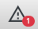

아이콘을 클릭하거나 영향을 받는 리소스의 상황에 맞는 메뉴를 사용하면 "경고" 메뉴로 이동하여 결함이 있는 리소스 목록을 보고 경고 유형별로 필터링할 수 있습니다. 카테고리뿐만 아니라 식별자와 간단한 설명(텍스트 입력을 통해)을 기준으로 필터링하는 옵션도 있습니다.

해당 리소스에 대한 기존 경고 목록을 보려면 표시된 리소스 중 하나를 선택하세요. 대부분의 경고에는 오류를 해결하는 데 사용할 수 있는 도구가 제공됩니다. 프로젝트 구성을 조정하여 많은 경고를 해결할 수도 있습니다. 어떤 경우에도 "프로젝트" ➝ "백업 생성..." 메뉴를 통해 프로젝트의 **백업**을 미리 생성하시기 바랍니다. 개별 경고 유형의 원인과 가능한 해결 방법에 대한 자세한 내용은 아래에서 확인할 수 있습니다.

## 경고 유형
### 갈등
서로 충돌하는 여러 버전의 리소스가 있습니다.

#### 가능한 원인
* 리소스가 기존 동기화 연결을 사용하여 동시에 다른 컴퓨터에서 편집되었습니다.
* 기존 동기화 연결 없이 다른 컴퓨터에서 리소스가 편집되었습니다. 그런 다음 데이터는 나중에 동기화되었습니다.

#### 가능한 해결책
* *충돌 해결* 버튼: 리소스 편집기에서 충돌을 해결합니다(*동기화* 장의 *충돌* 섹션 참조).

### 구성되지 않은 카테고리
프로젝트 구성에서 찾을 수 없는 리소스에 대한 카테고리가 설정됩니다. 따라서 리소스가 표시되지 않습니다.

#### 가능한 원인
* 카테고리가 구성 편집기에서 삭제되었습니다.

#### 가능한 해결책
* 버튼 *새 카테고리 선택*: 프로젝트에 구성된 카테고리 중 하나를 선택합니다. 그러면 영향을 받는 리소스에 대해 선택한 범주가 설정됩니다. 선택적으로 구성되지 않은 동일한 범주가 지정된 모든 리소스에 대해 새 범주를 설정할 수 있습니다.
* *리소스 삭제* 버튼: 영향을 받은 리소스가 완전히 삭제됩니다.
* 구성 편집기에서 동일한 이름의 카테고리를 추가하십시오.

### 구성되지 않은 필드
프로젝트 구성에서 찾을 수 없는 필드에 데이터가 입력되었습니다. 따라서 입력된 데이터는 표시되지 않습니다.

#### 가능한 원인
* 해당 필드가 구성 편집기에서 삭제되었습니다.

#### 가능한 해결책
* 버튼 *새 필드 선택*: 리소스 카테고리에 대해 구성된 필드 중 하나를 선택합니다. 그러면 입력된 데이터가 이 필드로 이동됩니다. 대상 필드의 기존 데이터를 덮어쓰게 된다는 점에 유의하세요. 선택적으로 구성되지 않은 동일한 필드에 데이터가 입력된 모든 자원에 대해 새 필드를 설정할 수 있습니다.
* *필드 데이터 삭제* 버튼: 필드에 입력된 데이터가 완전히 삭제됩니다. 선택적으로 구성되지 않은 동일한 필드에 데이터가 입력된 모든 자원에 대한 필드 데이터를 삭제할 수 있습니다.
* 구성 편집기에서 영향을 받는 리소스의 범주에 대해 동일한 이름을 가진 필드를 추가합니다.

### 잘못된 필드 데이터
필드에 입력한 데이터가 해당 필드에 대해 선택한 입력 유형과 일치하지 않습니다.

#### 가능한 원인
* 필드의 입력 유형이 구성 편집기에서 변경되었습니다.

#### 가능한 해결책
* *편집* 버튼: 리소스 편집기에서 리소스를 열어 잘못된 필드 데이터를 제거하고 필요한 경우 다시 입력합니다.
* *필드 데이터 변환* 버튼: 데이터가 해당 입력 유형에 맞는 형식으로 자동 변환됩니다. 선택적으로 동일한 필드에 유효하지 않은 데이터가 입력된 모든 자원에 대해 데이터를 변환할 수 있습니다. 모든 경우에 자동 변환이 가능하지는 않으므로 이 버튼을 항상 사용할 수 있는 것은 아닙니다.
* 버튼 *새 필드 선택*: 리소스 카테고리에 대해 구성된 필드 중 하나를 선택합니다. 그러면 입력된 데이터가 이 필드로 이동됩니다. 대상 필드의 기존 데이터를 덮어쓰게 된다는 점에 유의하세요. 선택적으로 동일한 필드에 유효하지 않은 데이터가 입력된 모든 자원에 대해 새 필드를 설정할 수 있습니다(유효한 데이터는 원래 필드에 남아 있음).

### 필수 필드가 누락되었습니다.
필수로 구성된 필드에 데이터가 입력되지 않았습니다.

#### 가능한 원인
* 해당 필드는 리소스 생성 후 구성 편집기에서 필수로 구성되었습니다.

#### 가능한 해결책
* *편집* 버튼: 리소스 편집기에서 리소스를 열어 필수 필드를 채웁니다.

### 필드의 충족되지 않은 표시 조건
해당 필드를 표시하기 위한 조건이 충족되지 않았지만 필드에 데이터가 입력되었습니다.

#### 가능한 원인
* 해당 필드에 데이터가 이미 입력된 후 구성 편집기에서 표시 조건이 설정되거나 변경되었습니다.

#### 가능한 해결책
* *편집* 버튼: 리소스 편집기에서 리소스를 열어 조건이 충족되도록 조건 필드의 데이터를 조정합니다.
* *필드 데이터 삭제* 버튼: 필드에 입력된 데이터가 완전히 삭제됩니다.
* 구성 편집기에서 필드의 표시 조건을 제거하거나 영향을 받는 리소스에 대해 조건이 충족되도록 조정하십시오.

### 값 목록에 포함되지 않은 값
필드에 대해 구성된 값 목록에 포함되지 않은 필드에 하나 이상의 값이 입력되었습니다.

#### 가능한 원인
* 필드의 값 목록이 구성 편집기에서 다른 값 목록으로 대체되었습니다.
* 값 목록 편집기의 프로젝트별 값 목록에서 값이 제거되었습니다.
* 필드의 입력 유형이 구성 편집기에서 텍스트를 자유롭게 입력할 수 있는 입력 유형에서 값 목록이 있는 입력 유형으로 변경되었습니다.
* 프로젝트 속성의 *직원* 및 *캠페인* 필드에 입력된 값을 사용하는 필드의 경우: 프로젝트 속성의 해당 필드에서 항목이 제거되었습니다.
* *Campaign* 필드의 경우: 상위 리소스에 있는 동일한 이름의 필드에서 값이 제거되었습니다(상위 리소스에 설정된 값만 *Campaign* 필드에 대해 선택할 수 있음).

#### 가능한 해결책
* *편집* 버튼: 리소스 편집기에서 리소스를 열어 값 목록에 포함되지 않은 값을 제거하고 필요한 경우 다른 값으로 바꿉니다.
* 버튼 *값 수정*: 필드에 구성된 값 목록에서 새 값을 선택합니다. 이전 값이 선택한 값으로 대체됩니다. 선택적으로 동일한 값이 입력되고 동일한 값 목록을 사용하는 모든 자원의 모든 필드에 대해 새 값을 설정할 수 있습니다.
* *값 삭제* 버튼: 해당 필드에 입력된 값이 완전히 삭제됩니다. 선택적으로 동일한 값이 입력된 모든 자원의 모든 필드에서 값을 삭제할 수 있습니다.
* 구성 편집기의 값 목록을 해당 값이 포함된 값 목록으로 바꿉니다.
* 필드에 대해 구성된 값 목록에 누락된 값을 추가합니다. 프로젝트별 값 목록이 아닌 경우 먼저 *값 목록 확장* 옵션을 사용하여 값 목록에 대한 확장 목록을 생성해야 합니다(*프로젝트 구성* 장의 *값 목록 생성 및 확장* 섹션 참조).
* 프로젝트 속성의 *직원* 및 *캠페인* 필드에 입력된 값을 기반으로 하는 필드의 경우: 프로젝트 속성의 해당 필드에 누락된 값을 추가합니다.
* *Campaign* 필드의 경우: 상위 리소스에 값이 아직 없으면 해당 값을 설정합니다.

### 관계의 대상 리소스가 누락되었습니다.
관계의 대상으로 지정된 리소스를 찾을 수 없습니다.

#### 가능한 원인
* 동기화 프로세스가 완전히 완료되지 않았습니다.

#### 가능한 해결책
* Field 프로젝트로 작업하는 모든 팀 구성원의 데이터가 동기화되었는지 확인하세요.
* *관계 정리* 버튼: 존재하지 않는 리소스에 대한 모든 참조가 관계에서 삭제됩니다.

### 관계의 잘못된 대상 리소스
관계의 대상으로 지정된 자원의 카테고리는 이 관계의 유효한 대상 카테고리가 아닙니다.

#### 가능한 원인
* 관계의 허용된 대상 카테고리 목록이 구성 편집기에서 편집되었습니다.
* 자원 카테고리가 변경되었습니다.

#### 가능한 해결책
* *편집* 버튼: 리소스 편집기에서 리소스를 열어 관계에서 잘못된 대상 리소스에 대한 참조를 제거합니다.
* *관계 정리* 버튼: 잘못된 대상 리소스에 대한 모든 참조가 관계에서 삭제됩니다.
* 구성 편집기에서 대상 리소스의 카테고리를 해당 관계의 유효한 대상 카테고리로 추가합니다.

### 누락되거나 잘못된 상위 리소스
리소스에 유효한 상위 리소스가 없습니다. 이는 리소스에 대해 상위 리소스가 설정되지 않았거나, 지정된 상위 리소스를 찾을 수 없거나, 해당 카테고리로 인해 유효한 상위 리소스가 아님을 의미할 수 있습니다. 따라서 리소스가 표시되지 않습니다.

#### 가능한 원인
* 동기화 프로세스가 완전히 완료되지 않았습니다.
* 리소스가 오래된 버전의 Field Desktop을 사용하여 생성되었습니다.

#### 가능한 해결책
* Field 프로젝트로 작업하는 모든 팀 구성원의 데이터가 동기화되었는지 확인하세요.
* *새 상위 리소스 설정* 버튼: 새 리소스를 상위 리소스로 선택합니다. 리소스가 선택한 리소스의 컨텍스트로 이동됩니다.
* *리소스 삭제* 버튼: 영향을 받은 리소스가 완전히 삭제됩니다.

### 식별자 접두어 누락
리소스 식별자에 해당 카테고리에 대해 구성된 접두사가 포함되어 있지 않습니다.

#### 가능한 원인
* 식별자 접두사가 구성되기 전에 리소스가 생성되었습니다.

#### 가능한 해결책
* *편집* 버튼: 리소스 편집기를 열어 식별자를 다시 입력하세요.

### 모호한 식별자
리소스의 식별자는 하나 이상의 다른 리소스에서도 사용됩니다. 따라서 데이터를 가져오고 내보낼 때 오류가 발생할 수 있습니다.

#### 가능한 원인
* 기존 동기화 연결 없이 다른 컴퓨터에 식별자가 입력되었습니다. 그런 다음 데이터는 나중에 동기화되었습니다.

#### 가능한 해결책
* *편집* 버튼: 리소스 편집기를 열어 새 식별자를 입력합니다.

### 모호한 QR 코드
리소스에 설정된 QR 코드는 하나 이상의 다른 리소스에서도 사용됩니다. 따라서 영향을 받는 리소스는 해당 QR 코드로 고유하게 식별될 수 없습니다.

#### 가능한 원인
* QR 코드는 기존 동기화 연결 없이 다른 컴퓨터의 다른 리소스에 연결되었습니다. 그런 다음 데이터는 나중에 동기화되었습니다.

#### 가능한 해결책
* *QR 코드 편집* 버튼: QR 코드 편집기를 열어 QR 코드를 삭제하고 필요한 경우 새 QR 코드를 연결하거나 생성합니다.

### 허용되지 않는 문자
해당 필드에 입력된 하나 이상의 문자는 해당 입력 유형의 필드에 허용되지 않습니다.

#### 가능한 원인
* 해당 필드는 오래된 버전의 Field Desktop으로 채워졌습니다.

#### 가능한 해결책
* *편집* 버튼: 리소스 편집기를 열어 필드에서 허용되지 않는 문자를 제거합니다.

### 허용되지 않는 도형 유형
리소스의 도형이 해당 카테고리에 허용되는 도형 유형과 일치하지 않습니다.

#### 가능한 원인
* 도형이 리소스에 추가된 후 해당 카테고리에 허용되는 도형 유형에서 도형 유형이 선택 취소되었습니다.

#### 가능한 해결책
* *편집* 버튼: 리소스 편집기를 열어 기하학을 조정하고 허용되는 기하학 유형을 선택합니다.
* 구성 편집기에서 해당 카테고리의 *기하학* 필드를 편집하고 리소스의 지오메트리 유형을 허용되는 지오메트리 유형으로 선택합니다.

### 리소스 한도를 초과했습니다.
특정 범주에 대해 구성된 리소스 제한이 허용하는 것보다 더 많은 리소스가 있습니다.

#### 가능한 원인
* 리소스 제한이 구성되기 전에 리소스가 생성되었습니다.
* 리소스는 기존 동기화 연결 없이 다른 컴퓨터에서 생성되었습니다. 그런 다음 데이터는 나중에 동기화되었습니다.

#### 가능한 해결책
* 리소스 제한에 도달할 때까지 해당 카테고리의 리소스를 삭제합니다.
* 구성 편집기에서 리소스 제한을 늘립니다.

### 잘못된 상태
프로세스 상태가 지정된 날짜와 모순됩니다. 예를 들어 "계획됨" 상태의 프로세스 날짜가 과거이거나 "완료됨" 상태의 프로세스 날짜가 미래인 경우가 이에 해당합니다.

#### 가능한 원인
* 프로세스가 시작, 완료 또는 취소된 후에도 상태가 업데이트되지 않았습니다.
* 지정된 날짜에 계획된 프로세스가 아직 수행되지 않았습니다.

#### 가능한 해결책
* *편집* 버튼: 리소스 편집기를 열어 프로세스 상태나 날짜를 조정합니다.

# API

Field Desktop은 HTTP를 통해 데이터에 액세스하고 가져오는 데 사용할 수 있는 REST API를 제공합니다. 애플리케이션이 열리면 다음 URL을 통해 API를 사용할 수 있습니다.

http://localhost:3000

각 API 엔드포인트에 접근할 때 "동기화" 아래의 "설정" 메뉴에서 "사용자 비밀번호"로 입력한 비밀번호는 *기본 인증*을 통해 제공되어야 합니다. 사용자 이름을 입력할 필요는 없습니다.

달리 지정하지 않는 한 데이터는 JSON 형식으로 반환되며 POST 요청의 요청 본문에서도 JSON으로 예상됩니다.

## 엔드포인트

### /정보 받기

이 API 끝점은 실행 중인 Field Desktop 인스턴스에 대한 일부 정보를 JSON 형식으로 반환합니다.

응답:
* *version (string)*: 실행 중인 애플리케이션의 버전
* *projects (string array)*: 현재 이 컴퓨터에 저장된 모든 프로젝트의 식별자
* *activeProject (string)*: 현재 애플리케이션에 열려 있는 프로젝트의 식별자
* *user(문자열)*: Field Desktop에 "사용자 이름"으로 입력된 이름

### GET /configuration/{프로젝트}

이 API 엔드포인트를 사용하여 JSON 형식으로 프로젝트 구성을 검색할 수 있습니다. "프로젝트 구성" ➝ "구성 내보내기..." 메뉴를 통해 생성할 수 있는 구성 파일에는 구성의 프로젝트별 부분만 포함되어 있지만, 이 API 엔드포인트는 필드 라이브러리(기본 양식, 값 목록 등)의 프로젝트에 사용된 모든 구성 요소를 포함한 전체 구성을 출력합니다.

API 엔드포인트의 JSON 출력은 "프로젝트 구성" ➝ "구성 가져오기..." 메뉴를 통해 **가져올 수 없습니다**. 이 목적에 적합한 구성 파일을 얻으려면 메뉴 옵션 "프로젝트 구성" ➝ "구성 내보내기..."를 사용하십시오.

매개변수:
* *project*: 구성을 검색할 프로젝트의 이름

### POST /import/{형식}

이 API 엔드포인트를 사용하여 현재 애플리케이션에 열려 있는 프로젝트로 데이터를 가져올 수 있습니다. 이 기능은 "도구" ➝ "가져오기" 메뉴를 통해 접근할 수 있는 가져오기 도구의 기능에 해당합니다. 옵션과 형식에 대한 자세한 설명은 "가져오기 및 내보내기" 장에서 확인할 수 있습니다.

가져올 데이터는 요청 본문에 포함되어야 합니다.

매개변수:
* *format*: 가져올 데이터의 형식입니다. 지원되는 형식: *csv*, *geojson*, *jsonl*

쿼리 매개변수:
* *병합(부울)*: 새 리소스를 생성하는 대신 기존 리소스를 업데이트합니다. 사용자 인터페이스의 "기존 리소스 업데이트" 옵션에 해당합니다. (기본값 : 거짓)
* *permitDeletions(부울)*: 가져오는 동안 필드가 제거되도록 허용합니다. 사용자 인터페이스의 "삭제 허용" 확인란에 해당합니다. (기본값 : 거짓)
* *ignoreUnconfiguredFields(부울)*: 구성되지 않은 필드가 발견되면 가져오기를 중단하지 않습니다. 사용자 인터페이스의 "구성되지 않은 필드 무시" 확인란에 해당합니다. (기본값 : 거짓)
* *category(문자열)*: 가져올 데이터가 속한 카테고리의 이름입니다. CSV 가져오기에만 필요합니다. 사용자 인터페이스의 드롭다운 필드 "범주"에 해당합니다. (기본값: "프로젝트")
* *작업(문자열)*: 가져온 리소스가 할당될 작업의 식별자입니다. 사용자 인터페이스의 "작업에 데이터 할당" 드롭다운 필드에 해당합니다. (기본값 : 설정하지 않음)
* *구분 기호(문자열)*: CSV 데이터에 사용되는 구분 기호입니다. CSV 가져오기에만 필요합니다. 사용자 인터페이스의 입력 필드 "필드 구분 기호"에 해당합니다. (기본값: ",")
* *command(문자열)*: 가져오기를 즉시 시작해야 하는지 또는 나중에 동일한 API 엔드포인트에 대한 다른 요청으로 시작할 수 있는 가져오기 프로세스를 위해 가져오기 데이터를 대기열에 넣어야 하는지 여부를 지정합니다. 가능한 값은 가져오기를 실행하는 "start"와 쿼리 매개변수 "importId"의 ID로 식별되는 가져오기 프로세스에 요청 본문의 데이터를 추가하는 "add"입니다. (기본값: "시작")
* *importId(문자열)*: 요청이 참조하는 가져오기 프로세스를 지정합니다. *command=add*를 사용하여 여러 요청에 걸쳐 CSV 데이터를 추가하는 경우에만 필요합니다.

### GET /내보내기/{형식}

이 API 끝점은 현재 애플리케이션에 열려 있는 프로젝트에서 데이터를 내보내는 데 사용할 수 있습니다. 이 기능은 "도구" ➝ "내보내기" 메뉴를 통해 접근할 수 있는 내보내기 도구의 기능에 해당합니다. 옵션과 형식에 대한 자세한 설명은 "가져오기 및 내보내기" 장에서 확인할 수 있습니다.

매개변수:
* *형식*: 데이터를 내보낼 형식입니다. 지원되는 형식: *csv*, *geojson*

쿼리 매개변수:
* *schemaOnly (boolean)*: CSV 테이블의 헤더만 출력합니다. CSV 내보내기에만 사용할 수 있습니다. (기본값 : 거짓)
* *context (string)*: 리소스를 내보낼 컨텍스트를 지정합니다. 가능한 값은 전체 프로젝트에 대한 "project" 또는 작업 식별자입니다. 사용자 인터페이스의 드롭다운 필드 "컨텍스트"에 해당합니다. (기본값: "프로젝트")
* *category (string)*: 데이터를 내보낼 카테고리의 이름입니다. CSV 내보내기에만 필요합니다. 사용자 인터페이스의 드롭다운 필드 "범주"에 해당합니다. (기본값: "프로젝트")
* *구분 기호(문자열)*: 내보낸 CSV 데이터에 사용할 구분 기호입니다. CSV 내보내기에만 필요합니다. 사용자 인터페이스의 입력 필드 "필드 구분 기호"에 해당합니다. (기본값: ",")
* *combineHierarchicalRelations (boolean)*: 계층 관계를 단순화된 관계 "isChildOf"로 결합합니다. CSV 내보내기에만 사용할 수 있습니다. 사용자 인터페이스의 "계층적 관계 결합" 확인란에 해당합니다. (기본값: 참)
* *formatted (boolean)*: 내보낸 데이터의 형식화된 출력에 대한 들여쓰기를 설정합니다. GeoJSON 내보내기에만 사용할 수 있습니다. (기본값: 참)

### POST /파일가져오기

이 API 엔드포인트는 JSON 형식으로 가져오기 요청을 전달하여 애플리케이션에 현재 열려 있는 프로젝트로 이미지 파일과 월드 파일을 가져오는 데 사용할 수 있습니다. 이 기능은 "도구" ➝ "이미지 관리" 메뉴를 통해 파일을 가져오는 것과 같습니다. 가져오기 프로세스에 대한 자세한 설명은 "이미지" 장에서 확인할 수 있습니다.

요청 본문:
* *filePaths (string array)*: 가져올 파일의 파일 경로
* *카테고리(문자열)*: 가져온 이미지에 설정할 카테고리 이름(기본값: "이미지")
* *readCreatorsFromMetadata(부울)*: 이미지 파일에서 메타데이터를 읽어 "Creator" 필드를 자동으로 채웁니다.
* *checkOriginalFilename (Boolean)*: 프로젝트에 동일한 식별자를 가진 이미지가 이미 포함되어 있으면 이미지 파일을 가져오지 않습니다. 이 옵션을 활성화하면 원본 파일 이름이 동일한 이미지가 이미 있는 경우에도 가져오기가 거부됩니다.

응답:
* *importedImages (integer)*: 성공적으로 가져온 이미지 파일 수
* *importedWorldFiles (정수)*: 성공적으로 가져온 월드 파일 수
* *messages*(문자열 배열): 가져오기 프로세스 중에 발생한 메시지

### GET /fileExport/:형식/:식별자

이 API 엔드포인트는 현재 애플리케이션에 열려 있는 프로젝트에서 이미지 파일과 월드 파일을 검색하는 데 사용할 수 있습니다.

매개변수:
* *형식*: 이미지 파일 자체를 내보내야 하는지 아니면 관련 지리 참조 정보를 내보내야 하는지 지정합니다. 가능한 값: *image*(이미지 파일 내보내기), *worldFile*(세계 파일 형식으로 지리참조 데이터 내보내기)
* *identifier*: 데이터를 검색할 이미지 리소스의 식별자

반환되는 데이터의 형식은 해당 파일 형식에 따라 다릅니다. 다음 MIME 유형 중 하나가 "Content-Type" 헤더에 설정되어 있습니다.
* *image/jpeg*: JPG 형식의 이미지
* *image/png*: PNG 형식의 이미지
* *image/tiff*: TIFF 형식의 이미지
* *text/plain*: 월드 파일
