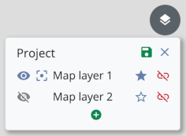
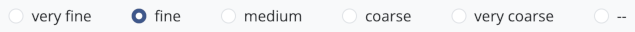
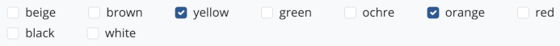
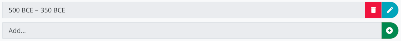

# İlk adımlar

Uygulamayı ilk başlattığınızda adınızı girmeniz istenecektir. Adınızı ve soyadınızı girmeniz önerilir. Girdiğiniz ad, yaptığınız tüm değişiklikler için veritabanında saklanır ve veri senkronizasyonu sırasında değişikliklerin kimin yaptığını belirterek proje veri kayıtlarında ortak çalışmayı kolaylaştırır. Daha sonra, gezinme çubuğunun sağ üst köşesindeki adınıza tıklayarak veya "Field" (MacOS) veya "Araçlar" (Windows) menüsü üzerinden erişebileceğiniz **Ayarlar** alt menüsü aracılığıyla kullanıcı adını değiştirebilirsiniz.

Başlangıçta, test projesi etkin olacak ve bir dizi örnek veri kullanarak uygulamanın işlevselliğini denemenize olanak tanıyacaktır. Lütfen test projesi seçili olduğu sürece, yeni oluşturulan tüm veri kümelerinin silineceğini ve uygulama yeniden başlatıldığında tüm değişikliklerin sıfırlanacağını unutmayın. Bu nedenle, test projesi için diğer Field Desktop projeleri veya veritabanlarıyla senkronizasyon gerçekleştirilmez.

Field Desktop ile üretken bir şekilde çalışabilmek ve kendi projenizi oluşturabilmek için öncelikle şu adımları izlemelisiniz:

1. "Proje" menüsünde, kendi projenizi oluşturmak için **Yeni...** menü öğesini seçin. Proje yapılandırması için çeşitli ön ayarlar arasından seçim yapabilirsiniz: Kapsamlı arazi araştırmalarına yönelik varsayılan konfigürasyon için "Standart"ı veya yalnızca ön ayar kategorileri ve alanlarından oluşan temel ayarlarla başlamak istiyorsanız "Temel" seçeneklerinden birini seçin. Ayrıca, proje içinde verilerin girileceği dilleri belirtin. Son olarak, istenen proje tanımlayıcısını ve isteğe bağlı olarak seçilen dillerin her biri için bir proje adı girin.

2. Yeni proje yüklenir yüklenmez, "Proje" ➝ "Özellikler" menüsü üzerinden temel proje verilerini girebilirsiniz. Öncelikle, **personel üyelerinin** listelerini oluşturmalısınız.
"Proje" bölümünde "Ekip"i ve **sezonları** ("Proje" bölümünün "Sezonlar" alanı) detaylandırabilirsiniz.
Bu listeleri istediğiniz zaman değiştirebilirsiniz.

"Proje" menüsü üzerinden erişilebilen **Yedek oluştur...** menü seçeneğini kullanarak yedekleme dosyalarını oluşturun.
Projenizin verilerini düzenli olarak güncelleyin.

# Girdiler (Ç.N. Yabancı dildeki 'Resource' ifadesi 'Girdi' olarak verilmiştir)

Bir proje oluşturduktan veya mevcut bir projeyi açtıktan sonra, **Genel Bakış** sekmesinden başlayabilirsiniz 
(Projenin tüm operasyonlarının ve yerlerinin yönetildiği yer (ev sembolü).

Yeni bir işlem oluşturmak için girdiler listesinin altındaki yeşil artı butonu kullanın.

Yeni girdi için, öncelikle işlemin kategorisini seçersiniz, ardından isteğe bağlı olarak bir geometri oluşturabilirsiniz. 
Daha sonra işlemin tüm verilerinin doldurulabildiği editör açılacaktır.
Seçilen işlem kategorisine bağlı olarak, gruplar halinde düzenlenmiş farklı alanlar mevcuttur.
Sol taraftaki butonlara tıklayarak alan grupları arasında geçiş yapabilirsiniz.

Girdiyi yeşil kaydet butonuyla kaydetmeden önce, en azından **tanımlayıcı** alanının
temel bilgiler bölümünün doldurulması gerekmektedir.

Yeni işlem artık kaynak listesinde görüntüleniyor. Yeni bir sekmede açmak için "İşleme geç" butonunu kullanın 
(Yukarı sağa ok işareti).

İşlemin kategorisine bağlı olarak, bir girdi sekmesi içinde artı butonu ile farklı kategorilerde (örneğin bir açmadaki stratigrafik birimler veya bir yapının odaları)
gibi alt girdiler oluşturulabilir.

## Hiyerarşik sıralama

Girdiler örneğin buluntuları bir stratigrafik birime atamak için, hiyerarşik yapılar halinde düzenlenebilir. 
Alt hiyerarşi seviyesine geçmek için "Alt girdileri göster" (aşağı sağa köşeli ok) butonunu kullanın. Alt kaynaklar artık görüntülenecek ve artı butonuyla yeni oluşturulan girdiler (örneğin, bir stratigrafik birimin buluntuları) buna göre bu hiyerarşi seviyesinde görünecektir.

Girdiler listesinin üstündeki gezinme yolu, şu anda seçili olan hiyerarşi düzeyini gösterir. Her zaman
Gezinme yolundaki butonlardan birine tıklayarak bir sonraki seviyeye geçebilirsiniz.

## Girdilerin yönetilmesi

Listedeki girdiler tıklanarak seçilebilir. Ctrl/Cmd veya Shift tuşuna basılı tutarak birden fazla girdi
aynı anda seçilebilir. Listedeki bir veya daha fazla seçili girdiye sağ tıklayarak aşağıdaki seçenekleri içeren
bir kontekst menüsü açılır:

* *Uyarıları göster*: Bu girdi için mevcut uyarıları görüntüler (sadece uyarı içeren girdiler için geçerlidir, *Uyarılar* bölümüne bakın)
* *Düzenle*: Düzenleyiciyi açar (ayrıca listedeki girdiye çift tıklanarak da kullanılabilir)
* *Görselleri bağla*: Görsellerin seçili girdiye bağlanabileceği veya bağlı görsellerin kaldırılabileceği bir pencere açar
* *QR kodu ekle*: Girdi için yeni bir QR kodunun oluşturulabileceği veya mevcut bir QR kodunun kamera taraması yoluyla bağlanabileceği bir pencere açar
* *QR kodunu yönet*: Girdinin QR kodunu görüntüler ve bir QR kodu etiketi yazdırmaya olanak tanır (alternatif olarak kaynağın liste öğesinin sağ tarafındaki QR kodu düğmesinden de erişilebilir)
* *Taşı*: Girdilerin geçerli kontekstlerinden kaldırılmasına ve başka bir üst girdiye atanmasını sağlar
* *Sil*: Bir güvenlik kontrolünden sonra girdileri kaldırır (isteğe bağlı olarak, yalnızca silmek istediğiniz girdilere bağlı
tüm görselleri de silebilirsiniz)
* *Depolama yerini tara*: Kamera taramasıyla depolama yerinin QR kodunu tarayarak kaynak için yeni bir depolama yeri ayarlar (yalnızca "Bul", "Koleksiyonu bul" ve "Örnek" kategorilerinin girdileri ile ilgili alt kategoriler için kullanılabilir)

Ayrıca, kontekst menüsü geometrileri oluşturma ve düzenleme seçenekleri içerir. Lütfen şunu unutmayın:
birden fazla girdi seçildiğinde, yalnızca *Taşı* ve *Sil* seçenekleri kullanılabilir. QR kodlarını ekleme veya yönetme seçenekleri yalnızca konfigürasyon düzenleyicisinde karşılık gelen kategori için QR kodlarının kullanımı ayarlanmışsa kullanılabilir (bkz. *Konfigürasyon* bölümündeki *Kategorileri düzenle* bölümü).

# Görüntüler

Görüntüler daha sonra girdilere bağlanmak veya harita katmanları olarak kullanılmak üzere bir Field projesine aktarılabilir. Her içe aktarılan görüntü için, görüntünün meta verilerinin girilebileceği bir görüntü kaydı otomatik olarak oluşturulur.

Görüntü dosyaları isteğe bağlı olarak bir senkronizasyon bağlantısı aracılığıyla diğer bilgisayarlarla paylaşılabilir (bkz. *Senkronizasyon* bölümü). Bilgisayarda bir görüntü dosyası yoksa, bunun yerine bir yer tutucu grafik görüntülenir.

## Görüntüleri içe aktarma

Görüntüler uygulamaya iki farklı şekilde aktarılabilir: "Araçlar" ➝ "Görüntü yönetimi" menüsü ve bir girdinin kontekst menüsündeki "Görüntüleri bağla" seçeneği (istenen girdiye sağ tıklanarak erişilebilir). İkinci durumda, görüntü içe aktarma işleminden sonra otomatik olarak ilgili girdiye bağlanacaktır (bkz. *Görüntüleri girdilere bağla* bölümü).

İçe aktarmayı başlatmak için artı düğmesine tıklayın ve projeye eklemek istediğiniz dosyaları seçin. Alternatif olarak, dosyaları doğrudan bir dosya yöneticisi uygulamasından artı düğmesini çevreleyen alana sürükleyip bırakabilirsiniz. Proje için birden fazla görsel kategorisi (yani "Görüntü" kategorisinin alt kategorileri) tanımlanmışsa, açılır menüden istediğiniz kategoriyi seçebilirsiniz. Ayrıca, "Oluşturucu" alanının içeriğinin resim dosyası meta verilerinden otomatik olarak okunmasını veya manuel olarak ayarlanmasını seçebilirsiniz. Proje özelliklerinde bulunan, "Ekip" alanına girilen kişi isimleri seçim için kullanılabilir. Her iki durumda da, resmin oluşturulma tarihi, yüksekliği ve genişliği dosya meta verilerinden otomatik olarak okunur.
Desteklenen görsel formatları *jpg/jpeg*, *png* ve *tif/tiff*'tir.

## Görüntü varyasyonları

Her içe aktarılan görüntü için uygulama bir kopya ve önizleme görüntüsü olarak daha küçük bir varyasyonunu oluşturur ve bunu **Görüntüler dizinine** kaydeder; bu dosya yolunu "Gelişmiş ayarlar"daki ayarlarda görebilirsiniz. Bu klasördeki dosyalar uygulama tarafından yönetildiği için manuel olarak düzenlenmemeli, yeniden adlandırılmamalı veya silinmemelidir. Aksi takdirde görüntüleri ön izlemede veya senkronize ederken hatalar oluşabilir.

Uygulama her görüntü için toplamda üç farklı varyasyonu yönetir:
* *Esas görüntü*: Projeye aktarıldığı haliyle değiştirilmemiş görüntü dosyası
* *Küçük resim görüntüsü*: Uygulamada (örneğin, görüntü yönetiminde veya bağlantılı görüntülere sahip girdiler için) ön izleme görüntüsü olarak görüntülenen görselin otomatik olarak oluşturulmuş düşük çözünürlüklü bir çeşidi 
* *Görüntüleme için optimize edilmiş görüntü*: Belirli görüntüler için uygulamada görüntülenmek üzere başka bir varyasyon oluşturulur. TIFF formatındaki dosyalar JPEG'e dönüştürülür ve çok yüksek çözünürlüklü görüntülerin boyutu küçültülür. Bu adım, proje yüklenirken gerçekleşir ve mevcut görüntü dosyalarının miktarına bağlı olarak yükleme süresinin birkaç dakika uzamasına yol açabilir.

Görüntü dizininde bulunan verilerin genel görünümünü "Proje" ➝ "Verilere genel bakış" menüsünden açabilirsiniz.

## Görüntü yönetimi

Görüntüleri yönetmek için "Araçlar" ➝ "Görüntü yönetimi" menüsünü açın. Burada projedeki tüm görselleri görüntüleyebilir ve arayabilirsiniz (ayrıca *Arama* bölümüne bakın).

### Meta verileri düzenle

İstediğiniz görüntüye çift tıklayarak görüntü ön izlemesini açarak bir görüntünün meta verilerini görüntüleyebilirsiniz. Düzenleyiciyi açmak ve meta verileri eklemek veya değiştirmek için düzenle düğmesine tıklayın. Burada, görüntü kategorisine karşılık gelen bilgiler için konfigürasyon düzenleyicisinde yapılandırılan alanlar mevcuttur.

### Görüntüleri sil

Projeden içe aktarılan görüntüleri kaldırmak için, görüntü yönetiminde karşılık gelen görüntüleri seçin. Daha sonra "Sil" düğmesiyle kaldırılabilirler:

Lütfen bunun aynı zamanda projenin görüntüler dizinindeki (ve bir senkronizasyon bağlantısı kurulmuşsa diğer bilgisayarlardaki) ilgili dosyaları da sileceğini unutmayın. Bir görüntü silindiğinde girdilerle bağlantıları kaybolacaktır.

## Görselleri girdilere bağlayın

Bir veya daha fazla görüntüyü bir girdiye bağlamak için, ilgili girdinin kontekst menüsünde "Görselleri bağla" seçeneğini seçin ve artı düğmesine tıklayın. Artık iki seçenek arasında seçim yapabilirsiniz:

* *Yeni görseller ekle*: Yeni görseller projeye aktarılacak ve girdiye bağlanacak.
* *Mevcut görselleri bağla*: Projede halihazırda mevcut olan görsellerden bir veya daha fazlasını seçerek girdiye bağla.

Listedeki görüntüleri seçin ve görüntüleri girdiden ayırmak için "Bağlantıyı kaldır" seçeneğini seçin. Görüntülerin kendisi projede kalır.

Bağlantılar ayrıca görüntü yönetimi aracılığıyla eklenebilir veya kaldırılabilir. Bunu yapmak için, istediğiniz görüntüleri seçin ve üst çubuktaki "Bağla" (mavi düğme) veya "Bağlantıları kaldır" (kırmızı düğme) düğmesine tıklayın:

### Ana görüntü ayarla

Bir girdi birden fazla görüntüye bağlıysa, görüntülerden biri **ana görüntü** olarak bir yıldız simgesiyle işaretlenir. Bu ana görüntü, girdi için bir önizleme görseli olarak görüntülenir. Girdinin kontekst menüsünde "Görüntüleri bağla" seçeneğini belirleyerek ve bağlı görüntüler listesinde istediğiniz görüntüyü seçerek ana görüntüyü değiştirebilirsiniz. Ardından "Ana görüntü olarak ayarla" düğmesine tıklayın:

## Harita katmanları

### Coğrafi referanslama

Bir görüntü harita katmanı olarak kullanılmadan önce, öncelikle coğrafi referans bilgisi sağlanmalıdır. Desteklenen biçimler; *tif/tiff* dosya uzantılı GeoTIFF dosyaları ve *wld*, *jpgw*, *jpegw*, *jgw*, *pngw*, *pgw*, *tifw*, *tiffw* ve *tfw* uzantılı 'world' dosyalarıdır.

Görüntü dosyası GeoTIFF biçimindeyse başka bir işlem yapılmasına gerek yoktur. Görüntü içe aktarıldığında coğrafi referanslama bilgileri otomatik olarak uygulanır.

World dosyaları iki farklı şekilde içe aktarılabilir: Uzantıdan önceki dosya adı, karşılık gelen görüntü dosyasının adıyla aynıysa, dosya görüntü içe aktarma (artı düğmesi) yoluyla eklenebilir. Görüntüye atama otomatik olarak gerçekleşir. Alternatif olarak, bir world dosyası görüntü yönetiminde karşılık gelen görüntüye çift tıklayarak ulaşabileceğiniz ön izleme menüsü ile içe aktarılabilir. "Coğrafi referans verileri" bölümünü açın ve istediğiniz dosyayı seçmek için "World dosyasını yükle" düğmesine tıklayın.

### Harita katmanlarını düzenle

Bir harita katmanı belirli bir işlem veya tüm proje için ayarlanabilir. Harita katmanının tüm projede kullanılabilir olmasını istiyorsanız genel bakış sekmesine (ev simgesi) veya istediğiniz işlemin sekmesine geçin. Orada, haritanın sağ üst köşesindeki düğme aracılığıyla harita katmanı menüsünü açın ve düzenle düğmesine tıklayın. Artık artı düğmesi aracılığıyla yeni harita katmanları ekleyebilirsiniz. Coğrafi referans verisi eklenmiş tüm görüntüler kullanılabilir.

Harita katmanlarının sırasını, sürükle ve bırak yoluyla listede yukarı veya aşağı taşıyarak değiştirin. Bu sıralama, haritada birden fazla (coğrafi olarak) üst üste gelen görüntünün hangisinin üstte görüntüleneceğini belirler: Listede daha yukarıda olan bir katman, haritada daha aşağıda olan bir katmanın üstünde görüntülenir ve onu tamamen veya kısmen gizleyebilir.

Her liste girişinin sağında bulunan mavi renkli "Varsayılan harita katmanı olarak ayarla" (yıldız simgesi) butonu, proje ilk açıldığında haritada varsayılan olarak görüntülenmesi gereken bir veya daha fazla görselin seçilmesine olanak tanır.

Kırmızı "Harita katmanını kaldır" butonuna tıklayarak listeden bir katmanı kaldırabilirsiniz. Görüntünün kendisi projeden silinmeyecek ve tekrar harita katmanı olarak eklenebilecektir.

Değişiklikleri veri tabanına kaydetmek için "Kaydet" butonuna tıklayın.

### Harita katmanlarını görüntüle

Ayarlanan harita katmanları, harita katmanı menüsü üzerinden her an gösterilebilir veya gizlenebilir. Bunu yapmak için listedeki ilgili katmanın solundaki göz düğmesine tıklayın. Burada yapılan ayarlar (sekme için kullanılabilen harita katmanları listesinin aksine) veritabanına kaydedilmez ve bu nedenle bir senkronizasyon bağlantısı üzerinden paylaşılmaz. Böylece farklı harita katmanları farklı bilgisayarlarda gösterilebilir ve gizlenebilir.

# Arama

**Genel Bakış**'ta, **İşlem sekmelerinde** ve **Görüntü Yönetimi**'nde bir **Arama Filtresi** mevcuttur. Bunu, halihazırda görüntülenen kayıtları ayırt etmek için kullanabilirsiniz:
Bazı temel arama kriterlerinin (tanımlayıcı, kısa açıklama, kategori) araçları.

Daha karmaşık arama sorguları işletmek istiyorsanız **Genel Bakış** veya **İşlem sekmelerinden** birindeyken **gelişmiş arama moduna** geçebilirsiniz.
Bu mod, hiyerarşik sıralamaları atlayarak 
aramayı detaylandırmanıza, tüm projede arama yapmanıza 
ve ek alan özel arama ölçütleri tanımlamanıza olanak tanır.

## Arama filtresi

Arama filtresi, belirli ölçütlere göre girdileri göstermenin veya gizlemenin hızlı bir yoludur. Şunlardan oluşur:
*metin filtresi* (bir arama kutucuğu) ve bir *kategori filtresi* (mavi buton).

Bir arama terimi girdikten ve/veya bir kategori seçtikten sonra, yalnızca bu filtre kriterlerine uyan kayıtlar gösterilir. 
**Genel bakış** ve **işlem sekmelerinde**, bu durum sol kenar çubuğundaki tüm girdiler 
ile sırasıyla haritadaki (harita görünümünde) tüm girdileri ve listenin öğelerini (liste görünümünde) etkiler. 
**Görüntü yönetiminde**, ızgarada gösterilen tüm görüntüler arama filtresinden etkilenir.

### Kategori filtresi

Kategori filtre düğmesi bir girdi kategorisi seçmenize olanak tanır. Üst ve alt kategoriler bulunmaktadır: Bir alt kategori seçerseniz (örneğin "Tabaka"),
yalnızca ilgili kategorinin girdileri gösterilir. 
Buna karşılık, bir üst kategori seçerseniz (örneğin "Stratigrafik birim"), 
seçili kategorinin girdileri ve tüm alt kategorileri (örneğin "Katman", "Mezar", "Mimarlık", "Zemin" vb.) dahil edilir.
Yalnızca üst kategoriyi seçmek için tekrar tıklayın.

Mevcut kontekst hangi kategorilerin kullanılabileceğini belirler: Genel bakışta işlem kategorilerini, 
görüntü yönetiminde görüntü kategorilerini vb. düzenleyebilirsiniz.

### Metin filtresi

Arama terimleri mevcut "Tanımlayıcı" ve "Kısa açıklama" girdi alanlarıyla karşılaştırılır.
 
*Örnek:*
 
Genel görünümde aşağıdaki üç açma gösterilmektedir:

    (1)
    Tanımlayıcı: "T01"
    Kısa açıklama: "Açma-01"
    
    (2)
    Tanımlayıcı:  "T02"
    Kısa açıklama: "Açma-02"
    
    (3)
    Tanımlayıcı:  "mt1"
    Kısa açıklama: "Benim Açmam 1" 

**Uygun arama terimleri** tanımlayıcıların ve kısa açıklamaların metin dizeleridir ve her biri boşluk karakterleri veya tirelerle ayrılmıştır, 
örnekte olduğu gibi: "T01", "T02", "mt1", "Açma", "01", "02", "Benim", "1".

Bu nedenle, sonuçlarda "t01" terimi için yapılan bir arama (1) girdisini verir ve "benim" için yapılan bir arama (3) değerini verir.
**Büyük-küçük harf kullanımı** göz ardı edilir.
  
Yapılan arama, her durumda arama teriminin başlangıcının kontrol edildiği bir çeşit **(başlangıç terimi) aramasıdır**: 
(1) ve (2) tanımlayıcıları "t0" metin dizesiyle başladığından, "t0" terimi için yapılan bir arama (1) ve (2) sonuçlarını döndürür. 
"aç" için yapılan bir arama (1), (2) ve (3) sonuçlarını döndürürken, 
"çm" veya "çma" için yapılan bir arama hiçbir şey döndürmez.

### Yer tutucu arama

Metin filtresi alanına metin girerken, yer tutucular kullanılabilir: 
Tek bir karakter yerine, köşeli parantez içinde izin verilen farklı karakterler kümesi belirtebilirsiniz. 
Böyle bir yer tutucu, arama sorgusu başına bir kez kullanılabilir.

*Örnek:*

    (1) Tanımlayıcı: "Arazi-0001"
    (2) Tanımlayıcı: "Arazi-0009"
    (3) Tanımlayıcı: "Arazi-0010"
    (4) Tanımlayıcı: "Arazi-0011"
    (5) Tanımlayıcı: "Arazi-0022"

"Arazi-00[01]" için yapılan bir arama (1), (2), (3), (4) döndürür çünkü 0 ve 1 üçüncü basamak için 
izin verilen karakterler olarak tanımlanmıştır. Başlangıç terimi araması nedeniyle tüm takip eden karakterlere izin verilir.

"Arazi-00[01]1" araması (1) ve (4) değerlerini döndürür, çünkü yer tutucudan sonraki rakam 1 olmalıdır.

### Diğer kontekstlerden gelen arama sonuçları

Mevcut bağlamda hiçbir arama sonucu bulunamazsa, metin giriş alanının altında diğer kontekstlerden 
gelen arama sonuçları gösterilir.

Girdilerden birine tıklayarak hemen ilgili bağlama geçebilir 
ve girdiyi seçebilirsiniz.

## Detaylı arama modu

**Genel bakış** ve **İşlem sekmelerinde** genişletilmiş arama moduna geçmek için
büyüteç butonuna tıklayın.
 

Detaylı arama modu, daha büyük miktardaki veriler üzerinde arama yapmanıza olanak tanır:

* **Genel Bakış** kısmında, arama projenin tüm girdileri üzerinden gerçekleştirilir.
* **İşlem sekmelerinde**, işlemin tüm girdileri üzerinde arama yapılır.

Her iki durumda da bulunan tüm girdiler sol taraftaki listede gösterilir. "Kontekstte göster" 
(Yukarı ok işareti) ve sırasıyla "Bir işlemin kontekstinde göster" (Sağ yukarı ok işareti) butonları 
bir kaydın hiyerarşik kontekstine geçmenizi sağlar; bunu yaparken genişletilmiş arama modu sonlandırılır ve 
gerekirse yeni bir sekme açılır.

Detaylı arama modundayken, devre dışı bırakılmış oluştur düğmesiyle girdi oluşturmak mümkün değildir. 
Yeni girdiler oluşturmak için lütfen detaylı arama modundan çıkın.

Performans nedenleriyle aynı anda gösterilen arama sonuçlarının sayısı maksimum **200** ile sınırlandırılmıştır. 
Diğer kaynaklar uygulama tarafından görüntülenmez ve bunun yerine maksimumun aşıldığına dair bir bildirim gösterilir. 
Bu girdilere erişmek için daha fazla arama kriteri ekleyin 
veya genişletilmiş arama modundan çıkın.

### Alana özgü arama kriterleri
 
Detaylı arama modu etkinleştirilirse, kategori filtresi düğmesinin solundaki artı düğmesine tıklayarak
bir girdinin belirli alanlarında arama başlatabilirsiniz. 
Arama için kullanılabilir alanlar, seçili kategoriye karşılık gelen alanlardır. 
Birden fazla arama kriterini birleştirmek için istediğiniz kadar alan seçebilirsiniz. 
Elbette, alan belirli arama kriterini metin filtresiyle birlikte de kullanabilirsiniz. 

Metin alanı olması durumunda, doğrudan arama terimini girmeniz yeterlidir.
Değer listeleri olan alanlar için, açılır menüdeki tüm izin verilen değerlerin listesinden terimi seçin.

**Önemli:** Arama filtresinin aksine, bu durumda başlangıç terimi araması yapılmaz. 
Girdinin arama sonuçları listesinde görünmesi için seçilen arama teriminin 
kaynak alanının içeriğiyle tam olarak eşleşmesi gerekir.

Belirli bir arama terimi belirtmek yerine, alanın ayarlandığı 
("Herhangi bir değer" seçeneği) veya ayarlanmadığı ("Değer yok" seçeneği) ile tüm kaynaklarda da arama yapabilirsiniz.

Kategori filtresi düğmesinin yanında görünen sayı, etkin arama kriteri sayısını gösterir.
Numaraya tıklayarak arama kriterini kaldırabilirsiniz. 
Bu işlem, menüyü tekrar açar ve kaldırılacak arama kriterini seçebilirsiniz.

# Senkronizasyon

Veriler farklı bilgisayarlardaki birden fazla Field Desktop kurulumu arasında, tek bir proje üzerinde ortak çalışabilmek için senkronize edilebilir. Bu, başka bir makinede çalışan bir Field Desktop uygulamasından gelen değişikliklerin (yeni girdiler, silinen girdiler, mevcut girdilerin düzenlenmesi, eklenen veya silinen resimler...) otomatik olarak yerel veritabanına aktarılacağını veya kaldırılacağı anlamına gelir. Bu, tüm kullanıcıların projenin en son kayıtlı haliyle aynı anda çalışmasını sağlar. Senkronizasyon hem internet üzerinden hem de yerel ağ üzerinden çalışır. Çevrimdışıyken bir proje üzerinde çalışmaya devam edebilirsiniz - bu durumda veritabanları ağ bağlantısı tekrar kurulduğunda senkronize edilecektir.

## Projeyi indir

Başka bir Field Desktop kurulumunda veya bir Field sunucusunda bulunan mevcut bir projeyle çalışmak için önce proje indirilmelidir. Bunu yapmak için "Proje" ➝ "İndir..." menü öğesini seçin ve erişim bilgilerini girin:

* *Adres*: Projeyi indirmek istediğiniz bilgisayarın adresini girin. Bu, Field Desktop'ın şu anda açık olduğu başka bir bilgisayarın ağ adresi olabilir (bu adres ayarlar bölümünde *Adresiniz* kısmında görülebilir). İnternet veya yerel ağ üzerinden erişilebilen bir Field sunucusunun adresi olabilir (örneğin DAI sunucusu için *https://server.field.idai.world*).
* *Proje adı*: İndirmek istediğiniz projenin adı.
* *Şifre*: Projeyi indirmek istediğiniz projenin veya Field Desktop kurulumunun şifresi.
* *Ön izleme görüntülerini indir*: Bu seçenek varsayılan olarak etkindir. Zayıf bir internet bağlantınız varsa ve mümkün olduğunca az veri indirmek istiyorsanız, bunu devre dışı bırakmak isteyebilirsiniz.
* *Esas görüntüleri indir*: Görüntüleri orijinal görüntü çözünürlüklerinde indirmek istiyorsanız bu seçeneği etkinleştirin. Projede yönetilen görüntü sayısına ve boyutuna bağlı olarak, birkaç gigabayt verinin indirilmesi gerekebilir. Bu seçeneği etkinleştirmeden önce yeterli bir internet bağlantınız ve sabit disk alanınız olduğundan emin olun.
* *Aynı tanımlayıcıda mevcut projenin üzerine yaz*: Bu seçenek etkinleştirilirse, bilgisayarda aynı adlı bir proje zaten mevcut olsa bile proje indirilir. Mevcut proje bu işlem sırasında silinir.

Geçerli bir adres, proje adı ve şifre girdiğinizde, kısa bir hesaplama süresinin ardından ilgili seçeneklerin yanında indirilecek görüntü verisinin miktarı gösterilecektir.

Lütfen daha büyük projeler için indirmenin daha uzun sürebileceğini unutmayın. İndirilen proje daha sonra otomatik olarak açılacak ve aynı kimlik bilgileri kullanılarak bir senkronizasyon bağlantısı kurulacaktır.

## Senkronizasyonu konfigüre etme

Hem indirilen hem de yeni oluşturulan projeler her zaman diğer veritabanlarıyla senkronize edilebilir. Senkronizasyon "Proje" ➝ "Senkronize et..." menüsü üzerinden yapılandırılabilir.

* *Adres*: Eşitleme bağlantısı kurmak istediğiniz veritabanının adresi. Bu, Field Desktop'ın şu anda açık olduğu başka bir bilgisayarın ağ adresi olabilir (bu adres ayarlar bölümünde *Adresiniz* olarak görüntülenebilir) veya internet veya yerel ağ üzerinden erişilebilen bir Field Hub sunucusunun adresi olabilir (örneğin DAI'nin Field Hub sunucusu için *https://server.field.idai.world*).
* *Şifre*: Senkronizasyon bağlantısını kurmak istediğiniz projenin veya Field Desktop kurulumunun şifresi.
* *Senkronizasyonu etkinleştir*: Bağlantıyı başlatmak veya kesmek için bu anahtarı kullanın.
* *Ön izleme görüntülerini senkronize et*: Bu seçenek varsayılan olarak etkindir. Zayıf bir internet bağlantınız varsa ve mümkün olduğunca az veri yüklemek/indirmek istiyorsanız, bunu devre dışı bırakmak isteyebilirsiniz.
* *Esas görüntüleri yükle*: Görüntüleri orijinal çözünürlüklerinde yüklemek istiyorsanız bu seçeneği etkinleştirin.
* *Esas görüntüleri indir*: Görüntüleri orijinal çözünürlüklerinde indirmek istiyorsanız bu seçeneği etkinleştirin. Projede yönetilen görüntü sayısına ve boyutuna bağlı olarak, birkaç gigabayt verinin indirilmesi gerekebilir. Bu seçeneği etkinleştirmeden önce yeterli bir internet bağlantınız ve sabit disk alanınız olduğundan emin olun.

Geçerli bir adres ve doğru şifreyi girer girmez, kısa bir hesaplama süresinden sonra ilgili seçeneklerin yanında yüklenecek/indirilecek görüntü verisi miktarı gösterilecektir. Lütfen daha sonra projeye ek görüntüler aktarılırsa veri miktarının artabileceğini unutmayın.

Son olarak **Ayarları uygula** butonuna tıklayarak ayarlarınızı onaylayın.

## Senkronizasyon durumu

Gezinme çubuğunun sağ üst köşesindeki bulut simgesi, yapılandırılmış senkronizasyon bağlantınızın geçerli durumunu gösterir.

Bağlantı başarıyla kurulmuşsa, simge bir onay işareti gösterir. Veriler yüklenirken veya indirilirken bu bir okla gösterilir. Hatalar durumunda bir ünlem işareti gösterilir. Eşitleme durumuyla ilgili ek bilgiler, fare işaretçisini simgenin üzerine getirerek görülebilir.

## Çakışmalar

Çakışmalar, bir girdinin birden fazla bilgisayarda aynı anda düzenlendiğinde veya bilgisayarlar bağlı değilken aynı girdinin düzenlendiği iki veritabanı senkronize edildiğinde ortaya çıkabilir . Bu durumlarda aynı girdinin iki farklı sürümü vardır: *geçerli sürüm* (girdi yönetiminde ve uygulamanın diğer alanlarında görüntülenir) ve *rekabet eden sürüm* (çakışma durumu görüntülene kadar arka planda saklanır). İki sürüm, doldurulan veri alanlarının sayısı bakımından farklılık gösterebilir veya aynı alanlarda farklı değerlere sahip olabilir.

Çatışmaları olan her girdi için bir uyarı gösterilir (bkz. *Uyarılar* bölümü). Girdi düzenleyicisinin **Çakışmalar** sekmesinde etkilenen bir kaydı temizleyebilirsiniz.

Çakışmaları çözmek için, farklı değerlere sahip her alan için hangi sürümün geçerli olduğuna karar verilmelidir. Alternatif olarak, *geçerli sürümü* veya *rekabet eden sürümü* bir bütün olarak seçebilirsiniz. **Çakışmayı çöz**'e tıklayarak kararı onaylayın. Tek bir girdide birden fazla çakışma olması durumunda, tüm çakışmalar çözülene kadar bu işlem tekrarlanmalıdır. Düzenleyici açıkken diğer düzenleyici gruplarında da değişiklik yapmak mümkündür. Değişiklikleri uygulamak için, girdi son olarak **Kaydet** butonuyla kaydedilmelidir.

## Kendi Field Desktop kurulumunuza senkronizasyon bağlantılarına izin verme

Başkalarının projenizle senkronizasyon bağlantısı kurmasına izin vermek için, **Ayarlar** menüsündeki **Senkronizasyon** bölümünde bulunan kimlik bilgilerini onlara sağlayabilirsiniz:

* *Adresiniz*: Başkalarının kendi Field Desktop kurulumlarından veri tabanınıza bağlanmak için kullanabileceği ağ adresinizdir. Bu adresi, başkalarının proje verilerini sizinle senkronize etmelerine izin vermek için şifrenizle birlikte paylaşabilirsiniz.
* *Şifreniz*: Veri tabanı yetkisiz erişime karşı rastgele oluşturulmuş varsayılan bir şifreyle korunur. Dilerseniz şifreyi değiştirebilirsiniz.
* *Esas görüntüleri al*: Bu seçenek etkinleştirilirse, başkaları tarafından gönderilen görüntü dosyaları orijinal görüntü çözünürlüklerinde kabul edilir ve görüntü dizininde saklanır. Görüntü dosyaları birkaç gigabayt veri içerebileceğinden, görüntü dizininde yeterli depolama alanı olduğundan emin olmalısınız. Varsayılan olarak bu seçenek devre dışıdır, bu nedenle orijinal görüntüler kabul edilmez. Seçenek yalnızca diğer bilgisayarlarda ayarlanmış olan senkronizasyon bağlantılarını etkiler; kendi kendine yapılandırılmış bir senkronizasyon bağlantısı bu ayardan etkilenmez.

# Project configuration

A database managed with Field Desktop contains a number of resources that always belong to a specific **category**, for example "Place", "Find" or "Image". A distinction is made between **supercategories** (e.g. "Find") and **subcategories** (e.g. "Brick" or "Pottery"). A resource of the subcategory always belongs to the supercategory as well (a brick is also a find).

Each category provides a set of **fields** that can be used to describe properties and metadata of the resource (e.g. "weight", "color", "processor", etc.). Fields each have a specific input type that determines what data can be entered for the field in which way (e.g.: text field, number input, dating input). For fields of some input types, a **valuelist** can be specified that defines a set of text values as predefined choices.

Which fields are specifically available for a category in the resource editor is determined by the choice of **form**, which makes a selection from the available fields and sorts them into **groups**. For each category a basic form of the same name is available, which contains only a few obligatory fields, in addition to one or more forms with a more extensive field selection (e.g. "Pottery:default" with the standard fields of the Field data model for the category "Pottery"). Forms and their field groups and fields can be customized and extended as desired using the configuration editor. A form of a subcategory always inherits the fields of the selected form of the corresponding supercategory.

**Relations** are used to specify relationships between resources (e.g.: layer "A1" lies spatially below layer "A2"). Relations can be hidden in the configuration editor, but not newly created.

Via the "Tools" ➝ "Project configuration" menu, you can access the configuration editor, which allows you to adjust and extend the categories, fields and valuelists available in the project. If a synchronization connection is established, changes to the configuration will be transferred to other users as soon as they are confirmed via the "Save" button.

## Identifiers and labels

All elements of the project configuration (categories, fields, valuelists, etc.) each have an **identifier** for unique identification. This identifier is saved in the database and is also used when importing or exporting resources. It is displayed in magenta in the configuration editor.

In addition, **labels** can be added for each of the configured project languages. These texts are used for display in all other areas of the application and are also displayed in black in the configuration editor. If there is no label, the identifier is displayed instead.

## Categories and forms

The left sidebar of the editor lists the categories currently configured for the project. Using the filter menu at the top left, you can limit the selection of displayed categories to a specific part of the application (e.g. "Trench" for limiting to categories that can be created within a trench tab). If you select the "All" option, all categories of the project will be listed.

When you select a category in the list, the form configured for that category is displayed on the right side with the corresponding field groups and fields.

### Add supercategories

Using the green plus button at the bottom of the list, you can add a new supercategory to the project. A new window opens where you can choose between all supercategories of the Field category library that are not already configured for the project. You can filter the displayed categories and forms using the text field above the list. For each category, the available forms are listed; when you select one of the forms, you will see the corresponding field groups and fields on the right side. Confirm your selection by clicking the "Add category" button.

Please note that no new supercategories can be added via the configuration editor.

### Add subcategories

If you want to add a new subcategory to an existing supercategory, click on the small plus button displayed to the right of the corresponding supercategory. If the plus button is missing, it is not possible to create subcategories for this category.

Similar to adding supercategories, you also have the choice between different forms for each category. If you want to create your own category, enter the desired category name in the text field above the list and select the "Create new category" option. The category editor will open, where you can set the category's properties (see the *Edit category* section). For a newly created category, a new form is also created automatically, which inherits the fields of the selected form of the parent category.

Project specific categories are highlighted in blue in the list, provided that the "Highlight custom categories/fields" option is enabled in the "Project configuration" menu.

### Manage categories

Right-clicking on a category brings up a context menu that provides the following options:

* *Edit*: Opens the category editor (see section *Edit categories*).
* *Swap form*: Opens a menu to select another form for this category. Please note that any changes made to the current form and category will be lost in this process. If this is a supercategory, this will also affect all subcategories and their forms.
* *Delete*: Removes the category after a confirmation prompt. If resources of this category have already been created in the project, they will not be lost, but will no longer be displayed until the category is added again. Since deleting also loses all customizations of the form selected for the category, however, a category should not be deleted in most cases if resources have already been created based on the corresponding form.

### Edit categories

Via the context menu or by double-clicking on an entry in the category list, the category editor can be opened, in which the properties of the category can be edited:

* *Label*: The display label of the category, which will be shown in all areas of the application. You can enter labels for different languages.
* *Color*: The color of the category icon as well as the geometries displayed for resources of this category on the map.
* *QR codes*: Enables the use of QR codes for resources of this category (see section *QR codes*).
* *Identifier prefix*: Optionally enter here a text with which the identifier of resources of this category should always start. Please note that already existing identifiers will not be adjusted automatically.
* *Resource limit*: Optionally enter a number here to specify the maximum number of resources that can be created for this category. If the input field is left blank, any number of resources can be created. This option is only available for operation categories and the category "Place".

You can also specify the following properties for project-specific categories:
* *Description*: A description text that informs in which contexts the category should be used.
* *References*: Specify URLs here if you want to reference more information about the category or category definitions in other systems.

#### QR codes

If the use of QR codes is enabled for a category, a unique QR code can be assigned to each resource of the category. Either a new code can be generated or an existing code can be read by camera scan and linked to the respective resource. The QR code can then be used in various ways:
* Accessing the resource by camera scan (via the QR code button in the search bar)
* Printing QR code labels (via the context menu of the resource)
* Setting the storage location of a resource via camera scan of the QR code linked to the storage location (via the context menu of the resource)
Please note that QR codes can only be used for the categories "Find", "Find collection", "Sample" and "Storage location" as well as the respective subcategories.

The following options are available in the category editor for configuring QR codes:
* *Use QR codes for identification*: Enable this option to allow the use of QR codes for resources of the category
* *Automatically create for new resources*: Enable this option if a QR code should be generated automatically for every newly created resource
* *Fields to print*: Select up to three fields to be printed on the QR code label in addition to the resource identifier. Activate the option "Print field label" if you want the field label to appear before the field content on the printed label.

### Hierarchy

The category determines where in the resource hierarchy a resource can be created: For example, finds can be created within stratigraphic units, but not vice versa. With the two buttons on the top right above the form display you can see below resources of which categories a resource of the selected category can be created and resources of which categories it can contain.

The category hierarchy cannot currently be changed in the configuration editor. For newly created subcategories, the hierarchical restrictions of the supercategory apply.

## Groups

To the right of the category list, the field groups of the currently selected category form are displayed. Click on a group to display the corresponding fields to the right of it.

### Add groups

You can add a new group to the form using the green plus button at the bottom of the list. You can select one of the groups already included in other forms configured for the project or create a new group. To do this, enter the name of the new group in the text field above the list and select the "Create new group" option. The group editor will open where you can enter the display label of the new group.

### Manage groups

Right-clicking on a group brings up a context menu with the following options:

* *Edit*: Opens the group editor where you can enter the display label of the group. You can enter labels for different languages. The group editor can also be opened by double-clicking on the group.
* *Delete*: Removes the group from the form. Please note that a group can only be deleted if it does not contain any fields. Before deleting the group, move all the fields to other groups or remove them.

## Fields

To the right of the group list, the fields that are included in the selected group are displayed. Click on an entry in the fields list to display more information about the field (description, input type, and the assigned valuelist, if any).

Fields inherited from the supercategory form are marked by the supercategory icon and cannot be edited or deleted. To do this, switch to the form of the corresponding supercategory.

### Add fields

Click the plus button at the bottom of the field list to add a new field to the group. You can choose between all the fields available for the selected category that have not yet been added to the form. Select an entry in the list to show information about the field on the right side. To create a new field, enter the desired identifier in the input field above the list and select the "Create new field" option. The field editor opens, where you can specify the properties of the field (see section *Edit field*).

Project-specific fields are highlighted in blue in the list, provided that the "Highlight custom categories/fields" option is enabled in the "Project configuration" menu.

### Manage fields

Right-clicking on a field brings up a context menu that provides the following options:

* *Edit*: Opens the field editor (see section *Edit field*).
* *Delete*: Deletes the field after a confirmation prompt. If data for this field has already been entered in resources, it will not be lost, but will no longer be displayed until the field is added again. This option is only available for project specific fields. Fields that belong to a form selected from the Field form library cannot be deleted, only hidden in the field editor. 

### Edit fields

Via the context menu or by double-clicking on an entry in the field list, the field editor can be opened, in which the properties of the field can be edited:

* *Label*: The display label of the field, which is shown in all areas of the application. You can enter labels for different languages.
* *Description*: A description text that informs what data should be entered into the field. This text is displayed in the resource editor as a tooltip of the info icon next to the field label and is intended to help with data entry.
* *References*: Specify URLs here to reference more information about the field or field definitions in other systems.

### Change input type

The *Input type* checkbox in the field editor allows you to change the input type of the field. Please note that for the fields that come with Field Desktop, you can only select input types whose data format is compatible with the default input type (for example, it is possible to change from a single-line text field to a multi-line text field, but not to change from a dating field to a checkbox selection field). For project-specific fields, you can freely change the input type at any time.

Field data that has already been entered will continue to be displayed even after the input type has been changed. In the resource editor, however, data that is incompatible with the current input type is marked accordingly and can no longer be edited there, only deleted.

#### Single line text
Input of a single line text (optionally monolingual or multilingual)

#### Single line text with multiple selection
Input of multiple single line texts (optionally monolingual or multilingual)

  
#### Multiline text
Input of a multiline, multilingual text

#### Whole number
Input of a positive or negative whole number

#### Positive whole number
Input of a positive whole number

#### Decimal number
Input of a positive or negative decimal number

#### Positive decimal number
Input of a positive decimal number

#### URL
Input of an URL

#### Dropdown list
Selection of a value from a valuelist

#### Dropdown list (range)
Selection of a value or a range of values (from/to, two values) from a valuelist

#### Radiobutton
Selection of a value from a valuelist

#### Yes / No
Selection of Yes or No

#### Checkboxes
Selection of one or more values from a valuelist

#### Date
Selection of a date from a calendar. The input field can also be used to enter only month or year information.

#### Dating
Specification of one or more datings. Possible dating types are: Period, Single year, Before, After, Scientific.

#### Dimension
Specification of one or more dimensions. Either a single value or a range can be specified. The selection options for the dropdown subfield "As measured by" are taken from the specified valuelist.

#### Bibliographic reference
Specification of one or more bibliographic references. Optionally, the Zenon ID, DOI, page number and figure number can be specified.

#### Composite field
Composite fields can contain multiple entries, each consisting of any number of subfields. Each subfield has its own name and input type (see section *Subfields*).

#### Relation
Reference to one or more other resources that belong to one of the configured target categories (see section *Allowed target categories*). Optionally, an inverse relation can be configured, which is automatically set in the target resources (see section *Inverse relation*).

### Hide fields

Fields can be hidden by deactivating the *Show field* setting in the field editor. The field is then neither displayed in the resource view nor in the resource editor. Whether hidden fields are displayed in the configuration editor depends on the "Show hidden fields" setting in the "Project configuration" menu. Data that has already been entered is still retained after hiding and is displayed again when the *Show field* option is activated again. Some fields that are essential to the functionality of the application cannot be hidden (such as the resource identifier); in these cases, the option is not displayed.

### Allow input in multiple languages

If the option *Allow input in multiple languages* is enabled, a separate text can be entered in the field for each of the configured project languages. The setting is only available for fields of the input types "Single line text", "Single line text with multiple selection" and "Multiline text" and is activated by default.

### Field specific search

The setting *Allow field specific search* in the field editor determines whether a field specific search can be performed for a field in extended search mode (see the *Extended search mode* section in the *Search* chapter). For fields of the category "Project" as well as for fields of some input types this setting cannot be activated; in these cases it is grayed out.

### Replace valuelist

The currently selected valuelist can be replaced by another one by clicking the "Replace valuelist" button. Either an existing valuelist can be selected or a new list can be created (see section *Valuelists*).

If data has already been entered for the field, it will continue to be displayed even if the values entered are not included in the new valuelist. In this case, the corresponding values are marked as incompatible in the resource editor and can be deleted there.

### Subfields

This section appears only if the input type "Composite field" is selected and allows defining the subfields each entry of the composite field consists of. The order of the subfields can be changed via drag & drop.

To create a new subfield, enter the desired name in the input field and confirm it by clicking the plus button.  A new editor window will open where you can configure the subfield in a similar way to a normal field (input type, label, description, etc.).

#### Subfield conditions

Optionally, a condition for displaying the subfield can be set in the subfield editor. If a condition is set, the subfield will be available during data entry only if another subfield has a specific value (or one of several values) set.

To set a condition, first select another subfield of the same composite field in the dropdown field "Condition for display of subfield". Subfields of the input types "Dropdown list", "Dropdown list (range)", "Radiobutton", "Yes / No" and "Checkboxes" are available for selection. The possible values of the chosen subfield are now displayed and can be selected. The current subfield is only displayed during data entry if at least one of the selected values is set for the subfield selected as a condition field.

### Allowed target categories

This section appears only if the input type "Relation" is selected. Only resources of the categories selected here can be chosen as targets of the relation. If a supercategory is selected, all of its subcategories are also automatically considered allowed target categories.

Please note that target resources already entered in the field are not automatically removed if a category is removed from the list of allowed target categories. In this case, a corresponding warning is displayed for the affected resources.

### Inverse relation

This section only appears if the input type "Relation" is selected. Optionally, another field of input type "Relation" can be selected here, which is automatically updated in entered target resources to reflect the opposite direction of the relation.

*Example:* The inverse relation "Lies above" is configured for the relation "Lies below". If the target resource "B" is entered in resource "A" in the relation field "Lies below", the target resource "A" is automatically entered in resource "B" in the "Lies above" relation field.

Only fields that have already been created and meet the following criteria appear in the selection field *Inverse relation*:

* The field in question must be of input type "Relation".
* The field in question must be configured under the same identifier for all allowed target categories of the field currently being edited.
* The category to which the field currently being edited belongs must be set as an allowed target category for the field in question.
* The field currently being edited must be allowed to be entered as an inverse relation for all allowed target categories of the field in question in accordance with these criteria.

After selecting an inverse relation and confirming the changes using the *OK* button, the inverse relations in other fields are automatically added or updated accordingly.

Please note that resource data that has already been entered is not automatically updated when another inverse relation is selected.

## Adjusting order and group assignment

The order of supercategories, subcategories, groups and fields can be changed using drag & drop. To do so, click on the handle icon on the left of the list entry, hold down the mouse button and move the element to the desired position.

Fields can also be assigned to another group in the same way: Simply drag the field to the entry of the corresponding group in the group list. Note that changes to the field/group order or group assignment are not automatically transferred from the form of a supercategory to forms of the corresponding subcategories (and vice versa).

## Valuelists

The "Project configuration" ➝ "Valuelist management" menu opens an overview of all the valuelists that come with Field. The valuelists listed here are either used by the fields of the standard forms or were created in the context of projects that have already used Field.

Use the text field above the list to filter the valuelists based on any search terms. The search takes into account valuelist identifiers as well as identifiers and display labels of individual values. Using the button to the right of the search field, you can open the filter menu, which allows you to selectively display only project specific (i.e. newly created) valuelists and/or valuelists currently used within the project.

Please note that all changes made in the valuelist management window must subsequently be confirmed by clicking on the "Save" button of the configuration editor before they are applied to the project.

### Create and extend valuelists

To create a new valuelist, enter the desired identifier in the text field and select the "Create new valuelist" option. The valuelist editor will open, where you can enter the desired values and make further settings (see section *Edit valuelists*).

Instead of creating a completely new valuelist, you can alternatively extend an already existing one. To do this, right-click on the corresponding list entry to open the context menu, select the *Extend valuelist* option and enter an identifier for your extension list. All values of the selected valuelist are taken over and can now be supplemented by additional values in the editor. You also have the option to hide existing values and adjust their order. Please note that extension lists as well as project specific lists cannot be extended.

### Manage project specific valuelists

Right-clicking on a project specific valuelist brings up a context menu that provides the following options:

* *Edit*: Opens the valuelist editor (see section *Edit valuelists*).
* *Delete*: Deletes the valuelist after a confirmation prompt. Deleting a valuelist is not possible as long as it is used by one or more fields. In this case, first select another valuelist for the corresponding fields.

### Edit valuelists

Via the context menu or by double-clicking on a valuelist, an editor can be opened in which the properties of the list can be edited:

* *Valuelist description*: A description text where you can specify more detailed information about the valuelist. This text is displayed in valuelist management when the list is selected.
* *References*: Specify URLs here to reference more information about the valuelist or definitions in other systems.
* *Values*: Use the text field "New value" to enter the desired identifier of a new value to be included in the valuelist. The value editor opens in each case, which can also be called later by clicking on the edit button next to each value (see section *Edit values*).
* *Automatic sorting*: If this option is enabled, the values will always be displayed in alphanumeric order. You can deactivate the option in order to subsequently drag and drop the values into the desired order.

### Edit values

The value editor allows you to customize the properties of a value:

* *Label*: The display label of the value. You can enter labels for different languages.
* *Description*: A description text where you can specify more detailed information about the value. This text is displayed in the configuration editor as a tooltip for the corresponding value.
* *References*: Specify URLs here to reference definitions in other systems.

## Select project languages

The menu "Project configuration" ➝ "Select project languages..." allows you to specify the languages for which data is to be entered in the project. For text fields for which the option "Allow input in multiple languages" is activated in the configuration editor, a separate text can be entered for each project language.
In addition, empty input fields for the labels and descriptions of categories, fields, groups, valuelists and values are automatically displayed in the configuration editor for each project language.

Please note that texts that have already been entered will no longer be displayed if the corresponding language is removed from the list of project languages. However, they will remain in the database and will be displayed again if the language is once more selected as a project language at a later time.

## Import configuration

Use the menu option "Project configuration" ➝ "Import configuration..." to import an existing configuration from another project. 
In the dropdown menu "Source", you can choose between two different import options:

* *File*: Import a Field configuration file (file extension *.configuration*) that was previously created in another project via the menu "Project configuration" ➝ "Export configuration...".
* *Project*: Import the configuration of another project available on the same computer.

The result of the import can now be checked in the editor and accepted by clicking the "Save" button. Please note that all previous configuration settings will be replaced by the imported configuration.

## Export configuration

Use the menu option "Project configuration" ➝ "Export configuration..." to save the configuration of the opened project as a Field configuration file (file extension *.configuration*). This will export the state currently displayed in the configuration editor, including any unsaved changes. The generated file also contains all project-specific valuelists.

The file can then be imported again via the menu option "Project configuration" ➝ "Import configuration..." in order to transfer the configuration to another project or restore the saved configuration state in the same project.

## JSON export API

The project configuration can be retrieved in JSON format via an API endpoint. The endpoint is available via the following URL when the application is open:

http://localhost:3000/configuration/PROJECT

Replace "PROJECT" with the name of the project whose configuration you want to access.

When accessing the API endpoint, the password that is entered as "Your password" in the section "Synchronization" of the menu "Settings" must be entered. The password is transmitted via *Basic Auth*; when the URL is entered in the browser, an input dialog appears. It is not necessary to enter the user name, the corresponding field can remain empty.

Please note that the JSON output of the API endpoint **cannot** be imported via the menu option "Import configuration...". Use the menu option "Export configuration..." to obtain a configuration file suitable for this purpose.

# Matrix

The **Matrix** view (accessible via the menu "Tools") displays a matrix for each trench of the project,
generated automatically from the stratigraphical units of the respective trench. The edges of the matrix are
built on the basis of the relations created for the units.

Choose the trench for which a matrix shall be generated via the dropdown button on the left side of the
toolbar.

## Options

Via the **Options button** in the upper right corner of the matrix view, you can customize the matrix
visualization by adjusting different settings. The chosen settings are applied to all matrices for all of the
project's trenches and are preserved when restarting the application.

### Relations

* *Temporal*: Edges are built based on the relations "Before", "After" and "Contemporary with" (field group
"Time"). 
* *Spatial*: Edges are built based on the relations "Above", "Below", "Cuts", "Cut by" and "Equivalent to"
(field group "Position").

### Edges

* *Straight*: All edges are composed of straight lines.
* *Curved*: Edges may be curved if there is no direct connecting line between two units of the matrix.

### Group by period

Activate this option in order to group the stratigraphical units of the matrix based on the value of the field
"Period". If two values are set for the field (from/until), the value of "Period (from)" is used in each case.
Stratigraphical units with equal period values are placed close to each other and framed by a rectangle. 

## Navigation

Move the mouse with the **right mouse button** pressed in order to change the position of the matrix within
the display area. Use the **mouse wheel** or the **zoom buttons** in the upper left corner of the display area
to adjust the zoom level. By using the **left mouse button**, you can interact with units of the matrix; the
type of interaction (editing or selection) depends on the selected interaction mode.

When the mouse cursor is moved over a unit, the edges starting at this unit are highlighted in color: Green
lines show connections to units on higher levels, blue ones to units on lower levels and orange ones to units
on the same level of the matrix. 

## Editing

By default, the **edit mode** is active: Click a unit in the matrix in order to open up the editor allowing
you to make changes to the corresponding resource. In this way, you can also change the position of the unit
within the matrix by editing the relations in the field groups "Time" respectively "Position". After clicking
**Save**, the matrix is updated automatically on the basis of the changed data. 

## Display of sub-matrices

To facilitate the overview in large matrices, sub-matrices can also be generated from selected units of the
matrix. Use the buttons on the right side of the toolbar in order to select units and create a new sub-matrix
from the current selection: 

* *Edit mode*: Units can be edited by left click.
* *Single selection mode*: Units can be selected and deselected separately by left click.
* *Group selection mode*: Units can be selected in groups by drawing a rectangle using the mouse.

* *Deselect*: All units are deselected.
* *Create matrix from selection*: A new matrix is generated consisting only of the selected units. Edges are
  still built on the basis of all stratigraphical units of the trench; thus the function can also be used as a
  fast way to check if two units are connected across multiple relations/resources.
* *Reload matrix*: The original matrix with all stratigraphical units of the selected trench is restored.

## Export

Use the export button on the far right of the toolbar to export the currently displayed matrix as a file.

You can choose between two different file formats:

* *Dot (Graphviz)*: A format for describing graphs that can be read by the open source software Graphviz, among others. (File extension *gv*)
* *SVG*: A format for displaying vector graphics. (File extension *svg*)

# Import and export

## Import

Select the menu item "Tools" ➝ "Import" to import resources into the currently opened project.

* *Source*: Select the type of import source. There are two options to choose from:
    * *File*: The data to be imported is read from a file existing on your computer, a connected storage medium or another computer available via the network.
    * *HTTP*: The data to be imported is loaded via HTTP or HTTPS using a URL. Please note that it is not possible to import files in the formats *Shapefile* and *Catalog* if this option is selected. 
* *Path*: Select the desired import file via a file selection dialog (only available for source option "File")
* *URL*: Enter the URL where the data to be imported can be found (only available for source option "HTTP")

Depending on the format of the selected file, which is recognized based on the file extension, further options may be available (see subsection on the corresponding format in section *Formats*).

Start the import process using the **Start import** button.

Supported import formats are:
* CSV (.csv)
* GeoJSON (.geojson, .json)
* Shapefile (.shp)
* JSON Lines (.jsonl)
* Catalog (.catalog)

The formats *CSV* and *JSON Lines* are suitable for creating new resources or editing existing resources. Geometries can be added or edited using the formats *GeoJSON*, *Shapefile* or *JSON Lines*. The *Catalog* format can be used to exchange Field type catalogs.

## Export

Select the menu item "Tools" ➝ "Import" to export resources from the currently opened project.

First, select the desired export format from the dropdown menu **Format**. Depending on the format, further options may be available (see subsection on the corresponding format in section *Formats*).

After clicking the button **Start export**, a file selection dialog opens where you can specify the name and target directory of the file to be created. Then the export process starts.

Supported export formats are:
* CSV (.csv)
* GeoJSON (.geojson, .json)
* Shapefile (.zip)
* Catalog (.catalog)

## Formats

### CSV

CSV (file extension *csv*) is the main file format for importing and exporting resource data in the context of Field Desktop. CSV files can be read and edited by all common spreadsheet applications.

CSV files **do not contain geodata**. Use one of the two formats *GeoJSON* or *Shapefile* to export geodata or add it to existing resources via import.

#### Structure

A CSV file only ever contains resources of a single category. Each column corresponds to one of the fields that have been configured for the form used in the project for this category. Please note that the column header must contain the unique field identifier as displayed for the respective field in magenta in the menu "Project configuration". The multilingual display names that are displayed in other areas of the application **cannot** be used in CSV files.

It is mandatory to specify the identifier in the *identifier* column. All other fields are optional.

For a quick overview and as a template for the CSV import, you can use the option *Schema only* in the menu "Tools" ➝ "Export" to create an empty CSV file with pre-filled column headers for all fields of a category (see section *Export options*).

##### Valuelist fields

For fields that allow a selection from a valuelist, the identifier of the corresponding value must be entered. The value identifier is displayed in magenta for each value in the menu "Project configuration" at all places where the respective valuelist is displayed. The multilingual display texts **cannot** be used (except in cases where the value identifier is identical to the display text in one of the languages).

##### Yes/No fields

The values *true* (Yes) and *false* (No) can be entered for fields of the input type "Yes / No".

##### Multilingual fields

If values in different languages can be entered in a field, a separate column is created in the CSV file for each language. The column header contains the language code (separated from the field identifier by a dot), as displayed in magenta in the menu "Settings" for each language (e.g. "shortDescription.en" for the English text of the short description).

In projects created with older versions of Field Desktop and due to changes to the project configuration, it is possible that a value without a language specification is present in a multilingual field. In these cases, the text "unspecifiedLanguage" is added to the column header instead of the language code.

*Example:*

  <table>
    <thead>
      <tr>
        <th>identifier</th>
        <th>description.de</th>
        <th>description.en</th>
      </tr>
    </thead>
    <tbody>
      <tr>
        <td>A</td>
        <td>Beispieltext</td>
        <td>Example text</td>
      </tr>
    </tbody>
  </table>

##### Dropdown lists (range)

Fields of the input type "Dropdown list (range)" consist of up to two subfields, for each of which a separate column is created:

* *value*: The identifier of the selected value; if two values are selected, the first of the two values
* *endValue*: The identifier of the second selected value if two values are selected

*Example (the value identifiers are identical with the German labels in this case):*

  <table>
    <thead>
      <tr>
        <th>identifier</th>
        <th>period.value</th>
        <th>period.endValue</th>
      </tr>
    </thead>
    <tbody>
      <tr>
        <td>A</td>
        <td>Eisenzeitlich</td>
        <td></td>
      </tr>
      <tr>
        <td>B</td>
        <td>Frühbronzezeitlich</td>
        <td>Spätbronzezeitlich</td>
      </tr>
    </tbody>
  </table>

##### Date fields

A value in the format "day.month.year" is entered for fields of the input type "Date". The entries for day and month are optional, so that it is possible to enter only a specific month or year.

  <table>
    <thead>
      <tr>
        <th>identifier</th>
        <th>date</th>
      </tr>
    </thead>
    <tbody>
      <tr>
        <td>A</td>
        <td>12.01.2025</td>
      </tr>
      <tr>
        <td>B</td>
        <td>09.2008</td>
      </tr>
      <tr>
        <td>C</td>
        <td>1995</td>
      </tr>
    </tbody>
  </table>

##### List fields

For fields of the input types "Checkboxes" and "Single line text (List)" (without input in multiple languages), only one column is created for the field. The field values are separated from each other by a semicolon (e.g. "Granite;Limestone;Slate").

For fields of the input types "Dating", "Dimension", "Bibliographic reference", "Composite field" and "Single line text (List)" (with input in multiple languages), the corresponding columns for the respective subfields or languages are created **for each list entry**. A number is inserted after the field name (starting at 0 and separated by dots) to identify the respective entry.

*Example of a field of the input type "Single line text (List)" with input in multiple languages:*

  <table>
    <thead>
      <tr>
        <th>identifier</th>
        <th>exampleField.0.de</th>
        <th>exampleField.0.en</th>
        <th>exampleField.1.de</th>
        <th>exampleField.1.en</th>
      </tr>
    </thead>
    <tbody>
      <tr>
        <td>A</td>
        <td>Wert A1</td>
        <td>Value A1</td>
        <td>Wert A2</td>
        <td>Value A2</td>
      </tr>
      <tr>
        <td>B</td>
        <td>Wert B1</td>
        <td>Value B1</td>
        <td>Wert B2</td>
        <td>Value B2</td>
      </tr>
    </tbody>
  </table>

##### Relations

The column header contains the prefix "relations" before the name of the relation (separated by a dot). The identifiers of the target resources are entered, separated by a semicolon.

In addition to the relations listed in the project configuration in the form of the respective category, the following columns can be used:
* *relations.isChildOf*: Specifies the direct parent resource in the hierarchy; remains empty for top-level resources
* *relations.depicts* (only for image resources): Links the image to one or more resources
* *relations.isDepictedIn* (not for image resources): Links the resource to one or more images
* *relations.isMapLayerOf* (only for image resources): Adds the image as a map layer in the context of the resource specified as the target
* *relations.hasMapLayer* (not for image resources): Adds one or more images as a map layer in the context of this resource

To link images to the project or set them up as map layers at project level, enter the project identifier in the column *relations.depicts* or *relations.isMapLayerOf*.

*Example:*

  <table>
    <thead>
      <tr>
        <th>identifier</th>
        <th>relations.isAbove</th>
        <th>relations.isChildOf</th>
        <th>relations.isDepictedIn</th>
      </tr>
    </thead>
    <tbody>
      <tr>
        <td>A</td>
        <td>B;C;D</td>
        <td>E</td>
        <td>Image1.png;Image2.png</td>
      </tr>
    </tbody>
  </table>

##### Datings

Fields of the input type "Dating" are list fields, each of which can contain several dating entries. A dating consists of the following subfields, for which a separate column is created for each dating:

* *type*: The dating type. Possible values are: *range* (Period), *single* (Single year), *before* (Before), *after* (After), *scientific* (Scientific)
* *begin*: Year specification that is set for the dating type *after* and for the start date for the dating type *range* 
* *end*: Year specification, which is set for the dating types *single*, *before* and *scientific* as well as for the end date for the dating type *range*
* *margin*: Tolerance margin in years for dating type *scientific*
* *source*: Source of the dating, multilingual text field
* *isImprecise*: Specification "Imprecise". Cannot be set for dating type *scientific*. Possible values are: *true* (yes), *false* (no)
* *isUncertain*: Specification "Uncertain". Cannot be set for dating type *scientific*. Possible values are: *true* (yes), *false* (no)

The year specifications *begin* and *end* consist of two subfields:

* *inputType*: The time scale. Possible values are: *bce* (BCE), *ce* (CE), *bp* (BP)
* *inputYear*: The year

*Example:*

  <table>
    <thead>
      <tr>
        <th>identifier</th>
        <th>dating.0.type</th>
        <th>dating.0.begin.inputType</th>
        <th>dating.0.begin.inputYear</th>
        <th>dating.0.end.inputType</th>
        <th>dating.0.end.inputYear</th>
        <th>dating.0.margin</th>
        <th>dating.0.source.de</th>
        <th>dating.0.source.en</th>
        <th>dating.0.isImprecise</th>
        <th>dating.0.isUncertain</th>
      </tr>
    </thead>
    <tbody>
      <tr>
        <td>A</td>
        <td>range</td>
        <td>bce</td>
        <td>100</td>
        <td>ce</td>
        <td>200</td>
        <td></td>
        <td>Beispieltext</td>
        <td>Example text</td>
        <td>false</td>
        <td>false</td>
      </tr>
      <tr>
        <td>B</td>
        <td>single</td>
        <td></td>
        <td></td>
        <td>ce</td>
        <td>750</td>
        <td></td>
        <td></td>
        <td></td>
        <td>true</td>
        <td>false</td>
      </tr>
      <tr>
        <td>C</td>
        <td>before</td>
        <td></td>
        <td></td>
        <td>bp</td>
        <td>20</td>
        <td></td>
        <td></td>
        <td></td>
        <td>false</td>
        <td>true</td>
      </tr>
      <tr>
        <td>D</td>
        <td>after</td>
        <td>bce</td>
        <td>350</td>
        <td></td>
        <td></td>
        <td></td>
        <td></td>
        <td></td>
        <td>false</td>
        <td>false</td>
      </tr>
      <tr>
        <td>E</td>
        <td>scientific</td>
        <td></td>
        <td></td>
        <td>ce</td>
        <td>1200</td>
        <td>50</td>
        <td></td>
        <td></td>
        <td>false</td>
        <td>false</td>
      </tr>
    </tbody>
  </table>

##### Dimensions

Fields of the input type "Dimension" are list fields, each of which can contain several dimension entries. A dimension entry consists of the following subfields, for which a separate column is created for each dimension:

* *inputValue*: The measured numerical value
* *inputRangeEndValue*: The second measured numerical value, if it is a range dimension
* *inputUnit*: The unit of measurement. Possible values: *mm*, *cm*, *m*
* *measurementPosition*: Field "As measured by". The identifier of a value from the valuelist configured for the field must be entered.
* *measurementComment*: Comment, multilingual text field
* *isImprecise*: Specification "Imprecise". Possible values are: *true* (yes), *false* (no)

*Example (the value identifiers in the column "dimensionLength.0.measurementPosition" are identical with the German labels in this case):*

  <table>
    <thead>
      <tr>
        <th>identifier</th>
        <th>dimensionLength.0.inputValue</th>
        <th>dimensionLength.0.inputRangeEndValue</th>
        <th>dimensionLength.0.inputUnit</th>
        <th>dimensionLength.0.measurementPosition</th>
        <th>dimensionLength.0.measurementComment.de</th>
        <th>dimensionLength.0.measurementComment.en</th>
        <th>dimensionLength.0.isImprecise</th>
      </tr>
    </thead>
    <tbody>
      <tr>
        <td>A</td>
        <td>50</td>
        <td></td>
        <td>cm</td>
        <td>Minimale Ausdehnung</td>
        <td>Beispieltext</td>
        <td>Example text</td>
        <td>false</td>
      </tr>
      <tr>
        <td>B</td>
        <td>10</td>
        <td>15</td>
        <td>m</td>
        <td>Maximale Ausdehnung</td>
        <td></td>
        <td></td>
        <td>true</td>
      </tr>
    </tbody>
  </table>

##### Bibliographic eferences

Fields of the input type "Bibliographic reference" are list fields, each of which can contain several reference entries. An entry consists of the following subfields, for which a separate column is created for each bibliographic reference:

* *quotation*: Literature quotation
* *zenonId*: Zenon ID
* *doi*: DOI
* *page*: Page
* *figure*: Figure

*Example:*

  <table>
    <thead>
      <tr>
        <th>identifier</th>
        <th>literature.0.quotation</th>
        <th>literature.0.zenonId</th>
        <th>literature.0.doi</th>
        <th>literature.0.page</th>
        <th>literature.0.figure</th>
      </tr>
    </thead>
    <tbody>
      <tr>
        <td>A</td>
        <td>Hohl S., Kleinke T., Riebschläger F., Watson J. 2023, iDAI.field: developing software for the documentation of archaeological fieldwork, in Bogdani J., Costa S. (eds.), ArcheoFOSS 2022. Proceedings of the 16th International Conference on Open Software, Hardware, Processes, Data and Formats in Archaeological Research (Rome, 22-23 September 2022), «Archeologia e Calcolatori», 34.1, 85-94</td>
        <td>002038255</td>
        <td>https://doi.org/10.19282/ac.34.1.2023.10</td>
        <td>90</td>
        <td>3</td>
      </tr>
    </tbody>
  </table>

##### Composite fields

Fields of the input type "Composite field" are list fields, each of which can contain several entries. One column is created per entry for each configured subfield (for multilingual text fields, one column for each language). The identifier of the subfield is specified in the column header.

#### Import options

Using CSV import, you can either create new resources or edit existing resources. You can choose between the following two options:

* *Import new resources*: If this option is activated, a new resource is created for each row of the CSV table. Resources whose identifiers (column *identifier*) have already been assigned are ignored.
* *Update existing resources*: If this option is activated, existing resources will be merged with the data from the CSV table. Fields in the import record overwrite fields with the same identifier in the existing data record. Fields in the existing record that are not present in the import record remain unchanged. The category cannot be changed. The assignment of records is performed based on the identifier field (column *identifier*). Records in the CSV table that cannot be assigned are ignored.

The following options are also available:

* *Permit deletions*: If this option is activated, fields can not only be changed but also deleted. All fields (including relations) for which the field in the import file is empty are deleted. Fields not listed as columns in the CSV table remain unchanged. This option is only available if the option *Update existing resources* is selected.
* *Ignore unconfigured fields*: If this option is activated, fields in the import file that are not part of the project configuration are ignored during the import. Otherwise, the import is aborted as soon as unconfigured fields are found in the file.
* *Select category*: If the identifier of the category is a part of the file name (separated from the rest of the file name by dots), the category is automatically recognized (e.g. "example.find.csv" for a CSV file containing resources of the category "Find"). If the file name does not contain a category identifier, the category must be selected manually using this dropdown menu.
* *Assign data to an operation*: Select one of the operations created in the project to which all newly created resources are to be assigned. It is not necessary to specify an operation if a parent resource has already been specified in the column *relations.isChildOf* of the CSV file for all records, or if resources of the category do not need to be created within an operation (which is true e.g. for the categories "Place", "Operation" and "Image"). This option is only available if the option *Import new resources* is selected.
* *Field separator*: Enter the character that is used as the field separator in the CSV file (the default setting is the comma). Enter the same character that you selected when creating the CSV file (e.g. in Field Desktop via the "Export" menu or in a spreadsheet application). In most cases, either the comma or the semicolon is used as the field separator for CSV files. If errors occur during import, please first check whether you have entered the correct field separator, as the file cannot be read correctly otherwise.

#### Export options

First select the type of CSV export. You can choose between the following two options:

* *Complete*: All resources are exported based on the selected settings for context and category (see below).
* *Schema only*: Only the header row with the column headers of all fields configured for the selected category will be exported. The exported file can be used as a starting point for creating an import file.

The following options are also available:

* *Context*: Optionally select an operation here whose resources are to be exported. If the default option "No restriction" is selected, all resources of the selected category are exported. This option is only available if the option *Complete* is selected.
* *Category*: Select the desired category here. Only resources of the selected category are exported. In this dropdown menu, only categories for which resources exist in the selected context are available for selection. The number of resources available in the selected context is displayed in brackets.
* *Field separator*: Enter the character to be used as the field separator in the CSV file to be created (the default setting is the comma).
* *Combine hierarchical relations*: If this option is activated, the hierarchical relations are combined into the simplified relation *isChildOf*, which specifies the direct parent resource in each case. This option is activated by default and should not be deactivated in most cases. If the option is deactivated, the two columns *relations.liesWithin* and *relations.isRecordedIn* are created instead of the column *relations.isChildOf*. In the column *relations.liesWithin*, the direct parent resource is set (if the parent resource is not an operation), while the operation in which the resource has been recorded is set in the column *relations.isRecordedIn*. 

### GeoJSON

GeoJSON (file extensions *geojson* and *json*) is an open format for exchanging vector geodata based on the JSON format. It can be used in Field Desktop to import and export geometries.

When importing GeoJSON files, **no new resources** are created. Instead, **geometries are added** to existing resources. To import new resources, use one of the two formats *CSV* or *JSON Lines* and then add geometries to the newly created resources using the GeoJSON import.

#### Structure

The structure of a GeoJSON file is based on the <a href="https://geojson.org" target="_blank">GeoJSON specification</a>. The following additional rules apply for import or export in the context of Field Desktop:

A GeoJSON file must always contain an object of the type "FeatureCollection" at the top level. This object in turn contains individual objects of the type "Feature".

*Example:*

    {
      "type": "FeatureCollection",
      "features": [
        {
          "type": "Feature",
          ...
        },
        {
          "type": "Feature",
          ...
        }
      ]
    }

Each object of the type "Feature" corresponds to a resource in Field and the associated geometry. A feature always contains the two fields *geometry* and *properties*: While the *geometry* field contains the geometry data, the data in the *properties* field establishes the link to the resource in Field.

##### Geometry

The following geometry types are supported:

* *Point* (Point)
* *MultiPoint* (Multipoint)
* *LineString* (Polyline)
* *MultiLineString* (Multipolyline)
* *Polygon* (Polygon)
* *MultiPolygon* (Multipolygon)

The coordinates are specified in accordance with the GeoJSON specification.

##### Properties

The following fields of the respective resource are written into the object *properties* during export:

* *identifier*: The identifier of the resource
* *category*: The identifier of the category selected for the resource
* *shortDescription*: The short description of the resource. The output depends on the configuration of the *shortDescription* field of the corresponding category:
    * Single line text without input in multiple languages: The text of the short description as a string
    * Single line text with input in multiple languages / Multiline text: An object with the language codes as field names
    * Dropdown list / Radiobutton: The identifier of the selected value from the configured valuelist

During import, data records are assigned via the identifier. It is therefore mandatory to set the field *identifier* in the object *properties* in order to successfully import GeoJSON data. Other fields of the *properties* object are **not** considered during the import; only the geometry is updated in the corresponding resource. Please note that existing geometries are overwritten during the import. Records in the import file that cannot be assigned are ignored.

##### Example

This example shows the content of a GeoJSON export file for a resource with a point geometry. The two fields *category* and *shortDescription* in the object *properties* do not need to be set for import.

    {
      "type": "FeatureCollection",
      "features": [
        {
          "type": "Feature",
          "geometry": {
            "type": "Point",
            "coordinates": [
              28.189335972070695,
              40.14122423529625
            ]
          },
          "properties": {
            "identifier": "F1",
            "category": "Find",
            "shortDescription": {
              "de": "Beispielfund",
              "en": "Example find"
            }
          }
        }
      ]
    }

### Shapefile

Shapefile is a widely used format for exchanging vector geodata and can be used as an alternative to the GeoJSON format in the context of Field Desktop.

As with the GeoJSON import, **no new resources** are created when importing Shapefile data. Instead, **geometries are added** to existing resources. To import new resources, use one of the two formats *CSV* or *JSON Lines* and then add geometries to the newly created resources using the Shapefile import.

#### Structure

A Shapefile consists of a group of several files, some of which are optional. When exporting from Field Desktop, files with the following extensions are created:

* *shp*: Contains the actual geodata
* *dbf*: Contains the attribute table data, i.e. data of the associated resource (see section *Attribute table*).
* *shx*: Establishes the link between geodata and attribute data
* *cpg*: Specifies the encoding used in the *dbf* file.
* *prj*: Specifies the projection. This file is only exported if a selection has been made in the field *Coordinate reference system*  of the project properties.

As a Shapefile can only ever contain geometries of a single type, a total of three Shapefiles (each consisting of the four or five files specified above) are created for the individual geometry types when exporting from Field Desktop. Single types are saved in the shapefile as multiple types, which leads to the following files:

  * File name "multipoints.\*", contains geometries of the types *Point* and *Multipoint*
  * File name "multipolylines.\*", contains geometries of the types *Polyline* and *Multipolyline*
  * File name "multipolygons.\*", contains geometries of the types *Polygon* and *Multipolygon*

All files are bundled in a zip archive.

When importing, all files belonging to the Shapefile must be in the same directory. In the file selection dialog of the import menu, select the file with the extension *shp*; all other files will be recognized automatically. Please note that zip archives are **not** supported during import. In order to import a Shapefile exported from Field Desktop into another project, the corresponding zip file must first be unpacked.

##### Attribute table

The following fields are included in the attribute table of the Shapefile during export:

* *identifier*: The identifier of the resource
* *category*: The identifier of the category selected for the resource
* *sdesc*: The short description of the resource. The output depends on the configuration of the field *short description* of the corresponding category:
    * Single line text without input in multiple languages: The text of the short description
    * Single line text with input in multiple languages / Multiline text: A separate field for each language with the language code in the field name, separated by an underscore (e.g. *sdesc\_de* or *sdesc\_en*) 
    * Dropdown list / Radiobutton: The identifier of the selected value from the configured valuelist
  
During import, data records are assigned via the identifier. It is therefore mandatory to set the field *identifier* in the attribute table in order to successfully import Shapefile data. Other fields in the attribute table are **not** considered during the import; only the geometry is updated in the corresponding resource. Please note that existing geometries are overwritten during the import. Records in the import file that cannot be assigned are ignored.

### JSON Lines

JSON Lines (file extension *jsonl*) is a JSON-based text format in which each line of the file corresponds to a JSON object. It can be used in Field Desktop to create and edit resources (including geometries).

The JSON Lines format is **not** available for export. Please note that backup files created via the menu "Project" ➝ "Create backup..." also use the JSON Lines format and the *jsonl* file extension, but **cannot** be imported via the "Import" menu. Backups can only be restored via the menu "Project" ➝ "Restore backup...".

#### Structure

The basic format of a JSON Lines file is based on the <a href="https://jsonlines.org" target="_blank">JSON Lines documentation</a>. Each JSON object corresponds to a resource in Field and contains the following mandatory fields:

* *identifier*: The identifier of the resource
* *category*: The identifier of the category selected for the resource

An object can also contain the following optional fields:

* *relations*: Contains all fields of the input type *Relation* (see section *Relations*)
* *geometry*: The geometry of the resource (see section *Geometry*)

In addition, the object can contain any number of fields that have been configured for the form that is used in the project for this category. Please note that the unique field identifier must be specified as displayed in magenta in the menu "Project configuration"  for the respective field. The multilingual display names that are displayed in other areas of the application **cannot** be used as field names in JSON Lines files.

For reasons of clarity, the examples below are each displayed in several lines. In actual import files, each JSON object must occupy **exactly one line** for the import to be successful.

##### Relations

Fields of the input type *Relation* are bundled in the object *relations*. The field names of the object correspond to the identifiers of the relations; in each case an array with the identifiers of the target resources is entered as the field value.

In addition to the relations listed in the project configuration in the form of the respective category, the following relations can be used:

* *isChildOf*: Specifies the direct parent resource in the hierarchy; remains empty for top-level resources
* *depicts* (only for image resources): Links the image to one or more resources
* *isDepictedIn* (not for image resources): Links the resource to one or more images
* *isMapLayerOf* (only for image resources): Adds the image as a map layer in the context of the resource specified as the target
* *hasMapLayer* (not for image resources): Adds one or more images as a map layer in the context of this resource

To link images to the project or set them up as map layers at project level, add the project identifier to the array for the relation *depicts* or *isMapLayerOf*.

*Example:*

    {
      "identifier": "A",
      "category": "Feature",
      "relations": { "isAbove": ["B", "C", "D"], "isChildOf": ["E"], "isDepictedIn": ["Image1.png", "Image2.png"] }
    }

##### Geometry

Geometries can be specified in accordance with the GeoJSON specification. In the field *geometry*, an object is entered whose structure corresponds to that of the *geometry* object within a GeoJSON feature (see section *GeoJSON*).

*Example:*

    {
      "identifier": "A",
      "category": "Feature",
      "geometry": {
        "type": "Point",
        "coordinates": [
          28.189335972070695,
          40.14122423529625
        ]
      }
    }

##### Valuelist fields

For fields that allow a selection from a valuelist, the identifier of the corresponding value must be entered. The value identifier is displayed in magenta for each value in the menu "Project configuration" at all places where the respective valuelist is displayed. The multilingual display texts **cannot** be used (except in cases where the value identifier is identical to the display text in one of the languages).

##### Yes/No fields

The values *true* (yes) and *false* (no) can be entered for fields of the input type "Yes / No".

##### Multilingual fields

For fields in which values can be entered in different languages, an object must be created whose field names correspond to the codes of the languages used. The language codes are displayed in magenta in the menu "Settings" for each language.

*Example:*

    {
      "identifier": "A",
      "category": "Feature",
      "description": { "de": "Beispieltext", "en": "Example text" }
    }

##### Dropdown lists (range)

For fields of the input type "Dropdown list (range)", an object is entered that contains the following two subfields:

* *value*: The identifier of the selected value; if two values are selected, the first of the two values
* *endValue*: The identifier of the second selected value if two values are selected

*Example (the value identifiers are identical with the German labels in this case):*

    {
      "identifier": "A",
      "category": "Feature",
      "period1": { "value": "Eisenzeitlich" },
      "period2": { "value": "Frühbronzezeitlich", "endValue": "Spätbronzezeitlich" }
    }

##### Date fields

A value in the format "day.month.year" is entered for fields of the input type "date". The entries for day and month are optional, so that it is possible to enter only a specific month or year.

*Example:*

    {
      "identifier": "A",
      "category": "Feature",
      "date1": "12.01.2025",
      "date2": "09.2008",
      "date3": "1995"
    }

##### List fields

Fields of the input types "Single line text (list)", "Checkboxes", "Dating", "Dimension", "Bibliographic reference" and "Composite field" can contain several entries. An array is therefore entered for these fields.

##### Datings

Fields of the input type "Dating" are list fields, each of which can contain several dating entries. A dating is an object that consists of the following subfields:

* *type*: The dating type. Possible values are: *range* (Period), *single* (Single year), *before* (Before), *after* (After), *scientific* (Scientific)
* *begin*: Year specification that is set for the dating type *after* and for the start date for the dating type *range* 
* *end*: Year specification, which is set for the dating types *single*, *before* and *scientific* as well as for the end date for the dating type *range*
* *margin*: Tolerance margin in years for dating type *scientific*
* *source*: Source of the dating, multilingual text field
* *isImprecise*: Specification "Imprecise". Cannot be set for dating type *scientific*. Possible values are: *true* (yes), *false* (no)
* *isUncertain*: Specification "Uncertain". Cannot be set for dating type *scientific*. Possible values are: *true* (yes), *false* (no)

The year specifications *begin* and *end* consist of two subfields:

* *inputType*: The time scale. Possible values are: *bce* (BCE), *ce* (CE), *bp* (BP)
* *inputYear*: The year

*Example:*

    {
      "identifier": "A",
      "category": "Feature", 
      "dating": [
        { "type": "range", "begin": { "inputType": "bce", "inputYear": 100 }, "end": { "inputType": "ce", "inputYear": 200 }, "source": { "de": "Beispieltext", "en": "Example text" }, "isImprecise": false, "isUncertain": false },
        { "type": "single", "end": { "inputType": "ce", "inputYear": 750 }, "isImprecise": true, "isUncertain": false },
        { "type": "before", "end": { "inputType": "bp", "inputYear": 20 }, "isImprecise": false, "isUncertain": true },
        { "type": "after", "begin": { "inputType": "bce", "inputYear": 350 }, "isImprecise": false, "isUncertain": false },
        { "type": "scientific", "end": { "inputType": "ce", "inputYear": 1200 }, "margin": 50, "isImprecise": false, "isUncertain": false }
      ]
    }

##### Dimensions

Fields of the input type "Dimension" are list fields, each of which can contain several dimension entries. A dimension entry is an object that consists of the following subfields:

* *inputValue*: The measured numerical value
* *inputRangeEndValue*: The second measured numerical value, if it is a range dimension
* *inputUnit*: The unit of measurement. Possible values: *mm*, *cm*, *m*
* *measurementPosition*: Field "As measured by". The identifier of a value from the valuelist configured for the field must be entered.
* *measurementComment*: Comment, multilingual text field
* *isImprecise*: Specification "Imprecise". Possible values are: *true* (yes), *false* (no)

*Example (the value identifiers in the field "measurementPosition" are identical with the German labels in this case):*

    {
      "identifier": "A",
      "category": "Feature", 
      "dimensionLength": [
        { "inputValue": 50, "inputUnit": "cm", "measurementPosition": "Minimale Ausdehnung", "measurementComment": { "de": "Beispieltext", "en": "Example text" }, "isImprecise": false },
        { "inputValue": 10, "inputRangeEndValue": 15, "inputUnit": "m", "measurementPosition": "Maximale Ausdehnung", "isImprecise": true }
      ]
    }

##### Bibliographic eferences

Fields of the input type "Bibliographic reference" are list fields, each of which can contain several reference entries. An entry consists of the following subfields:

* *quotation*: Literature quotation
* *zenonId*: Zenon ID
* *doi*: DOI
* *page*: Page
* *figure*: Figure

*Example:*

    {
      "identifier": ‘A’,
      "category": ‘Type’, 
      "literature": [
        {
          "quotation": ‘Hohl S., Kleinke T., Riebschläger F., Watson J. 2023, iDAI.field: developing software for the documentation of archaeological fieldwork, in Bogdani J., Costa S. (eds.), ArcheoFOSS 2022. Proceedings of the 16th International Conference on Open Software, Hardware, Processes, Data and Formats in Archaeological Research (Rome, September 22-23, 2022), ’Archeologia e Calcolatori", 34.1, 85-94",
          "zenonId": ‘002038255’,
          "doi": ‘https://doi.org/10.19282/ac.34.1.2023.10’,
          "page": ‘90’,
          "figure": "3"
        }
      ]
    }

##### Composite fields

Fields of the input type "Composite field" are list fields that can each contain several entries. Each entry is an object whose field names correspond to the identifiers of the subfields that have been configured for the composite field.

#### Import options

Using JSON Lines import, you can either create new resources or edit existing resources. You can choose between the following two options:

* *Import new resources*: If this option is activated, a new resource is created for each line of the JSON Lines file. Resources whose identifiers (column *identifier*) have already been assigned are ignored.
* *Update existing resources*: If this option is activated, existing resources will be merged with the data from the JSON Lines file. Fields in the import record overwrite fields with the same identifier in the existing data record. Fields in the existing record that are not present in the import record remain unchanged. The category cannot be changed. The assignment of records is performed based on the field *identifier*. Records in the JSON Lines file that cannot be assigned are ignored.

The following options are also available:

* *Permit deletions*: If this option is activated, fields can not only be changed but also deleted. All fields (including relations) to which the value *null* is assigned in the import file are deleted. Fields that are not listed remain unchanged. This option is only available if the option *Update existing resources* is selected.
* *Ignore unconfigured fields*: If this option is activated, fields in the import file that are not part of the project configuration are ignored during the import. Otherwise, the import is aborted as soon as unconfigured fields are found in the file.
* *Assign data to an operation*: Select one of the operations created in the project to which all newly created resources are to be assigned. It is not necessary to specify an operation if a parent resource has already been specified via the relation *isChildOf* for all records in the JSON Lines file, or if resources of the category do not need to be created within an operation (which is true e.g. for the categories "Place", "Operation" and "Image"). This option is only available if the option *Import new resources* is selected.

### Catalog

The Catalog format (file extension *catalog*) used exclusively by Field Desktop can be used to share type catalogs created via the menu "Tools" ➝ "Type management" between different projects.

A type catalog is exported together with all its types as well as linked images. Linked finds are **not** exported.

After importing the catalog file into another project, the type catalog can be viewed as usual in the type management and used for find identification. It is **not** possible to edit a catalog imported from another project: Imported type catalogs and their linked images can be deleted from the project as a whole, but not edited, extended or partly deleted (i.e. just some specific types or linked images). However, it is possible to replace the type catalog with an updated version by importing a new catalog file. Any already created links to finds are retained. This restriction also does not apply to type catalogs that are imported back into the same project at a later date after export. In these cases, the catalog can be fully edited and expanded.

Please note that when importing type catalogs into another project, there should be an identical configuration for the categories of the exported resources ("Type catalog", "Type", "Image" or any subcategories used) in both projects. Fields not configured in the target project are **not** displayed. If the catalog file contains resources that belong to a subcategory which does not exist in the target project, the import process will fail. 

#### Export options

The following option is available when exporting catalog files:

* *Catalog*: Select the type catalog to be exported here. This option is only displayed if there are type catalogs in the currently open project. Catalogs imported from other projects are not available for selection.

# Warnings

For various reasons, such as changes to the project configuration, inconsistent or otherwise incorrect data may occur in a project. In these cases, the application displays a warning and provides options for solving the problem. Faulty resources are marked with a red bar next to the list entry of the corresponding resource. Furthermore, an icon is displayed in the navigation bar at the top right, indicating the number of resources for which there are warnings due to data problems:

Clicking the icon or using the context menu of an affected resource takes you to the menu "Warnings", where you can view the list of faulty resources and filter by warning type. There are also options for filtering by identifier and short description (via text input) as well as by category.

Select one of the displayed resources to view the list of existing warnings for that resource. For most warnings, tools are provided that can be used to resolve the errors; many warnings can also be resolved by adjusting the project configuration. In any case, please create a **backup** of the project in advance via the menu "Project" ➝ "Create backup...". Further information on the causes and possible solutions for the individual warning types can be found below.

## Warning types
### Conflict
There are multiple versions of the resource that are in conflict with each other.

#### Possible causes
* The resource was edited on different computers at the same time with an existing synchronization connection.
* The resource was edited on different computers without an existing synchronization connection; the data was then synchronized at a later point in time.

#### Possible solutions
* Button *Resolve conflict*: Resolve the conflicts in the resource editor (see section *Conflicts* of chapter *Synchronization*).

### Unconfigured category
A category is set for the resource that cannot be found in the project configuration. The resource is therefore not displayed.

#### Possible causes
* The category has been deleted in the configuration editor.

#### Possible solutions
* Button *Select new category*: Select one of the categories configured for the project. The selected category is then set for the affected resource. Optionally, you can set the new category for all resources for which the same unconfigured category is specified.
* Button *Delete resource*: The affected resource is deleted completely.
* Add a category with the same name in the configuration editor.

### Unconfigured field
Data has been entered in a field that cannot be found in the project configuration. The entered data is therefore not displayed.

#### Possible causes
* The field has been deleted in the configuration editor.

#### Possible solutions
* Button *Select new field*: Select one of the fields configured for the category of the resource. The data entered will then be moved to this field. Please note that any existing data in the target field will be overwritten. Optionally, you can set the new field for all resources for which data has been entered in the same unconfigured field.
* Button *Delete field data*: The data entered in the field is deleted completely. Optionally, you can delete the field data for all resources for which data has been entered in the same unconfigured field.
* Add a field with the same name for the category of the affected resource in the configuration editor.

### Invalid field data
The data entered in a field does not correspond to the input type selected for the field.

#### Possible causes
* The input type of the field has been changed in the configuration editor.

#### Possible solutions
* Button *Edit*: Open the resource in the resource editor to remove the invalid field data and re-enter it if necessary.
* Button *Convert field data*: The data is automatically converted to the correct format for the respective input type. Optionally, you can have the data converted for all resources where invalid data has been entered in the same field. Please note that automatic conversion is not possible in all cases and this button is therefore not always available.
* Button *Select new field*: Select one of the fields configured for the category of the resource. The data entered will then be moved to this field. Please note that any existing data in the target field will be overwritten. Optionally, you can set the new field for all resources for which invalid data has been entered in the same field (valid data remains in the original field).

### Value not included in valuelist
One or more values are entered in a field that are not contained in the valuelist configured for the field.

#### Possible causes
* The valuelist of the field has been replaced with a different one in the configuration editor.
* Values have been removed from a project-specific valuelist in the valuelist editor.
* The input type of the field has been changed in the configuration editor from an input type that allows the free entry of text to an input type with a valuelist.
* For fields that use the values entered in the fields *Staff* and *Campaigns* of the project properties: Entries have been removed from the corresponding field in the project properties.
* For the field *Campaign*: Values have been removed from the field of the same name in the parent resource (only values that have been set in the parent resource may be selected for the field *Campaign*).

#### Possible solutions
* Button *Edit*: Open the resource in the resource editor to remove the values not included in the valuelist and replace them with other values if necessary.
* Button *Fix value*: Select a new value from the valuelist configured for the field. The previous value is replaced by the selected value. Optionally, you can set the new value for all fields of all resources in which the same value is entered and which use the same valuelist.
* Button *Delete value*: The value entered in the field is deleted completely. Optionally, you can delete the value from all fields of all resources in which the same value is entered.
* Replace the valuelist in the configuration editor with a valuelist that contains the corresponding value.
* Add the missing value to the valuelist configured for the field. For non-project-specific valuelists, you must first create an extension list for the valuelist using the option *Extend valuelist* (see section *Create and extend valuelists* in chapter *Project configuration*).
* For fields that are based on the values entered in the *Staff* and *Campaigns* fields of the project properties: Add the missing value to the corresponding field in the project properties.
* For the field *Campaign*: Set the value in the parent resource if it does not already exist there.

### Missing target resource of a relation
A resource specified as the target of a relation cannot be found.

#### Possible causes
* A synchronization process has not been fully completed.

#### Possible solutions
* Make sure that the data of all team members working with the Field project is synchronized.
* Button *Clean up relation*: All references to non-existent resources are deleted from the relation.

### Invalid target resource of a relation
The category of a resource specified as the target of a relation is not a valid target category of this relation.

#### Possible causes
* The list of allowed target categories of the relation has been edited in the configuration editor.
* The category of the resource has been changed.

#### Possible solutions
* Button *Edit*: Open the resource in the resource editor to remove the reference to the invalid target resource from the relation.
* Button *Clean up relation*: All references to invalid target resources are deleted from the relation.
* Add the category of the target resource as a valid target category of the corresponding relation in the configuration editor.

### Missing or invalid parent resource
The resource does not have a valid parent resource. This can either mean that no parent resource has been set for the resource, that the specified parent resource cannot be found or that it is not a valid parent resource due to its category. The resource is therefore not displayed.

#### Possible causes
* A synchronization process has not been fully completed.
* The resource was created with an outdated version of Field Desktop.

#### Possible solutions
* Make sure that the data of all team members working with the Field project is synchronized.
* Button *Set new parent resource*: Select a new resource as the parent resource. The resource is moved to the context of the selected resource.
* Button *Delete resource*: The affected resource is deleted completely.

### Missing identifier prefix
The identifier of the resource does not contain the prefix configured for the corresponding category.

#### Possible causes
* The resource was created before the identifier prefix was configured.

#### Possible solutions
* Button *Edit*: Open the resource editor to re-enter the identifier.

### Ambiguous identifier
The identifier of the resource is also used by one or more other resources. Therefore, errors can occur when importing and exporting data.

#### Possible causes
* The identifiers were entered on different computers without an existing synchronization connection; the data was then synchronized at a later point in time.

#### Possible solutions
* Button *Edit*: Open the resource editor to enter a new identifier.

### Resource limit exceeded
There are more resources of a particular category than the resource limit configured for this category allows.

#### Possible causes
* The resources were created before the resource limit was configured.
* The resources were created on different computers without an existing synchronization connection; the data was then synchronized at a later point in time.

#### Possible solutions
* Delete resources of the corresponding category until the resource limit is met.
* Increase the resource limit in the configuration editor.
