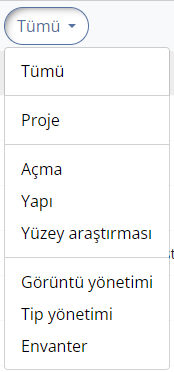
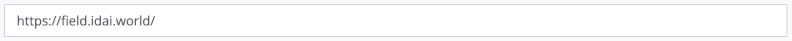
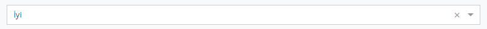
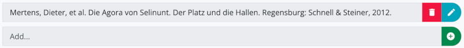
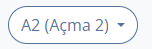
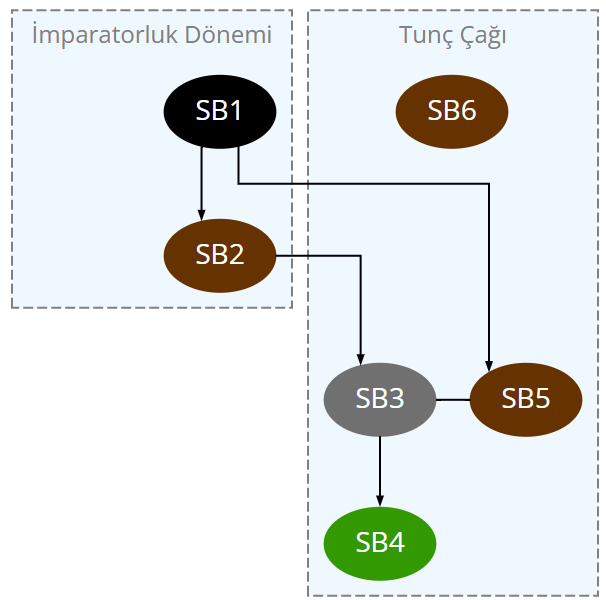

# İlk adımlar

Uygulamayı ilk başlattığınızda adınızı girmeniz istenecektir. Adınızı ve soyadınızı girmeniz önerilir. Girdiğiniz ad, yaptığınız tüm değişiklikler için veri tabanında saklanır ve veri senkronizasyonu sırasında değişikliklerin açıkça atanmasına olanak tanıyarak projedeki veri kayıtları üzerinde iş birliği yapmanızı kolaylaştırır. Kullanıcı adını daha sonra gezinme çubuğunun sağ üst köşesindeki ada tıklayarak veya "Field" (macOS) veya "Araçlar" (Windows ve Linux) menüsünden erişebileceğiniz **Ayarlar** alt menüsü aracılığıyla değiştirebilirsiniz.

Başlangıçta, test projesi etkin olacak ve bir dizi örnek veri kullanarak uygulamanın işlevselliğini denemenize olanak tanıyacaktır. Lütfen unutmayın; test projesi seçili olduğu sürece, yeni oluşturulan tüm veri kümelerinin silinecek ve uygulama yeniden başlatıldığında tüm değişikliklerin sıfırlanacaktır. Bu nedenle, test projesi için diğer Field Desktop projeleri veya veritabanlarıyla senkronizasyon gerçekleştirilmez.

Field Desktop ile üretken bir şekilde çalışabilmek ve kendi projenizi oluşturabilmek için öncelikle şu adımları izlemelisiniz:

1. "Proje" menüsünde, kendi projenizi oluşturmak için **Yeni...** menü öğesini seçin. Proje yapılandırması için çeşitli ön ayarlar arasından seçim yapabilirsiniz: Kapsamlı arazi araştırmalarına yönelik varsayılan yapılandırma için "Standart"ı veya yalnızca ön ayar kategorileri ve alanlarından oluşan temel ayarlarla başlamak istiyorsanız "Temel" seçeneklerinden birini seçin. Ayrıca, proje içinde verilerin girileceği dilleri belirtin. Son olarak, istenen proje tanımlayıcısını ve isteğe bağlı olarak seçilen dillerin her biri için bir proje adı girin.

2. Yeni proje yüklenir yüklenmez, "Proje" ➝ "Özellikler" menüsü üzerinden temel proje verilerini girebilirsiniz. Öncelikle, **personel üyelerinin** listelerini oluşturmalısınız.
"Proje" bölümünde "Ekip"i ve **sezonları** ("Proje" bölümünün "Sezonlar" alanı) detaylandırabilirsiniz.
Bu listeleri istediğiniz zaman değiştirebilirsiniz.

# Girdiler 
**(ç.n. Esas uygulamadaki 'Resource' ifadesi 'Girdi' olarak verilmiştir)**

Bir proje oluşturduktan veya mevcut bir projeyi açtıktan sonra, **Genel Bakış** sekmesinden başlayabilirsiniz 
(Projenin tüm operasyonlarının ve yerlerinin yönetildiği yer (ev sembolü).

Yeni bir işlem oluşturmak için girdiler listesinin altındaki yeşil artı butonu kullanın.

Bu işlem sırasında, öncelikle operasyonun kategorisini (örneğin "Açma" veya "Yapı") seçip, ardından haritada yeni girdi için isteğe bağlı bir geometri oluşturabilirsiniz. Ardından, operasyonun tüm verilerinin doldurulabileceği düzenleyici açılır.
Seçilen operasyon kategorisine bağlı olarak, farklı alanlar görünecektir. (bkz. *Girdileri düzenle* bölümü).

Girdiyi yeşil kaydet butonuyla kaydetmeden önce, en azından **tanımlayıcı** alanının
temel bilgiler bölümünün doldurulması gerekmektedir.

Yeni işlem artık girdi listesinde görüntüleniyor. Yeni bir sekmede açmak için "İşleme geç" butonunu kullanın 
(Yukarı sağa ok işareti).

İşlemin kategorisine bağlı olarak, bir girdi sekmesi içinde artı butonu ile farklı kategorilerde (örneğin bir açmadaki stratigrafik birimler veya bir yapının odaları)
gibi alt girdiler oluşturulabilir.

## Hiyerarşik sıralama

Girdiler örneğin buluntuları bir stratigrafik birime atamak için, hiyerarşik yapılar halinde düzenlenebilir. 
Alt hiyerarşi seviyesine geçmek için "Alt girdileri göster" (aşağı sağa köşeli ok) butonunu kullanın. Alt girdiler artık görüntülenecek ve artı butonuyla yeni oluşturulan girdiler (örneğin, bir stratigrafik birimin buluntuları) buna göre bu hiyerarşi seviyesinde görünecektir.

Girdiler listesinin üstündeki gezinme yolu, şu anda seçili olan hiyerarşi düzeyini gösterir. Her zaman
Gezinme yolundaki butonlardan birine tıklayarak bir sonraki seviyeye geçebilirsiniz.

## Girdilerin yönetilmesi

Listedeki girdiler tıklanarak seçilebilir. Ctrl/Cmd veya Shift tuşuna basılı tutarak birden fazla girdi
aynı anda seçilebilir. Listedeki bir veya daha fazla seçili girdiye sağ tıklayarak aşağıdaki seçenekleri içeren
bir içerik menüsü açılır:

* *Uyarıları göster*: Bu girdi için mevcut uyarıları görüntüler (sadece uyarı içeren girdiler için geçerlidir, *Uyarılar* bölümüne bakın)
* *Düzenle*: Girdi düzenleyicisini açar (bkz. *Girdileri düzenle* bölümü). Alternatif olarak, listedeki girdi kaydına çift tıklanarak da düzenleyici açılabilir.
* *Görselleri bağla*: Görsellerin seçili girdiye bağlanabileceği veya bağlı görsellerin kaldırılabileceği bir pencere açar
* *QR kodu ekle*: Girdi için yeni bir QR kodunun oluşturulabileceği veya mevcut bir QR kodunun kamera taraması yoluyla bağlanabileceği bir pencere açar
* *QR kodunu yönet*: Girdinin QR kodunu görüntüler ve bir QR kodu etiketi yazdırmaya olanak tanır (alternatif olarak kaynağın liste öğesinin sağ tarafındaki QR kodu düğmesinden de erişilebilir)
* *Taşı*: Girdilerin geçerli içeriklerinden kaldırılmasına ve başka bir üst girdiye atanmasını sağlar
* *Sil*: Bir güvenlik kontrolünden sonra girdileri kaldırır (isteğe bağlı olarak, yalnızca silmek istediğiniz girdilere bağlı
tüm görselleri de silebilirsiniz)
* *İş akışını belgele*: Seçili girdilere bağlı işlemleri görüntüler ve yeni işlemler oluşturulmasına olanak tanır (yalnızca bir işlem kategorisinin "Buna ilişkin uygulandı" ilişkisinin hedef kategorisi olarak yapılandırılmış kategorileri için kullanılabilir).
* *Depolama yerini tara*: Kamera taramasıyla depolama yerinin QR kodunu tarayarak girdi için yeni bir depolama yeri ayarlar (yalnızca "Bul", "Koleksiyonu bul" ve "Örnek" kategorilerinin girdileri ile ilgili alt kategoriler için kullanılabilir)

Ayrıca, içerik menüsü geometrileri oluşturma ve düzenleme seçenekleri içerir. Lütfen şunu unutmayın:
birden fazla girdi seçildiğinde, yalnızca *Taşı* ve *Sil* seçenekleri kullanılabilir. QR kodlarını ekleme veya yönetme seçenekleri yalnızca yapılandırma düzenleyicisinde karşılık gelen kategori için QR kodlarının kullanımı ayarlanmışsa kullanılabilir (bkz. *Yapılandırma* bölümündeki *Kategorileri düzenle* bölümü).

## Girdileri düzenle

Girdi düzenleyici, içerik menüsünden veya girdi listesindeki bir kayda çift tıklayarak açılabilir. Burada, seçili girdinin verilerini düzenleyebilirsiniz. Kayıt formu, girdinin kategorisine (örneğin, "Açma" veya "Buluntu") bağlıdır ve yapılandırma düzenleyicisinde tanımlanabilir (bkz. *Proje yapılandırması* bölümü).

Kategori için kullanılabilen alanlar birkaç gruba ayrılmıştır (örneğin, "Temel bilgiler", "Ölçüleri", "Pozisyon / Kontekst"). Düzenleyicinin sol tarafındaki grup düğmelerinden birine tıkladığınızda ilgili grubun alanları düzenleyicinin sağ tarafında görüntülenir. Proje yapılandırmasında, alana girilebilecek veri türünü belirleyen belirli bir giriş türü atanır (örneğin, "Tek satırlık metin", "Tarih", "Boyut"). Tüm giriş türlerinin listesi, *Proje yapılandırması* bölümünün *Alanlar* alt bölümünde bulunabilir.

Düzenleyicide yaptığınız değişiklikler ancak "Kaydet" butonuna tıkladıktan sonra kaydedilir.

### Alanlar ve değerler hakkında bilgi görüntüleme

Proje yapılandırmasında, alanlar ve değer listeleri için ek bilgiler içeren açıklayıcı metinler ve web sitesi bağlantılarını kaydedebilirsiniz. Bu bilgiler, veri girerken yardımcı olabilir. Bir alan veya değer listesindeki bir değer için bu tür ek bilgiler mevcutsa fare işaretçisini ilgili alana veya değere getirdiğinizde görünen noktalı bir çizgiyle belirtilir.

**Sağ tıklayarak**, referans olarak girdiğiniz açıklama metninin ve/veya harici web sitelerine bağlantıların görüntülendiği bir pencere açabilirsiniz.

### Kategori değiştirme

Seçilen girdinin ait olduğu kategorinin simgesi, düzenleyici başlığının sol tarafında görüntülenir. Kategori bir üst kategori veya alt kategorilerinden biriyse, başka bir alt kategoriye veya üst kategorinin kendisine geçebilirsiniz. Bu seçenek, ok sembolü bulunan küçük mavi bir düğmeyle gösterilir.

İstediğiniz kategoriyi listeden seçmek için butona tıklayın. Düzenleyicide yeni seçilen kategorinin formu görüntülenecektir. Ancak yaptığınız değişiklikler yalnızca "Kaydet" butonuna tıkladığınızda kaydedilir.

*Örnek*: "Buluntu" üst kategorisi, "Tuğla", "Sikke" ve "Pişmiş Toprak" gibi alt kategorilere sahiptir. Bir girdi "Tuğla" kategorisine aitse, istediğiniz zaman "Buluntu" üst kategorisine veya diğer alt kategorilerden birine ("Sikke" veya "Pişmiş Toprak") geçebilirsiniz. Ancak, başka bir kategoriye (örneğin "Açma") geçmek mümkün değildir.

**Önemli**: İlgili alan, yeni seçilen kategori formunun bir parçası değilse, kategorileri değiştirirken daha önce girilmiş alan verilerinin kaybolabileceğini lütfen unutmayın. Bu durumda, kategorileri değiştirirken bir uyarı görüntülenir. Kaydetmeden önce orijinal kategoriye geri dönerseniz, tüm alan verileri korunur.

Kategori "Operasyon" veya "İşlem" üst kategorisine aitse kategori değişikliği mümkün değildir.

### Bir girdinin birden çok örneğini/kopyasını oluşturma

Yeni bir girdi oluştururken, aynı anda birden fazla örnek (kopya) oluşturma seçeneğiniz vardır. Bunu yapmak için, "Kaydet" düğmesinin sağındaki "aşağı ok" sembolüne tıklayın ve açılan açılır menüden "Birden fazla örnek/kopya oluştur" seçeneğini belirleyin. Ardından oluşturulacak toplam girdi sayısını girin ve "Girdi oluştur" düğmesine tıklayarak girişinizi onaylayın.

Birden fazla girdi oluştururken, girdi düzenleyici formuna girdiğiniz alan verileri her kayda eklenir. Ancak girilen ilişkiler yalnızca oluşturulan ilk girdi için kaydedilir ve oluşturulan kopyalara **dahil edilmez**.

Oluşturulan her ek kopya için "Tanımlayıcı" alanına girilen değere bir sayaç eklenir; böylece her girdinin benzersiz bir tanımlayıcısı olur. "Tanımlayıcı" alanına sayaç içeren bir değer girdiyseniz, bu işlem ardışık olarak devam edecektir.

*Örnek*: "Tanımlayıcı" alanına "ABC" değerini girdiniz ve üç girdi oluşturmak istiyorsunuz. Oluşturulan ek girdilere otomatik olarak "ABC2" ve "ABC3" tanımlayıcıları verilir.
Ancak, "ABC15" değerini girdiyseniz, oluşturulan ek girdilere "ABC16" ve "ABC17" tanımlayıcıları verilir.

### Yinelenen girdiler

Girdi düzenleyicide "Kaydet" düğmesinin sağındaki "aşağı ok" sembolüne tıklayıp açılan açılır menüden "Yinele" seçeneğini belirleyerek mevcut bir girdinin kopyalarını oluşturabilirsiniz. Ardından (mevcut girdi hariç) oluşturulacak kopya sayısını girin ve "Girdileri kaydet" düğmesine tıklayarak kaydı onaylayın.

Bir girdinin birden fazla örneğinin oluşturulmasında olduğu gibi, girilen tüm alan verileri, ilişkiler hariç olmak üzere oluşturulan kopyalara eklenir. Tanımlayıcı bir sayaçla güncellenir veya mevcut bir sayaç devam ettirilir (bkz. *Birden fazla girdi oluşturma* bölümü).

# Görüntüler

Görüntüler daha sonra girdilere bağlanmak veya harita katmanları olarak kullanılmak üzere bir Field projesine aktarılabilir. Her içe aktarılan görüntü için, görüntünün meta verilerinin girilebileceği bir görüntü kaydı otomatik olarak oluşturulur.

Görüntü dosyaları isteğe bağlı olarak bir senkronizasyon bağlantısı aracılığıyla diğer bilgisayarlarla paylaşılabilir (bkz. *Senkronizasyon* bölümü). Bilgisayarda bir görüntü dosyası yoksa, bunun yerine bir yer tutucu grafik görüntülenir.

## Görüntüleri içe aktarma

Görüntüler uygulamaya iki farklı şekilde aktarılabilir: "Araçlar" ➝ "Görüntü yönetimi" menüsü ve bir girdinin içerik menüsündeki "Görüntüleri bağla" seçeneği (istenen girdiye sağ tıklanarak erişilebilir). İkinci durumda, görüntü içe aktarma işleminden sonra otomatik olarak ilgili girdiye bağlanacaktır (bkz. *Görüntüleri girdilere bağla* bölümü).

İçe aktarmayı başlatmak için artı düğmesine tıklayın ve projeye eklemek istediğiniz dosyaları seçin. Alternatif olarak, dosyaları doğrudan bir dosya yöneticisi uygulamasından artı düğmesini çevreleyen alana sürükleyip bırakabilirsiniz. Proje için birden fazla görsel kategorisi (yani "Görüntü" kategorisinin alt kategorileri) tanımlanmışsa, açılır menüden istediğiniz kategoriyi seçebilirsiniz. Ayrıca, "Oluşturucu" alanının içeriğinin resim dosyası meta verilerinden otomatik olarak okunmasını veya manuel olarak ayarlanmasını seçebilirsiniz. Proje özelliklerinde bulunan, "Ekip" alanına girilen kişi isimleri seçim için kullanılabilir. Her iki durumda da, resmin oluşturulma tarihi, yüksekliği ve genişliği dosya meta verilerinden otomatik olarak okunur.
Desteklenen görsel formatları *jpg/jpeg*, *png* ve *tif/tiff*'tir.

## Görüntü varyasyonları

Her içe aktarılan görüntü için uygulama bir kopya ve önizleme görüntüsü olarak daha küçük bir varyasyonunu oluşturur ve bunu **Görüntüler dizinine** kaydeder; bu dosya yolunu "Gelişmiş ayarlar"daki ayarlarda görebilirsiniz. Bu klasördeki dosyalar uygulama tarafından yönetildiği için manuel olarak düzenlenmemeli, yeniden adlandırılmamalı veya silinmemelidir. Aksi takdirde görüntüleri ön izlemede veya senkronize ederken hatalar oluşabilir.

Uygulama her görüntü için toplamda üç farklı varyasyonu yönetir:
* *Orijinal görüntü*: Projeye aktarıldığı haliyle değiştirilmemiş görüntü dosyası
* *Küçük resim*: Uygulamada (örneğin, görüntü yönetiminde veya bağlantılı görüntülere sahip girdiler için) ön izleme görüntüsü olarak görüntülenen görselin otomatik olarak oluşturulmuş düşük çözünürlüklü bir çeşidi 
* *Görüntüleme için optimize edilmiş görüntü*: Belirli görüntüler için uygulamada görüntülenmek üzere başka bir varyasyon oluşturulur. TIFF formatındaki dosyalar JPEG'e dönüştürülür ve çok yüksek çözünürlüklü görüntülerin boyutu küçültülür. Bu adım, proje yüklenirken gerçekleşir ve mevcut görüntü dosyalarının miktarına bağlı olarak yükleme süresinin birkaç dakika uzamasına yol açabilir.

Görüntü dizininde bulunan verilerin genel görünümünü "Proje" ➝ "Verilere genel bakış" menüsünden açabilirsiniz.

## Görüntü yönetimi

Görüntüleri yönetmek için "Araçlar" ➝ "Görüntü yönetimi" menüsünü açın. Burada projedeki tüm görselleri görüntüleyebilir ve arayabilirsiniz (ayrıca *Arama* bölümüne bakın).

### Meta verileri düzenle

İstediğiniz görüntüye çift tıklayarak görüntü ön izlemesini açarak bir görüntünün meta verilerini görüntüleyebilirsiniz. Düzenleyiciyi açmak ve meta verileri eklemek veya değiştirmek için düzenle düğmesine tıklayın. Burada, görüntü kategorisine karşılık gelen bilgiler için yapılandırma düzenleyicisinde yapılandırılan alanlar mevcuttur.

### Görüntüleri sil

Projeden içe aktarılan görüntüleri kaldırmak için, görüntü yönetiminde karşılık gelen görüntüleri seçin. Daha sonra "Sil" düğmesiyle kaldırılabilirler:

Lütfen unutmayın; bu aynı zamanda projenin görüntüler dizinindeki (ve bir senkronizasyon bağlantısı kurulmuşsa diğer bilgisayarlardaki) ilgili dosyaları da **silebilir**. Bir görüntü silindiğinde girdilerle bağlantıları kaybolacaktır.

### Orijinal görselleri indirme

Bir görselin orijinal dosyası bilgisayarınızda mevcut değilse, tüm proje için orijinal görüntülerin indirilmesini etkinleştirmeden, teker teker indirebilirsiniz. Bunun için, görüntü yönetiminde istediğiniz görselleri seçin (veya uygulamanın başka bir bölümünden görüntüleyin) ve "Orijinal görselleri indir" düğmesine tıklayın. Görüntü dosyaları artık yüklenecektir.

Bu işlevin yalnızca "Proje" ➝ "Senkronize et..." menüsü üzerinden proje için geçerli bir senkronizasyon hedefi girilmişse kullanılabileceğini lütfen unutmayın (bkz. *Senkronizasyon* bölümü).

### Orijinal görselleri dışa aktarma

Orijinal görüntü dosyalarını Field Desktop'tan dışa aktarmak için, önce görüntü yönetiminden görüntüleri seçin (veya uygulamanın başka bir bölümünden görüntüleyin) ve "Dışa Aktar" düğmesine tıklayın. Görüntü dosyalarının dışa aktarılacağı dizini seçebileceğiniz bir pencere açılacaktır. Ayrıca, dosyaları adlandırmak için iki farklı seçenek arasından seçim yapabilirsiniz:

* *Tanımlayıcı*: Projede bulunan ilgili görsellerin şu anda sahip olduğu tanımlayıcı, dışa aktarılan görüntü dosyaları için dosya adı olarak kullanılır.
* *Orijinal dosya adı*: Dosyalar, projeye ilk olarak hangi adla aktarıldıysa o ad ile dışa aktarılır.

## Görselleri girdilere bağlayın

Bir veya daha fazla görüntüyü bir girdiye bağlamak için, ilgili girdinin içerik menüsünde "Görselleri bağla" seçeneğini seçin ve artı düğmesine tıklayın. Artık iki seçenek arasında seçim yapabilirsiniz:

* *Yeni görseller ekle*: Yeni görseller projeye aktarılacak ve girdiye bağlanacak.
* *Mevcut görselleri bağla*: Projede halihazırda mevcut olan görsellerden bir veya daha fazlasını seçerek girdiye bağla.

Listedeki görüntüleri seçin ve görüntüleri girdiden ayırmak için "Bağlantıyı kaldır" seçeneğini seçin. Görüntülerin kendisi projede kalır.

Bağlantılar ayrıca görüntü yönetimi aracılığıyla eklenebilir veya kaldırılabilir. Bunu yapmak için, istediğiniz görüntüleri seçin ve üst çubuktaki "Bağla" (mavi düğme) veya "Bağlantıları kaldır" (kırmızı düğme) düğmesine tıklayın:

### Ana görüntü ayarla

Bir girdi birden fazla görüntüye bağlıysa, görüntülerden biri **ana görüntü** olarak bir yıldız simgesiyle işaretlenir. Bu ana görüntü, girdi için bir önizleme görseli olarak görüntülenir. Girdinin içerik menüsünde "Görüntüleri bağla" seçeneğini belirleyerek ve bağlı görüntüler listesinde istediğiniz görüntüyü seçerek ana görüntüyü değiştirebilirsiniz. Ardından "Ana görüntü olarak ayarla" düğmesine tıklayın:

## Harita katmanları

### Coğrafi referanslama

Bir görüntü harita katmanı olarak kullanılmadan önce, öncelikle coğrafi referans bilgisi sağlanmalıdır. Desteklenen biçimler; *tif/tiff* dosya uzantılı GeoTIFF dosyaları ve *wld*, *jpgw*, *jpegw*, *jgw*, *pngw*, *pgw*, *tifw*, *tiffw* ve *tfw* uzantılı 'world' dosyalarıdır.

Görüntü dosyası GeoTIFF biçimindeyse başka bir işlem yapılmasına gerek yoktur. Görüntü içe aktarıldığında coğrafi referanslama bilgileri otomatik olarak uygulanır.

World dosyaları iki farklı şekilde içe aktarılabilir: Uzantıdan önceki dosya adı, karşılık gelen görüntü dosyasının adıyla aynıysa, dosya görüntü içe aktarma (artı düğmesi) yoluyla eklenebilir. Görüntüye atama otomatik olarak gerçekleşir. Alternatif olarak, bir world dosyası görüntü yönetiminde karşılık gelen görüntüye çift tıklayarak ulaşabileceğiniz ön izleme menüsü ile içe aktarılabilir. "Coğrafi referans verileri" bölümünü açın ve istediğiniz dosyayı seçmek için "World dosyasını yükle" düğmesine tıklayın.

### Harita katmanlarını düzenle

Bir harita katmanı belirli bir işlem veya tüm proje için ayarlanabilir. Harita katmanının tüm projede kullanılabilir olmasını istiyorsanız genel bakış sekmesine (ev simgesi) veya istediğiniz işlemin sekmesine geçin. Orada, haritanın sağ üst köşesindeki düğme aracılığıyla harita katmanı menüsünü açın ve düzenle düğmesine tıklayın. Artık artı düğmesi aracılığıyla yeni harita katmanları ekleyebilirsiniz. Coğrafi referans verisi eklenmiş tüm görüntüler kullanılabilir.

Harita katmanlarının sırasını, sürükle ve bırak yoluyla listede yukarı veya aşağı taşıyarak değiştirin. Bu sıralama, haritada birden fazla (coğrafi olarak) üst üste gelen görüntünün hangisinin üstte görüntüleneceğini belirler: Listede daha yukarıda olan bir katman, haritada daha aşağıda olan bir katmanın üstünde görüntülenir ve onu tamamen veya kısmen gizleyebilir.

Her liste girişinin sağında bulunan mavi renkli "Varsayılan harita katmanı olarak ayarla" (yıldız simgesi) butonu, proje ilk açıldığında haritada varsayılan olarak görüntülenmesi gereken bir veya daha fazla görselin seçilmesine olanak tanır.

Kırmızı "Harita katmanını kaldır" butonuna tıklayarak listeden bir katmanı kaldırabilirsiniz. Görüntünün kendisi projeden silinmeyecek ve tekrar harita katmanı olarak eklenebilecektir.

Değişiklikleri veri tabanına kaydetmek için "Kaydet" butonuna tıklayın.

### Harita katmanlarını görüntüle

Ayarlanan harita katmanları, harita katmanı menüsü üzerinden her an gösterilebilir veya gizlenebilir. Bunu yapmak için listedeki ilgili katmanın solundaki göz düğmesine tıklayın. Burada yapılan ayarlar (sekme için kullanılabilen harita katmanları listesinin aksine) veri tabanına kaydedilmez ve bu nedenle bir senkronizasyon bağlantısı üzerinden paylaşılmaz. Böylece farklı harita katmanları farklı bilgisayarlarda gösterilebilir ve gizlenebilir.

# Arama

**Genel Bakış**'ta, **İşlem sekmelerinde** ve **Görüntü Yönetimi**'nde bir **Arama Filtresi** mevcuttur. Bunu, halihazırda görüntülenen kayıtları ayırt etmek için kullanabilirsiniz:
Bazı temel arama kriterlerinin (tanımlayıcı, kısa açıklama, kategori) araçları.

Daha karmaşık arama sorguları işletmek istiyorsanız **Genel Bakış** veya **İşlem sekmelerinden** birindeyken **gelişmiş arama moduna** geçebilirsiniz.
Bu mod, hiyerarşik sıralamaları atlayarak 
aramayı detaylandırmanıza, tüm projede arama yapmanıza 
ve ek alan özel arama ölçütleri tanımlamanıza olanak tanır.

## Arama filtresi

Arama filtresi, belirli ölçütlere göre girdileri göstermenin veya gizlemenin hızlı bir yoludur. Şunlardan oluşur:
*metin filtresi* (bir arama kutucuğu) ve bir *kategori filtresi* (mavi buton).

Bir arama terimi girdikten ve/veya bir kategori seçtikten sonra, yalnızca bu filtre kriterlerine uyan kayıtlar gösterilir. 
**Genel bakış** ve **işlem sekmelerinde**, bu durum sol kenar çubuğundaki tüm girdiler 
ile sırasıyla haritadaki (harita görünümünde) tüm girdileri ve listenin öğelerini (liste görünümünde) etkiler. 
**Görüntü yönetiminde**, ızgarada gösterilen tüm görüntüler arama filtresinden etkilenir.

### Kategori filtresi

Kategori filtre düğmesi bir girdi kategorisi seçmenize olanak tanır. Üst ve alt kategoriler bulunmaktadır: Bir alt kategori seçerseniz (örneğin "Tabaka"),
yalnızca ilgili kategorinin girdileri gösterilir. 
Buna karşılık, bir üst kategori seçerseniz (örneğin "Stratigrafik birim"), 
seçili kategorinin girdileri ve tüm alt kategorileri (örneğin "Tabaka", "Mezar", "Mimari", "Zemin" vb.) dahil edilir.
Yalnızca üst kategoriyi seçmek için tekrar tıklayın.

Mevcut içerik hangi kategorilerin kullanılabileceğini belirler: Genel bakışta işlem kategorilerini, 
görüntü yönetiminde görüntü kategorilerini vb. düzenleyebilirsiniz.

### Metin filtresi

Arama terimleri mevcut "Tanımlayıcı" ve "Kısa açıklama" girdi alanlarıyla karşılaştırılır.
 
*Örnek:*
 
Genel görünümde aşağıdaki üç açma gösterilmektedir:

    (1)
    Tanımlayıcı: "T01"
    Kısa açıklama: "Açma-01"
    
    (2)
    Tanımlayıcı:  "T02"
    Kısa açıklama: "Açma-02"
    
    (3)
    Tanımlayıcı:  "mt1"
    Kısa açıklama: "Benim Açmam 1" 

**Uygun arama terimleri** tanımlayıcıların ve kısa açıklamaların metin dizeleridir ve her biri boşluk karakterleri veya tirelerle ayrılmıştır, 
örnekte olduğu gibi: "T01", "T02", "mt1", "Açma", "01", "02", "Benim", "1".

Bu nedenle, sonuçlarda "t01" terimi için yapılan bir arama (1) girdisini verir ve "benim" için yapılan bir arama (3) değerini verir.
**Büyük-küçük harf kullanımı** göz ardı edilir.
  
Yapılan arama, her durumda arama teriminin başlangıcının kontrol edildiği bir çeşit **(başlangıç terimi) aramasıdır**: 
(1) ve (2) tanımlayıcıları "t0" metin dizesiyle başladığından, "t0" terimi için yapılan bir arama (1) ve (2) sonuçlarını döndürür. 
"aç" için yapılan bir arama (1), (2) ve (3) sonuçlarını döndürürken, 
"çm" veya "çma" için yapılan bir arama hiçbir şey döndürmez.

### Yer tutucu arama

Metin filtresi alanına metin girerken, yer tutucular kullanılabilir: 
Tek bir karakter yerine, köşeli parantez içinde izin verilen farklı karakterler kümesi belirtebilirsiniz. 
Böyle bir yer tutucu, arama sorgusu başına bir kez kullanılabilir.

*Örnek:*

    (1) Tanımlayıcı: "Arazi-0001"
    (2) Tanımlayıcı: "Arazi-0009"
    (3) Tanımlayıcı: "Arazi-0010"
    (4) Tanımlayıcı: "Arazi-0011"
    (5) Tanımlayıcı: "Arazi-0022"

"Arazi-00[01]" için yapılan bir arama (1), (2), (3), (4) döndürür çünkü 0 ve 1 üçüncü basamak için 
izin verilen karakterler olarak tanımlanmıştır. Başlangıç terimi araması nedeniyle tüm takip eden karakterlere izin verilir.

"Arazi-00[01]1" araması (1) ve (4) değerlerini döndürür, çünkü yer tutucudan sonraki rakam 1 olmalıdır.

### Diğer içeriklerden gelen arama sonuçları

Mevcut içerikte hiçbir arama sonucu bulunamazsa, metin giriş alanının altında diğer içeriklerden 
gelen arama sonuçları gösterilir.

Girdilerden birine tıklayarak hemen ilgili bağlama geçebilir 
ve girdiyi seçebilirsiniz.

## Detaylı arama modu

**Genel bakış** ve **İşlem sekmelerinde** genişletilmiş arama moduna geçmek için
büyüteç butonuna tıklayın.
 

Detaylı arama modu, daha büyük miktardaki veriler üzerinde arama yapmanıza olanak tanır:

* **Genel Bakış** kısmında, arama projenin tüm girdileri üzerinden gerçekleştirilir.
* **İşlem sekmelerinde**, işlemin tüm girdileri üzerinde arama yapılır.

Her iki durumda da bulunan tüm girdiler sol taraftaki listede gösterilir. "içerikte göster" 
(Yukarı ok işareti) ve sırasıyla "Bir işlemin içeriğinde göster" (Sağ yukarı ok işareti) butonları 
bir kaydın hiyerarşik içeriğine geçmenizi sağlar; bunu yaparken genişletilmiş arama modu sonlandırılır ve 
gerekirse yeni bir sekme açılır.

Detaylı arama modundayken, devre dışı bırakılmış oluştur düğmesiyle girdi oluşturmak mümkün değildir. 
Yeni girdiler oluşturmak için lütfen detaylı arama modundan çıkın.

Performans nedenleriyle aynı anda gösterilen arama sonuçlarının sayısı en fazla **200** ile sınırlandırılmıştır. 
Diğer girdiler uygulama tarafından görüntülenmez ve bunun yerine limitin aşıldığına dair bir bildirim gösterilir. 
Bu girdilere erişmek için daha fazla arama kriteri ekleyin 
veya genişletilmiş arama modundan çıkın.

### Alana özel arama kriterleri
 
Detaylı arama modu etkinleştirilirse, kategori filtresi düğmesinin solundaki artı düğmesine tıklayarak
bir girdinin belirli alanlarında arama başlatabilirsiniz. 
Arama için kullanılabilir alanlar, seçili kategoriye karşılık gelen alanlardır. 
Birden fazla arama kriterini birleştirmek için istediğiniz kadar alan seçebilirsiniz. 
Elbette, alan belirli arama kriterini metin filtresiyle birlikte de kullanabilirsiniz. 

Metin alanı olması durumunda, doğrudan arama terimini girmeniz yeterlidir.
Değer listeleri olan alanlar için, açılır menüdeki tüm izin verilen değerlerin listesinden terimi seçin.

**Önemli:** Arama filtresinin aksine, bu durumda başlangıç terimi araması yapılmaz. 
Girdinin arama sonuçları listesinde görünmesi için seçilen arama teriminin 
girdi alanının içeriğiyle tam olarak eşleşmesi gerekir.

Belirli bir arama terimi belirtmek yerine, alanın ayarlandığı 
("Herhangi bir değer" seçeneği) veya ayarlanmadığı ("Değer yok" seçeneği) ile tüm girdilerde de arama yapabilirsiniz.

Kategori filtresi düğmesinin yanında görünen sayı, etkin arama kriteri sayısını gösterir.
Numaraya tıklayarak arama kriterini kaldırabilirsiniz. 
Bu işlem, menüyü tekrar açar ve kaldırılacak arama kriterini seçebilirsiniz.

# Senkronizasyon

Veriler farklı bilgisayarlardaki birden fazla Field Desktop kurulumu arasında, tek bir proje üzerinde ortak çalışabilmek için senkronize edilebilir. Bu, başka bir makinede çalışan bir Field Desktop uygulamasından gelen değişikliklerin (yeni girdiler, silinen girdiler, mevcut girdilerin düzenlenmesi, eklenen veya silinen resimler...) otomatik olarak yerel veri tabanına aktarılacağını veya kaldırılacağı anlamına gelir. Bu, tüm kullanıcıların projenin en son kayıtlı haliyle aynı anda çalışmasını sağlar. Senkronizasyon hem internet üzerinden hem de yerel ağ üzerinden çalışır. Çevrimdışıyken bir proje üzerinde çalışmaya devam edebilirsiniz - bu durumda veritabanları ağ bağlantısı tekrar kurulduğunda senkronize edilecektir.

## Projeyi indir

Başka bir Field Desktop kurulumunda veya bir Field sunucusunda bulunan mevcut bir projeyle çalışmak için önce proje indirilmelidir. Bunu yapmak için "Proje" ➝ "İndir..." menü öğesini seçin ve erişim bilgilerini girin:

* *Adres*: Projeyi indirmek istediğiniz bilgisayarın adresini girin. Bu, Field Desktop'ın şu anda açık olduğu başka bir bilgisayarın ağ adresi olabilir (bu adres ayarlar bölümünde *Adresiniz* kısmında görülebilir). İnternet veya yerel ağ üzerinden erişilebilen bir Field sunucusunun adresi olabilir (örneğin DAI sunucusu için *https://server.field.idai.world*).
* *Proje adı*: İndirmek istediğiniz projenin adı.
* *Şifre*: Projeyi indirmek istediğiniz projenin veya Field Desktop kurulumunun şifresi.
* *Küçük resimleri indir*: Bu seçenek varsayılan olarak etkindir. Zayıf bir internet bağlantınız varsa ve mümkün olduğunca az veri indirmek istiyorsanız, bunu devre dışı bırakmak isteyebilirsiniz.
* *Orijinal görselleri indir*: Görüntüleri orijinal görüntü çözünürlüklerinde indirmek istiyorsanız bu seçeneği etkinleştirin. Projede yönetilen görüntü sayısına ve boyutuna bağlı olarak, birkaç gigabayt verinin indirilmesi gerekebilir. Bu seçeneği etkinleştirmeden önce yeterli bir internet bağlantınız ve sabit disk alanınız olduğundan emin olun.
* *Aynı tanımlayıcıda mevcut projenin üzerine yaz*: Bu seçenek etkinleştirilirse, bilgisayarda aynı adlı bir proje zaten mevcut olsa bile proje indirilir. Mevcut proje bu işlem sırasında silinir.

Geçerli bir adres, proje adı ve şifre girdiğinizde, kısa bir hesaplama süresinin ardından ilgili seçeneklerin yanında indirilecek görüntü verisinin miktarı gösterilecektir.

Lütfen unutmayın; daha büyük projelerin indirmesi daha uzun sürebilir. İndirilen proje daha sonra otomatik olarak açılacak ve aynı kimlik bilgileri kullanılarak bir senkronizasyon bağlantısı kurulacaktır.

## Senkronizasyonu yapılandırma

Hem indirilen hem de yeni oluşturulan projeler her zaman diğer veritabanlarıyla senkronize edilebilir. Senkronizasyon "Proje" ➝ "Senkronize et..." menüsü üzerinden yapılandırılabilir.

* *Adres*: Eşitleme bağlantısı kurmak istediğiniz veri tabanının adresi. Bu, Field Desktop'ın şu anda açık olduğu başka bir bilgisayarın ağ adresi olabilir (bu adres ayarlar bölümünde *Adresiniz* olarak görüntülenebilir) veya internet veya yerel ağ üzerinden erişilebilen bir Field Hub sunucusunun adresi olabilir (örneğin DAI'nin Field Hub sunucusu için *https://server.field.idai.world*).
* *Şifre*: Senkronizasyon bağlantısını kurmak istediğiniz projenin veya Field Desktop kurulumunun şifresi.
* *Senkronizasyonu etkinleştir*: Bağlantıyı başlatmak veya kesmek için bu anahtarı kullanın.
* *Küçük resimleri senkronize et*: Bu seçenek varsayılan olarak etkindir. Zayıf bir internet bağlantınız varsa ve mümkün olduğunca az veri yüklemek/indirmek istiyorsanız, bunu devre dışı bırakmak isteyebilirsiniz.
* *Orijinal görselleri yükleyin*: Görüntüleri orijinal çözünürlüklerinde yüklemek istiyorsanız bu seçeneği etkinleştirin.
* *Orijinal görselleri indir*: Görüntüleri orijinal çözünürlüklerinde indirmek istiyorsanız bu seçeneği etkinleştirin. Projede yönetilen görüntü sayısına ve boyutuna bağlı olarak, birkaç gigabayt verinin indirilmesi gerekebilir. Bu seçeneği etkinleştirmeden önce yeterli bir internet bağlantınız ve sabit disk alanınız olduğundan emin olun.

Geçerli bir adres ve doğru şifreyi girer girmez, kısa bir hesaplama süresinden sonra ilgili seçeneklerin yanında yüklenecek/indirilecek görüntü verisi miktarı gösterilecektir. Lütfen unutmayın; daha sonra projeye ek görüntüler aktarılırsa veri miktarının artabilecektir.

Son olarak **Ayarları uygula** butonuna tıklayarak ayarlarınızı onaylayın.

## Senkronizasyon durumu

Gezinme çubuğunun sağ üst köşesindeki bulut simgesi, yapılandırılmış senkronizasyon bağlantınızın geçerli durumunu gösterir.

Bağlantı başarıyla kurulmuşsa, simge bir onay işareti gösterir. Veriler yüklenirken veya indirilirken bu bir okla gösterilir. Hatalar durumunda bir ünlem işareti gösterilir. Eşitleme durumuyla ilgili ek bilgiler, fare işaretçisini simgenin üzerine getirerek görülebilir.

## Çakışmalar

Çakışmalar, bir girdinin birden fazla bilgisayarda aynı anda düzenlendiğinde veya bilgisayarlar bağlı değilken aynı girdinin düzenlendiği iki veri tabanı senkronize edildiğinde ortaya çıkabilir . Bu durumlarda aynı girdinin iki farklı sürümü vardır: *geçerli sürüm* (girdi yönetiminde ve uygulamanın diğer alanlarında görüntülenir) ve *rekabet eden sürüm* (çakışma durumu görüntülene kadar arka planda saklanır). İki sürüm, doldurulan veri alanlarının sayısı bakımından farklılık gösterebilir veya aynı alanlarda farklı değerlere sahip olabilir.

Çatışmaları olan her girdi için bir uyarı gösterilir (bkz. *Uyarılar* bölümü). Girdi düzenleyicisinin **Çakışmalar** sekmesinde etkilenen bir kaydı temizleyebilirsiniz.

Çakışmaları çözmek için, farklı değerlere sahip her alan için hangi sürümün geçerli olduğuna karar verilmelidir. Alternatif olarak, *geçerli sürümü* veya *rekabet eden sürümü* bir bütün olarak seçebilirsiniz. **Çakışmayı çöz**'e tıklayarak kararı onaylayın. Tek bir girdide birden fazla çakışma olması durumunda, tüm çakışmalar çözülene kadar bu işlem tekrarlanmalıdır. Düzenleyici açıkken diğer düzenleyici gruplarında da değişiklik yapmak mümkündür. Değişiklikleri uygulamak için, girdi son olarak **Kaydet** butonuyla kaydedilmelidir.

## Kendi Field Desktop kurulumunuza senkronizasyon bağlantılarına izin verme

Başkalarının projenizle senkronizasyon bağlantısı kurmasına izin vermek için, **Ayarlar** menüsündeki **Senkronizasyon** bölümünde bulunan kimlik bilgilerini onlara sağlayabilirsiniz:

* *Adresiniz*: Başkalarının kendi Field Desktop kurulumlarından veri tabanınıza bağlanmak için kullanabileceği ağ adresinizdir. Bu adresi, başkalarının proje verilerini sizinle senkronize etmelerine izin vermek için şifrenizle birlikte paylaşabilirsiniz.
* *Şifreniz*: Veri tabanı yetkisiz erişime karşı rastgele oluşturulmuş varsayılan bir şifreyle korunur. Dilerseniz şifreyi değiştirebilirsiniz.
* *Orijinal görüntüleri al*: Bu seçenek etkinleştirilirse, başkaları tarafından gönderilen görüntü dosyaları orijinal görüntü çözünürlüklerinde kabul edilir ve görüntü dizininde saklanır. Görüntü dosyaları birkaç gigabayt veri içerebileceğinden, görüntü dizininde yeterli depolama alanı olduğundan emin olmalısınız. Varsayılan olarak bu seçenek devre dışıdır, bu nedenle orijinal görüntüler kabul edilmez. Seçenek yalnızca diğer bilgisayarlarda ayarlanmış olan senkronizasyon bağlantılarını etkiler; kendi kendine yapılandırılmış bir senkronizasyon bağlantısı bu ayardan etkilenmez.

# Proje yapılandırması

Field Desktop ile yönetilen bir veri tabanı, her zaman belirli bir **kategoriye** ait olan bir dizi girdi içerir, örneğin "Yer", "Buluntu" veya "Görüntü". **Üst kategorilerde** (örneğin "Buluntu") ve **alt kategorilerde** (örneğin "Tuğla" veya "Pişmiş Toprak") arasında bir ayrım yapılır. Alt kategorinin bir girdisi her zaman üst kategoriye de aittir (bir tuğla da bir buluntudur).

Her kategoride, girdinin özelliklerini ve meta verilerini tanımlamak için kullanılabilen (örneğin "ağırlık", "renk", "sorumlu" vb.) bir dizi **alan** bulunur. Alanların her biri, hangi verilerin hangi şekilde girilebileceğini belirleyen (örneğin: metin alanı, sayı girişi, tarihleme girişi gibi) belirli bir tiptedir. Bazı giriş türlerindeki alanlarda, bir dizi metin değeri önceden tanımlanmış seçenekler halinde veren bir **değer listesi** belirebilir.

Girdi düzenleyicide bir kategori için hangi alanların özel olarak kullanılabilir olduğu, kullanılabilir alanlardan bir seçim yapan ve bunları **gruplar halinde** sıralayan **form** seçiminde belirlenir. Her kategori için, yalnızca birkaç zorunlu alan içeren aynı adlı temel bir form mevcuttur. Buna ek olarak daha kapsamlı bir alan seçimine sahip (örneğin, "Çanak Çömlek:default", "Çanak Çömlek" kategorisinde Field veri modelinin standart alanlarıyla) bir veya daha fazla form bulunmaktadır. Formlar, alan grupları ile alanları, yapılandırma düzenleyicisi kullanılarak istenildiği gibi özelleştirilebilir ve genişletilebilir. Bir alt kategorinin formu, her zaman ilgili üst kategorinin seçili formunun alanlarını devralır.

**İlişkiler**, girdiler arasındaki (örneğin: "A1" katmanı, "A2" katmanının konumsal olarak altında yer alır) gibi ilişkileri belirtmek için kullanılır. İlişkiler yapılandırma düzenleyicisinde gizlenebilir, ancak yeni bir tane oluşturulamaz.

Projede bulunan kategorileri, alanları ve değer listelerini ayarlamanıza ve genişletmenize olanak tanıyan yapılandırma düzenleyicisine "Araçlar" ➝ "Proje yapılandırması" menüsü üzerinden erişebilirsiniz. Bir senkronizasyon bağlantısı kurulmuş ise yapılandırmadaki değişiklikler "Kaydet" düğmesiyle onaylanır onaylanmaz diğer kullanıcılara aktarılır.

## Tanımlayıcılar ve etiketler

Proje yapılandırmasının tüm öğeleri (kategoriler, alanlar, değer listeleri, vb.) her biri, benzersiz tanımlama için bir **tanımlayıcı**ya sahiptir. Bu tanımlayıcı veri tabanında kaydedilir ve ayrıca girdileri içe veya dışa aktarırken kullanılır. Yapılandırma düzenleyicisinde fuşya renginde görüntülenir.

Ek olarak, yapılandırılmış proje dillerinin her biri için **etiketler** eklenebilir. Bu metinler uygulamanın diğer tüm alanlarında görüntülenmek üzere kullanılır ve yapılandırma düzenleyicisinde siyah olarak da görüntülenir. Etiket yoksa bunun yerine tanımlayıcısı görüntülenir.

## Kategoriler ve formlar

Düzenleyicinin sol kenar çubuğu, proje için mevcut yapılandırılmış kategorileri listeler. Sol üstteki filtre menüsünü kullanarak, görüntülenen kategorilerin seçimini uygulamanın belirli bir kısmıyla (örneğin, bir açma sekmesi içinde oluşturulabilecek kategorilerle filtrelemek için "Açma") sınırlayabilirsiniz. "Tümü" seçeneğini seçerseniz, projenin tüm kategorileri listelenir.

Listede bir kategoriyi seçtiğinizde, o kategori için yapılandırılmış form, ilgili alan grupları ve alanlarıyla birlikte sağ tarafta görüntülenir.

### Üst kategoriler ekleme

Listenin altındaki yeşil artı düğmesini kullanarak projeye yeni bir üst kategori ekleyebilirsiniz. Proje için henüz yapılandırılmamış olan Field Desktop kategori listesinden, tüm üst kategoriler arasından seçim yapabileceğiniz yeni bir pencere açılır. Listenin üstündeki metin alanını kullanarak görüntülenen kategorileri ve formları filtreleyebilirsiniz. Her kategori için kullanılabilir formlar listelenir; formlardan birini seçtiğinizde, sağ tarafta karşılık gelen alan gruplarını ve alanları göreceksiniz. "Kategori ekle" düğmesine tıklayarak seçiminizi onaylayın.

Lütfen unutmayın; yapılandırma düzenleyicisi üzerinden yeni üst kategoriler eklenemeyecektir.

### Alt kategoriler ekleme

Mevcut bir üst kategoriye yeni bir alt kategori eklemek istiyorsanız ilgili üst kategorinin sağında görüntülenen küçük artı düğmesine tıklayın. Artı düğmesi görünmüyorsa bu kategori için alt kategoriler oluşturmak mümkün değildir.

Üst kategori eklemeye benzer şekilde, her kategori için farklı formlar arasında seçim yapabilirsiniz. Kendi kategorinizi oluşturmak istiyorsanız, listenin üstündeki metin alanına istediğiniz kategori adını girin ve "Yeni kategori oluştur" seçeneğini belirleyin. Kategori düzenleyicisi açılır ve burada kategorinin özelliklerini ayarlayabilirsiniz (bkz. *Kategorileri düzenleme* bölümü). Yeni oluşturulan bir kategoride üst kategorinin seçili form alanlarını devralan yeni bir form otomatik olarak oluşturulur.

"Proje yapılandırması" menüsünde "Özel kategorileri/alanları vurgula" seçeneği etkinleştirildiği takdirde, listede proje özel kategorileri mavi renkle vurgulanır.

### Kategorileri yönetme

Bir kategoriye sağ tıklandığında aşağıdaki seçenekleri sunan bir içerik menüsü açılır:

* *Düzenle*: Kategori düzenleyicisini açar (bkz. *Kategorileri düzenleme* bölümü).
* *Formu değiştir*: Bu kategori için başka bir form seçmek üzere bir menü açar. Lütfen unutmayın; mevcut form ve kategoride yapılan tüm değişiklikler bu işlem sırasında kaybolacaktır. Bir üst kategori üzerinde işlem yapılıyorsa bu durum tüm alt kategorileri ve formlarını da etkileyecektir.
* *Sil*: Onayladıktan sonra kategoriyi kaldırır. Projede zaten bu kategoride girdiler mevcutsa silinmezler ancak kategori tekrar eklenene kadar görüntülenmezler. Ayrıca silme işlemi kategoride seçilen formun tüm özelleştirmelerini kaldıracaktır. Söz konusu forma göre oluşturulan girdileriniz varsa ilgili kategoriler silinmemelidir.

### Kategorileri düzenleme

İçerik menüsü üzerinden veya kategori listesindeki bir girişe çift tıklanarak, kategorinin özelliklerinin düzenlenebileceği pencere açılabilir:

* *Etiket*: Uygulamanın tüm alanlarında gösterilecek kategorinin görüntüleme etiketi. Farklı diller için etiketler girebilirsiniz.
* *Renk*: Kategori simgesinin ve haritada bu kategorideki girdiler için gösterilen geometrilerin rengi.
* *QR kodları*: Bu kategorideki girdilerde QR kodlarının kullanılmasını sağlar (bkz. *QR kodları* bölümü).
* *Tanımlayıcı ön eki*: İsteğe bağlı olarak bu kategorinin girdi tanımlayıcısının her zaman başlaması gereken bir metni buraya girin. Lütfen unutmayın; halihazırda var olan tanımlayıcılar otomatik olarak güncellenmeyecektir.
* *Girdi sınırı*: İsteğe bağlı olarak bu kategori için oluşturulabilecek en fazla girdi sayısını belirtmek için buraya bir sayı girin. Giriş alanı boş bırakılırsa, herhangi bir sayıda girdi oluşturulabilir. Bu seçenek yalnızca işlem kategorileri ve "Yer" kategorisi için kullanılabilir.

Projeye özel kategoriler için aşağıdaki özellikleri de belirtebilirsiniz:
* *Açıklama*: Kategorinin hangi bağlamlarda kullanılması gerektiğini belirten bir açıklama metni.
* *Genel referanslar*: Kategori hakkında daha fazla bilginin bulunabileceği web sitelerinin URL'leri (bkz. *Referanslar* bölümü).
* *Semantik referanslar*: Diğer sistemlerdeki ilgili kavramlara bağlantılar (bkz. *Referanslar* bölümü).

#### QR kodları

Bir kategori için QR kodlarının kullanımı etkinleştirilirse, kategorinin her girdisine benzersiz bir QR kodu atanabilir. Yeni bir kod oluşturulabilir, mevcut bir kod kamera taramasıyla okunabilir veya ilgili girdiye bağlanabilir. QR kodu daha sonra çeşitli şekillerde kullanılabilir:
* Kamera taramasıyla (arama çubuğundaki QR kod butonu) girdiye erişim
* QR kod etiketlerinin yazdırılması (girdinin içerik menüsü aracılığıyla)
* Depolama yerine bağlı QR kodunun (girdinin içerik menüsü üzerinden) kamera taraması yoluyla bir girdinin depodaki yerinin ayarlanması
Lütfen unutmayın; QR kodları yalnızca "Buluntu", "Buluntu Koleksiyonu", "Numune" ve "Depolama yeri" kategorileri ile bunların alt kategorileri için kullanılabilecektir.

QR kodlarını yapılandırmak için kategori düzenleyicide aşağıdaki seçenekler kullanılabilir:
* *Tanımlama için QR kodlarını kullan*: Kategorinin girdilerinde QR kodlarının kullanılmasına izin vermek için bu seçeneği etkinleştirin
* *Yeni girdiler için otomatik olarak oluştur*: Her yeni oluşturulan girdi için otomatik olarak bir QR kodu oluşturulması gerekiyorsa bu seçeneği etkinleştirin
* *Yazdırılacak alanlar*: Girdi tanımlayıcısına ek olarak QR kod etiketinde yazdırılacak en fazla üç alanı seçin. Alan etiketinin yazdırılan etikette, içerik bilgisinden önce görünmesini istiyorsanız "Alan etiketini yazdır" seçeneğini etkinleştirin.

### Hiyerarşi

Kategori, bir girdinin, hiyerarşik olarak nerede oluşturulabileceğini belirler: Örneğin, buluntular stratigrafik birimler içinde oluşturulabilir, ancak tersi mümkün değildir. Form görüntüsünün hemen üstündeki sağ üstteki iki düğmeyle, seçili kategorinin hangi kategorilerdeki girdilerinin oluşturulabileceğini ve hangi kategorilerdeki girdileri içerebileceğini aşağıda görebilirsiniz.

Kategori hiyerarşisi mevcut yapılandırma düzenleyicisinde değiştirilemez. Yeni oluşturulan alt kategoriler için, üst kategorinin hiyerarşik kısıtlamaları geçerlidir.

## Gruplar

Kategori listesinin sağında, şu anda seçili kategori formunun alan grupları görüntülenir. Bir gruba tıklayarak sağındaki ilgili alanları görüntüleyin.

### Grupları ekleyin

Listenin altındaki yeşil artı düğmesini kullanarak forma yeni bir grup ekleyebilirsiniz. Proje için yapılandırılmış diğer formlarda bulunan gruplardan birini seçebilir veya yeni bir grup oluşturabilirsiniz. Bunu yapmak için listenin üstündeki metin alanına yeni grubun adını girin ve "Yeni grup oluştur" seçeneğine tıklayın. Yeni grubun görüntü etiketini girebileceğiniz grup düzenleyicisi açılır.

### Grupları yönetme

Bir gruba sağ tıklandığında aşağıdaki seçeneklerin bulunduğu bir içerik menüsü açılır:

* *Düzenle*: Grubun görüntü etiketini girebileceğiniz grup düzenleyicisini açar. Farklı diller için etiketler girebilirsiniz. Grup düzenleyicisi ayrıca gruba çift tıklanarak da açılabilir.
* *Sil*: Grubu formdan kaldırır. Lütfen unutmayın; bir grup yalnızca herhangi bir alan içermiyorsa silinebilir. Grubu silmeden önce tüm alanları diğer gruplara taşıyın veya kaldırın.

## Alanlar

Grup listesinin sağında, seçili gruba dahil olan alanlar görüntülenir. Alanlar listesindeki bir girdiye tıklayarak alan hakkında daha fazla bilgi (açıklama, giriş türü ve varsa atanmış değer listesi) görüntüleyin.

Üst kategori formundan devralınan alanlar üst kategori simgesiyle işaretlenir ve düzenlenemez veya silinemez. Bunu yapmak için, karşılık gelen üst kategorinin formuna geçin.

### Alanlar ekleyin

Gruba yeni bir alan eklemek için alan listesinin altındaki artı düğmesine tıklayın. Seçili kategori için henüz forma eklenmemiş tüm alanlar arasından seçim yapabilirsiniz. Sağ tarafta alan hakkında bilgi göstermek için listede bir giriş seçin. Yeni bir alan oluşturmak için, listenin üstündeki giriş alanına istediğiniz tanımlayıcıyı girin ve "Yeni alan oluştur" seçeneğini seçin. Alan düzenleyicisi açılır ve burada alanın özelliklerini belirleyebilirsiniz (bkz. *Alanları düzenleme* bölümü).

"Proje yapılandırması" menüsünde "Özel kategorileri/alanları vurgula" seçeneği etkinleştirildiği takdirde, listede proje özelindeki alanlar mavi renkle vurgulanır.

### Alanları yönetme

Bir alana sağ tıklandığında aşağıdaki seçenekleri sağlayan bir içerik menüsü açılır:

* *Düzenle*: Alan düzenleyicisini açar (bkz. *Alanları düzenleme* bölümü).
* *Sil*: Onaydan sonra alanı siler. Bu alan için veriler girdilere daha önce eklenmişse silinmez ancak alan tekrar eklenene kadar artık görüntülenemez. Bu seçenek yalnızca projeye özgü alanlar için kullanılabilir. Alan form listesinden seçilen bir forma ait alanlar silinemez, yalnızca alan düzenleyicisinde gizlenir.
 

### Alanları düzenleme

İçerik menüsü üzerinden veya alan listesindeki bir girişe çift tıklanarak, alanın özelliklerinin düzenlenebileceği pencere açılabilir:

* *Etiket*: Uygulamanın tüm alanlarında gösterilen etiketi. Farklı diller için etiketler girebilirsiniz.
* *Açıklama*: Alana hangi verilerin girilmesi gerektiğini bildiren bir açıklama metni. Bu metin, girdi düzenleyicide alan etiketinin yanındaki bilgi simgesinin araç ipucu olarak görüntülenir ve veri girişi konusunda yardımcı olur.
* *Genel referanslar*: Alana ilişkin daha fazla bilginin bulunabileceği web sitelerinin URL'leri (bkz. *Referanslar* bölümü).
* *Semantik referanslar*: Diğer sistemlerdeki ilgili kavramlara bağlantılar (bkz. *Referanslar* bölümü).

### Giriş türünü değiştir

Alan düzenleyicisindeki *Giriş türü* onay kutusu, alanın giriş türünü değiştirmenize olanak tanır. Field Desktop ile gelen alanlar için yalnızca veri biçimi varsayılan giriş türüyle uyumlu olan giriş türlerini seçebileceğinizi lütfen unutmayın (örneğin, tek satırlık bir metin alanından çok satırlık bir metin alanına geçmek mümkündür, ancak bir tarihleme alanından bir onay kutusu seçim alanına geçmek mümkün değildir). Projeye özgü alanlar için, giriş türünü istediğiniz zaman özgürce değiştirebilirsiniz.

Zaten girilmiş olan alan verileri, giriş türü değiştirilse bile görüntülenmeye devam edecektir. Ancak girdi düzenleyicide, geçerli giriş türüyle uyumsuz olan veriler buna göre işaretlenir ve artık orada düzenlenemez, yalnızca silinebilir.

#### Tek satırlık metin
Tek satırlık bir metnin girişi (isteğe bağlı olarak tek dilli veya çok dilli olabilir)

#### Çoklu seçimli tek satırlık metin
Birden fazla tek satırlık metnin girişi (isteğe bağlı olarak tek dilli veya çok dilli olabilir)

  
#### Çok satırlı metin
Çok satırlı, çok dilli bir metnin girişi

#### Tam sayı
Pozitif veya negatif tam sayı girişi

#### Pozitif tam sayı
Pozitif tam sayı girişi

#### Ondalık sayı
Pozitif veya negatif ondalık sayı girişi

#### Pozitif ondalık sayı
Pozitif ondalık sayı girişi

#### URL
Bir URL girişi

#### Açılır liste
Değer listesinden bir değerin seçilmesi

#### Açılır liste (aralık)
Değer listesinden bir değerin veya değer aralığının (iki değer arasından) seçilmesi

#### Radyo düğmesi
Değer listesinden bir değerin seçilmesi

#### Evet / Hayır
Evet veya Hayır Seçimi

#### Onay Kutuları
Bir değer listesinden bir veya daha fazla değerin seçimi

#### Tarih
Takvimden bir tarih seçimi. Giriş alanı yalnızca ay veya yıl bilgilerini girmek için de kullanılabilir. İsteğe bağlı olarak saat bilgisi belirtebilirsiniz. Daha fazla yapılandırma seçeneği için *Tarih alanlarının yapılandırılması* bölümüne bakın.

#### Tarihleme
Bir veya daha fazla tarihlemenin belirtilmesi. Olası tarihleme türleri şunlardır: Dönem, Tek yıl, Önce, Sonra, Bilimsel.

#### Boyut
Bir veya daha fazla boyutsal ölçümün belirtilmesi. Mevcut ölçüm birimleri "mm", "cm" ve "m"dir. Tekil bir değer veya bir değer aralığı belirtilebilir. "Ölçüldüğü şekilde" açılır alt alanının seçim seçenekleri, belirtilen değer listesinden alınır.

#### Ağırlık
Bir veya daha fazla ağırlık ölçümünün belirtilmesi. Mevcut ölçüm birimleri "mg", "g" ve "kg"dır. Tekil bir değer veya bir değer aralığı belirtilebilir. "Ölçüm cihazı" açılır alt alanının seçim seçenekleri, belirtilen değer listesinden alınır.

#### Hacim
Bir veya daha fazla hacim ölçümünün belirtilmesi. Mevcut ölçüm birimleri "ml" ve "l"dir. Tekil bir değer veya bir değer aralığı belirtilebilir. "Ölçüm tekniği" açılır alt alanının seçim seçenekleri, belirtilen değer listesinden alınır.

#### Bibliyografik referans
Bir veya daha fazla bibliyografik referansın belirtilmesi. İsteğe bağlı olarak Zenon ID, DOI, sayfa numarası ve şekil numarası belirtilebilir.

#### Bileşik alan
Bileşik alanlar, her biri herhangi sayıda alt alandan oluşan birden fazla giriş içerebilir. Her alt alanın kendi adı ve giriş türü vardır (bkz. *Alt Alanlar* bölümü).

#### İlişki
Yapılandırılmış hedef kategorilerinden birine ait bir veya daha fazla başka girdiye bağlantı (bkz. *İzin verilen hedef kategorileri* bölümü). İsteğe bağlı olarak, hedef girdilerde otomatik olarak ayarlanan bir ters ilişki yapılandırılabilir (bkz. *Ters ilişki* bölümü).

### Alanları gizleme

Alanlar, alan düzenleyicisindeki *Alanı göster* ayarı devre dışı bırakılarak gizlenebilir. Alan daha sonra ne girdi görünümünde ne de girdi düzenleyicisinde görüntülenir. Gizli alanların yapılandırma düzenleyicisinde görüntülenip görüntülenmeyeceği, "Proje yapılandırması" menüsündeki "Gizlenmiş alanları göster" ayarına bağlıdır. Önceden girilmiş olan veriler gizlendikten sonra bile korunur ve *Alanı göster* seçeneği tekrar etkinleştirildiğinde tekrar görüntülenir. Uygulamanın işlevselliği için önemli olan bazı alanlar (girdi tanımlayıcısı gibi) gizlenemez; bu durumlarda seçenek görüntülenmez.

### Zorunlu alanlar

Alan düzenleyicide *Zorunlu alan* seçeneği etkinleştirilerek bir alan zorunlu olarak yapılandırılabilir. İlgili girdi kaydedilmeden önce zorunlu alanların doldurulması gerekir. Seçenek etkinleştirildiğinde kategoride halihazırda mevcut girdiler varsa, kullanıcıya doldurulması gereken zorunlu alan hakkında bilgi veren bir uyarı görüntülenir.

### Birden fazla dilde girişe izin verme

*Birden fazla dilde girişe izin ver* seçeneği etkinleştirilirse, yapılandırılmış proje dillerinin her biri için alana ayrı bir metin girilebilir. Ayar varsayılan olarak etkindir ve yalnızca "Tek satır metin", "Çoklu seçimli tek satır metin" ve "Çok satırlı metin" giriş türlerinin alanları için kullanılabilir.

### Alana özel arama

Alan düzenleyicisindeki *Alana özel aramaya izin ver* ayarı, genişletilmiş arama modundaki bir alan için alana özgü bir arama yapılıp yapılamayacağını belirler (bkz. *Arama* bölümündeki *Detaylı arama modu* bölümü). "Proje" kategorisindeki alanlar ve bazı giriş türlerindeki alanlar için bu ayar etkinleştirilemez; bu durumda gri renktedir.

### Görüntüleme koşulları

"Alanın görüntülenme koşulu" ayarı, alanın görüntülenmesi için bir koşul tanımlamak amacıyla kullanılabilir. Bir koşul ayarlandığı takdirde, alan yalnızca aynı girdinin başka bir alanında belirli bir değer (veya birkaç değerden biri) ayarlandığında veri girişi sırasında kullanılabilir.

Bir koşul belirlemek için, önce "Alanın görüntülenme koşulu" açılır menüsünden aynı kategoriden başka bir alan seçin. "Açılır liste", "Açılır liste (aralık)", "Radyo düğmesi", "Evet/Hayır" ve "Onay kutuları" giriş türlerinden birini seçebilirsiniz. Seçilen alan için olası değerler artık görüntülenebilir ve seçilebilir. Geçerli alan, yalnızca koşul olarak kullanılan alanda seçili değerlerden en az biri ayarlanmışsa veri girişi sırasında görüntülenir.

Zorunlu alan olarak yapılandırıldığı sürece bir alan için herhangi bir görüntüleme koşulunun ayarlanamayacağını lütfen unutmayın.

### Değer listesini değiştirme

Halihazırda seçili olan değer listesi, "Değer listesini değiştir" düğmesine tıklanarak başka bir değer listesiyle değiştirilebilir. Hazır bir değer listesi seçilebilir veya yeni bir liste oluşturulabilir (bkz. *Değer Listeleri* bölümü).

Alana daha önce veri girilmişse, girilen değerler yeni değer listesine dahil edilmese bile görüntülenmeye devam edecektir. Bu durumda, çakışan değerler girdi düzenleyicide uyumsuz olarak işaretlenir ve orada silinebilir.

### Tarih alanlarının yapılandırılması

Giriş türü "Tarih" olarak seçildiğinde, tarih alanının daha detaylı özelleştirilmesine olanak sağlayan iki ek seçim alanı görünür.

#### Zaman göstergesi

Burada tarih alanına saat girilmesine izin verilip verilmeyeceğini belirtebilirsiniz.

* *İsteğe bağlı*: Saat girilebilir, ancak yalnızca tarih girilmesi de mümkündür.
* *Zorunlu*: Bu alan yalnızca tarihe ek olarak saat girilmesi durumunda doldurulabilir.
* *İzin verilmez*: Saat girilmesi mümkün değildir. Yalnızca tarih ayarlanabilir.

#### Giriş modu

Burada alana tekil bir tarih mi yoksa bir tarih aralığı mı girileceğini belirtebilirsiniz. Tarih aralığı, başlangıç ve bitiş tarihlerinden oluşur.

* *Seçilebilir*: Hem tek bir tarih hem de bir tarih aralığı girilebilir.
* *Tekil tarih*: Yalnızca tek bir tarih girilebilir.
* *Tarih aralığı*: Yalnızca bir tarih aralığı girilebilir.

### Alt alanlar

Bu bölüm yalnızca "Bileşik alan" giriş türü seçildiğinde görünür ve bileşik alanın her girişinin hangi alt alanlardan oluştuğunu tanımlamaya izin verir. Alt alanların sıralaması sürükle ve bırak yoluyla değiştirilebilir.

Yeni bir alt alan oluşturmak için, giriş alanına istediğiniz adı girin ve artı düğmesine tıklayarak onaylayın. Alt alanı normal bir alana benzer şekilde  (giriş türü, etiket, açıklama, vb.) yapılandırabileceğiniz yeni bir düzenleyici penceresi açılacaktır.

#### Alt alan koşulları

İsteğe bağlı olarak, alt alan düzenleyicisinde alt alanı görüntülemek için bir koşul ayarlanabilir. Bir koşul ayarlandığı zaman, alt alan yalnızca başka bir alt alanın belirli bir değeri (veya birkaç değerden biri) ayarlanmışsa veri girişi sırasında kullanılabilir.

Bir koşul belirlemek için, önce "Alt alanın görüntülenme koşulu" olarak açılan kısımda bir alt alanını seçin. "Açılır liste", "Açılır liste (aralık)", "Radiobutton", "Evet / Hayır" ve "Onay kutuları" giriş türlerinin alt alanları seçilebilir. Artık seçilen alt alanın olası değerleri görüntülenecek ve seçilebilecektir. Geçerli alt alan, yalnızca koşul alanı olarak seçilen alt alanda seçilen değerlerden en az biri ayarlandığı takdirde veri girişi sırasında görüntülenir.

### İzin verilen hedef kategorileri

Bu bölüm yalnızca "İlişki" giriş türü seçildiğinde görünür. İlişkinin hedefleri olarak, yalnızca burada seçilen kategorilerin girdileri seçilebilir. Bir üst kategori seçilirse, tüm alt kategorileri de otomatik olarak izin verilen hedef kategoriler olarak kabul edilir.

Lütfen unutmayın; alana girilen hedef girdiler, bir kategori izin verilen hedef kategorileri listesinden kaldırılırsa bile otomatik olarak kaldırılmayacaktır. Bu durumda, etkilenen girdilere ilişkin bir uyarı görüntülenir.

### Ters ilişki

Bu bölüm yalnızca "İlişki" giriş türü seçildiğinde görünür. İsteğe bağlı olarak, burada "İlişki" giriş türünde başka bir alan seçilebilir ve bu, girilen hedef girdilerde ilişkinin zıt yönünü yansıtacak şekilde otomatik olarak güncellenir.

*Örnek:* "Üstünde" ters ilişkisi "Altında" ilişkisi için yapılandırılmıştır. Hedef girdi "B", "Altında" ilişki alanında girdi "A"ya kaydedilirse, hedef girdi "A" otomatik olarak "Üstünde" ilişki alanında girdi "B"ye kaydedilir.

*Ters ilişki* seçim alanında yalnızca daha önce oluşturulmuş ve aşağıdaki ölçütleri karşılayan alanlar görünür:

* Söz konusu alanın giriş tipi "İlişki" olmalıdır.
* Düzenlenen alanın tüm izin verilen hedef kategorileri, söz konusu alanın aynı tanımlayıcısı altında yapılandırması gerekir.
* Düzenlenen alanın ait olduğu kategori, söz konusu alan için izin verilen hedef kategori olarak ayarlanmalıdır.
* Düzenlenmekte olan alanın, bu kriterlere uygun olarak söz konusu alanın tüm izin verilen hedef kategorileri için ters ilişki olarak girilmesine izin verilmesi gerekmektedir.

Ters ilişki seçilip *Tamam* butonu ile değişiklikler onaylandığında, diğer alanlardaki ters ilişkiler de otomatik olarak eklenir veya güncellenir.

Lütfen unutmayın; daha önce kaydedilmiş girdi verileri, başka bir ters ilişki seçildiğinde otomatik olarak güncellenmeyecektir.

## Sıralama ve grup atamasını ayarlama

Üst kategorilerin, alt kategorilerin, grupların ve alanların sırası sürükle bırak işlemiyle değiştirilebilir. Bunu yapmak için, liste girişinin solundaki tutamak simgesine tıklayın, fare düğmesini basılı tutun ve öğeyi istediğiniz konuma taşıyın.

Alanlar aynı şekilde başka bir gruba da atanabilir: Alanı grup listesindeki ilgili grubun girişine sürüklemeniz yeterlidir. Lütfen unutmayın; alan/grup sırasındaki veya grup atamasındaki değişiklikler otomatik olarak bir üst kategorinin formundan ilgili alt (veya tam tersi) kategorilerin formlarına aktarılmaz.

## Değer Listeleri

"Proje yapılandırması" ➝ "Değer listesi yönetimi" menüsü, Field ile birlikte gelen tüm değer listelerinin genel görünümünü açar. Burada listelenen değer listeleri, standart formların alanları tarafından kullanılır veya Field'da daha önce kullanmış projeler bağlamında oluşturulmuştur.

Listenin üstündeki metin alanını kullanarak değer listelerini herhangi bir arama terimine göre filtreleyin. Aramada değer listesi tanımlayıcılarının yanı sıra tanımlayıcıları ve tekil değerlerin görüntüleme etiketlerini de bulunacaktır. Arama alanının sağındaki düğmeyi kullanarak, yalnızca projeye özgü (yani yeni oluşturulmuş) değer listelerini ve/veya projede şu anda kullanılan değer listelerini seçilebilir halde görüntülemenize olanak tanıyan filtre menüsünü açabilirsiniz.

Lütfen unutmayın; değer listesi yönetim penceresinde yapılan tüm değişiklikler projeye uygulanması için yapılandırma düzenleyicisinin "Kaydet" butonuna tıklanarak onaylanması gerekmektedir.

### Değer listeleri oluşturma ve genişletme

Yeni bir değer listesi oluşturmak için, metin alanına istediğiniz tanımlayıcıyı girin ve "Yeni değer listesi oluştur" seçeneğini seçin. İstediğiniz değerleri girebileceğiniz ve daha fazla ayar yapabileceğiniz değer listesi düzenleyicisi açılır (bkz. *Değer listelerini düzenleme* bölümü).

Tamamen yeni bir değer listesi oluşturmak yerine, alternatif olarak halihazırda var olan bir listeyi düzenleyebilirsiniz. Bunu yapmak için, ilgili liste girişine sağ tıklayarak içerik menüsünü açın, *Değer listesini genişlet* seçeneğini seçin ve genişletme listeniz için bir tanımlayıcı girin. Seçilen değer listesinin tüm değerleri devralınır ve artık düzenleyicide ek değerlerle desteklenebilir. Ayrıca, var olan değerleri gizleyebilir ve sıralarını ayarlayabilirsiniz. Lütfen unutmayın; genişletme listeleri ve projeye özgü listeler genişletilemeyecektir.

### Projeye özgü değer listelerini yönetme

Projeye özgü bir değer listesine sağ tıklandığında aşağıdaki seçenekleri sağlayan bir içerik menüsü açılır:

* *Düzenle*: Değer listesi düzenleyicisini açar (bkz. *Değer listelerini düzenleme* bölümü).
* *Sil*: Onay isteminden sonra değer listesini siler. Bir veya daha fazla alan tarafından kullanıldığı sürece bir değer listesini silmek mümkün değildir. Bu durumda, önce karşılık gelen alanlar için başka bir değer listesi seçin.

### Değer listelerini düzenleme

İçerik menüsü aracılığıyla veya bir değer listesine çift tıklanarak, listenin özelliklerinin düzenlenebileceği bir düzenleyici açılabilir:

* *Değer listesi açıklaması*: Değer listesi hakkında daha ayrıntılı bilgi belirtebileceğiniz bir açıklama metni. Bu metin, liste seçildiğinde değer listesi yönetiminde görüntülenir.
* *Genel referanslar*: Değer listesi hakkında daha fazla bilginin bulunabileceği web sitelerinin URL'leri (bkz. *Referanslar* bölümü).
* *Semantik referanslar*: Diğer sistemlerdeki ilgili kavramlara bağlantılar (bkz. *Referanslar* bölümü).
* *Değerler*: Değer listesine dahil edilecek yeni bir değerin istenen tanımlayıcısını girmek için "Yeni değer" metin alanını kullanın. Her durumda değer düzenleyicisi açılır ve bu düzenleyici daha sonra her değerin yanındaki düzenleme düğmesine tıklanarak da çağrılabilir (bkz. *Değerleri düzenleme* bölümü).
* *Otomatik sıralama*: Bu seçenek etkinleştirilirse, değerler her zaman alfanümerik sırayla görüntülenir. Değerleri daha sonra istediğiniz sıraya sürükleyip bırakmak için bu seçeneği devre dışı bırakabilirsiniz.

### Değerleri düzenleme

Değer düzenleyici, bir değeri özelleştirmenize olanak tanır:

* *Etiket*: Değerin görüntü etiketi. Farklı diller için etiketler girebilirsiniz.
* *Açıklama*: Değer hakkında daha ayrıntılı bilgi belirtebileceğiniz bir açıklama metni. Bu metin, yapılandırma düzenleyicisinde ilgili değer için bir araç ipucu olarak görüntülenir.
* *Genel referanslar*: Değer hakkında daha fazla bilginin bulunabileceği web sitelerinin URL'leri (bkz. *Referanslar* bölümü).
* *Semantik referanslar*: Diğer sistemlerdeki ilgili kavramlara bağlantılar (bkz. *Referanslar* bölümü).

## Referanslar

Formlar, alanlar, değer listeleri ve bunların değerleri referanslar aracılığıyla harici kaynaklara bağlanabilir. Genel ve semantik referanslar olarak ayrılmaktadır.

### Genel referanslar

Genel referanslar, proje yapılandırmasının ilgili öğesi hakkında daha fazla bilgiye erişebileceğiniz web sayfalarının URL'leridir. Bu URL'ler, girdi düzenleyicide bir alana veya değere sağ tıklanarak bir açılır pencerede görüntülenir ve veri girişi için yardımcı olabilir.

### Semantik referanslar

Semantik referanslar, diğer sistemlerdeki ilgili kavramlara (sözlükler, ontolojiler vb.) bağlantıları temsil eder ve bir tanım ve bir URI'den oluşur. 

#### İlişkileri Eşleme

Aşağıdaki ilişkilerden biri tanım olarak seçilebilir:

* skos:exactMatch
* skos:closeMatch
* skos:broadMatch
* skos:narrowMatch
* skos:relatedMatch
* idw:unknownMatch

İlk beş ilişki, *Simple Knowledge Organization System'in (SKOS)* standart eşleme ilişkileridir. *idw:unknownMatch*, özel olarak tanımlanmış bir ektir. Tüm ilişkiler, *skos:mappingRelation*'ın alt özellikleridir ve - geleneksel olarak - farklı kavram şemaları arasındaki bağlantılar için tasarlanmıştır.

Aşağıdaki açıklamalar, daha fazla bilgi bulabileceğiniz [SKOS referansına](https://www.w3.org/TR/skos-reference/#mapping) dayanmaktadır.

##### skos:exactMatch

*skos:exactMatch* ilişkisi, iki kavramı birbirine bağlamak için kullanılır ve bu kavramların çok çeşitli bilgi alma uygulamalarında birbirinin yerine kullanılabileceğine dair yüksek derece ilişkiyi gösterir.

##### skos:closeMatch

*skos:closeMatch* ilişkisi, bazı bilgi alma uygulamalarında birbirinin yerine kullanılabilecek kadar benzer olan iki kavramı birbirine bağlamak için kullanılır.

##### skos:broadMatch

*skos:broadMatch* ilişkisi, iki kavram arasında hiyerarşik bir eşleme bağlantısı belirtmek için kullanılır; hedef kavram daha geniş bir kavram olarak tanımlanır (yani bağlantılı kavram, Field Desktop projesi yapılandırmasındaki kavramı kapsar).

[A], Field projesi yapılandırmasının öğesi (örneğin alan veya değer) ve [B], URI tarafından tanımlanan kavram ise:

[A] skos:broadMatch [B] = [B], [A]'dan daha geniştir

##### skos:narrowMatch

*skos:narrowMatch* ilişkisi, iki kavram arasında hiyerarşik bir eşleme bağlantısı belirtmek için kullanılır; hedef kavram daha dar bir kavram olarak tanımlanır (yani Field projesi yapılandırmasındaki kavram, bağlantılı kavramı kapsar).

[A], Alan proje yapılandırmasındaki öğe (örneğin, alan veya değer) ve [B], URI tarafından tanımlanan kavram ise:

[A] skos:narrowMatch [B] = [B], [A] değerinden daha dardır

##### skos:relatedMatch

*skos:relatedMatch* ilişkisi, iki kavram arasında ilişkisel bir eşleme bağı kurmak için kullanılır. İki kavram ilişkili olduğunda, ancak hiçbiri diğerinden daha geniş veya daha dar olmadığında ve eşdeğer olmadıklarında kullanılmalıdır. Bu ilişki, işlevsel veya bağlamsal çağrışımlar için uygundur (örneğin, "Amfora" ve "Şarap ticareti" arasında bir bağlantı).

##### idw:unknownMatch

*idw:unknownMatch* ilişkisi, iki kavramı birbirine bağlamak için kullanılır ve eşleme türünün bilinmediğini belirtir. İki kavramın ilişkili olduğuna dair makul kanıtlar mevcut olduğunda, ancak kesin eşleme türü (eşdeğerlik, hiyerarşik veya ilişkisel) henüz belirlenemediğinde kullanılmalıdır.

##### Decision guide

Aynı kapsam ve amaç ise ➝ *skos:exactMatch*

Çok yakın, ancak bazı çekinceler var ise ➝ *skos:closeMatch*

Kesinlikle daha genel/özel ise ➝ *skos:broadMatch* / *skos:narrowMatch*

Sadece ilişkili, hiyerarşik/eşdeğer değil ise ➝ *skos:relatedMatch*

Belirsiz; ama küratörlük için işaretlenmeli ise ➝ *idw:unknownMatch*

## Proje dillerini değiştirme

"Proje yapılandırması" ➝ "Proje dillerini seç..." menüsü, projeye veri girilecek dilleri belirtmenize olanak tanır. Yapılandırma düzenleyicisinde "Birden fazla dilde girişe izin ver" seçeneğinin etkinleştirildiği metin alanlarında, her proje dili için ayrı bir metin girilebilir.
Ayrıca her proje dili için kategori, alan, grup, değer listesi ile değerlerin etiketleri ve açıklamaları için boş giriş alanları otomatik olarak yapılandırma düzenleyicisinde görüntülenir.

Lütfen unutmayın; daha önce girilmiş olan metinler, ilgili proje dilleri listesinden kaldırılırsa artık görüntülenmeyecektir. Ancak bunlar veri tabanında kalacaklar ve söz konusu dil daha sonra bir kez daha proje dili olarak seçilirse tekrar görüntüleneceklerdir.

## Yapılandırmayı içe aktarma

Mevcut bir yapılandırmayı başka bir projeden içe aktarmak için "Proje yapılandırması" ➝ "Yapılandırmayı içe aktar..." menü seçeneğini kullanın .
"Kaynak" açılır menüsünde iki farklı içe aktarma seçeneği arasından seçim yapabilirsiniz:

* *Dosya*: Daha önce başka bir projede oluşturulmuş bir Alan yapılandırma dosyasını (dosya uzantısı *.configuration*) "Proje yapılandırması" ➝ "Yapılandırmayı içe aktar..." menüsü üzerinden içe aktarın.
* *Proje*: Aynı bilgisayarda bulunan başka bir projenin yapılandırmasını içe aktar.

İçe aktarmanın sonucu artık düzenleyicide kontrol edilebilir ve "Kaydet" düğmesine tıklanarak kabul edilebilir. Lütfen unutmayın; tüm önceki ayarlar içe aktarılan yapılandırmayla değiştirilecektir.

## Yapılandırmayı dışa aktarma

Açılan projenin yapılandırmasını Field yapılandırma dosyası (dosya uzantısı *.configuration*) olarak kaydetmek için "Proje yapılandırması" ➝ "Yapılandırmayı dışa aktar..." menü seçeneğini kullanın. Bu, yapılandırma düzenleyicisinde mevcut görüntülenen durumu, kaydedilmemiş değişiklikler dahil olmak üzere dışa aktaracaktır. Oluşturulan dosya ayrıca tüm projeye özgü değer listelerini içerir.

Daha sonra yapılandırmayı başka bir projeye aktarmak veya aynı projede kaydedilmiş yapılandırma durumunu geri yüklemek için dosya "Proje yapılandırması" ➝ "Yapılandırmayı içe aktar..." menü seçeneği üzerinden tekrar içe aktarılabilir.

# İş Akışı

Field Desktop'taki iş akışı işlevi, bir projede gerçekleştirilen işlemleri (örneğin örnekleme, restorasyon, çizim oluşturma vb.) belgelemenizi sağlar.

## Yapılandırma

Bir işlem, "İşlem" üst kategorisinin bir girdisiyle temsil edilir. "İşlem" kategorisinin kendisi dokunulmazdır, yani yalnızca alt kategorilerinin girdileri oluşturulabilir. İş akışı dokümantasyonu ile çalışmak için, önce proje için "İşlem" kategorisinin bir veya daha fazla alt kategorisinin yapılandırılması gerekir. Alt kategori, işlemin türünü belirler.

Alt kategori eklemek için, "Araçlar" ➝ "Proje Yapılandırması" menüsünden yapılandırma düzenleyicisini açın, kategori filtresini "İş Akışı" veya "Tümü" seçeneğine ayarlayın ve ardından "İşlem" kategorisinin yanındaki artı düğmesine tıklayın. Alan kategori kitaplığında bulunan tüm işlem alt kategorilerini gösteren bir pencere açılır. Bu kategorilerden biri için istediğiniz formu seçin veya alternatif olarak, kendi işlem alt kategorinizi oluşturmak için yeni bir kategorinin adını girin.

Her iki durumda da artık "Buna ilişkin uygulandı" ve "Çıktıları" ilişkileri için izin verilen hedef kategorilerini ayarlayabilirsiniz.

"Buna ilişkin uygulandı" ilişkisi, işlemi **işlemle ilgili** girdilere bağlamak için kullanılır. Bu ilişki zorunlu bir alandır, bu nedenle bu noktada en az bir hedef kategori seçmeniz gerekir. Örneğin, burada "Buluntu" kategorisini seçerseniz, bu kategorideki işlemler buluntular üzerinde gerçekleştirilebilir.

"Çıktıları" ilişkisi, süreci sürecin **sonucu** olan girdilere bağlamak için kullanılır. Bu ilişkinin belirtilmesi isteğe bağlıdır. Bu aşamada herhangi bir hedef kategori seçmezseniz, ilişki başlangıçta bu süreç alt kategorisi için kullanılamaz. Ancak, ilişkiyi daha sonra istediğiniz zaman forma ekleyebilirsiniz (bkz. *Proje yapılandırması* bölümünün *Alan ekleme* bölümü).

Her iki ilişki için de izin verilen hedef kategorileri, kategori için ilgili ilişki alanı ("Buna ilişkin uygulandı" veya "Çıktıları") düzenlenerek daha sonra ayarlanabilir. Varsayılan olarak, her iki ilişki alanı da "İş Akışı" grubunda bulunur.

Alt kategori ekleme hakkında daha fazla bilgi için *Proje yapılandırması* bölümünün *Kategoriler ve formlar* kısmına bakın.

## Dokümantasyon

İşlemler iki farklı şekilde oluşturulabilir ve görüntülenebilir: iş akışı genel bakışı ve girdi içerik menüsündeki "Belge iş akışı" seçeneği.

### Genel Bakış

Projede belgelenen tüm işlemlerin genel görünümüne "Araçlar" ➝ "İş Akışı" menüsünden erişilebilir. İşlemler, tanımlayıcıya veya yürütme tarihine göre sıralanabilir. Ayrıca, kategori ve tanımlayıcıya göre filtreleme ve alana özel arama seçenekleri de mevcuttur (bkz. *Arama* bölümü). Ekranın alt kısmındaki artı düğmesi kullanılarak yeni işlemler oluşturulabilir.

### Seçili girdiler için iş akışı belgeleme

Yalnızca belirli girdilerde gerçekleştirilen işlemleri görüntülemek için, istediğiniz girdileri seçin (birden fazla girdiyi aynı anda seçmek için Ctrl/Cmd veya Shift tuşunu basılı tutun) ve sağ tıklayarak içerik menüsünü açın. "Belge iş akışı" seçeneğini belirleyerek, seçili girdilerden bir veya daha fazlasında gerçekleştirilen tüm işlemleri listeleyen bir pencere açabilirsiniz. Pencere ayrıca, işlemleri oluşturmak ve bağlamak için gelişmiş seçenekler sunar.

#### İşlem Oluşturma

Pencerenin alt kısmındaki artı düğmesini kullanarak yeni işlemler oluşturabilirsiniz. İlk olarak, istediğiniz işlem alt kategorisini seçin. Yalnızca seçili tüm girdilerde gerçekleştirilebilecek işlem alt kategorileri kullanılabilir. Karşılık gelen bir işlem bulunmuyorsa artı düğmesi görüntülenmez. Birden fazla girdi seçiliyse, artı düğmesine tıkladıktan sonra iki seçenek arasından seçim yapabilirsiniz:

* *Seçilen tüm girdiler için tek bir ortak işlem*: Tek bir yeni işlem oluşturulur. Bu işlem, "Buna ilişkin uygulandı" ilişkisi aracılığıyla seçilen tüm girdilere bağlanır.
* *Girdi başına bir işlem*: Seçilen girdilerin her biri için ayrı bir yeni işlem oluşturulur ve ilgili girdiye "Buna ilişkin uygulandı" ilişkisi aracılığıyla bağlanır.

#### İşlemleri Bağla

Mevcut işlemleri, pencerenin alt kısmındaki mavi bağlantı düğmesini kullanarak seçili girdilere bağlayabilirsiniz. Düğmeye tıkladıktan sonra, girdi arayabileceğiniz bir pencere açılır. Bir girdi seçtiğinizde, "Buna ilişkin uygulandı" ilişkisi aracılığıyla bu girdiye bağlı olan tüm işlemler görüntülenir. İşlemlerden birini seçerek seçili tüm girdilere bağlayabilirsiniz. İşlemin mevcut bağlantıları korunur.

Yalnızca seçili tüm girdilerde gerçekleştirilebilen alt kategorilerdeki işlemler seçilebilir. Karşılık gelen bir işlem bulunuyorsa bağlantı düğmesi görüntülenmez.

### Bir sürecin alanları

Her sürecin, her süreç için doldurulması gereken "Durum" ve "Tarih" olmak üzere iki zorunlu alanı vardır.

"Durum" alanı, aşağıdaki değerlerden birinin seçilebileceği bir açılır alandır:

* *Planlanmış*: İşlem henüz gerçekleştirilmedi, ancak gelecek için planlandı.
* *Devam Ediyor*: İşlem şu anda gerçekleştiriliyor ancak henüz tamamlanmadı.
* *Tamamlandı*: İşlem tamamlandı.
* *İptal Edildi*: İşlem başlatıldı ancak iptal edildi.

"Tarih" alanı, yürütme tarihini belirtir (duruma bağlı olarak geçmiş, şimdiki zaman veya gelecek olabilir). Tarih belirleme türü, yapılandırma düzenleyicisinde "Tarih" alanı düzenlenerek ayarlanabilir. Varsayılan gün bilgisine ek saati de belirtilebilir. Hem tekil bir tarih hem de bir tarih aralığı belirtmek mümkündür. Tarih alanları için özelleştirme seçenekleri hakkında daha fazla bilgi için, *Proje yapılandırması* bölümünün *Tarih alanlarının yapılandırılması* bölümüne bakın.

Lütfen girilen tarihin seçili durumla eşleşmesi gerektiğini unutmayın. Aksi takdirde (örneğin, "Tamamlandı" durumu seçiliyken girilen tarih gelecekteyse), ilgili bir uyarı görüntülenir (bkz. *Uyarılar* bölümünün *Geçersiz Durum* kısmı).

# Matris

**Matris** görünümü ("Araçlar" menüsü üzerinden erişilebilir), projenin her bir açmasında, 
ilgili açmanın stratigrafik birimlerinden otomatik olarak oluşturulan bir matris görüntüler. 
Matrisin kenarları, birimler arası ilişkiler esas alınarak oluşturulur.

Araç çubuğunun sol tarafındaki açılır menü butonunu kullanarak 
matrisin oluşturulacağı açmayı seçin.

## Seçenekler

Matris görünümünün sağ üst köşesindeki **Seçenekler** düğmesi aracılığıyla, farklı ayarları yaparak matris
görselleştirmesini özelleştirebilirsiniz. Seçilen ayarlar, projenin tüm
açmalarındaki tüm matrislere uygulanır ve uygulama yeniden başlatıldığında korunur.

### İlişkiler

* *Zamansal*: Kenarlar, "Önce", "Sonra" ve "ile Çağdaş" (alan grubu
"Zaman") ilişkilerine dayanarak oluşturulur.
* *Konumsal*: Kenarlar, "Üstünde", "Altında", "Kes(iş)mektedir", "Tarafından kesilmiştir" ve "Benzer"
(alan grubu "Konum") ilişkilerine dayanarak oluşturulur.

### Kenarlar

* *Düz*: Tüm kenarlar düz çizgilerden oluşur.
* *Eğri*: Matrisin iki birimi arasında doğrudan bir bağlantı çizgisi yoksa kenarlar eğri olabilir.

### Döneme göre gruplandırma

Matrisin stratigrafik birimlerini "Dönem" alanının değerine göre gruplamak için bu seçeneği etkinleştirin. Alan için iki değer (başlangıç/bitiş) ayarlanırsa, her durumda "Dönem (başlangıç)" değeri kullanılır.
Alan için iki değer (başlangıç/bitiş) ayarlanırsa, her durumda "Dönem (başlangıç)" değeri kullanılır.
Eşit dönem değerlerine sahip stratigrafik birimler birbirine yakın yerleştirilir ve bir dikdörtgenle çerçevelenir.

## Gezinme

Görüntüleme alanındaki matrisin konumunu değiştirmek için **sağ fare düğmesi** basılıyken fareyi hareket ettirin. 
Yakınlaştırma seviyesini ayarlamak için görüntüleme alanının sol üst köşesindeki **fare tekerleğini** veya **yakınlaştırma düğmelerini** kullanın. 
**Sol fare düğmesini** kullanarak matrisin birimleriyle etkileşim kurabilirsiniz; 
etkileşim türü (düzenleme veya seçim) seçilen etkileşim moduna bağlıdır.

Fare imleci bir birim üzerine getirildiğinde, bu birimden başlayan kenarlar renkle vurgulanır: 
Yeşil çizgiler daha yüksek seviyelerdeki birimlere, mavi çizgiler daha düşük seviyelerdeki birimlere ve 
turuncu çizgiler ise matrisin aynı seviyesindeki birimlere olan bağlantıları gösterir.

## Düzenleme

Varsayılan olarak, **düzenleme modu** etkindir: 
İlgili girdide değişiklik yapmanıza olanak tanıyan düzenleyiciyi açmak için matristeki bir birime tıklayın. 
Bu şekilde, sırasıyla "Zaman" ve "Konum" alan gruplarındaki ilişkileri düzenleyerek matris içindeki birimin konumunu da değiştirebilirsiniz. 
**Kaydet**'e tıkladıktan sonra, matris değiştirilen verilere göre otomatik olarak güncellenir.

## Alt matrislerin gösterimi

Büyük matrislerde genel bakışı kolaylaştırmak için, alt matrisler matrisin seçili birimlerinden de üretilebilir. 
Birimleri seçmek ve geçerli seçimden yeni bir alt matris oluşturmak
için araç çubuğunun sağ tarafındaki düğmeleri kullanın: 

* *Düzenleme modu*: Birimler sol tıklamayla düzenlenebilir.
* *Tek seçim modu*: Birimler sol tıklamayla ayrı ayrı seçilebilir ve seçimleri kaldırılabilir.
* *Grup seçim modu*: Birimler fare kullanılarak bir dikdörtgen çizilerek gruplar halinde seçilebilir.

* *Seçimi kaldır*: Tüm birimlerin seçimini kaldırır.
* *Seçimden matris oluştur*: Yalnızca seçili birimlerden oluşan yeni bir matris oluşturulur.
  Kenarlar hala açmanın tüm stratigrafik birimlerine göre oluşturulur;
  bu işlev ile iki birimin birden fazla ilişki/girdi boyunca bağlı olup olmadığı hızlıca kontrol edilebilir.
* *Matrisi yeniden yükle*: Seçili açmanın tüm stratigrafik birimlerini içeren esas matris geri yüklenir.

## Dışa aktarma

Şu anda görüntülenen matrisi bir dosya olarak dışa aktarmak için araç çubuğunun en sağındaki dışa aktarma düğmesini kullanın.

İki farklı dosya biçimi arasından seçim yapabilirsiniz:

* *Dot (Graphviz)*: Açık kaynak Graphviz yazılımı (ve benzerleri) tarafından okunabilen grafikleri tanımlamak için kullanılan bir format. (Dosya uzantısı *gv*)
* *SVG*: Vektör grafiklerini görüntülemek için bir format. (Dosya uzantısı *svg*)

# İçe ve dışa aktarma

## İçe aktarma

Halihazırda açık olan projeye girdileri içe aktarmak için "Araçlar" ➝ "İçe aktar" menü öğesini seçin.

* *Kaynak*: İçe aktarma kaynağının türünü seçin. Seçebileceğiniz iki seçenek vardır:
* *Dosya*: İçe aktarılacak veriler bilgisayarınızda bulunan bir dosyadan, bağlı bir depolama ortamından veya ağ üzerinden erişilebilen başka bir bilgisayardan okunur.
* *HTTP*: İçe aktarılacak veriler bir URL kullanılarak HTTP veya HTTPS üzerinden yüklenir. Bu seçenek seçildiğinde *Shapefile* ve *Catalog* formatlarındaki dosyaları içe aktarmanın mümkün olmadığını lütfen unutmayın.
* *Dosya yolu*: Bir dosya seçimi iletişim kutusu aracılığıyla istenen içe aktarma dosyasını seçin (yalnızca "Dosya" kaynak seçeneği için kullanılabilir)
* *URL*: İçe aktarılacak verilerin bulunabileceği URL'yi girin (yalnızca "HTTP" kaynak seçeneği için kullanılabilir)

Seçilen dosyanın dosya uzantısına göre tanınan biçimine bağlı olarak, daha fazla seçenek mevcut olabilir (*Formatlar* bölümündeki ilgili dosya biçimine ilişkin alt bölüme bakın).

**İçe aktarmayı başlat** düğmesini kullanarak içe aktarma işlemini başlatın.

Desteklenen içe aktarma biçimleri şunlardır:
* CSV (.csv)
* GeoJSON (.geojson, .json)
* Shapefile (.shp)
* JSON Lines (.jsonl)
* Catalog (.catalog)

*CSV* ve *JSON Lines* formatları yeni girdiler oluşturmak veya mevcut girdileri düzenlemek için uygundur. Geometriler *GeoJSON*, *Shapefile* veya *JSON Lines* formatları kullanılarak eklenebilir veya düzenlenebilir. *Catalog* formatı Field tipi katalogları değiştirmek için kullanılabilir.

Lütfen yeni resimlerin yalnızca "Araçlar" ➝ "Görüntü yönetimi" menüsü üzerinden içe aktarılabileceğini unutmayın. Ancak önceden içe aktarılan resimlerin girdi verileri CSV veya JSON Satırları içe aktarımı yoluyla düzenlenebilir.

## Dışa aktarma

Halihazırda açık olan projeden girdileri dışa aktarmak için "Araçlar" ➝ "Dışa Aktar" menü öğesini seçin.

İlk olarak, açılır menüden **Format** ile istediğiniz dışa aktarma biçimini seçin. Dosya biçimine bağlı olarak, daha fazla seçenek mevcut olabilir (*Formatlar* bölümündeki ilgili dosya biçimine ilişkin alt bölüme bakın).

**Dışa Aktarmayı Başlat** düğmesine tıkladıktan sonra, oluşturulacak dosyanın adını ve hedef dizinini belirtebileceğiniz bir dosya seçimi iletişim kutusu açılır. Ardından dışa aktarma işlemi başlar.

Desteklenen dışa aktarma biçimleri şunlardır:
* CSV (.csv)
* GeoJSON (.geojson, .json)
* Shapefile (.zip)
* Catalog (.catalog)

## Formatlar (ç.n. Dosya Biçimleri)

### CSV

CSV (dosya uzantısı *csv*), Field Desktop bağlamında girdi verilerini içe ve dışa aktarmak için kullanılan ana dosya biçimidir. CSV dosyaları tüm yaygın elektronik tablo uygulamaları tarafından okunabilir ve düzenlenebilir.

CSV dosyaları **coğrafi veri içermez**. Coğrafi verileri dışa aktarmak veya içe aktarma yoluyla mevcut girdilere eklemek için iki formattan birini kullanın: *GeoJSON* veya *Shapefile*.

#### Yapısı

Bir CSV dosyası yalnızca tek bir kategorinin girdilerini içerir. Her sütun, bu kategori için projede kullanılan form için yapılandırılmış alanlardan birine karşılık gelir. Lütfen unutmayın; sütun başlığı, "Proje yapılandırması" menüsünde ilgili alan için fuşya renginde görüntülenen benzersiz alan tanımlayıcısına sahip olması zorunludur. Uygulamanın diğer alanlarında görüntülenen çok dilli görüntüleme adları CSV dosyalarında **kullanılamaz**.

*identifier* sütununda tanımlayıcıyı belirtmek zorunludur. Diğer tüm alanlar isteğe bağlıdır.

Veriye hızlı bir genel bakış veya CSV içe aktarma için bir şablon olarak, bir kategorinin tüm alanlarının önceden doldurulmuş sütun başlıklarına sahip boş bir CSV dosyası oluşturmak için "Araçlar" ➝ "Dışa aktar" menüsündeki *Yalnızca şema* seçeneğini kullanabilirsiniz (bkz. *Dışa aktarma seçenekleri* bölümü).

##### Değer listesi alanları

Bir değer listesinden seçim yapılmasına izin veren alanlar için, karşılık gelen değerin tanımlayıcısı girilmelidir. Değer tanımlayıcısı, "Proje yapılandırması" menüsündeki ilgili değer listesinin görüntülendiği tüm yerlerde, her değer için fuşya renginde görüntülenir. Çok dilli görüntüleme metinleri (değer tanımlayıcısının dillerden birindeki görüntüleme metniyle aynı olduğu durumlar hariç) **kullanılamaz**.

##### Evet/Hayır alanları

"Evet/Hayır" giriş türündeki alanlar için *true* (Evet) ve *false* (Hayır) değerleri girilebilir.

##### Çok dilli alanlar

Bir alana farklı dillerde değerler girilebiliyorsa, CSV dosyasında her dil için ayrı bir sütun oluşturulur. Sütun başlığı, her dil için "Ayarlar" menüsünde fuşya renginde gösterilen (bir nokta ile alan tanımlayıcısından ayrılmış) dil kodunu içerir (örneğin, kısa açıklamanın İngilizce metni için "shortDescription.en").

Field Desktop'ın eski sürümleriyle oluşturulan projelerde ve proje yapılandırmasındaki değişiklikler nedeniyle, çok dilli bir alanda, dil belirtimi olmayan bir değer bulunabilir. Bu durumlarda, sütun başlığına dil kodu yerine "unspecifiedLanguage" metni eklenir.

*Örnek:*

  <table>
    <thead>
      <tr>
        <th>identifier</th>
        <th>description.de</th>
        <th>description.tr</th>
      </tr>
    </thead>
    <tbody>
      <tr>
        <td>A</td>
        <td>Beispieltext</td>
        <td>Örnek metin</td>
      </tr>
    </tbody>
  </table>

##### Açılır listeler (aralık)

"Açılır liste (aralık)" giriş türündeki alanlar, her biri için ayrı bir sütun oluşturulan en fazla iki alt alandan oluşur:

* *value*: Seçili değerin tanımlayıcısı; iki değer seçilirse, iki değerden ilki
* *endValue*: İki değer seçilirse, ikinci seçili değerin tanımlayıcısı

*Örnek:*

  <table>
    <thead>
      <tr>
        <th>identifier</th>
        <th>period.value</th>
        <th>period.endValue</th>
      </tr>
    </thead>
    <tbody>
      <tr>
        <td>A</td>
        <td>Demir Çağı</td>
        <td></td>
      </tr>
      <tr>
        <td>B</td>
        <td>Erken Tunç Çağı</td>
        <td>Geç Tunç Çağı</td>
      </tr>
    </tbody>
  </table>

##### Tarih alanları

"Tarih (Date)" giriş türündeki alanlar için "Gün.Ay.Yıl" biçiminde bir değer girilir. Gün ve ay girişleri isteğe bağlıdır, böylece yalnızca belirli bir ay veya yıl girilebilir.

  <table>
    <thead>
      <tr>
        <th>identifier</th>
        <th>date</th>
      </tr>
    </thead>
    <tbody>
      <tr>
        <td>A</td>
        <td>12.01.2025</td>
      </tr>
      <tr>
        <td>B</td>
        <td>09.2008</td>
      </tr>
      <tr>
        <td>C</td>
        <td>1995</td>
      </tr>
    </tbody>
  </table>

##### Liste alanları

"Onay kutuları" ve "Tek satırlık metin (Liste)" (birden fazla dilde giriş olmadan) giriş türlerindeki alanlar için, alan için yalnızca bir sütun oluşturulur. Alan değerleri birbirinden noktalı virgülle ayrılır (örneğin "Granit; Kireçtaşı; Kayrak Taşı").

"Tarih", "Boyut", "Bibliyografik referans", "Bileşik alan" ve "Tek satırlık metin (Liste)" (birden fazla dilde giriş ile) giriş türlerindeki alanlar için, ilgili alt alanlar veya diller için karşılık gelen sütunlar **her liste girişi için** oluşturulur. İlgili girişi tanımlamak için alan adından sonra bir sayı eklenir (0'dan başlar ve noktalarla ayrılır).

*Birden fazla dilde giriş ile "Tek satırlık metin (Liste)" giriş türündeki bir alana örnek:*

  <table>
    <thead>
      <tr>
        <th>identifier</th>
        <th>exampleField.0.de</th>
        <th>exampleField.0.tr</th>
        <th>exampleField.1.de</th>
        <th>exampleField.1.tr</th>
      </tr>
    </thead>
    <tbody>
      <tr>
        <td>A</td>
        <td>Wert A1</td>
        <td>Değer A1</td>
        <td>Wert A2</td>
        <td>Değer A2</td>
      </tr>
      <tr>
        <td>B</td>
        <td>Wert B1</td>
        <td>Değer B1</td>
        <td>Wert B2</td>
        <td>Değer B2</td>
      </tr>
    </tbody>
  </table>

##### İlişkiler

Sütun başlığı, ilişkinin adından önce "ilişkiler (relations)" ön ekini içerir (bir noktayla ayrılmış). Hedef girdilerin tanımlayıcıları, noktalı virgülle ayrılmış şekilde girilir.

Proje yapılandırmasında ilgili kategori biçiminde listelenen ilişkilere ek olarak, aşağıdaki sütunlar kullanılabilir:
* *relations.isChildOf*: Hiyerarşideki doğrudan üst girdiyi belirtir; en üst düzey girdilerde boş kalır
* *relations.depicts* (yalnızca görüntü girdileri için): Görüntüyü bir veya daha fazla girdiye bağlar
* *relations.isDepictedIn* (görüntü girdileri için değil): Girdiyi bir veya daha fazla görüntüye bağlar
* *relations.isMapLayerOf* (yalnızca görüntü girdileri için): Görüntüyü, hedef olarak belirtilen girdi bağlamında bir harita katmanı olarak ekler
* *relations.hasMapLayer* (görüntü girdileri için değil): Bu girdi bağlamında bir veya daha fazla görüntüyü harita katmanı olarak ekler

Görüntüleri projeye bağlamak veya proje düzeyinde harita katmanları olarak ayarlamak için *relations.depicts* veya *relations.isMapLayerOf* sütununa proje tanımlayıcısını girin.

*Örnek:*

  <table>
    <thead>
      <tr>
        <th>identifier</th>
        <th>relations.isAbove</th>
        <th>relations.isChildOf</th>
        <th>relations.isDepictedIn</th>
      </tr>
    </thead>
    <tbody>
      <tr>
        <td>A</td>
        <td>B;C;D</td>
        <td>E</td>
        <td>Goruntu1.png;Goruntu2.png</td>
      </tr>
    </tbody>
  </table>

##### Tarihlendirme

"Tarihlendirme" giriş türündeki alanlar, her biri birkaç tarihlendirme girişi içerebilen liste alanlarıdır. Bir tarihlendirme, her tarihlendirme değeri için ayrı bir sütun oluşturulan aşağıdaki alt alanlardan oluşur:

* *type*: Tarihlendirme türü. Olası değerler şunlardır: *range* (Dönem), *single* (Tek yıl), *before* (Önce), *after* (Sonra), *scientific* (Bilimsel)
* *begin*: Tarihlendirme türü *after* ve tarihlendirme türü *range* için başlangıç ​​tarihi için ayarlanan yıl belirtimi
* *end*: Tarihlendirme türü *single*, *before* ve *scientific* için ve tarihlendirme türü *range* için bitiş tarihi için ayarlanan yıl belirtimi
* *margin*: Tarihlendirme türü *scientific* için yıl cinsinden tolerans aralığı
* *source*: Tarihlendirmenin kaynağı, çok dilli metin alanı
* *isImprecise*: "Hassas olmayan". *scientific* (Bilimsel) tarihleme türü için ayarlanamaz. Olası değerler şunlardır: *true* (evet), *false* (hayır)
* *isUncertain*: "Belirsiz". *scientific* (Bilimsel) tarihleme türü için ayarlanamaz. Olası değerler şunlardır: *true* (evet), *false* (hayır)

Yıl özellikleri *begin* ve *end* iki alt alandan oluşur:

* *inputType*: Zaman ölçeği. Olası değerler şunlardır: *bce* (MÖ.), *ce* (MS.), *bp* (GÖ.)
* *inputYear*: Yıl

*Örnek:*

  <table>
    <thead>
      <tr>
        <th>identifier</th>
        <th>dating.0.type</th>
        <th>dating.0.begin.inputType</th>
        <th>dating.0.begin.inputYear</th>
        <th>dating.0.end.inputType</th>
        <th>dating.0.end.inputYear</th>
        <th>dating.0.margin</th>
        <th>dating.0.source.de</th>
        <th>dating.0.source.tr</th>
        <th>dating.0.isImprecise</th>
        <th>dating.0.isUncertain</th>
      </tr>
    </thead>
    <tbody>
      <tr>
        <td>A</td>
        <td>range</td>
        <td>bce</td>
        <td>100</td>
        <td>ce</td>
        <td>200</td>
        <td></td>
        <td>Beispieltext</td>
        <td>Örnek metin</td>
        <td>false</td>
        <td>false</td>
      </tr>
      <tr>
        <td>B</td>
        <td>single</td>
        <td></td>
        <td></td>
        <td>ce</td>
        <td>750</td>
        <td></td>
        <td></td>
        <td></td>
        <td>true</td>
        <td>false</td>
      </tr>
      <tr>
        <td>C</td>
        <td>before</td>
        <td></td>
        <td></td>
        <td>bp</td>
        <td>20</td>
        <td></td>
        <td></td>
        <td></td>
        <td>false</td>
        <td>true</td>
      </tr>
      <tr>
        <td>D</td>
        <td>after</td>
        <td>bce</td>
        <td>350</td>
        <td></td>
        <td></td>
        <td></td>
        <td></td>
        <td></td>
        <td>false</td>
        <td>false</td>
      </tr>
      <tr>
        <td>E</td>
        <td>scientific</td>
        <td></td>
        <td></td>
        <td>ce</td>
        <td>1200</td>
        <td>50</td>
        <td></td>
        <td></td>
        <td>false</td>
        <td>false</td>
      </tr>
    </tbody>
  </table>

##### Boyut, ağırlık ve hacim

"Boyut", "Ağırlık" ve "Hacim" giriş türlerindeki alanlar, her biri birkaç giriş içerebilen liste alanlarıdır. Bir giriş, her giriş için ayrı bir sütun oluşturulan aşağıdaki alt alanlardan oluşur:

* *inputValue*: Ölçülen sayısal değer
* *inputRangeEndValue*: Ölçümde bir değer aralığı belirtilecekse ölçülen ikinci sayısal değer.
* *inputUnit*: Ölçüm birimi. Olası değerler: *mm*, *cm*, *m* (Boyut) / *mg*, *g*, *kg* (Ağırlık) / *ml*, *l* (Hacim).
* *measurementPosition*: (yalnızca boyut özellikleri için) "Ölçüldüğü gibi" alanı. Alan için yapılandırılmış değer listesinden bir değerin tanımlayıcısı girilmelidir.
* *measurementDevice*: (yalnızca ağırlık özellikleri için) "Ölçüm cihazı" alanı . Alan için yapılandırılmış değer listesinden bir değerin tanımlayıcısı girilmelidir.
* *measurementTechnique*: (yalnızca hacim özellikleri için) "Ölçüm yöntemi" alanı . Alan için yapılandırılmış değer listesinden bir değerin tanımlayıcısı girilmelidir. 
* *measurementComment*: Yorum/açıklama, çok dilli metin alanı
* *isImprecise*: "Hassas olmayan". Olası değerler şunlardır: *true* (evet), *false* (hayır)

*Örnek:*

  <table>
    <thead>
      <tr>
        <th>identifier</th>
        <th>dimensionLength.0.inputValue</th>
        <th>dimensionLength.0.inputRangeEndValue</th>
        <th>dimensionLength.0.inputUnit</th>
        <th>dimensionLength.0.measurementPosition</th>
        <th>dimensionLength.0.measurementComment.de</th>
        <th>dimensionLength.0.measurementComment.tr</th>
        <th>dimensionLength.0.isImprecise</th>
      </tr>
    </thead>
    <tbody>
      <tr>
        <td>A</td>
        <td>50</td>
        <td></td>
        <td>cm</td>
        <td>En kısa tarafından</td>
        <td>Beispieltext</td>
        <td>Örnek metin</td>
        <td>false</td>
      </tr>
      <tr>
        <td>B</td>
        <td>10</td>
        <td>15</td>
        <td>m</td>
        <td>En uzun tarafından</td>
        <td></td>
        <td></td>
        <td>true</td>
      </tr>
    </tbody>
  </table>

##### Bibliyografik referanslar

"Bibliyografik referans" giriş türündeki alanlar, her biri birkaç referans girişi içerebilen liste alanlarıdır. Bir giriş, her bibliyografik referans için ayrı bir sütun oluşturulan aşağıdaki alt alanlardan oluşur:

* *quotation*: Literatür alıntısı
* *zenonId*: Zenon ID
* *doi*: DOI
* *page*: Sayfa
* *figure*: Şekil

*Örnek:*

  <table>
    <thead>
      <tr>
        <th>identifier</th>
        <th>literature.0.quotation</th>
        <th>literature.0.zenonId</th>
        <th>literature.0.doi</th>
        <th>literature.0.page</th>
        <th>literature.0.figure</th>
      </tr>
    </thead>
    <tbody>
      <tr>
        <td>A</td>
        <td>Hohl S., Kleinke T., Riebschläger F., Watson J. 2023, iDAI.field: developing software for the documentation of archaeological fieldwork, in Bogdani J., Costa S. (eds.), ArcheoFOSS 2022. Proceedings of the 16th International Conference on Open Software, Hardware, Processes, Data and Formats in Archaeological Research (Rome, 22-23 September 2022), «Archeologia e Calcolatori», 34.1, 85-94</td>
        <td>002038255</td>
        <td>https://doi.org/10.19282/ac.34.1.2023.10</td>
        <td>90</td>
        <td>3</td>
      </tr>
    </tbody>
  </table>

##### Bileşik alanlar

"Bileşik alan" giriş türündeki alanlar, her biri birkaç giriş içerebilen liste alanlarıdır. Her yapılandırılmış alt alan için giriş başına (çok dilli metin alanları için her dil için ayrı) bir sütun oluşturulur. Alt alanın tanımlayıcısı sütun başlığında belirtilir.

#### İçe aktarma seçenekleri

CSV içe aktarmayı kullanarak yeni girdiler oluşturabilir veya mevcut girdileri düzenleyebilirsiniz. Aşağıdaki iki seçenek arasından seçim yapabilirsiniz:

* *Yeni girdileri içe aktar*: Bu seçenek etkinleştirilirse, CSV tablosunun her satırından yeni bir girdi oluşturulur. Tanımlayıcıları (*identifier* sütunu) daha önce atanmış olan girdiler yok sayılır.
* *Mevcut girdileri güncelle*: Bu seçenek etkinleştirilirse, mevcut girdiler CSV tablosundaki verilerle birleştirilir. İçe aktarma kaydındaki alanlar, mevcut veri kaydındaki aynı tanımlayıcıya sahip alanların üzerine yazar. İçe aktarma kaydında bulunmayan mevcut kayıtlardaki alanlar değişmeden kalır. Kategori değiştirilemez. Kayıtların atanması, tanımlayıcı alanına (*identifier* sütununa) göre gerçekleştirilir. Atanamayan CSV tablosundaki kayıtlar yok sayılır.

Aşağıdaki ek seçenekler kullanılabilir:

* *Silmelere izin ver*: Bu seçenek etkinleştirilirse, alanlar yalnızca değiştirilemez, aynı zamanda silinebilir. İçe aktarma dosyasındaki alanın boş olduğu tüm alanlar (ilişkiler dahil) silinir. CSV tablosunda sütun olarak listelenmeyen alanlar değişmeden kalır. Bu seçenek yalnızca *Mevcut girdileri güncelle* tercihi seçildiğinde kullanılabilir.
* *Yapılandırılmamış alanları göz ardı et*: Bu seçenek etkinleştirilirse içe aktarma dosyasındaki proje yapılandırmanın parçası olmayan alanlar içe aktarma sırasında yok sayılır. Aksi takdirde, dosyada yapılandırılmamış alanlar bulunur bulunmaz içe aktarma işlemi iptal edilir.
* *Kategori seç*: Kategorinin tanımlayıcısı, dosya adının bir parçasıysa (dosya adının geri kalanından noktalarla ayrılmışsa), kategori otomatik olarak tanınır (ör. "Buluntu" kategorisinin girdilerini içeren bir CSV dosyası için "example.find.csv"). Dosya adı bir kategori tanımlayıcısı içermiyorsa, kategori bu açılır menü kullanılarak manuel olarak seçilmelidir.
* *Bir işleme veri atayın*: Projede oluşturulan ve tüm yeni oluşturulan girdilerin atanacağı işlemlerden birini seçin. CSV dosyasının *relations.isChildOf* sütununda tüm kayıtlar için bir üst girdi zaten belirtilmişse veya kategorinin girdilerinin bir işlem içinde oluşturulması gerekmiyorsa (örneğin "Yer", "İşlem" ve "Görüntü" kategorileri için geçerlidir) bir işlem belirtmeniz gerekmez. Bu seçenek yalnızca *Yeni girdileri içe aktar* seçeneği seçiliyse kullanılabilir.
* *Alan ayırıcı*: CSV dosyasında alan ayırıcı olarak kullanılan karakteri girin (varsayılan ayar virgüldür). CSV dosyasını oluştururken (örneğin Field Desktop'ta "Dışa Aktar" menüsü aracılığıyla veya bir elektronik tablo uygulamasında) seçtiğiniz karakteri girin. Çoğu durumda, CSV dosyaları için alan ayırıcı olarak virgül veya noktalı virgül kullanılır. Eğer içe aktarma sırasında hata oluşursa, lütfen öncelikle doğru alan ayırıcısını doğru girip girmediğinizi kontrol edin, aksi takdirde dosya doğru okunamaz.

#### Dışa aktarma seçenekleri

Önce CSV dışa aktarma türünü seçin. Aşağıdaki iki seçenek arasından seçim yapabilirsiniz:

* *Tümü*: Tüm girdiler, kontekst ve kategori için seçilen ayarlara göre dışa aktarılır (aşağıya bakın).
* *Yalnızca şema*: Yalnızca seçili kategori için yapılandırılmış tüm alanların sütun başlıklarını içeren başlık satırı dışa aktarılacaktır. Dışa aktarılan dosya, bir içe aktarma dosyası oluşturmak için şablon olarak kullanılabilir.

Aşağıdaki ek seçenekler kullanılabilir::

* *Kontekst*: İsteğe bağlı olarak girdileri dışa aktarılacak bir işlemi burada seçin. Varsayılan seçenek "Kısıtlama yok" olarak seçilirse, seçilen kategorinin tüm girdileri dışa aktarılır. Bu seçenek yalnızca *Tümü* seçeneği seçildiğinde kullanılabilir.
* *Kategori*: Burada istediğiniz kategoriyi seçin. Yalnızca seçilen kategorinin girdileri dışa aktarılır. Bu açılır menüde, yalnızca seçilen kontekstte girdileri bulunan kategoriler seçilebilir. Seçilen kontekstte bulunan girdi sayısı parantez içinde gösterilir.
* *Alan ayırıcı*: Oluşturulacak CSV dosyasında alan ayırıcı olarak kullanılacak karakteri girin (varsayılan ayar virgüldür).
* *Hiyerarşik ilişkileri birleştirin*: Bu seçenek etkinleştirilirse, hiyerarşik ilişkiler her durumda doğrudan üst girdiyi belirten basitleştirilmiş *isChildOf* ilişkisine birleştirilir. Bu seçenek varsayılan olarak etkinleştirilir ve çoğu durumda devre dışı bırakılmamalıdır. Seçenek devre dışı bırakılırsa, *relations.liesWithin* ve *relations.isRecordedIn* sütunları *relations.isChildOf* sütunu yerine oluşturulur. *relations.liesWithin* sütununda, doğrudan (üst girdi bir işlem değilse) üst girdi ayarlanır, girdinin kaydedildiği işlem ise *relations.isRecordedIn* sütununda ayarlanır.

### GeoJSON

GeoJSON (dosya uzantıları *geojson* ve *json*), JSON formatına dayalı vektör coğrafi verilerini değiştirmek için açık bir formattır. Field Desktop'ta geometrileri içe ve dışa aktarmak için kullanılabilir.

GeoJSON dosyalarını içe aktarırken, **yeni girdi** oluşturulmaz. Bunun yerine, mevcut girdilere **geometriler eklenir**. Yeni girdileri içe aktarmak için, *CSV* veya *JSON Lines* formatlarından birini kullanın ve ardından GeoJSON içe aktarmayı kullanarak yeni oluşturulan girdilere geometriler ekleyin.

#### Yapısı

Bir GeoJSON dosyasının yapısı <a href="https://geojson.org" target="_blank">GeoJSON Specification</a> şartnamesine dayanır. Field Desktop bağlamında içe veya dışa aktarım için aşağıdaki ek kurallar geçerlidir:

Bir GeoJSON dosyası her zaman en üst düzeyde "FeatureCollection" türünde bir nesne içermelidir. Bu nesne de sırayla "Feature" türünde tekil nesneler içerir.

*Örnek:*

    {
      "type": "FeatureCollection",
      "features": [
        {
          "type": "Feature",
          ...
        },
        {
          "type": "Feature",
          ...
        }
      ]
    }

"Feature" türündeki her nesne, Field'daki bir girdiye ve ilişkili geometriye karşılık gelir. Bir feature her zaman *geometry* ve *properties* alanlarını içerir: *geometry* alanı geometri verilerini içerirken, *properties* alanındaki veriler Field'daki girdiye bağlantı kurar.

##### Geometri

Aşağıdaki geometri türleri desteklenmektedir:

* *Point* (Nokta)
* *MultiPoint* (Çoklu Nokta)
* *LineString* (Çizgi)
* *MultiLineString* (Çoklu Çizgi)
* *Polygon* (Poligon/Alan)
* *MultiPolygon* (Çoklu Poligon)

Koordinatlar GeoJSON spesifikasyonuna uygun olarak belirtilmiştir.

##### Özellikler

İlgili girdinin aşağıdaki alanları, dışa aktarma sırasında nesne *properties*ine yazılır:

* *identifier*: Girdinin tanımlayıcısı
* *category*: Girdi için seçilen kategorinin tanımlayıcısı
* *shortDescription*: Girdinin kısa açıklaması. Çıktı, ilgili kategorinin *shortDescription* alanının yapılandırmasına bağlıdır:
    * Birden fazla dilde girişi olmayan tek satırlık metin: Kısa açıklamanın "string" olarak metni
    * Birden fazla dilde girişi olan tek satırlık metin / Çok satırlı metin: Alan adları olarak dil kodlarına sahip bir nesne
    * Açılır liste / Radyo düğmesi: Yapılandırılmış değer listesinden seçilen değerin tanımlayıcısı

İçe aktarma sırasında, veri kayıtları tanımlayıcı aracılığıyla atanır. Bu nedenle, GeoJSON verilerini başarıyla içe aktarmak için nesne *properties*'inde *identifier* alanını ayarlamak zorunludur. *properties* nesnesinin diğer alanları içe aktarma sırasında **dikkate alınmaz**; yalnızca ilgili girdideki geometri güncellenir. Lütfen unutmayın; içe aktarma sırasında mevcut geometrilerin üzerine yazılacaktır. İçe aktarma dosyasındaki atanamayan kayıtlar yok sayılır.

##### Örnek

Bu örnek, nokta geometrisi olan bir girdiden bir GeoJSON dışa aktarma dosyasının içeriğini gösterir. Nesne *properties* içindeki iki alanın *category* ve *shortDescription* içe aktarma için ayarlanması gerekmez.

    {
      "type": "FeatureCollection",
      "features": [
        {
          "type": "Feature",
          "geometry": {
            "type": "Point",
            "coordinates": [
              28.189335972070695,
              40.14122423529625
            ]
          },
          "properties": {
            "identifier": "F1",
            "category": "Find",
            "shortDescription": {
              "de": "Beispielfund",
              "tr": "Örnek buluntu"
            }
          }
        }
      ]
    }

### Shapefile

Shapefile, vektör coğrafi verilerini değiştirmek için yaygın olarak kullanılan bir formattır ve Field Desktop bağlamında GeoJSON formatına alternatif olarak kullanılabilir.

GeoJSON içe aktarımında olduğu gibi, Shapefile verileri içe aktarılırken **yeni girdi** oluşturulmaz. Bunun yerine, mevcut girdilere **geometriler** eklenir. Yeni girdileri içe aktarmak için, *CSV* veya *JSON Lines* biçiminden birini kullanın ve ardından Shapefile içe aktarımını kullanarak yeni oluşturulan girdilere geometriler ekleyin.

#### Yapısı

Bir Shapefile, bazıları isteğe bağlı olan birkaç dosyadan oluşan bir gruptan oluşur. Field Desktop'tan dışa aktarırken, aşağıdaki uzantılara sahip dosyalar oluşturulur:

* *shp*: Esas coğrafi verileri içerir
* *dbf*: Öznitelik tablosu verilerini, yani ilişkili girdinin verilerini içerir (bkz. *Öznitelik tablosu* bölümü).
* *shx*: Coğrafi veriler ile öznitelik verileri arasındaki bağlantıyı kurar
* *cpg*: *dbf* dosyasında kullanılan kodlamayı belirtir.
* *prj*: Projeksiyonu belirtir. Bu dosya yalnızca proje özelliklerinin *Koordinat referans sistemi* alanında bir seçim yapılmışsa dışa aktarılır.

Bir Shapefile yalnızca tek bir türdeki geometrileri içerebildiğinden, Field Desktop'tan dışa aktarırken her bir geometri türü için toplam üç Shapefile (her biri yukarıda belirtilen dört veya beş dosyadan oluşur) oluşturulur. Tekil türler, Shapefile'da birden fazla tür olarak kaydedilir ve aşağıdaki türden dosyalar üretilir:

  * Dosya adı "multipoints.\*", *Nokta* ve *Çoklu nokta* tiplerinde geometriler içerir
  * Dosya adı "multipolylines.\*", *Çizgi* ve *Çoklu çizgi* tiplerinde geometriler içerir
  * Dosya adı "multipolygons.\*", *Poligon* ve *Çoklu poligon* tiplerinde geometriler içerir

Tüm dosyalar bir zip arşivinde toplanmaktadır.

İçe aktarırken, Shapefile'a ait tüm dosyalar aynı dizinde olmalıdır. İçe aktarma menüsünün dosya seçimi iletişim kutusunda, *shp* uzantılı dosyayı seçin; diğer tüm dosyalar otomatik olarak tanınacaktır. Lütfen unutmayın; zip arşivleri içe aktarma sırasında **desteklenmez**. Field Desktop'tan dışa aktarılan bir Shapefile'ı başka bir projeye içe aktarmak için, önce ilgili zip dosyasının paketinden çıkarılması gerekir.

##### Öznitelik tablosu

Aşağıdaki alanlar, dışa aktarma sırasında Shapefile'ın öznitelik tablosuna dahil edilir:

* *identifier*: Girdinin tanımlayıcısı
* *category*: Girdi için seçilen kategorinin tanımlayıcısı
* *sdesc*: Girdinin kısa açıklaması. Çıktı, ilgili kategorinin *short description* alanının yapılandırmasına bağlıdır:
    * Birden fazla dilde giriş yapılmayan tek satırlık metin: Kısa açıklamanın metni
    * Birden fazla dilde giriş yapılan tek satırlık metin / Çok satırlı metin: Alan adında dil kodu bulunan ve alt çizgiyle ayrılmış her dil için ayrı bir alan (örn. *sdesc\_de* veya *sdesc\_tr*)
    * Açılır liste / Radyo düğmesi: Yapılandırılmış değer listesinden seçilen değerin tanımlayıcısı
  
İçe aktarma sırasında, veri kayıtları tanımlayıcı aracılığıyla atanır. Bu nedenle, Shapefile verilerini başarıyla içe aktarmak için nitelik tablosunda *identifier* alanını ayarlamak zorunludur. Öznitelik tablosundaki diğer alanlar içe aktarma sırasında **dikkate alınmaz**; yalnızca ilgili girdideki geometri güncellenir. Lütfen unutmayın; içe aktarma sırasında mevcut geometrilerin üzerine yazılacaktır. İçe aktarma dosyasındaki atanamayan kayıtlar yok sayılır.

### JSON Lines

JSON Lines (dosya uzantısı *jsonl*), dosyanın her satırının bir JSON nesnesine karşılık geldiği JSON tabanlı bir metin biçimidir. Field Desktop'ta (geometriler dahil) girdileri oluşturmak ve düzenlemek için kullanılabilir.

JSON Lines formatı, doğrudan dışa aktarmada **kullanılamaz**. Lütfen unutmayın; "Proje" ➝ "Yedek oluştur..." menüsü aracılığıyla oluşturulan yedekleme dosyaları da JSON Lines biçimini ve *jsonl* dosya uzantısını kullanmaktadır. Ancak "İçe Aktar" menüsü aracılığıyla içe aktarılamaz. Yedeklemeler yalnızca "Proje" ➝ "Yedeği geri yükle..." menüsüyle geri yüklenebilir.

#### Yapısı

JSON Lines dosyasının temel biçimi <a href="https://jsonlines.org" target="_blank">JSON Lines Documentation</a> şartnamesine dayanır. Her JSON nesnesi Field'daki bir girdiye karşılık gelir ve aşağıdaki zorunlu alanları içerir:

* *identifier*: Girdinin tanımlayıcısı
* *category*: Girdi için seçilen kategorinin tanımlayıcısı

Bir nesne ayrıca aşağıdaki isteğe bağlı alanları da içerebilir:

* *relations*: *İlişki* giriş türünün tüm alanlarını içerir (bkz. *İlişkiler* bölümü)
* *geometry*: Girdinin geometrisi (bkz. *Geometri* bölümü)

Ek olarak, nesne bu kategoride, projede kullanılan form için yapılandırılmış herhangi bir sayıda alan içerebilir. Lütfen unutmayın; benzersiz alan tanımlayıcısının ilgili alanı, "Proje yapılandırması" menüsünde fuşya renginde görüntülendiği şekilde belirtilmelidir. Uygulamanın diğer alanlarında görüntülenen çok dilli görüntüleme adları JSON Lines dosyalarında alan adı olarak **kullanılamaz**.

Açıklama: aşağıdaki örneklerin her biri birkaç satırda gösterilmektedir. Gerçek içe aktarma dosyalarında, içe aktarma işleminin başarılı olması için her JSON nesnesinin **tam olarak bir satır** olması gerekir.

##### İlişkiler

*İlişki* giriş türündeki alanlar *relations* nesnesinde bir araya getirilir. Nesnenin alan adları ilişkilerin tanımlayıcılarına karşılık gelir; her durumda hedef girdilerin tanımlayıcılarını içeren bir dizi alan değeri olarak girilir.

Proje yapılandırmasında, ilgili kategori biçiminde listelenen ilişkilere ek olarak aşağıdaki ilişkiler kullanılabilir:

* *isChildOf*: Hiyerarşideki doğrudan üst girdiyi belirtir; en üst düzey girdiler boş kalır
* *depicts* (yalnızca görüntü girdileri için): Görüntüyü bir veya daha fazla girdiye bağlar
* *isDepictedIn* (görüntü girdileri için değil): Girdiyi bir veya daha fazla görüntüye bağlar
* *isMapLayerOf* (yalnızca görüntü girdileri için): Görüntüyü, hedef olarak belirtilen girdi bağlamında bir harita katmanı olarak ekler
* *hasMapLayer* (görüntü girdileri için değil): Bu girdi bağlamında bir veya daha fazla görüntüyü harita katmanı olarak ekler

Görüntüleri projeye bağlamak veya proje düzeyinde harita katmanları olarak ayarlamak için, *depicts* veya *isMapLayerOf* ilişkisinin dizisine proje tanımlayıcısını ekleyin.

*Örnek:*

    {
      "identifier": "A",
      "category": "Feature",
      "relations": { "isAbove": ["B", "C", "D"], "isChildOf": ["E"], "isDepictedIn": ["Goruntu1.png", "Goruntu2.png"] }
    }

##### Geometri

Geometriler GeoJSON şartnamesine uygun olarak belirtilebilir. *Geometri* alanına, bir GeoJSON özelliği içindeki *geometry* nesnesinin yapısına karşılık gelen bir nesne girilir (bkz. *GeoJSON* bölümü).

*Örnek:*

    {
      "identifier": "A",
      "category": "Feature",
      "geometry": {
        "type": "Point",
        "coordinates": [
          28.189335972070695,
          40.14122423529625
        ]
      }
    }

##### Değer listesi alanları

Bir değer listesinden seçim yapılmasına izin veren alanlarda, bu alana karşılık gelen değerin tanımlayıcısı girilmelidir. Değer tanımlayıcısı, "Proje yapılandırması" menüsündeki ilgili değer listesinin görüntülendiği tüm yerlerde, her değer için fuşya rengi olarak görüntülenir. Çok dilli görüntüleme metinleri (değer tanımlayıcısının dillerden birindeki görüntüleme metniyle aynı olduğu durumlar hariç) **kullanılamaz**.

##### Numerik alanlar

"Tam sayı", "Pozitif tam sayı", "Ondalık sayı" ve "Pozitif ondalık sayı" giriş türlerinin alanlarına sayısal bir değer (tırnak işaretleri olmadan) girilebilir.

*Örnek:*

    {
      "identifier": "A",
      "category": "FindCollection",
      "amount": 12
    }

##### Evet/Hayır alanları

"Evet / Hayır" giriş türündeki alanlara *true* (evet) ve *false* (hayır) değerleri girilebilir.

*Örnek:*

    {
      "identifier": "A",
      "category": "Feature",
      "hasDisturbance": true
    }

##### Çok dilli alanlar

Farklı dillerde değer girilebilen alanlarda, kullanılan dillerin kodlarına karşılık gelen alan adlarına sahip bir nesne oluşturulmalıdır. Dil kodları her dil için "Ayarlar" menüsünde fuşya renginde görüntülenir.

*Örnek:*

    {
      "identifier": "A",
      "category": "Feature",
      "description": { "de": "Beispieltext", "tr": "Örnek metin" }
    }

##### Açılır listeler (aralık)

"Açılır liste (aralık)" giriş türündeki alanlar için, aşağıdaki iki alt alanı içeren bir nesne girilir:

* *value*: Seçilen değerin tanımlayıcısı; iki değer seçilirse, iki değerden ilki
* *endValue*: İki değer seçilirse, ikinci seçilen değerin tanımlayıcısı

*Örnek:*

    {
      "identifier": "A",
      "category": "Feature",
      "period1": { "value": "Demir Çağı" },
      "period2": { "value": "Erken Tunç Çağı", "endValue": "Geç Tunç Çağı" }
    }

##### Tarih alanları

"Gün.Ay.Yıl" (GG.AA.YYYY) biçimindeki bir değer, "date" giriş türündeki alanlar için girilir. Gün ve ay girişleri isteğe bağlıdır, böylece yalnızca yılın belirli bir ayını veya belirli bir yılı girmek mümkündür.

*Örnek:*

    {
      "identifier": "A",
      "category": "Feature",
      "date1": "12.01.2025",
      "date2": "09.2008",
      "date3": "1995"
    }

##### Liste alanları

"Tek satır metin (liste)", "Onay kutuları", "Tarih", "Boyut", "Bibliyografik referans" ve "Bileşik alan" giriş türlerinin alanları birkaç giriş içerebilir. Bu nedenle bu alanlar için bir dizi girilir.

##### Tarihlendirme

"Tarihlendirme" giriş türündeki alanlar, her biri birkaç tarihlendirme girişi içerebilen liste alanlarıdır. Tarihlendirme, aşağıdaki alt alanlardan oluşan bir nesnedir:

* *type*: Tarihlendirme türü. Olası değerler şunlardır: *range* (Dönem), *single* (Tek yıl), *before* (Önce), *after* (Sonra), *scientific* (Bilimsel)
* *begin*: Tarihlendirme türü *after* ve tarihlendirme türü *range* için başlangıç tarihi için ayarlanan yıl belirtimi
* *end*: Tarihlendirme türü *single*, *before* ve *scientific* için ve tarihlendirme türü *range* için bitiş tarihi için ayarlanan yıl belirtimi
* *margin*: Tarihlendirme türü *scientific* için yıl cinsinden tolerans aralığı
* *source*: Tarihlendirmenin kaynağı, çok dilli metin alanı
* *isImprecise*: "Hassas olmayan". *scientific* (Bilimsel) tarihleme türü için ayarlanamaz. Olası değerler şunlardır: *true* (evet), *false* (hayır)
* *isUncertain*: "Belirsiz". *scientific* (Bilimsel) tarihleme türü için ayarlanamaz. Olası değerler şunlardır: *true* (evet), *false* (hayır)

Yıl özellikleri *begin* ve *end* iki alt alandan oluşur:

* *inputType*: Zaman ölçeği. Olası değerler şunlardır: *bce* (MÖ.), *ce* (MS.), *bp* (GÖ.)
* *inputYear*: Yıl

*Örnek:*

    {
      "identifier": "A",
      "category": "Feature", 
      "dating": [
        { "type": "range", "begin": { "inputType": "bce", "inputYear": 100 }, "end": { "inputType": "ce", "inputYear": 200 }, "source": { "de": "Beispieltext", "tr": "Örnek metin" }, "isImprecise": false, "isUncertain": false },
        { "type": "single", "end": { "inputType": "ce", "inputYear": 750 }, "isImprecise": true, "isUncertain": false },
        { "type": "before", "end": { "inputType": "bp", "inputYear": 20 }, "isImprecise": false, "isUncertain": true },
        { "type": "after", "begin": { "inputType": "bce", "inputYear": 350 }, "isImprecise": false, "isUncertain": false },
        { "type": "scientific", "end": { "inputType": "ce", "inputYear": 1200 }, "margin": 50, "isImprecise": false, "isUncertain": false }
      ]
    }

##### Boyutlar, ağırlıklar ve hacimler

"Boyut", "Ağırlık" ve "Hacim" giriş türlerinin alanları, her biri aşağıdaki alt alanlardan oluşan birkaç nesne içerebilen liste alanlarıdır:

* *inputValue*: Ölçülen sayısal değer
* *inputRangeEndValue*: Bir aralık boyutuysa ölçülen ikinci sayısal değer
* *inputUnit*: Ölçü birimi. Olası değerler: *mm*, *cm*, *m* (Boyut) / *mg*, *g*, *kg* (Ağırlık) / *ml*, *l* (Hacim).
* *measurementPosition*: (yalnızca boyut özellikleri için) "Ölçüldüğü gibi" alanı. Alan için yapılandırılan değer listesinden bir değerin tanımlayıcısı girilmelidir.
* *measurementDevice*: (yalnızca ağırlık özellikleri için) "Ölçüm cihazı" alanı. Alan için yapılandırılmış değer listesinden bir değerin tanımlayıcısı girilmelidir.
* *measurementTechnique*: (yalnızca hacim özellikleri için) "Ölçüm yöntemi" alanı. Alan için yapılandırılmış değer listesinden bir değerin tanımlayıcısı girilmelidir.
* *measurementComment*: Yorum, çok dilli metin alanı
* *isImprecise*: "Hassas olmayan". Olası değerler şunlardır: *true* (evet), *false* (hayır)

*Örnek:*

    {
      "identifier": "A",
      "category": "Feature", 
      "dimensionLength": [
        { "inputValue": 50, "inputUnit": "cm", "measurementPosition": "En kısa tarafından", "measurementComment": { "de": "Beispieltext", "tr": "Örnek metin" }, "isImprecise": false },
        { "inputValue": 10, "inputRangeEndValue": 15, "inputUnit": "m", "measurementPosition": "En uzun tarafından", "isImprecise": true }
      ]
    }

##### Bibliyografik referanslar

"Bibliyografik referans" giriş türündeki alanlar, her biri birkaç referans girişi içerebilen liste alanlarıdır. Bir giriş aşağıdaki alt alanlardan oluşur:

* *quotation*: Literatür alıntısı
* *zenonId*: Zenon ID
* *doi*: DOI
* *page*: Sayfa
* *figure*: Şekil

*Örnek:*

    {
      "identifier": ‘A’,
      "category": ‘Type’, 
      "literature": [
        {
          "quotation": ‘Hohl S., Kleinke T., Riebschläger F., Watson J. 2023, iDAI.field: developing software for the documentation of archaeological fieldwork, in Bogdani J., Costa S. (eds.), ArcheoFOSS 2022. Proceedings of the 16th International Conference on Open Software, Hardware, Processes, Data and Formats in Archaeological Research (Rome, September 22-23, 2022), ’Archeologia e Calcolatori", 34.1, 85-94",
          "zenonId": ‘002038255’,
          "doi": ‘https://doi.org/10.19282/ac.34.1.2023.10’,
          "page": ‘90’,
          "figure": "3"
        }
      ]
    }

##### Bileşik alanlar

"Bileşik alan" giriş türündeki alanlar, her biri birkaç giriş içerebilen liste alanlarıdır. Her giriş, alan adları bileşik alan için yapılandırılmış alt alanların tanımlayıcılarına karşılık gelen bir nesnedir.

#### İçe aktarma seçenekleri

JSON Lines içe aktarmayı kullanarak yeni girdiler oluşturabilir veya mevcut girdileri düzenleyebilirsiniz. Aşağıdaki iki seçenek arasından seçim yapabilirsiniz:

* *Yeni girdileri içe aktar*: Bu seçenek etkinleştirildiğinde JSON Lines dosyasının her satırı için yeni bir girdi oluşturulur. Tanımlayıcıları (*identifier* sütununda) daha önce atanmış olan girdiler yok sayılır.
* *Mevcut girdileri güncelle*: Bu seçenek etkinleştirildiğinde mevcut girdiler JSON Lines dosyasındaki verilerle birleştirilir. İçe aktarma kaydındaki alanlar, mevcut veri kaydındaki aynı tanımlayıcıya sahip alanların üzerine yazar. İçe aktarma kaydında bulunmayan mevcut kayıttaki alanlar değişmeden kalır. Kategori değiştirilemez. Kayıtların atanması, *identifier* alanına göre gerçekleştirilir. Atanamayan JSON Lines dosyasındaki kayıtlar yok sayılır.

Aşağıdaki ek seçenekler kullanılabilir:

* *Silmelere izin ver*: Bu seçenek etkinleştirilirse, alanlar yalnızca değiştirilemez, aynı zamanda silinebilir. İçe aktarma dosyasında *null* değerinin atandığı tüm alanlar (ilişkiler dahil) silinir. Listelenmeyen alanlar değişmeden kalır. Bu seçenek yalnızca *Mevcut girdileri güncelle* seçeneği seçiliyse kullanılabilir.
* *Yapılandırılmamış alanları göz ardı et*: Bu seçenek etkinleştirilirse, içe aktarma dosyasındaki proje yapılandırmasının parçası olmayan alanlar içe aktarma sırasında yok sayılır. Aksi takdirde, dosyada yapılandırılmamış alanlar bulunur bulunmaz içe aktarma işlemi iptal edilir.
* *Bir işleme veri ata*: Projede oluşturulan tüm girdilerin atanacağı işlemlerden birini seçin. JSON Lines dosyasındaki tüm kayıtlar için *isChildOf* ilişkisi aracılığıyla bir üst girdi zaten belirtilmişse veya kategori girdilerinin bir işlem içinde oluşturulması gerekmiyorsa (örneğin "Yer", "İşlem" ve "Görüntü" kategorileri için geçerlidir) bir işlem belirtmek gerekli değildir. Bu seçenek yalnızca *Yeni girdileri içe aktar* tercihi seçiliyse kullanılabilir.

### Catalog

Yalnızca Field Desktop tarafından kullanılan Katalog formatı (dosya uzantısı *catalog*), "Araçlar" ➝ "Tip yönetimi" menüsü aracılığıyla oluşturulan tip kataloglarını farklı projeler arasında paylaşmak için kullanılabilir.

Bir tip kataloğu, tüm türleriyle ve bağlantılı görselleriyle birlikte dışa aktarılır. Bağlantılı buluntular **dışa aktarılmaz**.

Katalog dosyası başka bir projeye içe aktarıldıktan sonra, tip kataloğu, tip yönetiminde her zamanki gibi görüntülenebilir ve buluntu tanımlaması için kullanılabilir. Başka bir projeden içe aktarılan bir kataloğu düzenlemek **mümkün değildir**: İçe aktarılan tip katalogları ve bunların bağlantılı görselleri projeden bir bütün olarak silinebilir, ancak düzenlenemez, genişletilemez veya (yalnızca belirli bazı türler veya bağlantılı görseller) kısmen silinemez. Ancak, yeni bir katalog dosyası içe aktarılarak tip kataloğunun güncellenmiş bir sürümle değiştirilmesi mümkündür. Buluntulara yönelik önceden oluşturulmuş tüm bağlantılar korunur. Bu kısıtlama, dışa aktarmadan sonra daha sonraki bir tarihte aynı projeye geri aktarılan tip katalogları için de geçerli değildir. Bu durumlarda, katalog tamamen düzenlenebilir ve genişletilebilir.

Lütfen unutmayın; tip kataloglarını başka bir projeye aktarırken, her iki projede de dışa aktarılan girdilerin kategorileri ("Tip kataloğu", "Tip", "Görüntü" veya kullanılan herhangi bir alt kategori) aynı yapılandırmaya sahip olmalıdır. Hedef projede yapılandırılmayan alanlar **görüntülenmez**. Katalog dosyası hedef projede bulunmayan bir alt kategoriye ait girdiler içeriyorsa, içe aktarma işlemi başarısız olur.

#### Dışa aktarma seçenekleri

Katalog dosyalarını dışa aktarırken aşağıdaki seçenek kullanılabilir:

* *Katalog*: Buradan dışa aktarılacak katalog türünü seçin. Bu seçenek yalnızca şu anda açık olan projede katalog türleri varsa görüntülenir. Diğer projelerden içe aktarılan kataloglar seçilemez.

# Yedeklemeler

Veri kaybını önlemek için proje veritabanlarının yedek kopyalarını düzenli olarak oluşturmak önemlidir. Field Desktop, JSONL formatında yedek dosyaları otomatik veya manuel olarak oluşturmak için kapsamlı seçenekler sunar.

**Önemli**: Bu şekilde oluşturulan yedekleme dosyaları, projeye girilen tüm verileri içerir, ancak **görüntü içermez**. Görüntü dosyaları, "Gelişmiş ayarlar" altındaki ayarlarda yolunu bulabileceğiniz görüntü dizininde bulunur. Veri tabanı yedeklerine ek olarak, görüntü dizininin düzenli yedek kopyalarını oluşturmanız önerilir. Ayrıca, veri tabanı ve görüntü verileri bir Field Hub sunucusuyla senkronize edilerek yedeklenebilir.

Yedekleme fonksiyonu ile oluşturulan JSONL dosyalarının mevcut projelere aktarılmaya uygun olmadığını, yalnızca "Proje" ➝ "Yedekleme aktar..." menüsü üzerinden ayrı bir proje olarak geri yüklenebileceğini lütfen unutmayın.

## Otomatik yedekleme

Field Desktop, proje verilerinde yapılan her değişiklikten sonra ilgili proje için otomatik olarak bir yedekleme dosyası oluşturur. Varsayılan olarak, proje başına yalnızca en son yedekleme saklanırken, eski yedeklemeler silinir. Ancak bu durum ayarlardan ayarlanabilir (bkz. *Yedeklemelerin depolanması* bölümü).

Dosya adı, proje tanımlayıcısının yanı sıra yedeklemenin oluşturulduğu tarih ve saati de içerir (örneğin, 14 Mayıs 2025'te saat 11:28:25'te yedeklenen "example-project" adlı bir proje için "example-project.2025-05-14.11-28-25.jsonl").

Lütfen (seçilen ayarlardan bağımsız olarak) yeni bir yedeklemenin yalnızca son yedekleme oluşturulduktan sonra proje verilerinde değişiklik yapılmışsa oluşturulacağını unutmayın. Bunun amacı, depolama alanından tasarruf etmek için aynı kopyaların oluşturulmasını önlemektir.

**Önemli**: Yedeklemeler yalnızca uygulama açıkken oluşturulur. Yedeklemeler yalnızca uygulamada açık olan proje için değil, tüm projeler için oluşturulmaktadır.

Otomatik yedeklemeleri yapılandırma seçeneklerine "Gelişmiş ayarlar" bölümünden ulaşabilirsiniz.

### Dizin yolunu değiştirme

Otomatik olarak oluşturulan yedekleme dosyalarının depolandığı dizinin yolunu "Dosya yolu" giriş alanını kullanarak görüntüleyebilir ve değiştirebilirsiniz. Yedekleme dizini değiştirildiğinde mevcut yedekleme dosyalarının otomatik olarak yeni dizine taşınmayacağını lütfen unutmayın. Eski dizindeki dosyalar yerinde kalırken, yedekleme dosyaları tüm projeler için yeni dizinde yeniden oluşturulur.

### Yedeklemelerin depolanması

Her projenin en son sürümünün (her zaman saklanan) yedeğine ek olarak, başka yedekleme dosyaları da depolanabilir. Bunun için ayarlardan "Yedekleri zamana göre depola" ve "Yedekleri tarihe göre depola" kurallarını yapılandırabilirsiniz.

#### Yedeklemeleri zamana göre depola

Bu kural, yedekleme dosyalarını belirli bir zaman aralığında (her X saatte bir) kaydetmenizi sağlar.

* *Saat cinsinden aralık*: Yedekleme dosyalarının tutulacağı zaman aralığını belirtir. Örneğin, girilen değer "3" ise, her üç saatte bir yedekleme dosyası tutulur.
* *Sayı*: Kaç yedekleme dosyasının tutulacağını belirtir. Örneğin, girilen değer "5" ise, en son oluşturulan beş yedekleme dosyası tutulur.

#### Yedeklemeleri tarihe göre depola

Bu kural, günlük, haftalık veya aylık bir yedekleme dosyası kaydetmenizi sağlar.

* *Gün*: Kaç günlük yedekleme dosyasının saklanacağını belirtir. Örneğin, girilen değer "7" ise, en son yedi günlük yedekleme saklanır. Her gün oluşturulan ilk yedekleme saklanacaktır.
* *Hafta*: Kaç haftalık yedekleme dosyasının saklanacağını belirtir. Örneğin, girilen değer "4" ise, en son dört haftalık yedekleme saklanacaktır. Her hafta oluşturulan ilk yedekleme (Pazartesi'den başlayarak) saklanacaktır.
* *Ay*: Kaç aylık yedekleme dosyasının saklanacağını belirtir. Örneğin, girilen değer "12" ise, en son on iki aylık yedekleme saklanacaktır. Her ay oluşturulan ilk yedekleme saklanacaktır.

Yedekleme dosyalarının yalnızca uygulama açıkken ve son yedeklemeden bu yana proje verilerinde değişiklik yapılmışsa oluşturulduğunu lütfen unutmayın. Bu nedenle, günlük yedeklemeler için "7" ayarı, her proje için geçen haftanın her günü için bir yedekleme dosyasının mevcut olduğu anlamına gelmez. Bu durum, yalnızca uygulama haftanın her günü açıksa ve ilgili proje her gün düzenleniyorsa geçerlidir.

#### Gereken sabit disk alanı

Ne kadar çok yedekleme yaparsanız, seçili yedekleme dizininde o kadar fazla depolama alanına ihtiyacınız olur. Ayarlarda, otomatik yedeklemelerin kapladığı sabit disk alanını görebilirsiniz. Ayrıca, gelecekte ihtiyaç duyulacak tahmini disk alanı görüntülenir: Bu, şu anda bilgisayarda bulunan projeler için (belirtilen kurallara uygun olarak) maksimum sayıda yedekleme dosyası saklanması durumunda ihtiyaç duyulacak disk alanıdır. Projeler silinirse, yeni oluşturulursa veya mevcut projelerin boyutu değişirse, bu tahmin gerçek depolama alanından farklı olabilir.

## Manuel yedekleme oluşturma

Açık olan proje için yedekleme dosyaları, "Proje" ➝ "Yedek oluştur..." menüsü üzerinden manuel olarak oluşturulabilir. "Yedek oluştur" düğmesini kullanın ve oluşturulacak yedekleme dosyası için bir dizin ve ad seçin.

## Yedeği Geri Yükleme

Bir projeyi yedekleme dosyasından geri yüklemek için "Proje" ➝ "Yedeği Geri Yükle..." menüsünü açın. Öncelikle, "Dosya yolu" dosya seçim alanını kullanarak istediğiniz yedekleme dosyasını seçin. Seçilen dosya, Field Desktop'ta otomatik veya manuel yedekleme ile oluşturulmuş bir JSONL dosyası olmalıdır. "Proje tanımlayıcı" giriş alanına, yedekleme dosyasından oluşturulacak yeni proje için benzersiz bir tanımlayıcı girebilirsiniz. Bu, orijinal projenin tanımlayıcısı veya farklı bir tanımlayıcı olabilir. Girilen tanımlayıcı orijinalinden önemli ölçüde farklıysa, yanlışlıkla yanlış yedeklemeyi geri yükleme olasılığı konusunda sizi uyaran bir uyarı görüntülenir.

**Önemli**: Mevcut bir projenin tanımlayıcısını girerseniz, geri yükleme işlemi sırasında bu projenin üzerine yazılır.

# Uyarılar

Proje yapılandırmasının değiştirilmesi gibi çeşitli nedenlerle, projede tutarsız veya farklı şekillerde yanlış veriler oluşabilir. Bu durumlarda, uygulama bir uyarı görüntüler ve sorunu çözmek için seçenekler sunar. Hatalı girdiler, ilgili girdi kutucuğunun yanında ince kırmızı dik bir çubukla işaretlenir. Ayrıca, sağ üstteki gezinme çubuğunda, veri sorunları nedeniyle uyarı verilen girdi sayısını belirten bir simge görüntülenir:

Etkilenen bir girdinin simgesine tıklamak veya içerik menüsünü kullanmak sizi "Uyarılar" menüsüne götürür. Burada hatalı girdilerin listesini görüntüleyebilir ve uyarı türüne göre filtreleyebilirsiniz. Ayrıca tanımlayıcıya,  (metin girişi yoluyla) kısa açıklamaya ve kategoriye göre filtreleme seçenekleri kullanılabilir.

Görüntülenen girdilerden birini seçerek söz konusu girdi için mevcut uyarıların listesini görüntüleyin. Çoğu uyarıda hataları çözmek için kullanılabilecek araçlar uygulama tarafından önerilir. Birçok uyarı, proje yapılandırmasını ayarlayarak da çözülebilir. Her ihtimale karşın, öncelikle lütfen "Proje" ➝ "Yedek oluştur..." menüsü aracılığıyla projenin bir **yedeğini** oluşturun. Aşağıda tekil uyarı türlerine göre nedenleri ve olası çözümleri hakkında daha fazla bilgiye göz atabilirsiniz.

## Uyarı türleri
### Çakışma
Birbirleriyle çakışan birden fazla girdi sürümü var.

#### Olası nedenler
* Girdi, mevcut bir senkronizasyon bağlantısıyla aynı anda farklı bilgisayarlarda düzenlenmiş olabilir.
* Girdi, mevcut bir senkronizasyon bağlantısı olmadan farklı bilgisayarlarda düzenlendi. Aynı veriler farklı bilgisayarlarda düzenlendikten çok sonra senkronizasyon başlatıldı.

#### Olası çözümler
* *Çakışmayı çöz* Butonu: Girdi düzenleyicisindeki çakışmaları çözün (bkz. *Senkronizasyon* bölümünün *Çakışmalar* kısmı).

### Yapılandırılmamış kategori
Bir girdiye proje yapılandırmasında bulunamayan bir kategori ayarlandı. Bu nedenle girdi görüntülenmiyor.

#### Olası nedenler
* Kategori, yapılandırma düzenleyicisinde silinmiş olabilir.

#### Olası çözümler
* *Yeni kategori seç* Butonu: Proje için yapılandırılmış kategorilerden birini seçin. Seçilen kategori daha sonra etkilenen girdi için ayarlanacaktır. İsteğe bağlı olarak, söz konusu kategorinin belirtildiği tüm girdiler için yeni kategoriyi ayarlayabilirsiniz.
* *Girdiyi sil* Butonu: Etkilenen girdi tamamen silinir.
* Yapılandırma düzenleyicisinde aynı adı taşıyan bir kategori ekleyin.

### Yapılandırılmamış alan
Veriler, proje yapılandırmasında bulunamayan bir alana girildi. Bu nedenle girilen veriler görüntülenmiyor.

#### Olası nedenler
* Alan, yapılandırma düzenleyicisinde silinmiş olabilir.

#### Olası çözümler
* *Yeni alan seç* Butonu: Girdinin kategorisi için yapılandırılmış alanlardan birini seçin. Girilen veriler daha sonra bu alana taşınacaktır. Lütfen unutmayın, veriler hedef alanda mevcut olan tüm verilerin üzerine yazılacaktır. İsteğe bağlı olarak, aynı yapılandırılmamış alana veri girilen tüm kayıtlardaki yeni alanı ayarlayabilirsiniz.
* *Alan verilerini sil* Butonu: Alana girilen veriler tamamen silinir. İsteğe bağlı olarak, aynı yapılandırılmamış alana veri girilen tüm kayıtlardaki alan verilerini silebilirsiniz.
* Yapılandırma düzenleyicisinde etkilenen girdinin kategorisinde aynı adı taşıyan bir alan ekleyin.

### Geçersiz alan verileri
Bir alana girilen veriler, alan için seçilen giriş türüne uymuyor.

#### Olası nedenler
* Alanın giriş türü yapılandırma düzenleyicisinde değiştirilmiş olabilir.

#### Olası çözümler
* *Düzenle* Butonu: Geçersiz alan verilerini kaldırmak ve gerekirse yeniden girmek için girdiyi düzenleyicide açın.
* *Alan verilerini dönüştür* Butonu: Veriler, ilgili giriş türü için otomatik olarak doğru biçime dönüştürülür. İsteğe bağlı olarak, aynı alana geçersiz verilerin girildiği tüm girdilerde verilerin dönüştürülmesini sağlayabilirsiniz. Lütfen unutmayın; otomatik dönüştürme her durumda mümkün değildir ve bu nedenle bu düğme her zaman kullanılamaz.
* *Yeni alan seç* Butonu: Girdi kategorisi için yapılandırılmış alanlardan birini seçin. Girilen veriler daha sonra bu alana taşınacaktır. Lütfen unutmayın; veriler, hedef alanda mevcut olan tüm verilerin üzerine yazılacaktır. İsteğe bağlı olarak, aynı alana geçersiz verilerin girildiği tüm girdilerde yeni alanı ayarlayabilirsiniz (geçerli veriler orijinal alanda kalır).

### Zorunlu alan eksik
Zorunlu olarak yapılandırılmış bir alana veri girilmedi.

#### Olası nedenler
* Alan, girdi oluşturulduktan sonra yapılandırma düzenleyicisinde zorunlu olarak yapılandırılmış olabilir.

#### Olası çözümler
* *Düzenle* Butonu: Zorunlu alanı doldurmak için girdiyi, girdi düzenleyicide açın.

### Bir alanın görüntülenme koşulu yerine getirilmedi
Bir alana veri girildi, ancak bu alanın görüntülenme koşulu yerine getirilmedi.

#### Olası nedenler
* Alana veri girildikten sonra görüntüleme koşulu yapılandırma düzenleyicisinde ayarlanmış veya değiştirilmiş olabilir.

#### Olası çözümler
* *Düzenle* Butonu: Koşul alanındaki verileri, koşulun karşılanması için ayarlamak üzere girdiyi, girdi düzenleyicide açın.
* *Alan verisini sil* Butonu: Alana girilen veriler tamamen silinir.
* Yapılandırma düzenleyicide alan için görüntüleme koşulunu kaldırın veya etkilenen girdiyi koşulun karşılanması için ayarlayın.

### Değer listesinde yer almayan değer
Alana girilen, bir veya daha fazla (alan için yapılandırılmış) değer listesinde bulunmayan veri. 

#### Olası nedenler
* Alanın değer listesi, yapılandırma düzenleyicisinde farklı bir değer listesiyle değiştirilmiş olabilir.
* Değerler, değer listesi düzenleyicisinde, projeye özel bir değer listesinden kaldırılmış olabilir.
* Alanın giriş türü, yapılandırma düzenleyicisinde metnin serbestçe girilmesine izin veren bir giriş türünden değer listesi olan bir giriş türüne değiştirilmiş olabilir.
* Proje özelliklerinin *Ekip* ve *Sezonlar* alanlarına girilen değerleri kullanan alanlar için: Proje özelliklerindeki ekip veya sezon alanından girişler kaldırılmış olabilir
* *Sezon* alanı için: Üst girdide aynı adlı alandan değerler kaldırılmış olabilir (yalnızca üst girdide ayarlanan değerler *Sezon* alanı için seçilebilir).

#### Olası çözümler
* *Düzenle* Butonu: Değer listesinde yer almayan değerleri kaldırmak ve gerekirse bunları başka değerlerle değiştirmek için, girdiyi, düzenleyicide açın.
* *Değeri düzelt* Butonu: Alan için yapılandırılan değer listesinden yeni bir değer seçin. Önceki değer, seçilen değerle değiştirilir. İsteğe bağlı olarak, aynı değerin girildiği ve aynı değer listesini kullanan tüm girdilerin tüm alanları için (toplu olarak) yeni değeri ayarlayabilirsiniz.
* *Değeri sil* Butonu: Alana girilen değer tamamen silinir. İsteğe bağlı olarak, aynı değerin eklendiği tüm girdilerin tüm alanlarından silebilirsiniz.
* Yapılandırma düzenleyicisindeki değer listesini, karşılık gelen değeri içeren uygun bir değer listesiyle değiştirin.
* Değer listesindeki ilgili alana, (yapılandırma düzenleyicisinde) eksik değeri ekleyin. Projeye özel olmayan değer listelerinde, önce *Değer listesini genişlet* seçeneğini kullanarak bir uzantı listesi oluşturmanız gerekir (bkz. *Proje yapılandırması* bölümündeki *Değer listeleri oluşturma ve genişletme*). 
* Proje özelliklerinde *Ekip* ve *Sezonlar* alanlarına girilen değerlere bağlı alanlarda: Eksik değeri proje özelliklerindeki ilgili alana ekleyin.
* *Sezon* alanı için: Değer zaten orada yoksa, ana girdide ayarlayın.

### Bir ilişkinin hedef girdisi eksik
Bir ilişkinin hedefi olarak belirtilen bir girdi bulunamadı.

#### Olası nedenler
* Bir senkronizasyon işlemi tam olarak tamamlanmamış olabilir.

#### Olası çözümler
* Field projesiyle çalışan tüm ekip üyelerinin verilerinin senkronize olduğundan emin olun.
* *İlişkiyi temizle* Butonu: İlişkide var olmayan girdilere yapılan tüm bağlantılar silinir.

### Bir ilişkinin geçersiz hedef girdisi
Bir ilişkinin hedefi olarak belirtilen bir girdinin kategorisi, bu ilişkinin geçerli bir hedef kategorisi değildir.

#### Olası nedenler
* İlişkinin izin verilen hedef kategori listesi, yapılandırma düzenleyicisinde düzenlenmiş olabilir.
* Girdinin kategorisi değiştirilmiş olabilir.

#### Olası çözümler
* *Düzenle* Butonu: İlişkide geçersiz hedef girdiye olan bağlantıyı kaldırmak için girdiyi, düzenleyicisinde açın.
* *İlişkiyi temizle* Butonu: Geçersiz hedef girdilere olan tüm bağlantılar ilişkiden silinir.
* Hedef girdinin kategorisini, yapılandırma düzenleyicisinde, söz konusu ilişkinin geçerli bir hedef kategorisi olarak tanımlatın.

### Eksik veya geçersiz üst girdi
Girdinin geçerli bir üst girdisi yok. Bu, girdi için hiçbir üst girdinin ayarlanmadığı, belirtilen üst girdinin bulunamadığı veya kategorisi nedeniyle geçerli bir üst girdi olmadığı anlamına gelebilir. Bu nedenle girdi görüntülenmiyor.

#### Olası nedenler
* Bir senkronizasyon işlemi tam olarak tamamlanmamış olabilir.
* Girdi, Field Desktop'ın eski bir sürümüyle oluşturulmuş olabilir.

#### Olası çözümler
* Field projesiyle çalışan tüm ekip üyelerinin verilerinin senkronize edildiğinden emin olun.
* *Yeni üst girdi ayarla* Butonu: Üst girdi olarak yeni bir girdi seçin. Girdi, seçilen girdinin kontekstine taşınır.
* Düğme *Girdiyi sil*: Etkilenen girdi tamamen silinir.

### Eksik tanımlayıcı öneki
Girdinin tanımlayıcısı, ilgili kategori için yapılandırılmış bir ön ek içermiyor.

#### Olası nedenler
* Girdi, tanımlayıcı ön eki yapılandırılmadan önce oluşturulmuş olabilir.

#### Olası çözümler
* *Düzenle* Butonu: Tanımlayıcıyı yeniden girmek için girdi düzenleyicisini açın.

### Belirsiz tanımlayıcı
Girdinin tanımlayıcısı bir veya daha fazla başka girdi tarafından kullanılıyor. Bu nedenle, veri içe ve dışa aktarılırken hatalar oluşabilir.

#### Olası nedenler
* Tanımlayıcılar, mevcut bir senkronizasyon bağlantısı olmadan farklı bilgisayarlara girildi; veriler başka bir zamanda senkronize edildi.

#### Olası çözümler
* *Düzenle* Butonu: Yeni bir tanımlayıcı girmek için girdi düzenleyicisini açın.

### Girdi sınırı aşıldı
Bu kategori için yapılandırılmış girdi sınırının izin verdiğinden daha fazla girdi var.

#### Olası nedenler
* Girdiler, girdi sınırı yapılandırılmadan önce oluşturulmuş olabilir.
* Girdiler, mevcut bir senkronizasyon bağlantısı olmadan farklı bilgisayarlarda oluşturuldu; veriler başka bir zamanda senkronize edildi.

#### Olası çözümler
* Girdi sınırı karşılanana kadar ilgili kategorinin girdilerini silin.
* Yapılandırma düzenleyicisinde girdi sınırını artırın.

### Geçersiz durum
Bir işlemin durumu belirtilen tarihle çelişiyor. Bu durum, örneğin "Planlandı" durumundaki bir işlemin tarihinin geçmişte veya "Tamamlandı" durumundaki bir işlemin tarihinin gelecekte olması gibi hallerde ortaya çıkar.

#### Olası nedenler
* İşlem başlatıldıktan, tamamlandıktan veya iptal edildikten sonra durum güncellenmemiş olabilir.
* Planlanan bir işlem belirtilen tarihte henüz gerçekleştirilmemiş olabilir.

#### Olası çözümler
* *Düzenle* Butonu: İşlemin durumunu veya tarihini ayarlamak için girdi düzenleyiciyi açın.

# API

Field Desktop, HTTP üzerinden verilere erişmek ve içe aktarmak için kullanılabilen bir REST API sağlar. Uygulama açıkken, API'yi aşağıdaki URL üzerinden kullanabilirsiniz:

http://localhost:3000

Her API uç noktasına erişimde, "Senkronizasyon" altındaki "Ayarlar" menüsünde "Şifreniz" olarak girilen şifrenin *Temel Kimlik Doğrulama* ile girilmesi gerekmektedir. Kullanıcı adı girilmesine gerek yoktur.

## Uç Noktalar

### GET /info

Bu API uç noktası, Field Desktop'ın çalışan (proje) örneği hakkında JSON formatında bazı bilgiler döndürür.

Çıktı:
* *version (string)*: Çalışan uygulamanın sürümü
* *projects (string array)*: Bu bilgisayarda şu anda depolanan tüm projelerin tanımlayıcıları
* *activeProject (string)*: Uygulamada şu anda açık olan projenin tanımlayıcısı
* *user (string)*: Field Desktop'a "Kullanıcı adı" olarak girilen ad

### GET /configuration/{project}

Bu API uç noktası, proje yapılandırmasını JSON formatında almak için kullanılabilir. "Proje yapılandırması" ➝ "Yapılandırmayı dışa aktar..." menüsü aracılığıyla oluşturulabilen yapılandırma dosyaları, yapılandırmanın yalnızca projeye özgü kısmını içerirken, bu API uç noktası, Alan kitaplıklarından projede kullanılan tüm yapılandırma öğeleri (varsayılan formlar, değer listeleri vb.) dahil olmak üzere tam yapılandırmayı çıktı olarak verir.

API uç noktasının JSON çıktısının "Proje yapılandırması" ➝ "Yapılandırmayı içe aktar..." menüsü üzerinden içe **aktarılamayacağını** lütfen unutmayın. Bu amaca uygun bir yapılandırma dosyası edinmek için "Proje yapılandırması" ➝ "Yapılandırmayı dışa aktar..." menü seçeneğini kullanın.

Parametreler:
* *proje*: Yapılandırması alınacak projenin adı