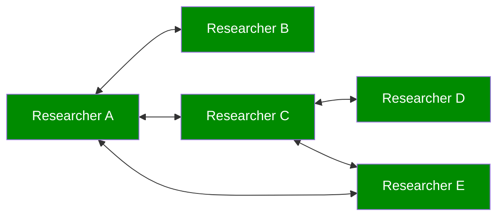
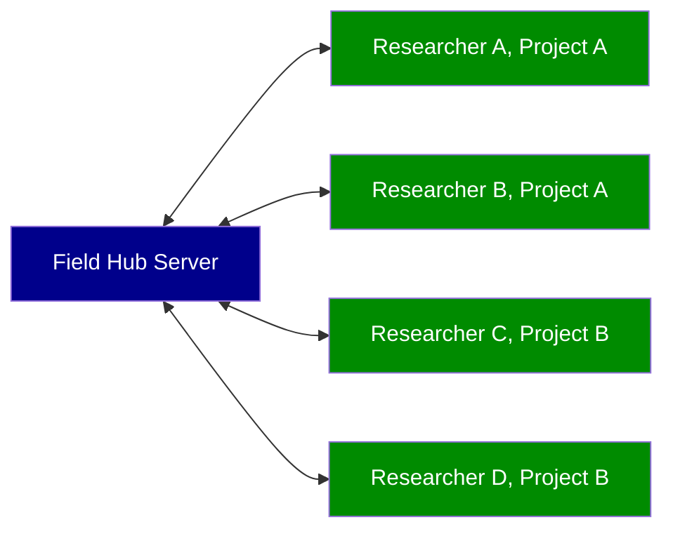
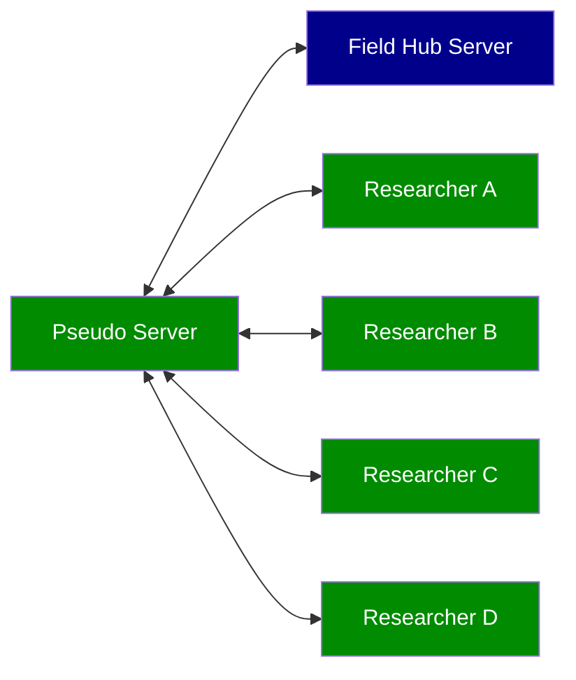
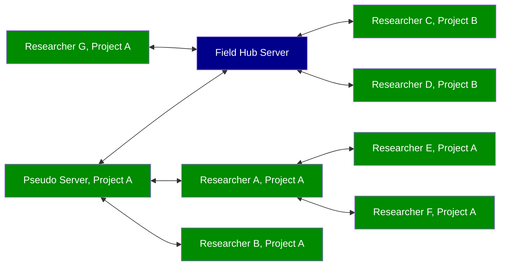

독일 고고학 연구소([DAI](https://www.dainst.org))의 현장 연구 기록 시스템에 대한 접근 방식입니다.
# 소개
GIS, 사진 관리 및 데이터베이스 관리 시스템의 기능을 고유하고 통합적인 방식으로 결합한 Field는 여러 시스템 사용에 따른 오버헤드를 줄여 고고학 작업 흐름을 촉진하는 것을 목표로 합니다. DAI의 정보 기술 부서에서 자체 개발한 이 제품은 연구소의 발굴, 오래된 발굴 및 향후 발굴의 요구 사항을 목표로 합니다. 조정 가능한 데이터 모델의 특성과 오픈 소스 소프트웨어라는 사실로 인해 관심 있는 모든 제3자는 이를 자유롭게 재사용하고 필요에 따라 조정할 수 있습니다.
주요 응용 프로그램은 현재 Field Desktop이며, Field Mobile은 곧 출시될 대안으로 아직 초기 개발 단계에 있습니다. 당분간 Field 사용에 관심이 있는 연구자라면 먼저 [Field Desktop](#field-desktop)을 살펴보는 것이 좋습니다.
단일 시스템에서 프로젝트에 대해 하나의 Field Desktop 설치만 실행할 수 있지만 Field의 강점은 자동 데이터베이스 및 다양한 Field Desktop 설치 간의 파일 동기화 기능입니다. [아래](#동기화-네트워크-예시) 설정 동기화에 대한 몇 가지 예를 확인하세요.
# Field Desktop

Field Desktop은 데이터 수집을 위한 기본 데스크탑(**MacOS**, **Windows** 또는 **Linux**) 애플리케이션입니다.
## 설치
[GitHub 릴리스 페이지](https://github.com/dainst/idai-field/releases/latest)에서 최신 버전의 Field Desktop을 다운로드하여 설치할 수 있습니다. 운영 체제에 맞는 설치 프로그램을 선택하세요.
### Windows
Windows 설치 프로그램을 사용하면 컴퓨터의 모든 사용자를 위한 응용 프로그램 설치와 현재 활성 사용자만을 위한 설치 중에서 선택할 수 있습니다.
#### 모든 사용자용으로 설치
이 옵션을 선택하려면 관리자여야 합니다. 이제 설치 경로를 편집할 수 있습니다. 기본적으로 애플리케이션은 모든 사용자를 위해 설치할 때 "C:\Program Files\Field Desktop" 디렉토리에 설치됩니다.
#### 현재 사용자에 대해서만 설치
현재 활성 사용자에 대해서만 설치된 경우 기본 설치 경로는 "C:\Users\\[USERNAME]\AppData\Local\Programs\Field Desktop"입니다.
#### 사용자 데이터
어떤 옵션을 선택하든 응용 프로그램을 사용하는 각 사용자의 사용자 데이터는 항상 "C:\Users\\[USERNAME]\AppData\Roaming\idai-field-client" 디렉터리에 저장됩니다. 이 디렉터리에는 이 사용자가 만들거나 다운로드한 모든 프로젝트의 데이터베이스는 물론 구성 설정 및 이미지 저장소 데이터(이미지 저장소 디렉터리 경로가 설정에서 변경되지 않은 경우)가 포함됩니다.
#### 자동 설치
명령줄에서 자동으로(그래픽 사용자 인터페이스 없이) 애플리케이션을 설치하려면 명령줄 매개변수 "/S"를 선택적으로 다른 매개변수와 함께 사용할 수 있습니다. 다음 명령줄 매개변수가 지원됩니다.
* **/S** 자동 설치
* **/currentuser** 현재 사용자만을 위한 애플리케이션 설치
* **/allusers** 모든 사용자를 위한 애플리케이션 설치(관리자 권한 필요)
* **/D=[PATH]** 사용자 정의 설치 경로 설정(예: "/D=C:\Example\Field")
### macOS
DMG 파일을 열고 Field Desktop 아이콘을 "Applications" 폴더로 이동하여 컴퓨터에 Field Desktop을 설치합니다.
#### 사용자 데이터
사용자 데이터는 "/Users/[USERNAME]/Library/Application Support/idai-field-client" 디렉토리에 저장됩니다. 이 디렉터리에는 이 사용자가 만들거나 다운로드한 모든 프로젝트의 데이터베이스는 물론 구성 설정 및 이미지 저장소 데이터(이미지 저장소 디렉터리 경로가 설정에서 변경되지 않은 경우)가 포함됩니다.
### Linux
AppImage 파일을 열어 애플리케이션을 시작합니다. 일부 Linux 운영 체제(예: 최신 Ubuntu 버전)에서는 AppImage 파일을 실행할 때 오류가 발생할 수 있습니다. [AppImage 홈페이지 문제 해결 섹션](https://docs.appimage.org/user-guide/troubleshooting)에서 문제 해결 방법에 대한 정보를 확인할 수 있습니다.
### 기존 버전 업데이트
이전 버전의 애플리케이션이 이미 설치된 경우에도 설치를 시작할 수 있습니다. 이 경우 Field Desktop이 새 버전으로 업데이트됩니다. 기존 프로젝트는 일반적으로 유지됩니다. 단, 예외적인 경우 데이터가 손실될 수 있으므로 업데이트 전에 중요한 프로젝트는 모두 백업 파일을 생성하는 것이 좋습니다.
## 제거
애플리케이션을 삭제할 때 사용자 데이터 디렉터리는 제거되지 **않습니다**. 즉, 응용 프로그램을 다시 설치한 후에도 모든 사용자의 모든 프로젝트 데이터베이스를 계속 사용할 수 있습니다. 모든 프로젝트 데이터도 제거하려면 각 사용자의 사용자 디렉터리를 수동으로 삭제하면 됩니다.
### Windows
Field Desktop이 설치된 디렉터리에서 "Uninstall Field Desktop.exe" 파일을 실행합니다.
### macOS
응용 프로그램 폴더에서 "Field Desktop"을 삭제합니다.
## 매뉴얼
애플리케이션 내부 [매뉴얼](../../../desktop/src/manual/manual.ko.md)을 참조하세요.
## 번역
Field Desktop을 다른 언어로 번역하는 데 도움을 주려면 [이 Wiki 페이지](Translating-Field-Desktop.md)를 참조하세요.
# Field Hub
Field Desktop 사용을 고려하는 기관의 경우 모든 연구원을 위한 중앙 집중식 동기화 서버 역할을 할 수 있는 [Field Hub](Field-Hub.md)를 설정하는 것이 좋습니다.
# 동기화 네트워크 예시
현재 사용 중인 일부 네트워크 토폴로지는 다음과 같습니다.
## Field Desktop 설치만 사용하는 경우
이 설정에는 Field Hub 서버 설치가 필요하지 않습니다. 모든 연구원은 근거리 통신망을 통해 자신의 컴퓨터(노트북 또는 데스크탑 PC) 간에 동기화됩니다.

## Field Desktop 설치 및 기관의 Field Hub 서버
기관에서 모든 연구 데이터를 중앙에서 수집하려는 경우 Field Hub 서버 인스턴스를 설정하고 모든 연구자가 이에 동기화하도록 할 수 있습니다.

## Field Desktop 의사 프록시 서버로 설치
발굴 시 대역폭이 문제인 경우 Field Desktop을 로컬 '의사 서버'로 실행하는 현장의 데스크톱 PC 또는 노트북을 사용하여 데이터를 수집하고 기관의 Field Hub 서버와의 동기화를 용이하게 할 수도 있습니다. 이렇게 하면 위의 토폴로지 변형에 비해 중복된 업로드/다운로드 대역폭 사용량이 줄어듭니다.

## 혼합 구성
위의 토폴로지를 결합할 수도 있습니다.

# 프로젝트 이후 데이터 활용
[Field Desktop](../../../desktop)을 사용하여 현장 조사 문서를 작성한 후 데이터를 처리하거나 게시하는 방법에는 여러 가지가 있습니다.
* Field Desktop 애플리케이션 내에서 CSV/GeoJSON/Shapefiles를 내보냅니다.
* 기본 CouchDB(Field Hub) 또는 PouchDB(Field Desktop)에 직접 액세스하세요. CouchDB는 자체 [REST API](https://docs.couchdb.org/en/3.2.0/api/index.html)를 제공하지만 [R](https://www.r-project.org)에 대한 [sofa](https://github.com/ropensci/sofa)와 같은 기본 라이브러리도 있습니다. [Lisa Steinmann](https://orcid.org/0000-0002-2215-1243)의 소파 구현 예시는 [여기](https://github.com/lsteinmann/idaifieldR)에서 확인할 수 있습니다.
