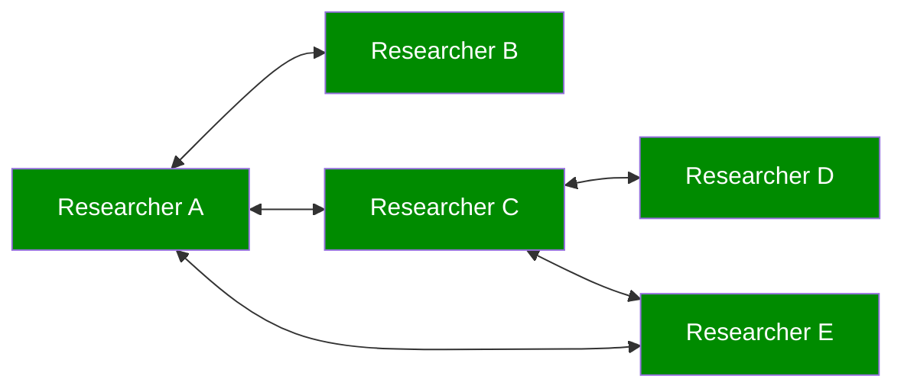
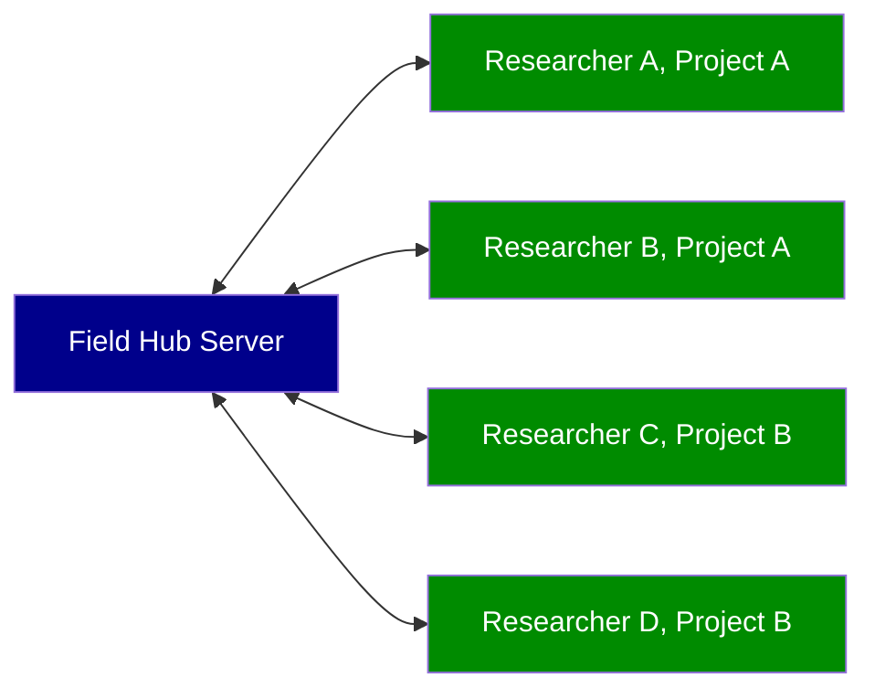
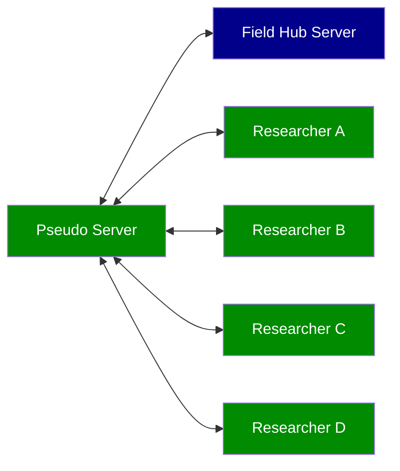
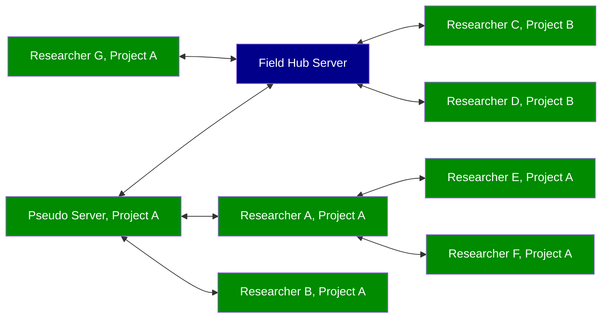

The German Archaeological Institute’s ([DAI](https://www.dainst.org)) take on a field research documentation system.

# Introduction

Combining features of GIS, photo management, and database management systems in a unique and integrating manner, Field aims at facilitating archaeological workflows by reducing the overhead of using multiple systems. Developed in-house by the DAI’s information technology department, it targets the needs of the institute’s excavations, older ones as well as those to come. Due to the nature of its adjustable data model and the fact it is open source software, any interested third party is free to reuse and adjust it to their needs.

The main application is currently Field Desktop, with Field Mobile as an upcoming alternative still in early development. For the time being, if you are a researcher interested in using Field, we would suggest to first have a look at [Field Desktop](#Field-Desktop).

While it is possible to run just one Field Desktop installation for your project on a single machine, the strength of Field is its capability for automatic database- and filesyncing between different Field Desktop installations. You find some examples for syncing setups [below](#Syncing-network-examples).

# Field Desktop

Field Desktop is the main desktop (**MacOS**, **Windows** or **Linux**) application for collecting data.

## Installation

You can install the latest version of Field Desktop by downloading it from the [GitHub releases page](https://github.com/dainst/idai-field/releases/latest). Choose the installer for your operating system.

### Windows

The Windows installer allows choosing between installing the application for all users of the computer and installing it just for the currently active user.

#### Installing for all users

You need to be an administrator to select this option. You can now edit the installation path. Per default, the application is installed in the directory "C:\Program Files\Field Desktop" when installing it for all users.

#### Installing only for the current user

If installed only for the currently active user, the default installation path is "C:\Users\\[USERNAME]\AppData\Local\Programs\Field Desktop".

#### User data

Regardless of which option you chose, the user data for each user that is working with the application is always stored in the directory "C:\Users\\[USERNAME]\AppData\Roaming\idai-field-client". This directory contains the databases of all projects created or downloaded by this user, as well as configuration settings and imagestore data (if the path to the imagestore directory hasn't been changed in the settings).

#### Silent installation

To install the application from the command line silently (without a graphical user interface), you can use the command line parameter "/S", optionally in combination with other parameters. The following command line parameters are supported:

* **/S** Silent installation
* **/currentuser** Install the application only for the current user
* **/allusers** Install the application for all users (administrator rights required)
* **/D=[PATH]** Set a custom installation path (e. g. "/D=C:\Example\Field")

### macOS

Open the DMG file and move the Field Desktop Icon to the "Applications" folder to install Field Desktop on your computer.

#### User data

The user data is stored in the directory "/Users/[USERNAME]/Library/Application Support/idai-field-client". This directory contains the databases of all projects created or downloaded by this user, as well as configuration settings and imagestore data (if the path to the imagestore directory hasn't been changed in the settings).

### Linux

Open the AppImage file to start the application. Please note that with some Linux operating systems (e. g. newer Ubuntu versions), errors may occur when running AppImage files. You can find information on how to solve the problem in the [troubleshooting section of the AppImage homepage](https://docs.appimage.org/user-guide/troubleshooting).

### Updating an existing version

You can also start the installation if an older version of the application is already installed. In this case, Field Desktop will be updated to the new version. Existing projects are normally retained. However, it is strongly recommended that you create backup files of all important projects before the update, as data may be lost in exceptional cases.

## Deinstallation

Please note that when deleting the application, the user data directories are **not** removed. This means that all project databases for all users will still be available after reinstalling the application. If you want to remove all project data as well, you can delete the user directory for each user manually.

### Windows

Execute the file "Uninstall Field Desktop.exe" in the directory where Field Desktop has been installed.

### macOS

Delete "Field Desktop" from the applications folder.

## Manual

See the application's internal [manual](https://github.com/dainst/idai-field/blob/v3.6.1/desktop/src/manual/manual.en.md).

## Translations

If you would like to help translate Field Desktop into another language, please see [this Wiki page](Translating-Field-Desktop).

# Field Hub

For institutions that consider using Field Desktop, we would recommend setting up [Field Hub](Field-Hub) which may serve as a centralized syncing server for all your researchers.

# Syncing network examples

Here are some network topologies currently in use.

## Field Desktop installations only

This setup does not require a Field Hub server installation. All researchers sync between their machines (laptops or desktop PCs) via local area network.

## Field Desktop installations and institution's Field Hub server

If your institution wants to collect all research data centrally, you may setup a Field Hub server instance and let all your researchers sync to it.

## Field Desktop installation as a pseudo proxy server

If bandwidth is a concern on excavation, you may also use a desktop PC or laptop on site running Field Desktop as a local 'pseudo server' to collect data and facilitate syncing to your institution's Field Hub server. This will reduce redundant upload/download bandwith usage compared to the topology variant above.

## Mix and match

The topologies above can also be combined.

# Post-project data usage

After field research documentation has been created using [Field Desktop](desktop), there are several ways to process or publish your data.
* Export CSV/GeoJSON/Shapefiles from within the Field Desktop application.
* Access the underlying CouchDB (Field Hub) or PouchDB (Field Desktop) directly. CouchDB provides its own [Rest API](https://docs.couchdb.org/en/3.2.0/api/index.html), but there also exist native libraries like [sofa](https://github.com/ropensci/sofa) for [R](https://www.r-project.org). An example sofa implementation by [Lisa Steinmann](https://orcid.org/0000-0002-2215-1243) can be found [here](https://github.com/lsteinmann/idaifieldR).
