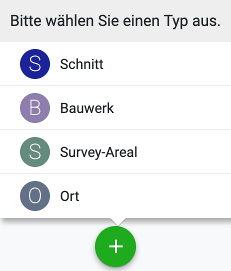
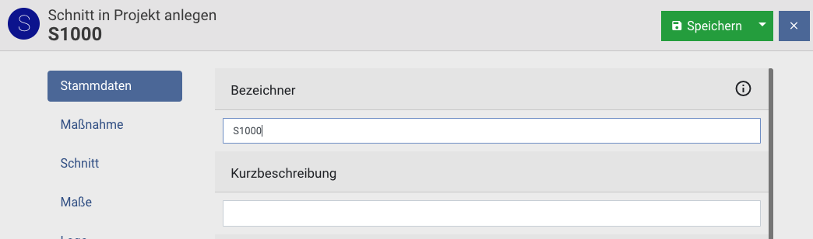
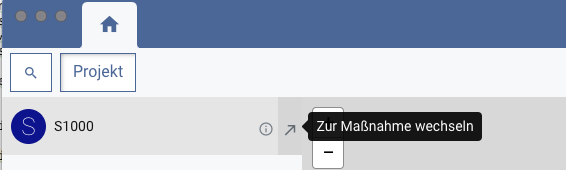
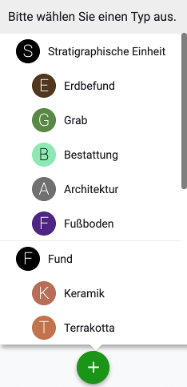
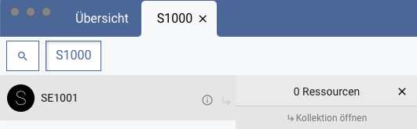
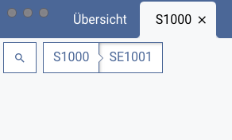
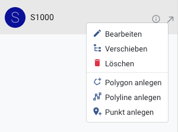
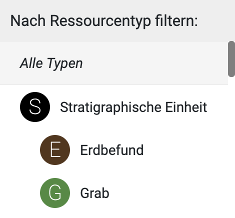
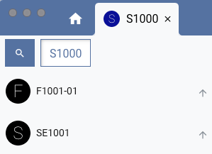

## Erste Schritte

Nach dem ersten Start des Clients befinden Sie sich zunächst im Projekt "test", das es
Ihnen ermöglicht, die Funktionen des Programms anhand einiger Testdaten auszuprobieren.
Bitte beachten Sie, dass neu angelegte Datensätze nach einem Neustart des Clients
gelöscht und alle Änderungen zurückgesetzt werden, solange das Testprojekt ausgewählt ist.
Aus diesem Grund findet im Testprojekt grundsätzlich keine Synchronisation mit anderen Clients
oder Datenbanken statt.

Um mit dem Client produktiv zu arbeiten, sollten Sie zunächst die folgenden Schritte
durchführen:

1. Im Untermenü **Einstellungen**, das Sie über das Menü "iDAI.field" (MacOS) bzw. "Datei" (Windows)
erreichen, können Sie grundlegende Einstellungen vornehmen, die für sämtliche Projekte gelten. Legen Sie hier
bitte zunächst Ihren Bearbeiternamen fest. Dieser Name wird bei allen von Ihnen vorgenommenen Änderungen in
der Datenbank hinterlegt und sollte unbedingt gesetzt werden, insbesondere wenn Daten mit anderen Clients
synchronisiert werden sollen.

2. Darüber hinaus können Sie im Untermenü **Einstellungen** den Pfad des Bilderverzeichnisses
ändern. Dies ist erforderlich, wenn Sie auf ein Bilderverzeichnis zugreifen möchten,
das auf einem Netzwerk-Gerät (NAS) liegt und das von mehreren Nutzern bzw. Nutzerinnen
gleichzeitig verwendet wird. Bitte beachten Sie, dass Bilder in jedem Fall über den
Client importiert werden müssen. Bilddateien, die manuell in das Bilderverzeichnis
eingefügt werden, können von der Anwendung **nicht** verwendet werden.

3. Klicken Sie auf den Projektnamen "test", um die **Projektverwaltung** aufzurufen. Hier
können Sie über den Plus-Button ein neues Projekt anlegen. Erlaubte Zeichen für den
Projektnamen sind Buchstaben, Zahlen und Bindestriche. Sobald das neue Projekt
geladen wurde, können Sie über den Editierungs-Button in der Projektverwaltung allgemeine
Metadaten des Projekts eingeben. 

Verwenden Sie das Untermenü **Backup erstellen**, das Sie über das Menü "Tools" erreichen, um regelmäßig
Sicherungen Ihrer Projektdaten anzulegen.

## Ressourcen

Die Ressourcenverwaltung bildet das Herzstück von iDAI.field.

### Maßnahmen

Nach dem Anlegen bzw. Öffnen eines Projekts befinden Sie sich zunächst im Tab **Übersicht** (gekennzeichnet
durch ein Haus-Symbol), in dem alle Maßnahmen und Orte des Projekts verwaltet werden.

Verwenden Sie den grünen Plus-Button unten in der Ressourcenliste, um eine neue Maßnahme anzulegen. 

Dabei wählen Sie in einem ersten Schritt den Typ der Maßnahme aus und können anschließend optional eine
Geometrie für die neue Ressource anlegen. Schließlich öffnet sich der Editor, in dem Sie sämtliche Daten der
Maßnahme eintragen können. Je nach gewähltem Maßnahmentyp stehen unterschiedliche Felder zur Auswahl, die
jeweils in Gruppen aufgeteilt sind. Zwischen den Feldgruppen können Sie jederzeit per Klick auf einen der
Buttons auf der linken Seite wechseln.

Bevor die Maßnahme über den grünen Speichern-Button gesichert werden kann, muss in jedem Fall das Feld
**Bezeichner** in der Gruppe "Stammdaten" ausgefüllt werden.

Die neue Maßnahme wird nun in der Ressourcenliste angezeigt. Benutzen Sie den Button "Zur Maßnahme wechseln"
(Symbol: Pfeil nach rechts oben), um einen neuen Tab für die Maßnahme zu öffnen.

In Abhängigkeit vom Maßnahmentyp können innerhalb eines Maßnahmen-Tabs mithilfe des Plus-Buttons Ressourcen
verschiedener Typen angelegt werden (etwa stratigraphische Einheiten innerhalb eines Schnitts oder
Räume innerhalb eines Gebäudes).

### Hierarchische Anordnung

Ressourcen können in hierarchischen Strukturen angeordnet werden, beispielsweise um Funde einer
stratigraphischen Einheit zuzuweisen. Benutzen Sie den Button "Untergeordnete Ressourcen anzeigen"
(Symbol: rechtwinkliger Pfeil nach rechts unten), um eine Liste aller Ressourcen anzuzeigen, die der
ausgewählten Ressource untergeordnet wurden. Bei einer neu angelegten Ressource ist diese Liste zunächst leer.

Per Klick auf **Kollektion öffnen** kann auf die tiefere Hierarchieebene gewechselt werden, sodass nun die
untergeordneten Ressourcen angezeigt werden (etwa die Funde einer stratigraphischen Einheit).
Die Verwendung des Plus-Buttons führt jetzt dazu, dass Ressourcen entsprechend auf dieser Ebene angelegt
werden.

Der Navigationspfad oberhalb der Ressourcenliste zeigt die gerade ausgewählte Hierarchieebene an. Sie können
jederzeit per Klick auf einen der Buttons des Navigationspfades in eine andere Ebene wechseln.

### Verwaltung

Bei Rechtsklick auf eine Ressource in der Liste öffnet sich ein Kontextmenü, das die folgenden Optionen
bereitstellt:

* *Bearbeiten*: Öffnet den Editor (alternativ auch per Doppelklick auf den Ressourceneintrag in der Liste
erreichbar)
* *Verschieben*: Erlaubt es, die Ressource aus ihrem aktuellen Kontext zu entfernen und einer anderen
Ressource unterzuordnen
* *Löschen*: Entfernt die Ressource nach einer Sicherheitsabfrage

Darüber hinaus stellt das Kontextmenü Funktionen zum Anlegen bzw. Bearbeiten von Geometrien bereit.

## Suche

In der **Übersicht**, den einzelnen Maßnahmenansichten sowie in der 
Bilderverwaltung (Menüpunkt **Bilder**) stehen **Suchfilter** zur Verfügung, die Sie verwenden können, um
die Menge der aktuell angezeigten Ressourcen anhand grundlegender Suchkriterien 
(Bezeichner, Kurzbeschreibung, Ressourcentyp) einzuschränken.

Möchten Sie komplexere Suchanfragen formulieren, können Sie innerhalb der **Übersicht** und der
**Maßnahmenansichten** darüber hinaus in den **erweiterten Suchmodus** wechseln. 
Dieser Modus ermöglicht es Ihnen einerseits, über Hierarchieebenen hinweg und auch innerhalb des gesamten Projektes
zu suchen und dabei andererseits zusätzliche feldspezifische Suchkriterien zu definieren.

### Suchfilter

Der Suchfilter stellt eine schnelle Möglichkeit dar, Ressourcen nach bestimmten Kriterien anzuzeigen bzw.
auszublenden, und besteht aus einem *Textfilter* (Eingabefeld) sowie einem *Typfilter* (blauer Button).

Nach der Eingabe eines Suchbegriffes und/oder der Auswahl eines Ressourcentyps wird die Menge der aktuell
angezeigten Ressourcen so eingeschränkt, dass sie den Filterkriterien entspricht. In der **Übersicht** und den
**Maßnahmenansichten** betrifft das die Ressourcen in der linken Seitenleiste und auf der Karte (in der
Kartenansicht) bzw. die Elemente der Liste (in der Listenansicht). In der **Bilderverwaltung** sind alle im
Raster angezeigten Bilder vom Suchfilter betroffen.

#### Typfilter

Über den Typfilter-Button können Sie einen Ressourcentyp wählen. Unterschieden wird zwischen Obertypen und
Untertypen: Wählen Sie einen Untertyp (z. B. "Erdbefund"), werden ausschließlich Ressourcen des entsprechenden
Typs angezeigt. Wählen Sie dagegen einen Obertyp (z. B. "Stratigraphische Einheit"), werden Ressourcen des
ausgewählten Typs sowie aller seiner Untertypen (z. B. "Erdbefund", "Grab", "Architektur", "Fußboden" etc.)
berücksichtigt. Welche Typen zur Auswahl stehen, hängt jeweils vom gerade aktiven Kontext ab: In der Übersicht
können Maßnahmentypen gewählt werden, in der Bilderverwaltung Bildtypen etc. 

#### Textfilter

Suchbegriffe werden derzeit mit den Feldern "Bezeichner" und "Kurzbeschreibung" von Ressourcen abgeglichen. 
 
*Beispiel:*
 
In der Übersicht werden die folgenden drei Schnitte angezeigt:

    (1)
    Bezeichner: "S01"
    Kurzbeschreibung: "Schnitt-01"
    
    (2)
    Bezeichner: "S02"
    Kurzbeschreibung: "Schnitt-02"
    
    (3)
    Bezeichner: "ms1"
    Kurzbeschreibung: "Mein Schnitt 1" 

**Mögliche Suchbegriffe** sind die jeweils durch Leerzeichen oder Bindestriche getrennten Textfolgen in den
Bezeichnern und Kurzbeschreibungen, also im Beispiel: "S01", "S02", "ms1", "Schnitt", "01", "02", "Mein", "1".
  
Der Suchbegriff "s01" liefert beispielsweise die Ressource (1), die Suche nach "mein" liefert (3) als
Suchtreffer. **Groß- bzw. Kleinschreibung** spielt dabei keine Rolle und wird ignoriert.

Es handelt sich um eine sogenannte **Präfix-Suche**, d. h. es wird stets auf den Anfang eines Suchbegriffs
geprüft: Da die Bezeichner von (1) und (2) mit der Textfolge "s0" beginnen, liefert der Suchbegriff "s0"
sowohl (1) als auch (2) als Suchtreffer. Eine Suche nach "Schn" liefert (1), (2) und (3) zurück, eine Suche
nach "itt" oder "chni" hingegen nichts.

#### Platzhaltersuche

Im Textfilter ist auch eine Platzhaltersuche möglich: Statt eines Zeichens können Sie innerhalb eckiger
Klammern eine Menge unterschiedlicher erlaubter Zeichen angeben. Ein solcher Platzhalter kann pro Suchanfrage
einmal verwendet werden.

*Beispiel:*

    (1) Bezeichner: "Landscape-0001"
    (2) Bezeichner: "Landscape-0009"
    (3) Bezeichner: "Landscape-0010"
    (4) Bezeichner: "Landscape-0011"
    (5) Bezeichner: "Landscape-0022"

Eine Suche nach "Landscape-00[01]" liefert (1), (2), (3), (4), da für die dritte Ziffer sowohl 0 als auch 1
als zulässige Zeichen angegeben wurden. Alle weiteren Zeichen danach sind aufgrund der Präfix-Suche erlaubt.

Eine Suche nach "Landscape-00[01]1" liefert (1) und (4), da die Ziffer nach dem Platzhalter genau eine 1 sein
muss.

#### Suchergebnisse aus anderen Kontexten

Werden bei gesetztem Suchfilter keine Suchergebnisse im aktuellen Kontext gefunden, werden unterhalb des
Textfelds Suchergebnisse aus anderen Kontexten angezeigt.

Durch einen Klick auf eine der angezeigten Ressourcen wechseln Sie sofort in den dazugehörigen Kontext und
wählen die entsprechende Ressource aus.

### Erweiterter Suchmodus

In der **Übersicht** und in den **Maßnahmenansichten** können Sie durch einen Klick auf den Lupen-Button in
den erweiterten Suchmodus wechseln.
 

Im erweiterten Suchmodus ist eine Suche über größere Datenmengen möglich:

* In der **Übersicht** wird über alle im Projekt angelegten Ressourcen gesucht.
* In den **Maßnahmenansichten** wird über alle Resourcen der Maßnahme gesucht.

In beiden Fällen werden alle gefundenen Suchergebnisse links in der Liste angezeigt. Der nach oben zeigende
Pfeil erlaubt einem, in den ensprechenden hierarchischen Kontext der Ressource zu springen. Mit Klick
auf den Pfeil wird dann auch der erweiterte Suchmodus beendet.   

Zustätzlich taucht in der Übersicht für Ressourcen, die zu Maßnahmen gehören, ein nach rechts oben
zeigender Pfeil auf. Ein Klick auf diesen Pfeil führt zu einem Sprung in den hierarchischen Kontext 
der Ressource innerhalb der entsprechenden Maßnahmenasicht. 

Innerhalb der erweiterten Suche können keine neuen Ressourcen angelegt werden, was durch den ausgegrauten
Plus-Button angezeigt wird. Um neue Ressourcen anzulegen, verlassen sie die erweiterte Suchansicht wieder.

Die Anzahl der gleichzeitig angezeigten Suchergebnisse ist aus Performancegründen immer auf maximal **200**
beschränkt. Das Programm zeigt die weiteren Ressourcen nicht an, weist aber darauf hin, dass die Maximalanzahl
überschritten ist. Fügen Sie weitere Suchkriterien hinzu oder verlassen Sie den erweiterten Suchmodus, um auf
die ausgeblendeten Ressourcen zugreifen zu können.
 

#### Feldspezifische Suchkriterien
 
Ist der erweiterte Suchmodus aktiviert, können Sie bei aktiviertem Typfilter eine Suche über spezifische
Felder einer Ressource anstoßen, indem Sie auf den Plus-Button links neben dem Typfilter-Button klicken.
Dabei werden Felder zur Suche angeboten, die der entsprechenden Typendefinition entsprechen. Sie können
beliebig viele Felder auswählen, sodass Sie mehrere Suchkriterien miteinander kombinieren können. Darüber
hinaus können Sie die feldspezifischen Suchkriterien selbstverständlich auch in Kombination mit dem Textfilter
verwenden.

Handelt es sich um Freitextfelder, so geben Sie den Suchbegriff direkt ein; bei Feldern mit Wertelisten
wählen Sie den Begriff aus der Liste aller erlaubten Werte in einem Dropdown-Menü aus.
 
**Achtung**: Im Gegensatz zum Suchfilter wird an dieser Stelle keine Präfix-Suche durchgeführt. Der
eingestellte Begriff muss exakt mit dem Feldinhalt des entsprechenden Feldes einer Ressource
übereinstimmen, damit die Ressource als Suchergebnis auftaucht.

Alternativ zur Angabe eines konkreten Suchbegriffs kann außerdem nach allen Ressourcen gesucht werden, bei
denen das Feld gesetzt (Option "Beliebiger Wert") bzw. nicht gesetzt ist (Option "Kein Wert").

Die Zahl neben dem Typfilter-Button gibt die Anzahl der aktiven Suchkriterien an. Sie können Suchkriterien
auch nachträglich wieder entfernen, indem Sie das Menü durch einen Klick auf die Zahl erneut öffnen und das
entsprechende Kriterium auswählen.

## Matrix

In der **Matrix** Ansicht (zu finden im Werkzeuge-Menü) finden Sie für jeden Schnitt des Projekts eine Matrix vor, die automatisch aus
den stratigraphischen Einheiten des jeweiligen Schnitts generiert wird. Die Kanten der Matrix werden dabei
auf Grundlage der Relationen erstellt, die für die Einheiten angelegt wurden.

Wählen Sie den Schnitt, für den Sie eine Matrix generieren möchten, über den Dropdown-Button links oben in der
Toolbar aus.

### Optionen

Über den **Optionsbutton** in der rechten oberen Ecke der Matrixansicht können Sie verschiedene Einstellungen
vornehmen, mit denen Sie die Darstellung der Matrix individuell anpassen können. Die gewählten Einstellungen
gelten für alle Matrizen in allen Schnitten des Projekts und bleiben auch nach einem Programmneustart
erhalten.

#### Relationen

* *Zeitlich*: Kanten werden auf Basis der Relationen "Zeitlich vor", "Zeitlich nach" und "Zeitgleich mit"
  erstellt.
* *Räumlich*: Kanten werden auf Basis der Relationen "Liegt über", "Liegt unter", "Schneidet" und "Wird
  geschnitten von" erstellt.

#### Kanten

* *Gerade*: Alle Kanten bestehen aus geraden Linien.
* *Gebogen*: Kanten können gebogen sein, wenn keine direkte Verbindungslinie zwischen zwei Einheiten der
  Matrix gezogen werden kann.

#### Gruppierung nach Grobdatierung

Aktivieren Sie diese Option, um die stratigraphischen Einheiten in der Matrix anhand des Eintrags im Feld
"Grobdatierung" zu gruppieren. Sind als Grobdatierung zwei Werte (von/bis) eingetragen, wird jeweils nur
der Wert aus "Grobdatierung (von)" verwendet. Stratigraphische Einheiten mit gleichen Werten für die
Grobdatierung werden nun nahe beieinander platziert und mit einem Rechteck umrahmt.

### Navigation

Bewegen Sie die Maus bei gedrückter **rechter Maustaste**, um die Position der Matrix innerhalb des
Anzeigebereichs zu verändern. Verwenden Sie das **Mausrad** oder die **Zoom-Buttons** in der linken oberen
Ecke des Anzeigebereichs, um die Zoomstufe anzupassen. Mit der **linken Maustaste** können Sie mit Einheiten
der Matrix interagieren; die Art der Interaktion (Editierung oder Selektion) ist dabei vom gewählten
Interaktionsmodus abhängig.

Wenn Sie mit dem Mauszeiger über eine Einheit fahren, werden die davon ausgehenden Kanten farbig markiert:
Grüne Linien zeigen Verbindungen zu Einheiten auf höheren Ebenen an, blaue zu Einheiten auf niedrigeren Ebenen
und orange zu Einheiten auf der gleichen Ebene innerhalb der Matrix.

### Editierung

Standardmäßig befinden Sie sich im **Editierungsmodus**: Klicken Sie auf eine Einheit in der Matrix, um ein
Fenster zu öffnen, in dem Sie die entsprechende Ressource bearbeiten können. Über den Reiter **Relationen**
können Sie auf diese Weise durch Editierung der zeitlichen bzw. räumlichen Relationen auch die Einordnung der
Einheit innerhalb der Matrix verändern. Nach einem Klick auf den Button **Speichern** wird die Matrix
automatisch auf Grundlage der geänderten Daten aktualisiert.

### Anzeige von Teilmatrizen

Um die Übersicht in großen Matrizen zu erleichtern, können auch Teilmatrizen aus ausgewählten Einheiten
der Matrix generiert werden. Verwenden Sie die Buttons auf der rechten Seite der Toolbar, um Einheiten zu
selektieren und eine neue Teilmatrix aus der aktuellen Selektion zu erstellen:

* *Bearbeitungsmodus*: Einheiten können per Linksklick editiert werden.
* *Einzelauswahlmodus*: Einheiten können einzeln per Linksklick selektiert und (bei erneutem Klick)
  deselektiert werden.
* *Gruppenauswahlmodus*: Einheiten können gruppenweise selektiert werden, indem ein Rechteck mit der Maus
  gezogen wird.

  
* *Auswahl aufheben*: Alle Einheiten werden deselektiert.
* *Matrix aus Auswahl erstellen*: Eine neue Matrix wird generiert, in der ausschließlich die selektierten
  Einheiten angezeigt werden. Die Generierung der Kanten geschieht weiterhin auf Grundlage aller
  stratigraphischen Einheiten des Schnitts, sodass diese Funktion auch dazu verwendet werden kann, um auf
  schnelle Weise zu prüfen, ob zwei Einheiten über mehrere Relationen/Ressourcen hinweg miteinander
  verknüpft sind.
* *Matrix neu laden*: Die ursprüngliche Matrix mit allen stratigraphischen Einheiten des gewählten Schnitts
  wird wiederhergestellt.
  