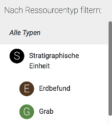
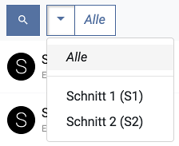
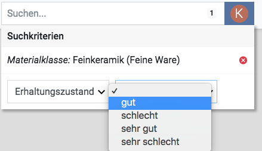

## First steps

After starting the client for the first time, the project "test" will be active, allowing you to experiment
with the application's functionality using a set of test data. Please note that as long as the test project is
selected, any newly created data sets will be deleted and all changes will be reset when restarting the client. For
this reason, synchronization with other clients or databases is not performed for the test project.  

In order to work with the client productively, you should first follow these steps:

1. The menu **Settings**, which you can open via the dropdown menu in the upper right corner of the screen, allows you
to change some basic settings applied to all projects. As a first step, please enter your editor name. This
name will be stored in the database along with every change you make. It is strongly recommended to set the
name, especially if data is going to be synchronized with other clients.  

2. In the menu **Settings** you can also change the path to the image directory. This may be necessary if you want to
access an image directory located on a network device (NAS) used by several users simultaneously. Please note that
in each case images must be imported via the client. Image files that are manually placed in the image directory
can **not** be used by the application. 

3. Click on the project name "test" in order to open the **Project management**. In this menu, you can create
a new project by clicking the plus button. Allowed characters for the project name are letters, numbers and hyphens.
As soon as the new project has been loaded, you can enter basic project metadata by clicking the edit button in the
project management menu.

To start entering data, switch to the area **Overview** where you can add new operations (trenches,
buildings, survey areas). Subsequently, you can add resources (e. g. stratigraphical units, finds or building parts)
inside these operations in the areas **Excavation**, **Building** and **Survey**. 

Use the menu **Create backup**, which is also accessible via the dropdown menu in the upper right screen corner, to
create backup files of your project data regularly.

## Search

In the **Overview**, in the operation views **Excavation**, **Building** and **Survey** as well as in the image
overview (menu item **Images**), a **search filter** is available. You can use it to restrict the currently displayed
resources by the means of some basic search criteria (identifier, short description, resource type).

If you want to express more complex search queries, you can furthermore switch into the **extended search mode** while
in the **overview** or one of the **operation views**. This mode allows you to expand the search to a larger
area (e. g. to all trenches or the whole project) and to define additional field specific search criteria.

### Search filter

The search filter is a fast way to show or hide resources based on specific criteria. It consists of a
*text filter* (an input field) and a *type filter* (a blue button).

After entering a search term and/or choosing a resource type, only the resources matching these filter criteria are
shown. In the **overview** and the **operation views**, this affects all resources in the left sidebar and on the
map (in map view) respectively the elements of the list (in list view). In the **image overview**, all images shown
in the grid are affected by the search filter.

#### Type filter

The type filter button allows you to choose a resource type. There are supertypes and subtypes: If you choose a
subtype (e. g. "Layer"), only the resources of the respective type are shown. In constrast, if you choose a
supertype (e. g. "Stratigraphical unit"), the resources of the selected type as well as all of its subtypes (e. g.
"Layer", "Grave", "Architecture", "Floor" etc.) are included. The current context decides which types are available:
In the overview you can choose operation types, in the image overview image types etc.

#### Text filter

Search terms are currently compared with the resource fields "Identifier" and "Short description".
 
*Example:*
 
The following three trenches are shown in the overview:

    (1)
    Identifier: "T01"
    Short description: "Trench-01"
    
    (2)
    Identifier: "T02"
    Short description: "Trench-02"
    
    (3)
    Identifier: "mt1"
    Short description: "My trench 1" 

**Possible search terms** are the text strings of the identifiers and short descriptions, each split by space
characters or hyphens, as in the example: "T01", "T02", "mt1", "Trench", "01", "02", "My", "1".  

Therefore, a search for the term "t01" returns the resource (1), and a search for "my" returns (3) as a
result. **Capitalization** is ignored. 
  
The search performed is a so-called **prefix search**, which means that in each case the beginning of the search term
is checked: As the identifiers of (1) and (2) start with the text string "t0", a search for the term "t0" returns
(1) as well as (2) as results. A search for "tr" returns (1), (2) and (3), while a search for "ench" or "ren" returns
nothing.

#### Placeholder search

When entering text into the text filter field, placeholders can be used: Instead of a single character, you can specify
a set of different allowed characters within square brackets. Such a placeholder can be used one time per search
query.

*Example:*

    (1) Identifier: "Landscape-0001"
    (2) Identifier: "Landscape-0009"
    (3) Identifier: "Landscape-0010"
    (4) Identifier: "Landscape-0011"
    (5) Identifier: "Landscape-0022"

A search for "Landscape-00[01]" returns (1), (2), (3), (4), because 0 as well as 1 are defined as allowed
characters for the third digit. All following characters are allowed due to the prefix search.

A search for "Landscape-00[01]1" returns (1) and (4), as the digit after the placeholder must be a 1.

#### Search results from other contexts

If no search results are found in the current context, search results from other contexts are shown below the
text input field.

By clicking one of the resources, you can immediately switch to the corresponding context and select the
resource.

### Extended search mode

In the **overview** as well as in the **operation views**, you can switch to the extended search mode by clicking
the magnifier button.
 

 
A blue magnifier button indicates that the extended search mode is activated.

#### Particularities

The extended search mode allows searching over larger amounts of data:
* In the **overview**, the search is performed over all of the project's resources.
* In the **operation views**, you can choose if the search should be performed within a single operation or over all
operations of the respective type (e. g. over all trenches in the view **Excavation**). For this purpose, the option
"All" is available in the operation selection menu.

Please note that the hierarchy resulting from the created "Lies within" relations is not shown in the extended
search mode and the creation of new resources is not possible. For these tasks, leave the extended search mode
by clicking the magnifier button again.

The number of search results shown simultaneously is restricted to a maximum of **200** for performance reasons. Other
resources are not displayed by the application and instead a notice is shown informing about the maximum being exceeded.
Add further search criteria or leave the extended search mode in order to access these resources. 

#### Field specific search criteria
 
If the extended search mode is activated and a type filter is selected, you can start a search over specific fields
of a resource by clicking the plus button to the left of the type filter button. Fields available for search are
those corresponding to the respective type definition. You can choose as many fields as you want in order to combine
multiple search criteria. Of course, you can also use the field specific search criteria in combination with the text
filter. 

In case of a text field, just enter the search term directly; for fields with value lists, choose the term from
a list of all allowed values in a dropdown menu. 

**Important**: In contrast to the the search filter, no prefix search is performed in this case. The chosen search
term must match the content of the resource field exactly for the resource to appear in the list of search
results. 

The number appearing next to the type filter button indicates the number of active search criteria. You can
remove search criteria by clicking the number. This opens up the menu again and you can choose the search criterium to
remove.
