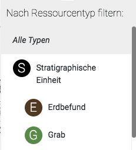
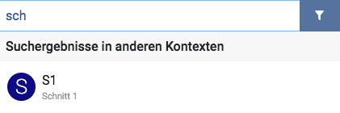

# Erste Schritte

Nach dem ersten Start des Clients befinden Sie sich zunächst im Projekt "test", das es
Ihnen ermöglicht, die Funktionen des Programms anhand einiger Testdaten auszuprobieren.
Bitte beachten Sie, dass neu angelegte Datensätze nach einem Neustart des Clients
gelöscht und alle Änderungen zurückgesetzt werden, solange das Testprojekt ausgewählt ist.
Um mit dem Client produktiv zu arbeiten, sollten Sie zunächst die folgenden Schritte
durchführen:

1. Im Menü **Einstellungen**, das Sie über das Dropdown-Menü in der oberen
rechten Bildschirmecke erreichen, können Sie grundlegende Einstellungen vornehmen,
die für sämtliche Projekte gelten. Legen Sie hier bitte zunächst Ihren Bearbeiternamen
fest. Dieser Name wird bei allen von Ihnen vorgenommenen Änderungen in der
Datenbank hinterlegt und sollte unbedingt gesetzt werden, wenn Daten mit anderen
Clients synchronisiert werden sollen.

2. Darüber hinaus können Sie im Menü **Einstellungen** den Pfad des Bilderverzeichnisses
ändern. Dies ist erforderlich, wenn Sie auf ein Bilderverzeichnis zugreifen möchten,
das auf einem Netzwerk-Gerät (NAS) liegt und das von mehreren Nutzern bzw. Nutzerinnen
gleichzeitig verwendet wird. Bitte beachten Sie, dass Bilder in jedem Fall über den
Client importiert werden müssen. Bilddateien, die manuell in das Bilderverzeichnis
eingefügt werden, können von der Anwendung **nicht** korrekt erkannt werden. 

3. Klicken Sie auf den Projektnamen *"test"*, um die **Projektverwaltung** aufzurufen. Hier
können Sie über den Plus-Button ein neues Projekt anlegen. Erlaubte Zeichen für den
Projektnamen sind Buchstaben, Zahlen und Bindestriche. Sobald das neue Projekt
geladen wurde, können Sie über den Editierungs-Button in der Projektverwaltung allgemeine
Metadaten des Projekts eingeben.

Beginnnen Sie mit der Dateneingabe, indem Sie in den Bereich **Übersicht** wechseln, wo
Sie Datensätze für Maßnahmen (Schnitte, Bauwerke, Survey-Areale) anlegen können. In den
Bereichen **Ausgrabung**, **Bauaufnahme** und **Survey** können Sie anschließend Ressourcen
innerhalb einer Maßnahme anlegen. 

Verwenden Sie das Menü **Backup erstellen**, das Sie ebenfalls über das Dropdown-Menü
in der oberen rechten Bildschirmecke erreichen, um regelmäßig Sicherungen Ihrer Projektdaten
anzulegen.

# Suche

In der **Übersicht**, den Maßnahmenansichten **Ausgrabung**, **Bauaufnahme** und **Survey** sowie in der 
Bilderverwaltung (Menüpunkt **Bilder**) steht ein **Suchfilter** zur Verfügung, den Sie verwenden können, um
die Menge der aktuell angezeigten Ressourcen anhand grundlegender Suchkriterien (Bezeichner, Kurzbeschreibung,
Ressourcentyp) einzuschränken.

Möchten Sie komplexere Suchanfragen formulieren, können Sie innerhalb der **Übersicht** und der
**Maßnahmenansichten** darüber hinaus in den **erweiterten Suchmodus** wechseln. Dieser Modus ermöglicht es
Ihnen, die Suche auf einen größeren Bereich auszuweiten (beispielsweise auf alle Schnitte oder auf das gesamte
Projekt) und zusätzliche feldspezifische Suchkriterien zu definieren.

## Suchfilter

Der Suchfilter stellt eine schnelle Möglichkeit dar, Ressourcen nach bestimmten Kriterien anzuzeigen bzw.
auszublenden, und besteht aus einem *Textfilter* (Eingabefeld) sowie einem *Typfilter* (blauer Button).

Nach der Eingabe eines Suchbegriffes und/oder der Auswahl eines Ressourcentyps wird die Menge der aktuell
angezeigten Ressourcen so eingeschränkt, dass sie den Filterkriterien entspricht. In der **Übersicht** und den
**Maßnahmenansichten** betrifft das die Ressourcen in der linken Seitenleiste und auf der Karte (in der
Kartenansicht) bzw. die Elemente der Liste (in der Listenansicht). In der Bilderverwaltung sind alle im
Raster angezeigten Bilder vom Suchfilter betroffen.

### Typfilter

Über den Typfilter-Button können Sie einen Ressourcentyp wählen. Unterschieden wird zwischen Obertypen und
Untertypen: Wählen Sie einen Untertyp (z. B. "Erdbefund"), werden ausschließlich Ressourcen des entsprechenden
Typs angezeigt. Wählen Sie dagegen einen Obertyp (z. B. "Stratigraphische Einheit"), werden Ressourcen des
ausgewählten Typs sowie aller seiner Untertypen (z. B. "Erdbefund", "Grab", "Architektur", "Fußboden" etc.)
angezeigt. Welche Typen zur Auswahl stehen, hängt jeweils vom gerade aktiven Kontext ab.   

### Textfilter

Suchbegriffe werden derzeit mit den Feldern "Bezeichner" und "Kurzbeschreibung" von Ressourcen abgeglichen. 
 
*Beispiel:*
 
In der Übersicht werden die folgenden drei Schnitte angezeigt:

    (1)
    Bezeichner: "S01"
    Kurzbeschreibung: "Schnitt 01"
    
    (2)
    Bezeichner: "S02"
    Kurzbeschreibung: "Schnitt 02"
    
    (3)
    Bezeichner: "ms1"
    Kurzbeschreibung: "Mein Schnitt 1" 

**Mögliche Suchbegriffe** sind die jeweils durch Leerzeichen getrennten Textfolgen in den Bezeichnern und 
Kurzbeschreibungen, also im Beispiel: "S01", "S02", "ms1", "Schnitt", "01", "02", "Mein", "Schnitt", "1".
  
Der Suchbegriff "s01" liefert beispielsweise die Ressource (1), die Suche nach "mein" liefert (3) als
Suchtreffer. **Groß- bzw. Kleinschreibung** spielt dabei keine Rolle und wird ignoriert.

Es handelt sich um eine sogenannte **Präfix-Suche**, d. h. es wird stets auf den Anfang eines Suchbegriffs
geprüft: Da die Bezeichner von (1) und (2) mit der Textfolge "s0" beginnen, liefert der Suchbegriff "s0"
sowohl (1) als auch (2) als Suchtreffer. Eine Suche nach "Schn" liefert (1), (2) und (3) zurück, eine Suche
nach "itt" oder "chni" hingegen nichts.

### Platzhaltersuche

Im Textfilter ist auch eine Platzhaltersuche möglich: Statt eines Zeichens können Sie innerhalb eckiger
Klammern eine Menge unterschiedlicher erlaubter Zeichen angeben. Ein solcher Platzhalter kann pro Suchanfrage
einmal verwendet werden.

*Beispiel:*

    (1) Bezeichner: "Landscape-0001"
    (2) Bezeichner: "Landscape-0009"
    (3) Bezeichner: "Landscape-0010"
    (4) Bezeichner: "Landscape-0011"
    (5) Bezeichner: "Landscape-0022"

Eine Suche nach "Landscape-00[01]" liefert (1), (2), (3), (4), da für die dritte Ziffer sowohl 0 als auch 1
als zulässige Zeichen angegeben wurden. Alle weiteren Zeichen danach sind aufgrund der Präfix-Suche erlaubt.

Eine Suche nach "Landscape-00[01]1" liefert (1) und (4), da die Ziffer nach dem Platzhalter genau eine 1 sein
muss.

### Suchergebnisse aus anderen Kontexten

Werden bei gesetztem Suchfilter keine Suchergebnisse im aktuellen Kontext gefunden, werden unterhalb des
Textfelds Suchergebnisse aus anderen Kontexten angezeigt.

Durch einen Klick auf eine der angezeigten Ressourcen wechseln Sie sofort in den dazugehörigen Kontext und
wählen die entsprechende Ressource aus.

## Erweiterter Suchmodus

In der Übersicht und in den Maßnahmenansichten können Sie durch einen Klick auf den Lupen-Button in den
erweiterten Suchmodus wechseln.
 
 
 
Ein blauer Lupen-Button zeigt an, dass der erweiterte Suchmodus aktiviert ist.

### Besonderheiten

Im erweiterten Suchmodus ist eine Suche über größere Datenmengen möglich:
* In der **Übersicht** wird über alle im Projekt angelegten Ressourcen gesucht.
* In den Maßnahmenübersichten können Sie wählen, ob die Suche innerhalb einer Maßnahme oder über alle
Maßnahmen des jeweiligen Typs (z. B. alle Schnitte in der Ansicht **Ausgrabung**) erfolgen soll. Hierzu
steht in der Maßnahmen-Auswahl die Option "Alle" zur Verfügung.

Bitte beachten Sie, dass die Hierarchie, die sich anhand der angelegten "Liegt in"-Relationen ergibt, im
erweiterten Suchmodus nicht dargestellt wird und das Anlegen neuer Ressourcen nicht möglich ist. Verlassen
Sie für diese Zwecke den erweiterten Suchmodus wieder durch einen erneuten Klick auf den Lupen-Button.

Die Anzahl der gleichzeitig angezeigten Suchergebnisse ist aus Performancegründen immer auf maximal **200**
beschränkt. Das Programm zeigt die weiteren Ressourcen nicht an, weist aber darauf hin, dass die Maximalanzahl
überschritten ist. Fügen Sie weitere Suchkriterien hinzu oder verlassen Sie den erweiterten Suchmodus, um auf
die ausgeblendeten Ressourcen zugreifen zu können.
 

### Feldspezifische Suchkriterien
 
Ist der erweiterte Suchmodus aktiviert, können Sie bei aktiviertem Typfilter eine Suche über spezifische
Felder einer Ressource anzustoßen, indem Sie auf den Plus-Button links neben dem Typfilter-Button klicken.
Dabei werden Felder zur Suche angeboten, die der entsprechenden Typendefinition entsprechen. Sie können
beliebig viele Felder auswählen, sodass Sie mehrere Suchkriterien miteinander kombinieren können. Darüber
hinaus können Sie die feldspezifischen Suchkriterien selbstverständlich auch in Kombination mit dem Textfilter
verwenden.

Handelt es sich um Freitextfelder, so geben Sie den Suchbegriff direkt ein; bei Feldern mit Wertelisten
wählen Sie den Begriff aus der Liste aller erlaubten Werte in einem Dropdown-Menü aus. 
 
**Achtung**: Im Gegensatz zum Suchfilter wird an dieser Stelle keine Präfix-Suche durchgeführt. Der
eingestellte Begriff muss exakt so mit dem Feldinhalt des entsprechenden Feldes einer Ressource
übereinstimmen, damit die Ressource als Suchergebnis auftaucht. 

Die Zahl neben dem Typfilter-Button gibt die Anzahl der aktiven Suchkriterien an. Sie können Suchkriterien
auch nachträglich wieder entfernen, indem Sie das Menü durch einen Klick auf die Zahl erneut öffnen und das
entsprechende Kriterium auswählen.

# Matrix

Unter dem Menüpunkt **Matrix** finden sich automatisch aus den Stratigrapischen Einheiten eines Projektes
generierte Matrizen, pro Schnitt jeweils eine. Der Schnitt kann durch das Dropdown links oben in der Toolbar
gewählt werden. Die Kanten der Matrix werden auf Grundlage der Beziehungen 
"Zeitlich vor, Zeitlich nach, Zeitgleich mit", alternativ auf Grundlage der Relationen "Liegt über, Liegt unter" 
zwischen verschiedenen Stratigraphischen Einheiten eines Schnittes erstellt. Die Auswahl zwischen diesen Varianten
sowie weitere Optionen zur Generierung der Matrix können im Matrixwerkzeugmenü ausgewählt werden.

Die gewählten Einstellungen gelten für alle Matrizen in allen Schnitten und bleiben auch nach einem Programmneustart 
erhalten.

Ein Klick auf ein Matrix-Element führt zum Editierformular, in dem die entsprechende Ressource bearbeitet und
gespeichert werden kann. Ein Rechtsklick, und eine anschließendes **Ziehen** der Maus bei weiterhin gedrückter
Maustaste ändert die Positionierung der Matrix innerhalb des Anwendungsfensters. Die Zoomstufe kann mithilfe der + und -
Buttons links oben eingestellt werden. 

## Phasen

In dem Matrixwerkzeugmenü befindet sich auch ein Häkchen für die **Gruppierung nach Grobdatierung**. Diese kann
genutzt werden, wenn Stratigraphische Einheiten im Feld **Grobdatierung** Werte enthalten. Im Falle, dass ein Zeitraum gewählt ist, 
wird jeweils nur der Wert aus **Grobdatierung (von)** verwendet. Stratigraphische Einheiten mit gleichen Feldwerten
für die Grobdatierung werden nun nahe beieinander platziert und mit Boxen umrahmt.

## Teilmatrizen

Um die Übersicht in großen Matrizen zu erleichtern, können auch Teilbereiche ausgewählt werden. Dies geschieht
mithilfe der Werkzeuge in der Toolbar rechts oben.

  
Mit Klick auf das Mauszeiger Symbol wird der **Einzelauswahlmodus** gestartet. 
Ein Klick auf ein Matrix-Element bewirkt
nun eine Auswahl desselben. Mehrere Elemente gleichzeitig können 
mithilfe des **Gruppenauswahlmodus** selektiert werden. Mit Klick auf das Stiftsymbol kann das ursprüngliche
Verhalten wiederhergestellt werden, dass ein Klick auf ein Matrixelement das Editierformular öffnet.
Sind Elemente selektiert, kann anschließend eine Matrix aus einer Auswahl erstellt werden. Aus dieser Matrix
kann anschließend wieder eine Teilauswahl erstellt werden.

Mit Klick auf den **Matrix Neu Laden** Button kann die ursprüngliche Matrix wiederhergestellt werden.

 
 